Next2D Player
=============
<div align="center">
  
</div>

[](https://github.com/Next2D/Player/actions/workflows/integration.yml)
[](https://github.com/Next2D/player/actions/workflows/github-code-scanning/codeql)
[](https://github.com/Next2D/Player/actions/workflows/lint.yml)

[](https://github.com/Next2D/Player/releases)
[](https://github.com/Next2D/Player/releases)
[](https://discord.gg/6c9rv5Uns5)
[](https://twitter.com/Next2D)

[日本語]  
Next2D Playerは、WebGLのハードウェアアクセラレーションでグラフィックス処理負荷を軽減し、OffscreenCanvasのマルチスレッド処理で描画パフォーマンスを向上させています。  
ベクター描画、Tweenアニメーション、テキスト、音声、動画など、さまざまな要素をサポートしているので、ゲーム制作、インタラクティブなデータビジュアライゼーション、クリエイティブなウェブアプリケーションなど、豊かな表現が必要とされるプロジェクトで活用が期待できます。  
  
[English]  
Next2D Player reduces graphics processing load with WebGL hardware acceleration and improves drawing performance with OffscreenCanvas multi-threaded processing.  
With support for vector rendering, tween animation, text, audio, video, and many other elements, Next2D Player can be used for game production, interactive data visualization, creative web applications, and other projects that require rich expression. The software is expected to be used in game production, interactive data visualization, creative web applications and other projects requiring rich expression.  
  
[简体中文]  
Next2D Player通过WebGL硬件加速降低了图形处理负载，通过OffscreenCanvas多线程处理提高了绘图性能。  
由于支持矢量绘图、Tween动画、文本、音频、视频和许多其他元素，它可用于游戏制作、交互式数据可视化、创意网络应用和其他需要丰富表达的项目。 该软件可用于需要丰富表现力的项目中。  
  
## Support
[日本語]  
最新ニュースや技術情報は、Twitterの[@Next2D](https://twitter.com/Next2D)や公式の[Website](https://next2d.app/ja/)で発信していきますので、チェックしてみてください。  
Next2Dがお役に立つようでしたら、プロジェクトをご支援いただければ幸いです。  
  
[English]  
Please check [@Next2D](https://twitter.com/Next2D) on Twitter and the [official website](https://next2d.app/en/) for the latest news and technical information.    
If Next2D is useful to you, we hope you will support our project.  
  
[简体中文]  
请在Twitter上查看[@Next2D](https://twitter.com/Next2D)和[官方网站](https://next2d.app/cn/)，了解最新的新闻和技术信息。  
如果Next2D对你有用，我们希望你能支持我们的项目。  
  
<div align="center">
  <a href="https://github.com/sponsors/Next2D" target="_blank">
    
  </a>
</div>

## Related Sites
* [Website](https://next2d.app)
* [Animation Tool](https://tool.next2d.app)
* [Framework](https://github.com/Next2D/framework)

## Examples

### Use Simple Sample
```javascript
next2d.load("Path to JSON output from Animation Tool");
```

### Use Program Sample For JavaScript
```javascript
const { Loader }     = next2d.display;
const { URLRequest } = next2d.net;
const { Event }      = next2d.events;

// create root MovieClip
const start = async () =>
{
    const request = new URLRequest("JSON path");
    const loader  = new Loader();
    await loader.load(request);

    const root = await next2d.createRootMovieClip();
    root.addChild(loader.contentLoaderInfo.content);
};

start();
```

### Use Program Sample For TypeScript
```typescript
import { Loader } from "@next2d/display";
import { URLRequest } from "@next2d/net";
import { Event } from "@next2d/events";

// create root MovieClip
const start = async (): Promise<void> =>
{
    const request = new URLRequest("JSON path");
    const loader  = new Loader();
    await loader.load(request);

    const root = await next2d.createRootMovieClip();
    root.addChild(loader.content);
};

start();
```

## Option settings

[日本語]  

| プロパティ名       | 型       | デフォルト値        | 説明                                                                    |
|--------------|---------|---------------|-----------------------------------------------------------------------|
| `fullScreen` | boolean | false         | Stageクラスで設定した幅と高さを超えて画面全体に描画されます。                                     |
| `tagId`      | string  | empty         | IDを指定すると、指定したIDのエレメント内で描画を行います。                                       |
| `bgColor`    | string  | "transparent" | 背景色を16進数で指定できます。デフォルトは無色透明です。                                         |

[English]  

| name           | type    | default       | description                                                                                                                         |
|----------------|---------|---------------|-------------------------------------------------------------------------------------------------------------------------------------|
| `fullScreen`   | boolean | false         | The entire screen is drawn beyond the width and height set in the Stage class.                                                      |
| `tagId`        | string  | empty         | When an ID is specified, drawing is performed within the element of the specified ID.                                               |
| `bgColor`      | string  | "transparent" | You can specify a background color in hexadecimal. The default is colorless.                                                        |

[简体中文]  

| 名称           | 值类型     | 默认值           | 说明                                                |
|--------------|---------|---------------|---------------------------------------------------|
| `fullScreen` | boolean | false         | 整个屏幕的绘制超出了Stage类中设置的宽度和高度。                        |
| `tagId`      | string  | empty         | 当一个ID被指定时，在指定ID的元素内进行绘图。                          |
| `bgColor`    | string  | "transparent" | 你可以指定一个十六进制的背景颜色。默认为无色。                           |

##  Flowchart

```mermaid
flowchart TB
    %% Main Drawing Flow Chart
    subgraph MainFlow["🎨 Drawing Flow Chart - Main Rendering Pipeline"]
        direction TB
        
        subgraph Inputs["Display Objects"]
            Shape["Shape<br/>(Bitmap/Vector)"]
            TextField["TextField<br/>(canvas2d)"]
            Video["Video Element"]
        end
        
        Shape --> MaskCheck
        TextField --> MaskCheck
        Video --> MaskCheck
        
        MaskCheck{"mask<br/>rendering?"}
        
        MaskCheck -->|YES| DirectRender["Direct Rendering"]
        DirectRender -->|drawArrays| FinalRender
        
        MaskCheck -->|NO| CacheCheck1{"cache<br/>exists?"}
        
        CacheCheck1 -->|NO| TextureAtlas["📦 Texture Atlas<br/>(Binary Tree Packing)"]
        TextureAtlas --> Coordinates
        
        CacheCheck1 -->|YES| Coordinates["📍 Coordinates DB<br/>(x, y, w, h)"]
        
        Coordinates --> FilterBlendCheck{"filter or<br/>blend?"}
        
        FilterBlendCheck -->|NO| MainArrays
        FilterBlendCheck -->|YES| NeedCache{"cache<br/>exists?"}
        
        NeedCache -->|NO| CacheRender["Render to Cache"]
        CacheRender --> TextureCache
        NeedCache -->|YES| TextureCache["💾 Texture Cache"]
        
        TextureCache -->|drawArrays| FinalRender
        
        MainArrays["⚡ Instanced Arrays<br/>━━━━━━━━━━━━━━━<br/>matrix<br/>colorTransform<br/>Coordinates<br/>━━━━━━━━━━━━━━━<br/><b>Batch Rendering</b>"]
        
        MainArrays -->|drawArraysInstanced<br/><b>Multiple objects in one call</b>| FinalRender["🎬 Final Rendering"]
        
        FinalRender -->|60fps| MainFramebuffer["🖥️ Main Framebuffer<br/>(Display)"]
    end
    
    %% Branch Flow for Filter/Blend/Mask
    subgraph BranchFlow["🎭 Filter/Blend/Mask - Branch Processing"]
        direction TB
        
        subgraph FilterInputs["Display Objects"]
            Shape2["Shape<br/>(Bitmap/Vector)"]
            TextField2["TextField<br/>(canvas2d)"]
            Video2["Video Element"]
        end
        
        Shape2 --> CacheCheck2
        TextField2 --> CacheCheck2
        Video2 --> CacheCheck2
        
        CacheCheck2{"cache<br/>exists?"}
        
        CacheCheck2 -->|NO| EffectRender["Effect Rendering"]
        CacheCheck2 -->|YES| BranchArrays
        EffectRender --> BranchArrays
        
        BranchArrays["⚡ Instanced Arrays<br/>━━━━━━━━━━━━━━━<br/>matrix<br/>colorTransform<br/>Coordinates<br/>━━━━━━━━━━━━━━━<br/><b>Batch Rendering</b>"]
        
        BranchArrays -->|drawArraysInstanced<br/><b>Multiple objects in one call</b>| BranchRender["Effect Result"]
        
        BranchRender -->|filter/blend| TextureCache
    end
    
    %% Connections between flows
    FilterBlendCheck -.->|"trigger<br/>branch flow"| BranchFlow
    BranchArrays -.->|"rendering info<br/>(coordinates)"| MainArrays
    
    %% Styling
    style MainFlow fill:#e3f2fd,stroke:#1976d2,stroke-width:3px
    style BranchFlow fill:#fff3e0,stroke:#f57c00,stroke-width:3px
    style Inputs fill:#f5f5f5,stroke:#9e9e9e,stroke-width:1px
    style FilterInputs fill:#f5f5f5,stroke:#9e9e9e,stroke-width:1px
    
    style MainArrays fill:#c8e6c9,stroke:#388e3c,stroke-width:3px
    style BranchArrays fill:#c8e6c9,stroke:#388e3c,stroke-width:3px
    style FinalRender fill:#ffecb3,stroke:#f57f17,stroke-width:2px
    style MainFramebuffer fill:#c5e1a5,stroke:#689f38,stroke-width:3px
    style TextureCache fill:#e1bee7,stroke:#8e24aa,stroke-width:2px
    style Coordinates fill:#b3e5fc,stroke:#0277bd,stroke-width:2px
    style TextureAtlas fill:#fff9c4,stroke:#f9a825,stroke-width:2px
```



## License
This project is licensed under the [MIT License](https://opensource.org/licenses/MIT) - see the [LICENSE](LICENSE) file for details.
