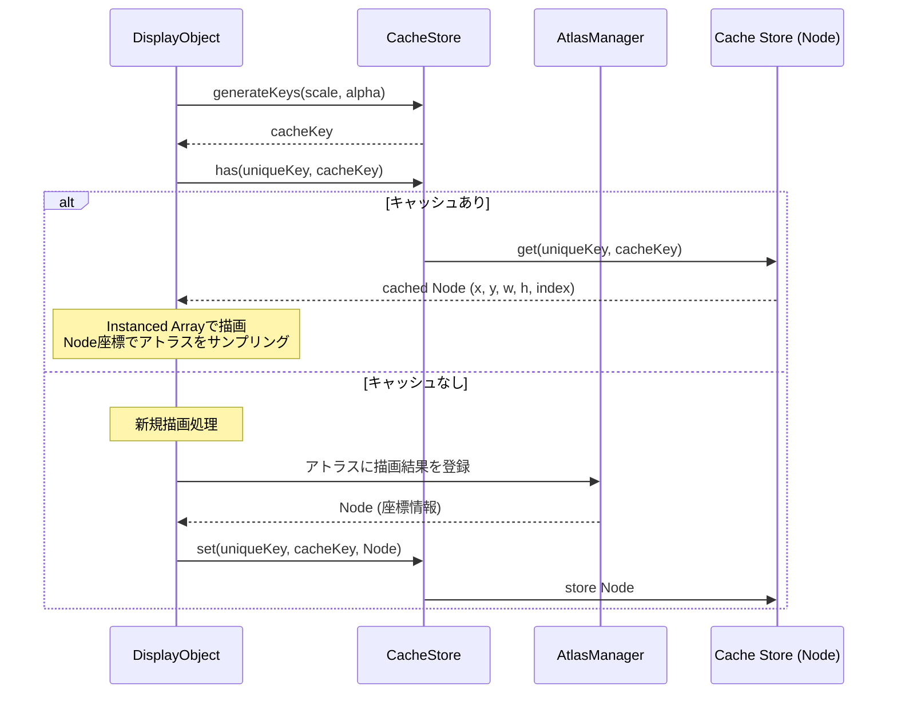
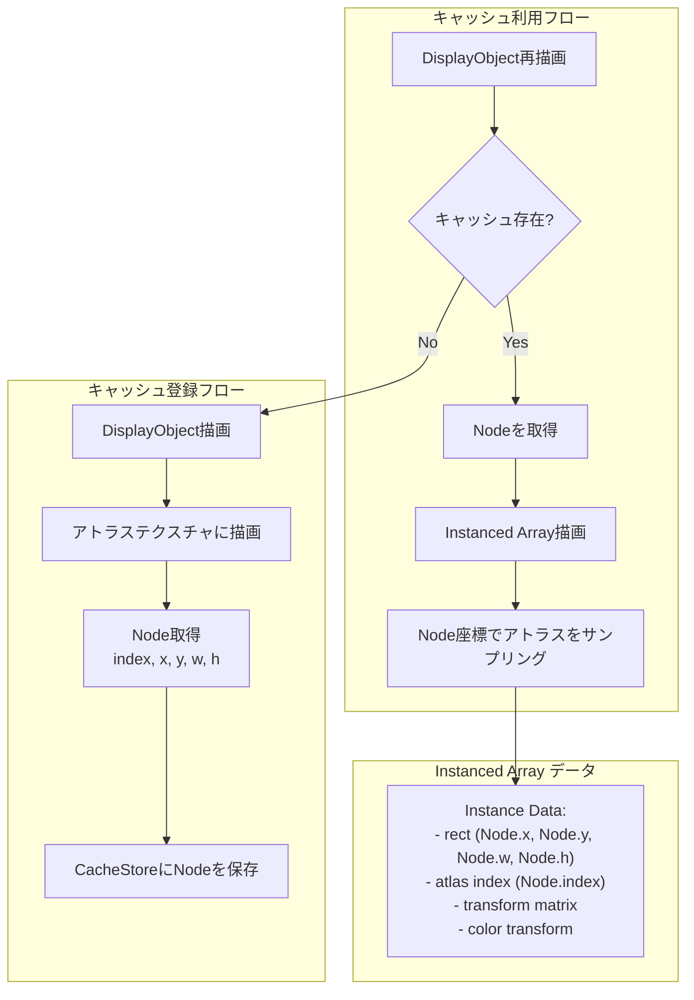
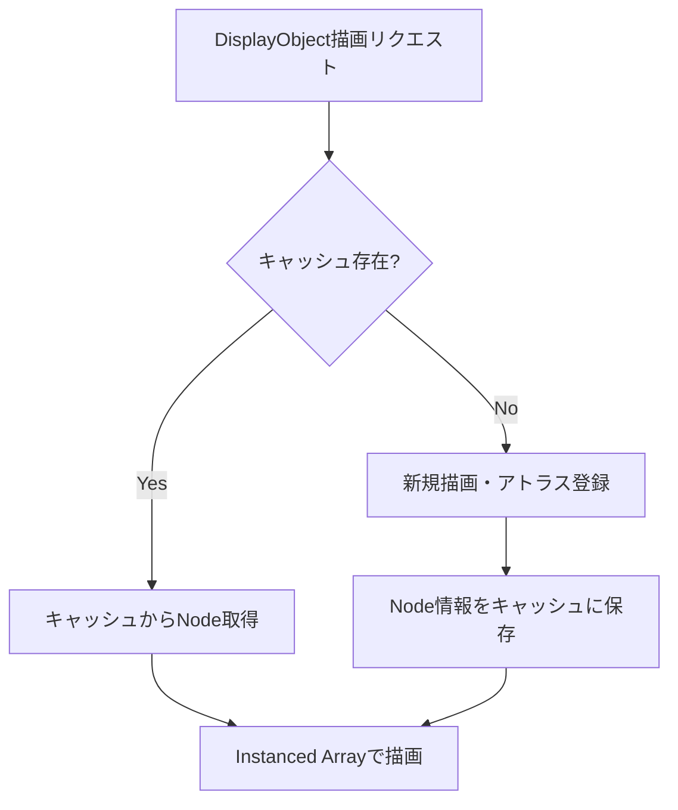
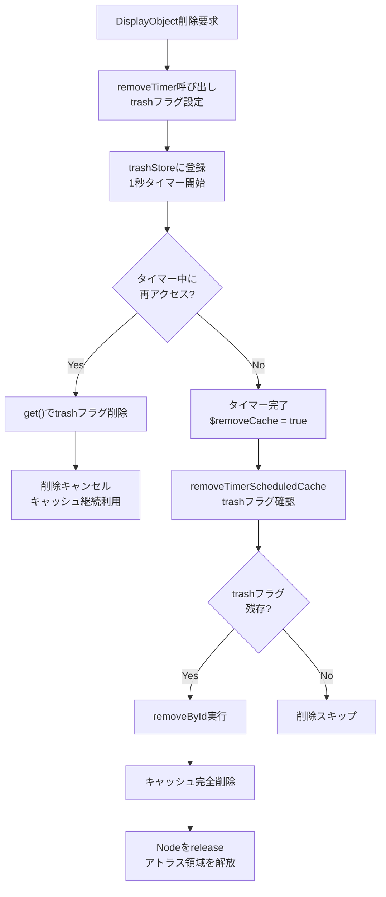
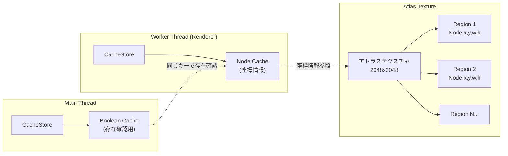

@next2d/cache
=============

Next2Dプレイヤーのレンダリングキャッシュを管理するパッケージです。DisplayObjectの描画結果に対応するアトラステクスチャ上の位置情報をキャッシュし、再描画時のパフォーマンスを向上させます。

## Overview

`@next2d/cache`は、DisplayObjectの描画結果をアトラステクスチャ上の位置情報（`@next2d/texture-packer`の`Node`）としてキャッシュし、同じ描画内容を再利用することでレンダリングパフォーマンスを最適化します。

メインスレッドと描画スレッド（Worker）の両方でキャッシュを管理しています：

- **メインスレッド**: 同じキーでキャッシュが存在するかをbooleanで管理（`true`をvalueにセット）
- **Workerスレッド（描画スレッド）**: `@next2d/texture-packer`の`Node`オブジェクトをキャッシュ。`Node`にはアトラステクスチャに描画された矩形の座標情報（index, x, y, w, h）が含まれており、Instanced Array描画時にこれらの情報を使用してアトラステクスチャから正しい領域をサンプリングします。

キャッシュキーはスケール、アルファ値、フィルターパラメータから生成され、変換行列やフィルターの変更を検知して適切にキャッシュを更新します。

### キャッシュの仕組み

1. **描画結果のアトラス登録**: DisplayObjectの描画結果はアトラステクスチャに格納される
2. **Node情報のキャッシュ**: アトラステクスチャ上の矩形位置（x, y, width, height）とインデックスを`Node`としてキャッシュ
3. **Instanced描画での利用**: キャッシュされた`Node`の座標情報を使用し、Instanced Arrayで効率的に描画

## Directory Structure

```
src/
├── index.ts                    # エクスポート定義
├── CacheStore.ts               # キャッシュ管理メインクラス
├── CacheUtil.ts                # ユーティリティ関数
└── CacheStore/
    └── service/
        ├── CacheStoreDestroyService.ts              # キャッシュ破棄
        ├── CacheStoreGenerateFilterKeysService.ts   # フィルターキー生成
        ├── CacheStoreGenerateKeysService.ts         # キャッシュキー生成
        ├── CacheStoreGetService.ts                  # キャッシュ取得
        ├── CacheStoreHasService.ts                  # キャッシュ存在確認
        ├── CacheStoreRemoveByIdService.ts           # ID指定削除
        ├── CacheStoreRemoveService.ts               # キャッシュ削除
        ├── CacheStoreRemoveTimerScheduledCacheService.ts  # タイマー削除実行
        ├── CacheStoreRemoveTimerService.ts          # タイマー削除登録
        ├── CacheStoreResetService.ts                # 全キャッシュリセット
        └── CacheStoreSetService.ts                  # キャッシュ保存
```

## Key Components

### CacheStore
キャッシュの中心となるクラスで、以下の機能を提供します：

- **キャッシュストア**: unique_keyとキャッシュキーのペアで`Node`データを格納するMap
- **キャッシュトラッシュ**: 削除予定のキャッシュを一時保管
- **タイマー制御**: 遅延削除によるキャッシュライフサイクル管理
- **Canvasプール**: 一時的な描画用HTMLCanvasElementの再利用プール

### Node（@next2d/texture-packer）
キャッシュされるデータの実体で、以下の情報を持ちます：

- `index`: アトラステクスチャの識別番号
- `x`, `y`: アトラステクスチャ上の矩形のx,y座標
- `w`, `h`: 矩形の幅と高さ

## Data Flow



## Cache and Instanced Rendering



## Cache Lifecycle



### 削除フロー（遅延削除メカニズム）

タイマーによる遅延削除で、一時的に非表示になったオブジェクトの再描画コストを削減します。



### 削除フローの詳細

1. **removeTimer**: DisplayObject削除時に呼び出し、`trash`フラグを設定してtrashStoreに登録、1秒タイマー開始
2. **get()でのフラグ解除**: タイマー中に`get()`でキャッシュにアクセスすると、`data.delete("trash")`でフラグが削除される
3. **removeTimerScheduledCache**: タイマー完了後、`trash`フラグが残っているエントリのみを実際に削除

## Thread Architecture



### スレッド間のキャッシュ連携

| スレッド | キャッシュ内容 | 用途 |
|---------|--------------|------|
| メインスレッド | `boolean` (`true`) | キャッシュの存在確認、描画コマンド生成の判断 |
| Workerスレッド | `Node` (index, x, y, w, h) | Instanced Array描画時のアトラス座標参照 |

両スレッドで同じキー（unique_key + cacheKey）を使用することで、キャッシュの整合性を保っています。

## Installation

```
npm install @next2d/cache
```

## License
This project is licensed under the [MIT License](https://opensource.org/licenses/MIT) - see the [LICENSE](LICENSE) file for details.
