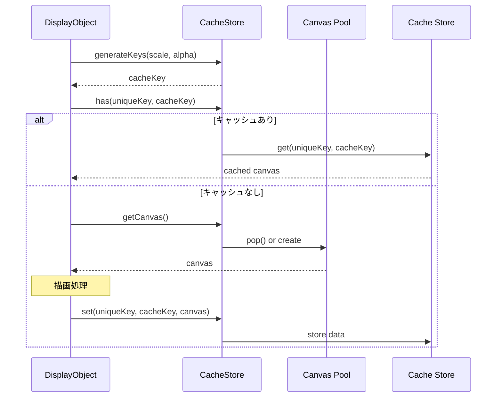
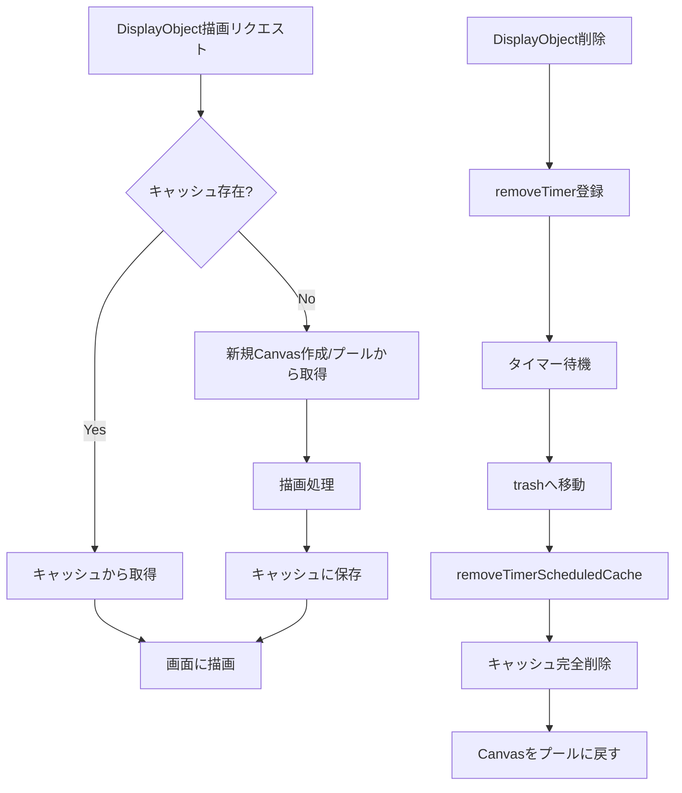

@next2d/cache
=============

Next2Dプレイヤーのレンダリングキャッシュを管理するパッケージです。DisplayObjectの描画結果をキャッシュし、再描画時のパフォーマンスを向上させます。

## Overview

`@next2d/cache`は、DisplayObjectの描画結果をHTMLCanvasElementとしてキャッシュし、同じ描画内容を再利用することでレンダリングパフォーマンスを最適化します。キャッシュキーはスケール、アルファ値、フィルターパラメータから生成され、変換行列やフィルターの変更を検知して適切にキャッシュを更新します。

## Directory Structure

```
src/
├── index.ts                    # エクスポート定義
├── CacheStore.ts               # キャッシュ管理メインクラス
├── CacheUtil.ts                # ユーティリティ関数
└── CacheStore/
    └── service/
        ├── CacheStoreDestroyService.ts              # キャッシュ破棄
        ├── CacheStoreGenerateFilterKeysService.ts   # フィルターキー生成
        ├── CacheStoreGenerateKeysService.ts         # キャッシュキー生成
        ├── CacheStoreGetService.ts                  # キャッシュ取得
        ├── CacheStoreHasService.ts                  # キャッシュ存在確認
        ├── CacheStoreRemoveByIdService.ts           # ID指定削除
        ├── CacheStoreRemoveService.ts               # キャッシュ削除
        ├── CacheStoreRemoveTimerScheduledCacheService.ts  # タイマー削除実行
        ├── CacheStoreRemoveTimerService.ts          # タイマー削除登録
        ├── CacheStoreResetService.ts                # 全キャッシュリセット
        └── CacheStoreSetService.ts                  # キャッシュ保存
```

## Key Components

### CacheStore
キャッシュの中心となるクラスで、以下の機能を提供します：

- **キャッシュプール**: 使用済みのHTMLCanvasElementを再利用可能なプールとして管理
- **キャッシュストア**: unique_keyとキャッシュキーのペアでデータを格納するMap
- **キャッシュトラッシュ**: 削除予定のキャッシュを一時保管
- **タイマー制御**: 遅延削除によるキャッシュライフサイクル管理

## Data Flow



## Cache Lifecycle



## Installation

```
npm install @next2d/cache
```

## License
This project is licensed under the [MIT License](https://opensource.org/licenses/MIT) - see the [LICENSE](LICENSE) file for details.
