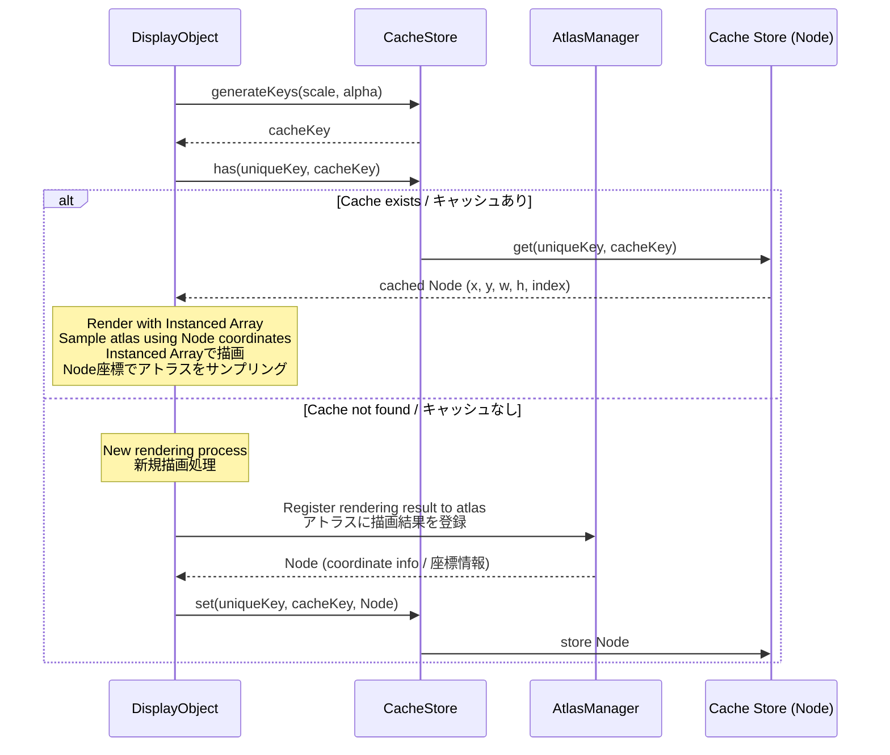
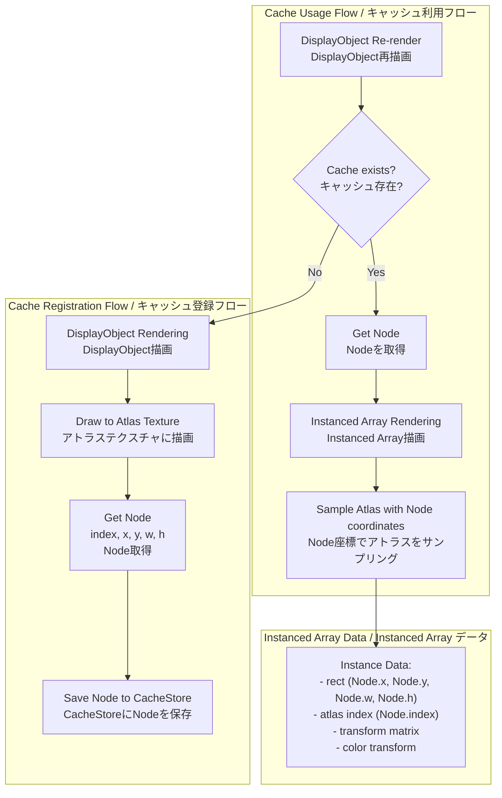
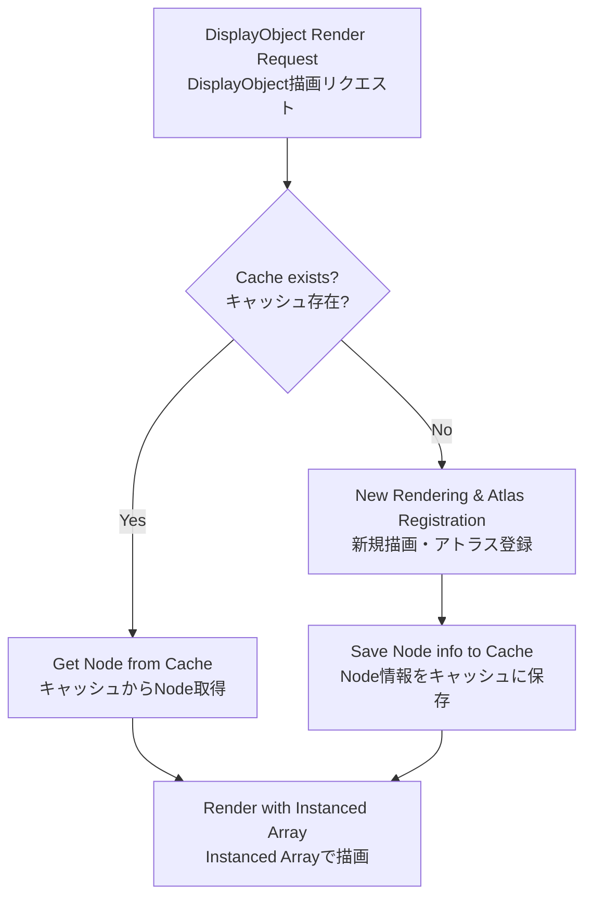
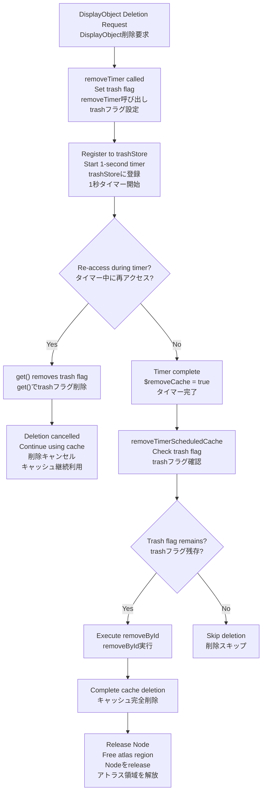
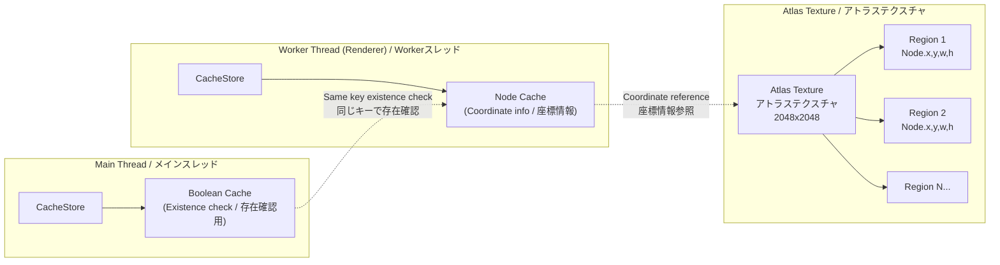

@next2d/cache
=============

**Important**: `@next2d/cache` prohibits importing other packages. This package is a foundational module that must remain independent to avoid circular dependencies.

**重要**: `@next2d/cache` は他の packages の import を禁止しています。このパッケージは基盤モジュールであり、循環依存を避けるために独立を維持する必要があります。

---

A package for managing rendering cache in Next2D Player. It caches position information on atlas textures corresponding to DisplayObject rendering results, improving performance during re-rendering.

Next2Dプレイヤーのレンダリングキャッシュを管理するパッケージです。DisplayObjectの描画結果に対応するアトラステクスチャ上の位置情報をキャッシュし、再描画時のパフォーマンスを向上させます。

## Overview / 概要

`@next2d/cache` optimizes rendering performance by caching DisplayObject rendering results as position information on atlas textures (`Node` from `@next2d/texture-packer`), enabling reuse of identical rendering content.

`@next2d/cache`は、DisplayObjectの描画結果をアトラステクスチャ上の位置情報（`@next2d/texture-packer`の`Node`）としてキャッシュし、同じ描画内容を再利用することでレンダリングパフォーマンスを最適化します。

Cache is managed on both the main thread and the rendering thread (Worker):

メインスレッドと描画スレッド（Worker）の両方でキャッシュを管理しています：

- **Main Thread / メインスレッド**: Manages cache existence with boolean values (sets `true` as value) using the same key
- **Worker Thread (Rendering Thread) / Workerスレッド（描画スレッド）**: Caches `Node` objects from `@next2d/texture-packer`. `Node` contains rectangle coordinate information (index, x, y, w, h) drawn on atlas textures, which is used during Instanced Array rendering to sample the correct region from the atlas texture.

Cache keys are generated from scale, alpha values, and filter parameters, detecting changes in transformation matrices and filters to update the cache appropriately.

キャッシュキーはスケール、アルファ値、フィルターパラメータから生成され、変換行列やフィルターの変更を検知して適切にキャッシュを更新します。

### How Caching Works / キャッシュの仕組み

1. **Atlas Registration of Rendering Results / 描画結果のアトラス登録**: DisplayObject rendering results are stored in atlas textures
2. **Node Information Caching / Node情報のキャッシュ**: Rectangle position (x, y, width, height) and index on atlas texture are cached as `Node`
3. **Usage in Instanced Rendering / Instanced描画での利用**: Cached `Node` coordinate information is used for efficient Instanced Array rendering

## Directory Structure / ディレクトリ構造

```
src/
├── index.ts                    # Export definitions / エクスポート定義
├── CacheStore.ts               # Main cache management class / キャッシュ管理メインクラス
├── CacheUtil.ts                # Utility functions / ユーティリティ関数
└── CacheStore/
    └── service/
        ├── CacheStoreDestroyService.ts              # Cache destruction / キャッシュ破棄
        ├── CacheStoreGenerateFilterKeysService.ts   # Filter key generation / フィルターキー生成
        ├── CacheStoreGenerateKeysService.ts         # Cache key generation / キャッシュキー生成
        ├── CacheStoreGetService.ts                  # Cache retrieval / キャッシュ取得
        ├── CacheStoreHasService.ts                  # Cache existence check / キャッシュ存在確認
        ├── CacheStoreRemoveByIdService.ts           # Delete by ID / ID指定削除
        ├── CacheStoreRemoveService.ts               # Cache deletion / キャッシュ削除
        ├── CacheStoreRemoveTimerScheduledCacheService.ts  # Timer deletion execution / タイマー削除実行
        ├── CacheStoreRemoveTimerService.ts          # Timer deletion registration / タイマー削除登録
        ├── CacheStoreResetService.ts                # Reset all caches / 全キャッシュリセット
        └── CacheStoreSetService.ts                  # Cache storage / キャッシュ保存
```

## Key Components / 主要コンポーネント

### CacheStore
The central class for caching, providing the following features:

キャッシュの中心となるクラスで、以下の機能を提供します：

- **Cache Store / キャッシュストア**: Map storing `Node` data with unique_key and cache key pairs
- **Cache Trash / キャッシュトラッシュ**: Temporary storage for caches scheduled for deletion
- **Timer Control / タイマー制御**: Cache lifecycle management through delayed deletion
- **Canvas Pool / Canvasプール**: Reuse pool for temporary rendering HTMLCanvasElements

### Node (@next2d/texture-packer)
The actual cached data entity, containing the following information:

キャッシュされるデータの実体で、以下の情報を持ちます：

- `index`: Atlas texture identification number / アトラステクスチャの識別番号
- `x`, `y`: Rectangle x,y coordinates on atlas texture / アトラステクスチャ上の矩形のx,y座標
- `w`, `h`: Rectangle width and height / 矩形の幅と高さ

## Data Flow / データフロー



## Cache and Instanced Rendering / キャッシュとインスタンス描画



## Cache Lifecycle / キャッシュライフサイクル



### Deletion Flow (Delayed Deletion Mechanism) / 削除フロー（遅延削除メカニズム）

Timer-based delayed deletion reduces re-rendering costs for temporarily hidden objects.

タイマーによる遅延削除で、一時的に非表示になったオブジェクトの再描画コストを削減します。



### Deletion Flow Details / 削除フローの詳細

1. **removeTimer**: Called when DisplayObject is deleted, sets `trash` flag, registers to trashStore, and starts 1-second timer
   - DisplayObject削除時に呼び出し、`trash`フラグを設定してtrashStoreに登録、1秒タイマー開始
2. **Flag removal via get()**: When cache is accessed via `get()` during timer, `data.delete("trash")` removes the flag
   - タイマー中に`get()`でキャッシュにアクセスすると、`data.delete("trash")`でフラグが削除される
3. **removeTimerScheduledCache**: After timer completes, only entries with remaining `trash` flag are actually deleted
   - タイマー完了後、`trash`フラグが残っているエントリのみを実際に削除

## Thread Architecture / スレッドアーキテクチャ



### Inter-Thread Cache Coordination / スレッド間のキャッシュ連携

| Thread / スレッド | Cache Content / キャッシュ内容 | Purpose / 用途 |
|---------|--------------|------|
| Main Thread / メインスレッド | `boolean` (`true`) | Cache existence check, render command generation decision / キャッシュの存在確認、描画コマンド生成の判断 |
| Worker Thread / Workerスレッド | `Node` (index, x, y, w, h) | Atlas coordinate reference during Instanced Array rendering / Instanced Array描画時のアトラス座標参照 |

Both threads use the same key (unique_key + cacheKey) to maintain cache consistency.

両スレッドで同じキー（unique_key + cacheKey）を使用することで、キャッシュの整合性を保っています。

## Installation / インストール

```
npm install @next2d/cache
```

## License / ライセンス

This project is licensed under the [MIT License](https://opensource.org/licenses/MIT) - see the [LICENSE](LICENSE) file for details.

このプロジェクトは[MITライセンス](https://opensource.org/licenses/MIT)の下でライセンスされています。詳細は[LICENSE](LICENSE)ファイルを参照してください。
