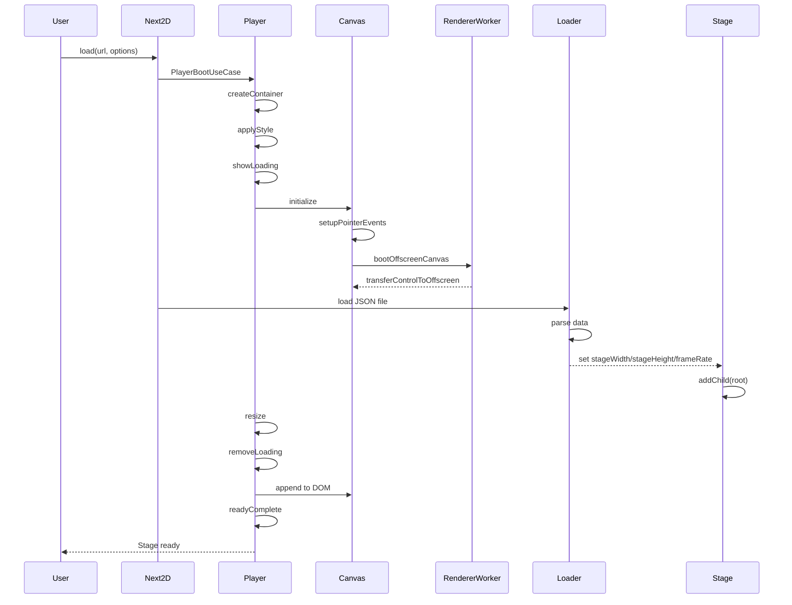
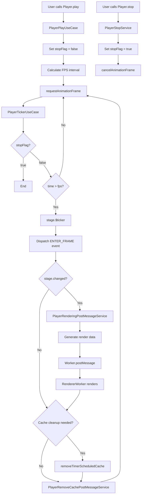

@next2d/core
=============

Next2Dプレイヤーのコアパッケージです。プレイヤー管理、Canvas初期化、イベント処理、レンダリングワーカー通信など、Next2Dの中核機能を提供します。

## Overview

`@next2d/core`は、Next2Dプレイヤーのメインエントリーポイントとして以下の機能を提供します：

- **Next2D**: アプリケーションのブートストラップ、JSONファイルのロード、ルートMovieClipの作成
- **Player**: 再生/停止制御、リサイズ処理、イベント管理、描画ループ制御
- **Canvas**: Canvas要素の初期化、ポインター/キーボードイベント処理、OffscreenCanvas対応
- **RendererWorker**: WebWorkerを使用した描画処理の並列化
- **Package Facades**: Display、Events、Filters、Geom、Media、Net、Text、UIパッケージへの統一アクセス

## Directory Structure

```
src/
├── index.ts                          # エクスポート定義
├── CoreUtil.ts                       # コアユーティリティ関数
├── RendererWorker.ts                 # レンダリングワーカー初期化
│
├── Next2D.ts                         # Next2Dメインクラス
├── Next2D/
│   ├── service/
│   │   └── VideoSyncService.ts      # ビデオ同期サービス
│   └── usecase/
│       ├── LoadUseCase.ts           # JSONファイルロード
│       ├── CreateRootMovieClipUseCase.ts  # ルートMovieClip作成
│       └── CaptureToCanvasUseCase.ts      # Canvas キャプチャ
│
├── Player.ts                         # Playerメインクラス
├── Player/
│   ├── service/
│   │   ├── PlayerAppendElementService.ts           # Canvas要素追加
│   │   ├── PlayerApplyContainerElementStyleService.ts  # スタイル適用
│   │   ├── PlayerCreateContainerElementService.ts      # コンテナ要素作成
│   │   ├── PlayerDoubleClickEventService.ts        # ダブルクリックイベント
│   │   ├── PlayerKeyDownEventService.ts            # キー押下イベント
│   │   ├── PlayerKeyUpEventService.ts              # キー離しイベント
│   │   ├── PlayerLoadingAnimationService.ts        # ローディングアニメーション
│   │   ├── PlayerPointerDownEventService.ts        # ポインター押下イベント
│   │   ├── PlayerPointerMoveEventService.ts        # ポインター移動イベント
│   │   ├── PlayerPointerUpEventService.ts          # ポインター離しイベント
│   │   ├── PlayerRemoveCachePostMessageService.ts  # キャッシュ削除メッセージ
│   │   ├── PlayerRemoveLoadingElementService.ts    # ローディング要素削除
│   │   ├── PlayerRenderingPostMessageService.ts    # レンダリングメッセージ
│   │   ├── PlayerResizePostMessageService.ts       # リサイズメッセージ
│   │   ├── PlayerSetCurrentMousePointService.ts    # マウス座標設定
│   │   ├── PlayerStopService.ts                    # 停止処理
│   │   └── PlayerTransferCanvasPostMessageService.ts  # Canvas転送メッセージ
│   └── usecase/
│       ├── PlayerBootUseCase.ts                    # Player初期起動
│       ├── PlayerHitTestUseCase.ts                 # ヒットテスト
│       ├── PlayerPlayUseCase.ts                    # 再生開始
│       ├── PlayerReadyCompleteUseCase.ts           # 準備完了処理
│       ├── PlayerRegisterEventUseCase.ts           # イベント登録
│       ├── PlayerResizeEventUseCase.ts             # リサイズイベント
│       ├── PlayerResizeRegisterUseCase.ts          # リサイズ登録
│       └── PlayerTickerUseCase.ts                  # フレームティッカー
│
├── Canvas.ts                         # Canvasメインモジュール
├── Canvas/
│   ├── service/
│   │   ├── CanvasBootOffscreenCanvasService.ts     # OffscreenCanvas起動
│   │   ├── CanvasInitializeService.ts              # Canvas初期化
│   │   └── CanvasSetPositionService.ts             # Canvas位置設定
│   └── usecase/
│       ├── CanvasPointerDownEventUseCase.ts        # ポインター押下処理
│       ├── CanvasPointerLeaveEventUseCase.ts       # ポインター離脱処理
│       ├── CanvasPointerMoveEventUseCase.ts        # ポインター移動処理
│       ├── CanvasPointerUpEventUseCase.ts          # ポインター離し処理
│       └── CanvasWheelEventUseCase.ts              # ホイールイベント処理
│
├── Display.ts                        # Display パッケージファサード
├── Events.ts                         # Events パッケージファサード
├── Filters.ts                        # Filters パッケージファサード
├── Geom.ts                           # Geom パッケージファサード
├── Media.ts                          # Media パッケージファサード
├── Net.ts                            # Net パッケージファサード
├── Text.ts                           # Text パッケージファサード
├── UI.ts                             # UI パッケージファサード
│
└── interface/                        # 型定義
    ├── ICaptureMessage.ts
    ├── ICaptureOptions.ts
    ├── IDisplay.ts
    ├── IDisplayObject.ts
    ├── IEvents.ts
    ├── IFilters.ts
    ├── IGeom.ts
    ├── IMedia.ts
    ├── INet.ts
    ├── IPlayerHitObject.ts
    ├── IPlayerOptions.ts
    ├── IRemoveCacheMessage.ts
    ├── IRenderMessage.ts
    └── IResizeMessage.ts
```

## Boot Flow



## Render Loop



## Key Components

### Next2D Class
アプリケーションのメインエントリーポイント。すべてのパッケージへのアクセスを提供し、初期化を管理します。

**主要メソッド:**
- `load(url, options)`: JSONファイルを読み込み、プレイヤーを初期化
- `createRootMovieClip(width, height, fps, options)`: プログラマティックにルートMovieClipを作成
- `captureToCanvas(displayObject, options)`: DisplayObjectをCanvasにキャプチャ

### Player Class
描画、イベント、設定、コントロールを管理します。

**主要メソッド:**
- `play()`: 描画ループを開始
- `stop()`: 描画ループを停止
- `cacheClear()`: すべての描画キャッシュをクリア
- `setOptions(options)`: プレイヤーオプションを設定

**主要プロパティ:**
- `rendererWidth/rendererHeight`: devicePixelRatioを含む描画領域サイズ
- `screenWidth/screenHeight`: 画面表示サイズ
- `fps`: フレームレート間隔（ミリ秒）
- `fullScreen`: フルスクリーンモード設定

### Canvas Module
Canvas要素の初期化とイベント処理を管理します。

**機能:**
- devicePixelRatio対応の初期化
- ポインターイベント（down/move/up/leave）のハンドリング
- ホイールイベント処理
- OffscreenCanvas対応（WebWorker用）

### RendererWorker
WebWorkerを使用して描画処理を並列化し、メインスレッドのパフォーマンスを向上させます。

**通信内容:**
- レンダリングメッセージ（render data）
- リサイズメッセージ（canvas size）
- キャッシュ削除メッセージ（cache IDs）
- Canvas転送メッセージ（OffscreenCanvas）

## Usage Example

```typescript
import { Next2D } from "@next2d/core";

const next2d = new Next2D();

// JSONファイルからロード
await next2d.load("/path/to/content.json", {
    width: 800,
    height: 600,
    tagId: "app",
    bgColor: "#ffffff"
});

// プログラマティックに作成
const root = await next2d.createRootMovieClip(800, 600, 60);
root.addChild(myDisplayObject);

// Displayパッケージへのアクセス
const sprite = new next2d.display.Sprite();
const shape = new next2d.display.Shape();
```

## Installation

```bash
npm install @next2d/core
```

## License
This project is licensed under the [MIT License](https://opensource.org/licenses/MIT) - see the [LICENSE](LICENSE) file for details.
