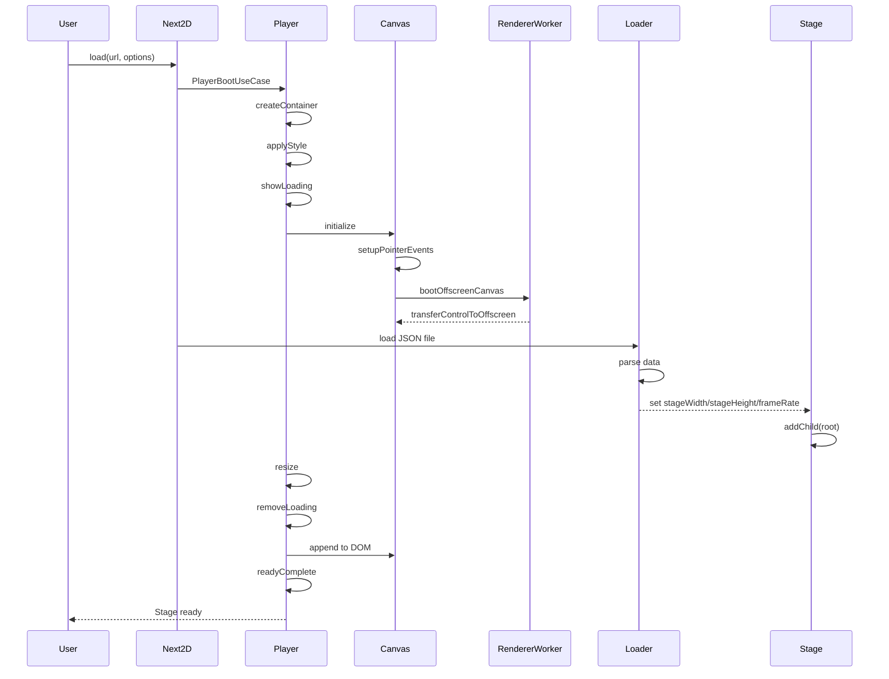
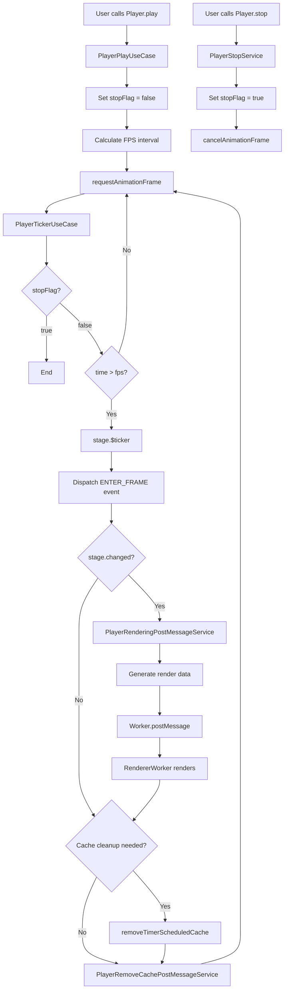

@next2d/core
=============

The core package for Next2D Player. It provides central functionality for Next2D including player management, Canvas initialization, event processing, and rendering worker communication.

Next2Dプレイヤーのコアパッケージです。プレイヤー管理、Canvas初期化、イベント処理、レンダリングワーカー通信など、Next2Dの中核機能を提供します。

**Important**: `@next2d/core` must not be referenced from other packages. This package is the top-level entry point and depends on other packages, but other packages must not depend on it to avoid circular dependencies.

**重要**: `@next2d/core` は他の packages からの参照を禁止しています。このパッケージはトップレベルのエントリーポイントであり、他のパッケージに依存しますが、循環依存を避けるため、他のパッケージからの依存は禁止されています。

## Overview / 概要

`@next2d/core` serves as the main entry point for the Next2D Player, providing the following features:

`@next2d/core`は、Next2Dプレイヤーのメインエントリーポイントとして以下の機能を提供します：

- **Next2D**: Application bootstrap, JSON file loading, root MovieClip creation / アプリケーションのブートストラップ、JSONファイルのロード、ルートMovieClipの作成
- **Player**: Play/stop control, resize handling, event management, render loop control / 再生/停止制御、リサイズ処理、イベント管理、描画ループ制御
- **Canvas**: Canvas element initialization, pointer/keyboard event processing, OffscreenCanvas support / Canvas要素の初期化、ポインター/キーボードイベント処理、OffscreenCanvas対応
- **RendererWorker**: Parallelized rendering using WebWorker / WebWorkerを使用した描画処理の並列化
- **Package Facades**: Unified access to Display, Events, Filters, Geom, Media, Net, Text, UI packages / Display、Events、Filters、Geom、Media、Net、Text、UIパッケージへの統一アクセス

## Directory Structure / ディレクトリ構造

```
src/
├── index.ts                          # Export definitions / エクスポート定義
├── CoreUtil.ts                       # Core utility functions / コアユーティリティ関数
├── RendererWorker.ts                 # Rendering worker initialization / レンダリングワーカー初期化
│
├── Next2D.ts                         # Next2D main class / Next2Dメインクラス
├── Next2D/
│   ├── service/
│   │   └── VideoSyncService.ts      # Video sync service / ビデオ同期サービス
│   └── usecase/
│       ├── LoadUseCase.ts           # JSON file loading / JSONファイルロード
│       ├── CreateRootMovieClipUseCase.ts  # Root MovieClip creation / ルートMovieClip作成
│       └── CaptureToCanvasUseCase.ts      # Canvas capture / Canvas キャプチャ
│
├── Player.ts                         # Player main class / Playerメインクラス
├── Player/
│   ├── service/
│   │   ├── PlayerAppendElementService.ts           # Canvas element append / Canvas要素追加
│   │   ├── PlayerApplyContainerElementStyleService.ts  # Style application / スタイル適用
│   │   ├── PlayerCreateContainerElementService.ts      # Container element creation / コンテナ要素作成
│   │   ├── PlayerDoubleClickEventService.ts        # Double click event / ダブルクリックイベント
│   │   ├── PlayerKeyDownEventService.ts            # Key down event / キー押下イベント
│   │   ├── PlayerKeyUpEventService.ts              # Key up event / キー離しイベント
│   │   ├── PlayerLoadingAnimationService.ts        # Loading animation / ローディングアニメーション
│   │   ├── PlayerPointerDownEventService.ts        # Pointer down event / ポインター押下イベント
│   │   ├── PlayerPointerMoveEventService.ts        # Pointer move event / ポインター移動イベント
│   │   ├── PlayerPointerUpEventService.ts          # Pointer up event / ポインター離しイベント
│   │   ├── PlayerRemoveCachePostMessageService.ts  # Cache removal message / キャッシュ削除メッセージ
│   │   ├── PlayerRemoveLoadingElementService.ts    # Loading element removal / ローディング要素削除
│   │   ├── PlayerRenderingPostMessageService.ts    # Rendering message / レンダリングメッセージ
│   │   ├── PlayerResizePostMessageService.ts       # Resize message / リサイズメッセージ
│   │   ├── PlayerSetCurrentMousePointService.ts    # Mouse coordinate setting / マウス座標設定
│   │   ├── PlayerStopService.ts                    # Stop processing / 停止処理
│   │   └── PlayerTransferCanvasPostMessageService.ts  # Canvas transfer message / Canvas転送メッセージ
│   └── usecase/
│       ├── PlayerBootUseCase.ts                    # Player boot / Player初期起動
│       ├── PlayerHitTestUseCase.ts                 # Hit test / ヒットテスト
│       ├── PlayerPlayUseCase.ts                    # Play start / 再生開始
│       ├── PlayerReadyCompleteUseCase.ts           # Ready complete / 準備完了処理
│       ├── PlayerRegisterEventUseCase.ts           # Event registration / イベント登録
│       ├── PlayerResizeEventUseCase.ts             # Resize event / リサイズイベント
│       ├── PlayerResizeRegisterUseCase.ts          # Resize registration / リサイズ登録
│       └── PlayerTickerUseCase.ts                  # Frame ticker / フレームティッカー
│
├── Canvas.ts                         # Canvas main module / Canvasメインモジュール
├── Canvas/
│   ├── service/
│   │   ├── CanvasBootOffscreenCanvasService.ts     # OffscreenCanvas boot / OffscreenCanvas起動
│   │   ├── CanvasInitializeService.ts              # Canvas initialization / Canvas初期化
│   │   └── CanvasSetPositionService.ts             # Canvas position setting / Canvas位置設定
│   └── usecase/
│       ├── CanvasPointerDownEventUseCase.ts        # Pointer down processing / ポインター押下処理
│       ├── CanvasPointerLeaveEventUseCase.ts       # Pointer leave processing / ポインター離脱処理
│       ├── CanvasPointerMoveEventUseCase.ts        # Pointer move processing / ポインター移動処理
│       ├── CanvasPointerUpEventUseCase.ts          # Pointer up processing / ポインター離し処理
│       └── CanvasWheelEventUseCase.ts              # Wheel event processing / ホイールイベント処理
│
├── Display.ts                        # Display package facade / Display パッケージファサード
├── Events.ts                         # Events package facade / Events パッケージファサード
├── Filters.ts                        # Filters package facade / Filters パッケージファサード
├── Geom.ts                           # Geom package facade / Geom パッケージファサード
├── Media.ts                          # Media package facade / Media パッケージファサード
├── Net.ts                            # Net package facade / Net パッケージファサード
├── Text.ts                           # Text package facade / Text パッケージファサード
├── UI.ts                             # UI package facade / UI パッケージファサード
│
└── interface/                        # Type definitions / 型定義
    ├── ICaptureMessage.ts
    ├── ICaptureOptions.ts
    ├── IDisplay.ts
    ├── IDisplayObject.ts
    ├── IEvents.ts
    ├── IFilters.ts
    ├── IGeom.ts
    ├── IMedia.ts
    ├── INet.ts
    ├── IPlayerHitObject.ts
    ├── IPlayerOptions.ts
    ├── IRemoveCacheMessage.ts
    ├── IRenderMessage.ts
    └── IResizeMessage.ts
```

## Boot Flow / 起動フロー



## Render Loop / レンダーループ



## Key Components / 主要コンポーネント

### Next2D Class

The main entry point for the application. Provides access to all packages and manages initialization.

アプリケーションのメインエントリーポイント。すべてのパッケージへのアクセスを提供し、初期化を管理します。

**Key Methods / 主要メソッド:**
- `load(url, options)`: Load JSON file and initialize player / JSONファイルを読み込み、プレイヤーを初期化
- `createRootMovieClip(width, height, fps, options)`: Programmatically create root MovieClip / プログラマティックにルートMovieClipを作成
- `captureToCanvas(displayObject, options)`: Capture DisplayObject to Canvas / DisplayObjectをCanvasにキャプチャ

### Player Class

Manages rendering, events, settings, and controls.

描画、イベント、設定、コントロールを管理します。

**Key Methods / 主要メソッド:**
- `play()`: Start render loop / 描画ループを開始
- `stop()`: Stop render loop / 描画ループを停止
- `cacheClear()`: Clear all render caches / すべての描画キャッシュをクリア
- `setOptions(options)`: Set player options / プレイヤーオプションを設定

**Key Properties / 主要プロパティ:**
- `rendererWidth/rendererHeight`: Render area size including devicePixelRatio / devicePixelRatioを含む描画領域サイズ
- `screenWidth/screenHeight`: Screen display size / 画面表示サイズ
- `fps`: Frame rate interval (milliseconds) / フレームレート間隔（ミリ秒）
- `fullScreen`: Full screen mode setting / フルスクリーンモード設定

### Canvas Module

Manages Canvas element initialization and event processing.

Canvas要素の初期化とイベント処理を管理します。

**Features / 機能:**
- Initialization with devicePixelRatio support / devicePixelRatio対応の初期化
- Pointer event handling (down/move/up/leave) / ポインターイベント（down/move/up/leave）のハンドリング
- Wheel event processing / ホイールイベント処理
- OffscreenCanvas support (for WebWorker) / OffscreenCanvas対応（WebWorker用）

### RendererWorker

Parallelizes rendering using WebWorker to improve main thread performance.

WebWorkerを使用して描画処理を並列化し、メインスレッドのパフォーマンスを向上させます。

**Communication Contents / 通信内容:**
- Rendering message (render data) / レンダリングメッセージ（render data）
- Resize message (canvas size) / リサイズメッセージ（canvas size）
- Cache removal message (cache IDs) / キャッシュ削除メッセージ（cache IDs）
- Canvas transfer message (OffscreenCanvas) / Canvas転送メッセージ（OffscreenCanvas）

## Usage Example / 使用例

```typescript
import { Next2D } from "@next2d/core";

const next2d = new Next2D();

// Load from JSON file / JSONファイルからロード
await next2d.load("/path/to/content.json", {
    width: 800,
    height: 600,
    tagId: "app",
    bgColor: "#ffffff"
});

// Create programmatically / プログラマティックに作成
const root = await next2d.createRootMovieClip(800, 600, 60);
root.addChild(myDisplayObject);

// Access Display package / Displayパッケージへのアクセス
const sprite = new next2d.display.Sprite();
const shape = new next2d.display.Shape();
```

## Installation / インストール

```bash
npm install @next2d/core
```

## License / ライセンス

This project is licensed under the [MIT License](https://opensource.org/licenses/MIT) - see the [LICENSE](LICENSE) file for details.

このプロジェクトは[MITライセンス](https://opensource.org/licenses/MIT)の下でライセンスされています。詳細は[LICENSE](LICENSE)ファイルを参照してください。
