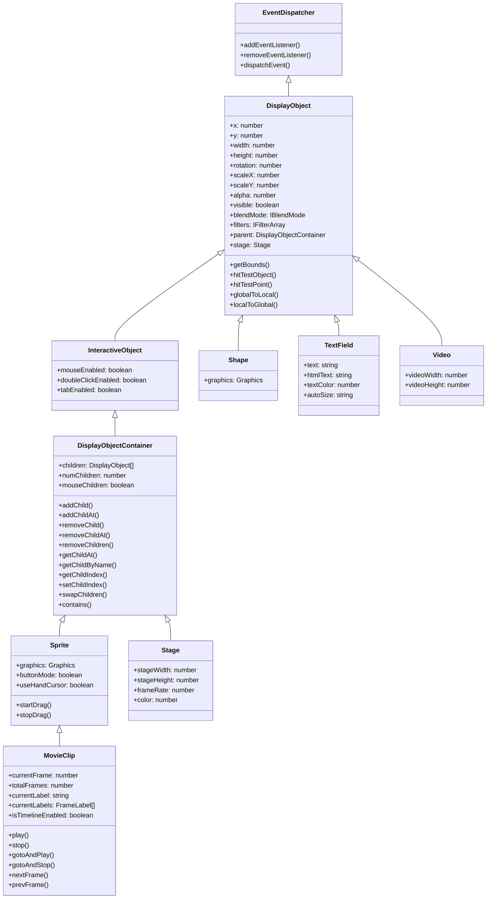
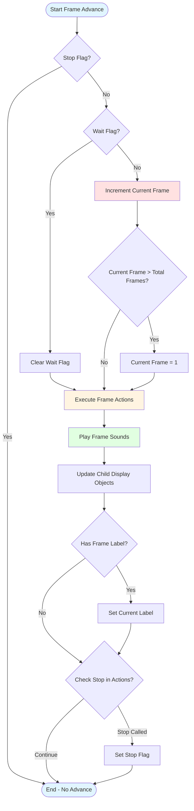

# @next2d/display

Display package for Next2D Player - DisplayObject hierarchy, Graphics drawing API, and content loading capabilities.

Next2D Player の Display パッケージ - DisplayObject 階層、Graphics 描画 API、およびコンテンツ読み込み機能を提供します。

## Overview / 概要

The `@next2d/display` package provides the core visual object model for Next2D Player. It implements the complete DisplayObject hierarchy, a powerful vector graphics drawing API, and content loading capabilities.

`@next2d/display` パッケージは Next2D Player のコアとなるビジュアルオブジェクトモデルを提供します。完全な DisplayObject 階層、強力なベクターグラフィックス描画 API、およびコンテンツ読み込み機能を実装しています。

### Key Features / 主な機能

- **DisplayObject Hierarchy**: Complete implementation of the display list architecture
  - **DisplayObject 階層**: ディスプレイリストアーキテクチャの完全な実装
- **Graphics API**: Vector drawing capabilities with fills, strokes, and gradients
  - **Graphics API**: 塗り、線、グラデーションを使ったベクター描画機能
- **Content Loading**: Dynamic loading of external content and assets
  - **コンテンツ読み込み**: 外部コンテンツとアセットの動的読み込み
- **Timeline Support**: MovieClip with frame-based animation and scripting
  - **タイムラインサポート**: フレームベースのアニメーションとスクリプティングを持つ MovieClip

## Installation / インストール

```bash
npm install @next2d/display
```

## Directory Structure / ディレクトリ構造

```
src/
├── DisplayObject.ts              # Base class for all display objects / すべての表示オブジェクトの基底クラス
├── DisplayObjectContainer.ts     # Container for child display objects / 子表示オブジェクトのコンテナ
├── InteractiveObject.ts         # Base class for interactive objects / インタラクティブオブジェクトの基底クラス
├── Sprite.ts                    # Basic display object container with graphics / グラフィックスを持つ基本的な表示オブジェクトコンテナ
├── MovieClip.ts                 # Timeline-based animation object / タイムラインベースのアニメーションオブジェクト
├── Shape.ts                     # Lightweight graphics display object / 軽量なグラフィックス表示オブジェクト
├── Stage.ts                     # Root display object / ルート表示オブジェクト
├── TextField.ts                 # Text display and input / テキスト表示と入力
├── Video.ts                     # Video display object / ビデオ表示オブジェクト
│
├── Graphics.ts                  # Vector drawing API / ベクター描画 API
├── Graphics/                    # Graphics implementation details / Graphics 実装の詳細
│   ├── service/                # Graphics service layer / Graphics サービス層
│   └── usecase/                # Graphics use cases / Graphics ユースケース
│
├── Loader.ts                    # External content loader / 外部コンテンツローダー
├── Loader/                      # Loader implementation details / Loader 実装の詳細
│   ├── service/                # Loader service layer / Loader サービス層
│   ├── usecase/                # Loader use cases / Loader ユースケース
│   └── worker/                 # Loader web workers / Loader ウェブワーカー
│
├── LoaderInfo.ts               # Loader information / ローダー情報
├── BitmapData.ts               # Bitmap manipulation / ビットマップ操作
├── BlendMode.ts                # Blend mode constants / ブレンドモード定数
├── FrameLabel.ts               # Frame label for timeline / タイムライン用フレームラベル
├── LoopConfig.ts               # Loop configuration / ループ設定
├── LoopType.ts                 # Loop type constants / ループタイプ定数
├── DisplayObjectUtil.ts        # Display object utilities / 表示オブジェクトユーティリティ
│
├── GraphicsBitmapFill.ts       # Bitmap fill style / ビットマップ塗りスタイル
├── GraphicsGradientFill.ts     # Gradient fill style / グラデーション塗りスタイル
│
├── interface/                   # TypeScript interfaces / TypeScript インターフェース
│   ├── IDisplayObject.ts
│   ├── IBlendMode.ts
│   ├── IBounds.ts
│   ├── ICharacter.ts
│   ├── IMovieClipCharacter.ts
│   ├── IShapeCharacter.ts
│   ├── ITextFieldCharacter.ts
│   ├── IVideoCharacter.ts
│   ├── ILoaderInfoData.ts
│   ├── ILoopConfig.ts
│   ├── ILoopType.ts
│   ├── IFrameLabel.ts
│   ├── IPlaceObject.ts
│   └── ... (40+ interface files)
│
├── DisplayObject/              # DisplayObject implementation / DisplayObject 実装
│   ├── service/               # Service layer / サービス層
│   └── usecase/               # Use case layer / ユースケース層
│
├── DisplayObjectContainer/    # DisplayObjectContainer implementation / DisplayObjectContainer 実装
│   ├── service/               # Service layer / サービス層
│   └── usecase/               # Use case layer / ユースケース層
│
├── MovieClip/                 # MovieClip implementation / MovieClip 実装
│   ├── service/               # Service layer / サービス層
│   └── usecase/               # Use case layer / ユースケース層
│
├── Shape/                     # Shape implementation / Shape 実装
│   └── service/               # Service layer / サービス層
│
├── Sprite/                    # Sprite implementation / Sprite 実装
│   └── service/               # Service layer / サービス層
│
└── Stage/                     # Stage implementation / Stage 実装
    └── usecase/               # Use case layer / ユースケース層
```

## Class Hierarchy / クラス階層

The display package implements a hierarchical object model where each class extends its parent's functionality.

display パッケージは、各クラスが親の機能を拡張する階層的なオブジェクトモデルを実装しています。



## Graphics API / Graphics API

The Graphics class provides a drawing API for creating vector shapes programmatically.

Graphics クラスは、ベクター図形をプログラム的に作成するための描画 API を提供します。

### Example Usage / 使用例

```typescript
import { Sprite, BlendMode } from "@next2d/display";

// Create a sprite with graphics
// グラフィックスを持つスプライトを作成
const sprite = new Sprite();

// Draw a rectangle
// 矩形を描画
sprite.graphics.beginFill(0xFF0000);
sprite.graphics.drawRect(0, 0, 100, 100);
sprite.graphics.endFill();

// Draw a circle with gradient
// グラデーションを使った円を描画
sprite.graphics.beginGradientFill(
    "radial",
    [0xFF0000, 0x0000FF],
    [1, 1],
    [0, 255]
);
sprite.graphics.drawCircle(50, 50, 40);
sprite.graphics.endFill();
```

### Graphics Methods / Graphics メソッド

- **Line Styles / 線スタイル**
  - `lineStyle()` - Set line style / 線スタイルを設定
  - `lineGradientStyle()` - Set gradient line style / グラデーション線スタイルを設定

- **Fills / 塗り**
  - `beginFill()` - Begin solid fill / 単色塗りを開始
  - `beginGradientFill()` - Begin gradient fill / グラデーション塗りを開始
  - `beginBitmapFill()` - Begin bitmap fill / ビットマップ塗りを開始
  - `endFill()` - End current fill / 現在の塗りを終了

- **Drawing / 描画**
  - `moveTo()` - Move drawing cursor / 描画カーソルを移動
  - `lineTo()` - Draw line / 直線を描画
  - `curveTo()` - Draw quadratic curve / 二次曲線を描画
  - `cubicCurveTo()` - Draw cubic curve / 三次曲線を描画
  - `drawRect()` - Draw rectangle / 矩形を描画
  - `drawRoundRect()` - Draw rounded rectangle / 角丸矩形を描画
  - `drawCircle()` - Draw circle / 円を描画
  - `drawEllipse()` - Draw ellipse / 楕円を描画
  - `clear()` - Clear all graphics / すべてのグラフィックスをクリア

## MovieClip Frame Advance Logic / MovieClip フレーム進行ロジック

MovieClip implements timeline-based animation with frame labels, actions, and sounds.

MovieClip は、フレームラベル、アクション、サウンドを持つタイムラインベースのアニメーションを実装します。



### Frame Control Methods / フレーム制御メソッド

- `play()` - Start timeline playback / タイムライン再生を開始
- `stop()` - Stop timeline playback / タイムライン再生を停止
- `gotoAndPlay(frame)` - Jump to frame and play / フレームにジャンプして再生
- `gotoAndStop(frame)` - Jump to frame and stop / フレームにジャンプして停止
- `nextFrame()` - Advance to next frame / 次のフレームへ進む
- `prevFrame()` - Go back to previous frame / 前のフレームへ戻る

### Timeline Properties / タイムラインプロパティ

- `currentFrame` - Current frame number (1-based) / 現在のフレーム番号（1始まり）
- `totalFrames` - Total number of frames / フレームの総数
- `currentLabel` - Current frame label / 現在のフレームラベル
- `currentLabels` - Array of all frame labels / すべてのフレームラベルの配列
- `isTimelineEnabled` - Whether timeline is enabled / タイムラインが有効かどうか

## Loader / ローダー

The Loader class handles loading JSON files exported from Next2D AnimationTool only. It does not support loading images or other media files directly.

Loader クラスは、Next2D AnimationTool で書き出された JSON ファイルの読み込みのみに対応しています。画像やその他のメディアファイルの直接読み込みには対応していません。

**Important / 重要:**
- Only supports JSON files exported from Next2D AnimationTool / Next2D AnimationTool で書き出された JSON ファイルのみ対応
- Does not support loading images (PNG, JPG, etc.) directly / 画像（PNG、JPGなど）の直接読み込みには非対応
- Does not support loading videos directly / ビデオの直接読み込みには非対応

```typescript
import { Loader } from "@next2d/display";
import { URLRequest } from "@next2d/net";

const loader = new Loader();
loader.contentLoaderInfo.addEventListener("complete", (event) => {
    // JSON content loaded successfully
    // JSONコンテンツの読み込みが成功
    console.log("Loaded:", loader.content);
});

// Load Next2D AnimationTool exported JSON
// Next2D AnimationTool で書き出した JSON を読み込み
loader.load(new URLRequest("path/to/animation.json"));
```

## Architecture / アーキテクチャ

The package follows a clean architecture pattern with separation of concerns:

パッケージは、関心の分離を伴うクリーンアーキテクチャパターンに従っています：

- **Main Classes** - Public API and core logic / パブリック API とコアロジック
- **Service Layer** - Reusable business logic / 再利用可能なビジネスロジック
- **Use Case Layer** - Specific feature implementations / 特定の機能実装
- **Interface Layer** - TypeScript type definitions / TypeScript 型定義

This architecture ensures:
- Code reusability and maintainability / コードの再利用性と保守性
- Clear separation between public API and implementation / パブリック API と実装の明確な分離
- Testability of individual components / 個々のコンポーネントのテスト可能性

## Related Packages / 関連パッケージ

- `@next2d/events` - Event system / イベントシステム
- `@next2d/geom` - Geometric primitives / 幾何プリミティブ
- `@next2d/filters` - Display filters / 表示フィルター
- `@next2d/text` - Text rendering / テキストレンダリング
- `@next2d/media` - Media playback / メディア再生
- `@next2d/net` - Network communication / ネットワーク通信
- `@next2d/ui` - User interface components / ユーザーインターフェースコンポーネント

## License / ライセンス

This project is licensed under the [MIT License](https://opensource.org/licenses/MIT) - see the [LICENSE](LICENSE) file for details.

このプロジェクトは [MIT ライセンス](https://opensource.org/licenses/MIT)の下でライセンスされています - 詳細は [LICENSE](LICENSE) ファイルを参照してください。

---

Copyright (c) 2021 Next2D
