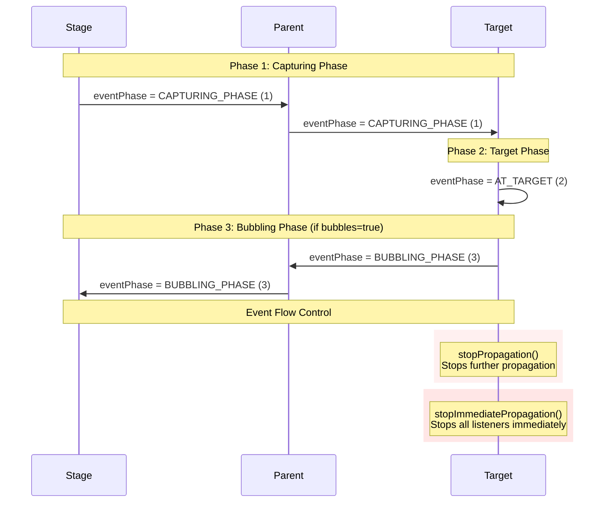
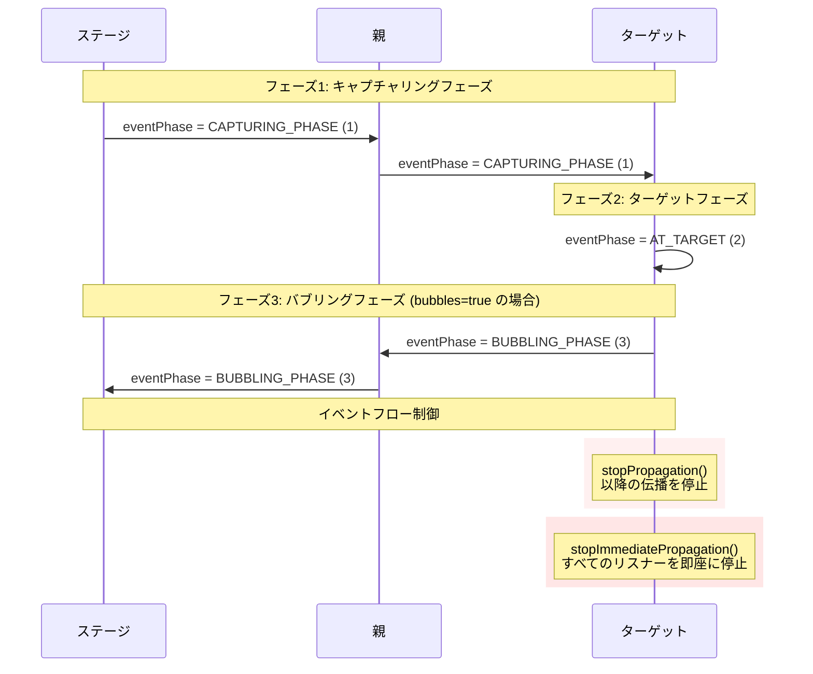

# @next2d/events

English | [日本語](#日本語)

## Overview

The `@next2d/events` package provides a comprehensive event handling system based on the EventDispatcher pattern. This package implements a robust event flow mechanism with support for event bubbling, capturing, and various event types commonly used in interactive applications.

## Installation

```bash
npm install @next2d/events
```

## Features

- **EventDispatcher Pattern**: Complete implementation of the observer pattern for event-driven architecture
- **Event Flow Control**: Support for capturing and bubbling phases with event propagation control
- **Multiple Event Types**: Pre-defined event classes for common use cases (pointer, keyboard, focus, video, etc.)
- **Type Safety**: Full TypeScript support with comprehensive type definitions
- **Service-based Architecture**: Modular service layer for event dispatcher operations

## Directory Structure

```
@next2d/events/
├── src/
│   ├── Event.ts                      # Base event class
│   ├── EventDispatcher.ts            # Event dispatcher implementation
│   ├── EventPhase.ts                 # Event phase constants
│   ├── EventUtil.ts                  # Event utility functions
│   │
│   ├── EventDispatcher/
│   │   └── service/                  # Event dispatcher service layer
│   │       ├── EventDispatcherAddEventListenerService.ts
│   │       ├── EventDispatcherDispatchEventService.ts
│   │       ├── EventDispatcherHasEventListenerService.ts
│   │       ├── EventDispatcherRemoveEventListenerService.ts
│   │       ├── EventDispatcherRemoveAllEventListenerService.ts
│   │       └── EventDispatcherWillTriggerService.ts
│   │
│   ├── interface/                    # TypeScript interfaces
│   │   ├── IEvent.ts
│   │   ├── IEventDispatcher.ts
│   │   ├── IEventListener.ts
│   │   └── IURLRequestHeader.ts
│   │
│   └── [Event Types]                 # Specialized event classes
│       ├── PointerEvent.ts           # Mouse and touch events
│       ├── KeyboardEvent.ts          # Keyboard input events
│       ├── FocusEvent.ts             # Focus change events
│       ├── WheelEvent.ts             # Mouse wheel events
│       ├── VideoEvent.ts             # Video playback events
│       ├── JobEvent.ts               # Tween job events
│       ├── HTTPStatusEvent.ts        # HTTP status events
│       ├── IOErrorEvent.ts           # I/O error events
│       └── ProgressEvent.ts          # Load progress events
```

## Event Flow

The event system implements a three-phase event flow mechanism similar to the W3C DOM event model:



## Core Classes

### Event

The base class for all events. Provides core event properties and propagation control methods.

**Key Properties:**
- `type`: Event type identifier
- `bubbles`: Whether the event participates in the bubbling phase
- `target`: The object that registered the event listener
- `currentTarget`: The object currently processing the event
- `eventPhase`: Current phase of event flow (CAPTURING_PHASE, AT_TARGET, BUBBLING_PHASE)

**Methods:**
- `stopPropagation()`: Prevents processing in subsequent nodes
- `stopImmediatePropagation()`: Prevents processing of all remaining listeners

### EventDispatcher

The base class for all classes that dispatch events. Manages event listener registration and event dispatching.

**Methods:**
- `addEventListener(type, listener, useCapture, priority)`: Register an event listener
- `removeEventListener(type, listener, useCapture)`: Remove an event listener
- `removeAllEventListener(type, useCapture)`: Remove all listeners of a specific type
- `dispatchEvent(event)`: Dispatch an event into the event flow
- `hasEventListener(type)`: Check if a listener exists for an event type
- `willTrigger(type)`: Check if this object or ancestors have listeners for an event type

### EventPhase

Constants defining the current phase of event flow:
- `CAPTURING_PHASE = 1`: The capture phase
- `AT_TARGET = 2`: The target phase
- `BUBBLING_PHASE = 3`: The bubbling phase

## Event Types

### PointerEvent

Handles pointer device interactions (mouse, pen, touch).

**Event Types:**
- `POINTER_DOWN`: Button press started
- `POINTER_UP`: Button released
- `POINTER_MOVE`: Pointer coordinates changed
- `POINTER_OVER`: Pointer entered hit test boundary
- `POINTER_OUT`: Pointer left hit test boundary
- `POINTER_LEAVE`: Pointer left element area
- `POINTER_CANCEL`: Pointer interaction canceled
- `DOUBLE_CLICK`: Double-click/tap occurred

### KeyboardEvent

Handles keyboard input.

**Event Types:**
- `KEY_DOWN`: Key pressed
- `KEY_UP`: Key released

### FocusEvent

Handles focus changes between display objects.

**Event Types:**
- `FOCUS_IN`: Element received focus
- `FOCUS_OUT`: Element lost focus

### WheelEvent

Handles mouse wheel interactions.

**Event Types:**
- `WHEEL`: Mouse wheel rotated

### VideoEvent

Handles video playback state changes.

**Event Types:**
- `PLAY`: Video play requested
- `PLAYING`: Video playback started
- `PAUSE`: Video paused
- `SEEK`: Video seek operation

### JobEvent

Handles tween animation events.

**Event Types:**
- `UPDATE`: Tween property updated
- `STOP`: Tween job stopped

### ProgressEvent

Handles loading progress for files and data.

**Properties:**
- `bytesLoaded`: Bytes loaded so far
- `bytesTotal`: Total bytes to load

**Event Types:**
- `PROGRESS`: Loading progress update

### HTTPStatusEvent

Handles HTTP response status.

**Properties:**
- `status`: HTTP status code
- `responseURL`: Response URL
- `responseHeaders`: Array of response headers

**Event Types:**
- `HTTP_STATUS`: HTTP status received

### IOErrorEvent

Handles I/O operation errors.

**Properties:**
- `text`: Error message text

**Event Types:**
- `IO_ERROR`: I/O error occurred

## Usage Example

```typescript
import { EventDispatcher, Event, PointerEvent } from '@next2d/events';

// Create an event dispatcher
const dispatcher = new EventDispatcher();

// Add event listener
dispatcher.addEventListener(PointerEvent.POINTER_DOWN, (event: Event) => {
    console.log('Pointer down at:', event.target);
});

// Dispatch event
const event = new PointerEvent(PointerEvent.POINTER_DOWN, true);
dispatcher.dispatchEvent(event);

// Remove event listener
dispatcher.removeEventListener(PointerEvent.POINTER_DOWN, listener);
```

### Event Bubbling Example

```typescript
import { EventDispatcher, Event } from '@next2d/events';

const stage = new EventDispatcher();
const parent = new EventDispatcher();
const child = new EventDispatcher();

// Setup hierarchy (child -> parent -> stage)

// Add capturing phase listener
stage.addEventListener(Event.ADDED, (e) => {
    console.log('Stage: Capturing', e.eventPhase); // 1
}, true);

// Add target phase listener
child.addEventListener(Event.ADDED, (e) => {
    console.log('Child: Target', e.eventPhase); // 2
});

// Add bubbling phase listener
parent.addEventListener(Event.ADDED, (e) => {
    console.log('Parent: Bubbling', e.eventPhase); // 3
});

// Dispatch bubbling event from child
const event = new Event(Event.ADDED, true); // bubbles = true
child.dispatchEvent(event);
```

---

## 日本語

## 概要

`@next2d/events` パッケージは、EventDispatcher パターンに基づく包括的なイベント処理システムを提供します。このパッケージは、イベントのバブリング、キャプチャリング、およびインタラクティブアプリケーションで一般的に使用される様々なイベントタイプをサポートする堅牢なイベントフロー機構を実装しています。

## インストール

```bash
npm install @next2d/events
```

## 特徴

- **EventDispatcher パターン**: イベント駆動型アーキテクチャのためのオブザーバーパターンの完全な実装
- **イベントフロー制御**: イベント伝播制御を備えたキャプチャリングフェーズとバブリングフェーズのサポート
- **複数のイベントタイプ**: 一般的なユースケース（ポインター、キーボード、フォーカス、ビデオなど）のための事前定義されたイベントクラス
- **型安全性**: 包括的な型定義による完全な TypeScript サポート
- **サービスベースアーキテクチャ**: イベントディスパッチャー操作のためのモジュラーサービス層

## ディレクトリ構造

```
@next2d/events/
├── src/
│   ├── Event.ts                      # 基本イベントクラス
│   ├── EventDispatcher.ts            # イベントディスパッチャーの実装
│   ├── EventPhase.ts                 # イベントフェーズ定数
│   ├── EventUtil.ts                  # イベントユーティリティ関数
│   │
│   ├── EventDispatcher/
│   │   └── service/                  # イベントディスパッチャーサービス層
│   │       ├── EventDispatcherAddEventListenerService.ts
│   │       ├── EventDispatcherDispatchEventService.ts
│   │       ├── EventDispatcherHasEventListenerService.ts
│   │       ├── EventDispatcherRemoveEventListenerService.ts
│   │       ├── EventDispatcherRemoveAllEventListenerService.ts
│   │       └── EventDispatcherWillTriggerService.ts
│   │
│   ├── interface/                    # TypeScript インターフェース
│   │   ├── IEvent.ts
│   │   ├── IEventDispatcher.ts
│   │   ├── IEventListener.ts
│   │   └── IURLRequestHeader.ts
│   │
│   └── [イベントタイプ]               # 特殊化されたイベントクラス
│       ├── PointerEvent.ts           # マウスとタッチイベント
│       ├── KeyboardEvent.ts          # キーボード入力イベント
│       ├── FocusEvent.ts             # フォーカス変更イベント
│       ├── WheelEvent.ts             # マウスホイールイベント
│       ├── VideoEvent.ts             # ビデオ再生イベント
│       ├── JobEvent.ts               # Tween ジョブイベント
│       ├── HTTPStatusEvent.ts        # HTTP ステータスイベント
│       ├── IOErrorEvent.ts           # I/O エラーイベント
│       └── ProgressEvent.ts          # ロード進捗イベント
```

## イベントフロー

イベントシステムは、W3C DOM イベントモデルと同様の3フェーズイベントフロー機構を実装しています：



## コアクラス

### Event

すべてのイベントの基本クラス。コアイベントプロパティと伝播制御メソッドを提供します。

**主要プロパティ:**
- `type`: イベントタイプ識別子
- `bubbles`: イベントがバブリングフェーズに参加するかどうか
- `target`: イベントリスナーを登録したオブジェクト
- `currentTarget`: 現在イベントを処理しているオブジェクト
- `eventPhase`: イベントフローの現在のフェーズ（CAPTURING_PHASE、AT_TARGET、BUBBLING_PHASE）

**メソッド:**
- `stopPropagation()`: 後続ノードでの処理を防止
- `stopImmediatePropagation()`: 残りのすべてのリスナーの処理を防止

### EventDispatcher

イベントを送出するすべてのクラスの基本クラス。イベントリスナーの登録とイベントの送出を管理します。

**メソッド:**
- `addEventListener(type, listener, useCapture, priority)`: イベントリスナーを登録
- `removeEventListener(type, listener, useCapture)`: イベントリスナーを削除
- `removeAllEventListener(type, useCapture)`: 特定タイプのすべてのリスナーを削除
- `dispatchEvent(event)`: イベントをイベントフローに送出
- `hasEventListener(type)`: イベントタイプのリスナーが存在するか確認
- `willTrigger(type)`: このオブジェクトまたは祖先がイベントタイプのリスナーを持つか確認

### EventPhase

イベントフローの現在のフェーズを定義する定数：
- `CAPTURING_PHASE = 1`: キャプチャフェーズ
- `AT_TARGET = 2`: ターゲットフェーズ
- `BUBBLING_PHASE = 3`: バブリングフェーズ

## イベントタイプ

### PointerEvent

ポインターデバイスの操作（マウス、ペン、タッチ）を処理します。

**イベントタイプ:**
- `POINTER_DOWN`: ボタンの押下開始
- `POINTER_UP`: ボタンの解放
- `POINTER_MOVE`: ポインター座標の変化
- `POINTER_OVER`: ポインターがヒットテスト境界に入った
- `POINTER_OUT`: ポインターがヒットテスト境界を出た
- `POINTER_LEAVE`: ポインターが要素領域を離れた
- `POINTER_CANCEL`: ポインター操作がキャンセルされた
- `DOUBLE_CLICK`: ダブルクリック/タップが発生

### KeyboardEvent

キーボード入力を処理します。

**イベントタイプ:**
- `KEY_DOWN`: キーが押された
- `KEY_UP`: キーが離された

### FocusEvent

表示オブジェクト間のフォーカス変更を処理します。

**イベントタイプ:**
- `FOCUS_IN`: 要素がフォーカスを受け取った
- `FOCUS_OUT`: 要素がフォーカスを失った

### WheelEvent

マウスホイールの操作を処理します。

**イベントタイプ:**
- `WHEEL`: マウスホイールが回転した

### VideoEvent

ビデオ再生の状態変化を処理します。

**イベントタイプ:**
- `PLAY`: ビデオ再生がリクエストされた
- `PLAYING`: ビデオ再生が開始された
- `PAUSE`: ビデオが一時停止された
- `SEEK`: ビデオシーク操作

### JobEvent

Tween アニメーションイベントを処理します。

**イベントタイプ:**
- `UPDATE`: Tween プロパティが更新された
- `STOP`: Tween ジョブが停止した

### ProgressEvent

ファイルやデータのロード進捗を処理します。

**プロパティ:**
- `bytesLoaded`: これまでにロードされたバイト数
- `bytesTotal`: ロードする合計バイト数

**イベントタイプ:**
- `PROGRESS`: ロード進捗の更新

### HTTPStatusEvent

HTTP レスポンスステータスを処理します。

**プロパティ:**
- `status`: HTTP ステータスコード
- `responseURL`: レスポンス URL
- `responseHeaders`: レスポンスヘッダーの配列

**イベントタイプ:**
- `HTTP_STATUS`: HTTP ステータスを受信

### IOErrorEvent

I/O 操作エラーを処理します。

**プロパティ:**
- `text`: エラーメッセージテキスト

**イベントタイプ:**
- `IO_ERROR`: I/O エラーが発生

## 使用例

```typescript
import { EventDispatcher, Event, PointerEvent } from '@next2d/events';

// イベントディスパッチャーを作成
const dispatcher = new EventDispatcher();

// イベントリスナーを追加
dispatcher.addEventListener(PointerEvent.POINTER_DOWN, (event: Event) => {
    console.log('ポインターダウン:', event.target);
});

// イベントを送出
const event = new PointerEvent(PointerEvent.POINTER_DOWN, true);
dispatcher.dispatchEvent(event);

// イベントリスナーを削除
dispatcher.removeEventListener(PointerEvent.POINTER_DOWN, listener);
```

### イベントバブリングの例

```typescript
import { EventDispatcher, Event } from '@next2d/events';

const stage = new EventDispatcher();
const parent = new EventDispatcher();
const child = new EventDispatcher();

// 階層を設定（child -> parent -> stage）

// キャプチャフェーズリスナーを追加
stage.addEventListener(Event.ADDED, (e) => {
    console.log('ステージ: キャプチャリング', e.eventPhase); // 1
}, true);

// ターゲットフェーズリスナーを追加
child.addEventListener(Event.ADDED, (e) => {
    console.log('子: ターゲット', e.eventPhase); // 2
});

// バブリングフェーズリスナーを追加
parent.addEventListener(Event.ADDED, (e) => {
    console.log('親: バブリング', e.eventPhase); // 3
});

// 子からバブリングイベントを送出
const event = new Event(Event.ADDED, true); // bubbles = true
child.dispatchEvent(event);
```

## License

This project is licensed under the [MIT License](https://opensource.org/licenses/MIT) - see the [LICENSE](LICENSE) file for details.
