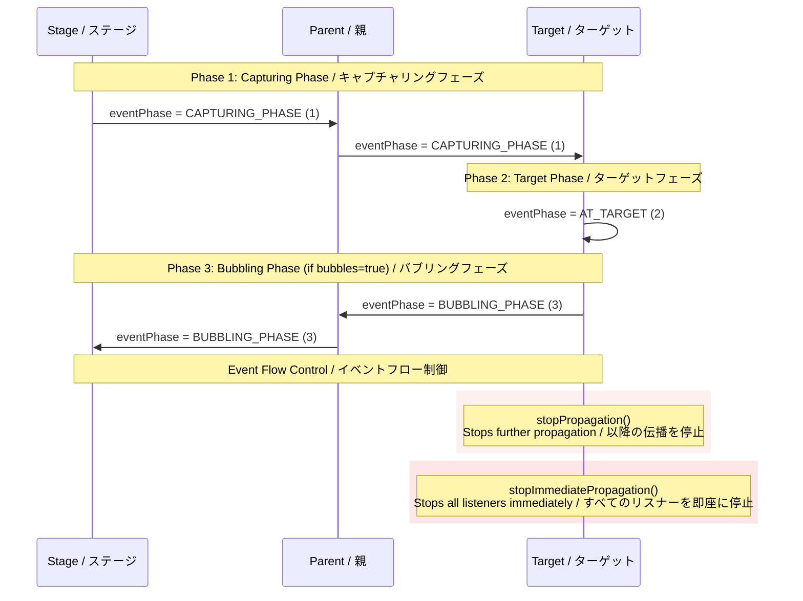

# @next2d/events

**重要**: `@next2d/events` は他の packages の import を禁止しています。このパッケージは基盤モジュールであり、循環依存を避けるために独立を維持する必要があります。

**Important**: `@next2d/events` prohibits importing other packages. This package is a foundational module that must remain independent to avoid circular dependencies.

## 概要 / Overview

`@next2d/events` パッケージは、EventDispatcher パターンに基づく包括的なイベント処理システムを提供します。このパッケージは、イベントのバブリング、キャプチャリング、およびインタラクティブアプリケーションで一般的に使用される様々なイベントタイプをサポートする堅牢なイベントフロー機構を実装しています。

The `@next2d/events` package provides a comprehensive event handling system based on the EventDispatcher pattern. This package implements a robust event flow mechanism with support for event bubbling, capturing, and various event types commonly used in interactive applications.

## インストール / Installation

```bash
npm install @next2d/events
```

## 特徴 / Features

- **EventDispatcher パターン**: イベント駆動型アーキテクチャのためのオブザーバーパターンの完全な実装
  - Complete implementation of the observer pattern for event-driven architecture
- **イベントフロー制御**: イベント伝播制御を備えたキャプチャリングフェーズとバブリングフェーズのサポート
  - Support for capturing and bubbling phases with event propagation control
- **複数のイベントタイプ**: 一般的なユースケース（ポインター、キーボード、フォーカス、ビデオなど）のための事前定義されたイベントクラス
  - Pre-defined event classes for common use cases (pointer, keyboard, focus, video, etc.)
- **型安全性**: 包括的な型定義による完全な TypeScript サポート
  - Full TypeScript support with comprehensive type definitions
- **サービスベースアーキテクチャ**: イベントディスパッチャー操作のためのモジュラーサービス層
  - Modular service layer for event dispatcher operations

## ディレクトリ構造 / Directory Structure

```
@next2d/events/
├── src/
│   ├── Event.ts                      # 基本イベントクラス / Base event class
│   ├── EventDispatcher.ts            # イベントディスパッチャーの実装 / Event dispatcher implementation
│   ├── EventPhase.ts                 # イベントフェーズ定数 / Event phase constants
│   ├── EventUtil.ts                  # イベントユーティリティ関数 / Event utility functions
│   │
│   ├── EventDispatcher/
│   │   └── service/                  # イベントディスパッチャーサービス層 / Event dispatcher service layer
│   │       ├── EventDispatcherAddEventListenerService.ts
│   │       ├── EventDispatcherDispatchEventService.ts
│   │       ├── EventDispatcherHasEventListenerService.ts
│   │       ├── EventDispatcherRemoveEventListenerService.ts
│   │       ├── EventDispatcherRemoveAllEventListenerService.ts
│   │       └── EventDispatcherWillTriggerService.ts
│   │
│   ├── interface/                    # TypeScript インターフェース / TypeScript interfaces
│   │   ├── IEvent.ts
│   │   ├── IEventDispatcher.ts
│   │   ├── IEventListener.ts
│   │   └── IURLRequestHeader.ts
│   │
│   └── [イベントタイプ / Event Types]
│       ├── PointerEvent.ts           # マウスとタッチイベント / Mouse and touch events
│       ├── KeyboardEvent.ts          # キーボード入力イベント / Keyboard input events
│       ├── FocusEvent.ts             # フォーカス変更イベント / Focus change events
│       ├── WheelEvent.ts             # マウスホイールイベント / Mouse wheel events
│       ├── VideoEvent.ts             # ビデオ再生イベント / Video playback events
│       ├── JobEvent.ts               # Tween ジョブイベント / Tween job events
│       ├── HTTPStatusEvent.ts        # HTTP ステータスイベント / HTTP status events
│       ├── IOErrorEvent.ts           # I/O エラーイベント / I/O error events
│       └── ProgressEvent.ts          # ロード進捗イベント / Load progress events
```

## イベントフロー / Event Flow

イベントシステムは、W3C DOM イベントモデルと同様の3フェーズイベントフロー機構を実装しています。

The event system implements a three-phase event flow mechanism similar to the W3C DOM event model.



## コアクラス / Core Classes

### Event

すべてのイベントの基本クラス。コアイベントプロパティと伝播制御メソッドを提供します。

The base class for all events. Provides core event properties and propagation control methods.

**主要プロパティ / Key Properties:**
- `type`: イベントタイプ識別子 / Event type identifier
- `bubbles`: イベントがバブリングフェーズに参加するかどうか / Whether the event participates in the bubbling phase
- `target`: イベントリスナーを登録したオブジェクト / The object that registered the event listener
- `currentTarget`: 現在イベントを処理しているオブジェクト / The object currently processing the event
- `eventPhase`: イベントフローの現在のフェーズ / Current phase of event flow (CAPTURING_PHASE, AT_TARGET, BUBBLING_PHASE)

**メソッド / Methods:**
- `stopPropagation()`: 後続ノードでの処理を防止 / Prevents processing in subsequent nodes
- `stopImmediatePropagation()`: 残りのすべてのリスナーの処理を防止 / Prevents processing of all remaining listeners

### EventDispatcher

イベントを送出するすべてのクラスの基本クラス。イベントリスナーの登録とイベントの送出を管理します。

The base class for all classes that dispatch events. Manages event listener registration and event dispatching.

**メソッド / Methods:**
- `addEventListener(type, listener, useCapture, priority)`: イベントリスナーを登録 / Register an event listener
- `removeEventListener(type, listener, useCapture)`: イベントリスナーを削除 / Remove an event listener
- `removeAllEventListener(type, useCapture)`: 特定タイプのすべてのリスナーを削除 / Remove all listeners of a specific type
- `dispatchEvent(event)`: イベントをイベントフローに送出 / Dispatch an event into the event flow
- `hasEventListener(type)`: イベントタイプのリスナーが存在するか確認 / Check if a listener exists for an event type
- `willTrigger(type)`: このオブジェクトまたは祖先がイベントタイプのリスナーを持つか確認 / Check if this object or ancestors have listeners for an event type

### EventPhase

イベントフローの現在のフェーズを定義する定数。

Constants defining the current phase of event flow.

- `CAPTURING_PHASE = 1`: キャプチャフェーズ / The capture phase
- `AT_TARGET = 2`: ターゲットフェーズ / The target phase
- `BUBBLING_PHASE = 3`: バブリングフェーズ / The bubbling phase

## イベントタイプ / Event Types

### PointerEvent

ポインターデバイスの操作（マウス、ペン、タッチ）を処理します。

Handles pointer device interactions (mouse, pen, touch).

**イベントタイプ / Event Types:**
- `POINTER_DOWN`: ボタンの押下開始 / Button press started
- `POINTER_UP`: ボタンの解放 / Button released
- `POINTER_MOVE`: ポインター座標の変化 / Pointer coordinates changed
- `POINTER_OVER`: ポインターがヒットテスト境界に入った / Pointer entered hit test boundary
- `POINTER_OUT`: ポインターがヒットテスト境界を出た / Pointer left hit test boundary
- `POINTER_LEAVE`: ポインターが要素領域を離れた / Pointer left element area
- `POINTER_CANCEL`: ポインター操作がキャンセルされた / Pointer interaction canceled
- `DOUBLE_CLICK`: ダブルクリック/タップが発生 / Double-click/tap occurred

### KeyboardEvent

キーボード入力を処理します。

Handles keyboard input.

**イベントタイプ / Event Types:**
- `KEY_DOWN`: キーが押された / Key pressed
- `KEY_UP`: キーが離された / Key released

### FocusEvent

表示オブジェクト間のフォーカス変更を処理します。

Handles focus changes between display objects.

**イベントタイプ / Event Types:**
- `FOCUS_IN`: 要素がフォーカスを受け取った / Element received focus
- `FOCUS_OUT`: 要素がフォーカスを失った / Element lost focus

### WheelEvent

マウスホイールの操作を処理します。

Handles mouse wheel interactions.

**イベントタイプ / Event Types:**
- `WHEEL`: マウスホイールが回転した / Mouse wheel rotated

### VideoEvent

ビデオ再生の状態変化を処理します。

Handles video playback state changes.

**イベントタイプ / Event Types:**
- `PLAY`: ビデオ再生がリクエストされた / Video play requested
- `PLAYING`: ビデオ再生が開始された / Video playback started
- `PAUSE`: ビデオが一時停止された / Video paused
- `SEEK`: ビデオシーク操作 / Video seek operation

### JobEvent

Tween アニメーションイベントを処理します。

Handles tween animation events.

**イベントタイプ / Event Types:**
- `UPDATE`: Tween プロパティが更新された / Tween property updated
- `STOP`: Tween ジョブが停止した / Tween job stopped

### ProgressEvent

ファイルやデータのロード進捗を処理します。

Handles loading progress for files and data.

**プロパティ / Properties:**
- `bytesLoaded`: これまでにロードされたバイト数 / Bytes loaded so far
- `bytesTotal`: ロードする合計バイト数 / Total bytes to load

**イベントタイプ / Event Types:**
- `PROGRESS`: ロード進捗の更新 / Loading progress update

### HTTPStatusEvent

HTTP レスポンスステータスを処理します。

Handles HTTP response status.

**プロパティ / Properties:**
- `status`: HTTP ステータスコード / HTTP status code
- `responseURL`: レスポンス URL / Response URL
- `responseHeaders`: レスポンスヘッダーの配列 / Array of response headers

**イベントタイプ / Event Types:**
- `HTTP_STATUS`: HTTP ステータスを受信 / HTTP status received

### IOErrorEvent

I/O 操作エラーを処理します。

Handles I/O operation errors.

**プロパティ / Properties:**
- `text`: エラーメッセージテキスト / Error message text

**イベントタイプ / Event Types:**
- `IO_ERROR`: I/O エラーが発生 / I/O error occurred

## 使用例 / Usage Example

```typescript
import { EventDispatcher, Event, PointerEvent } from '@next2d/events';

// イベントディスパッチャーを作成 / Create an event dispatcher
const dispatcher = new EventDispatcher();

// イベントリスナーを追加 / Add event listener
dispatcher.addEventListener(PointerEvent.POINTER_DOWN, (event: Event) => {
    console.log('ポインターダウン / Pointer down:', event.target);
});

// イベントを送出 / Dispatch event
const event = new PointerEvent(PointerEvent.POINTER_DOWN, true);
dispatcher.dispatchEvent(event);

// イベントリスナーを削除 / Remove event listener
dispatcher.removeEventListener(PointerEvent.POINTER_DOWN, listener);
```

### イベントバブリングの例 / Event Bubbling Example

```typescript
import { EventDispatcher, Event } from '@next2d/events';

const stage = new EventDispatcher();
const parent = new EventDispatcher();
const child = new EventDispatcher();

// 階層を設定（child -> parent -> stage）
// Setup hierarchy (child -> parent -> stage)

// キャプチャフェーズリスナーを追加 / Add capturing phase listener
stage.addEventListener(Event.ADDED, (e) => {
    console.log('ステージ / Stage: Capturing', e.eventPhase); // 1
}, true);

// ターゲットフェーズリスナーを追加 / Add target phase listener
child.addEventListener(Event.ADDED, (e) => {
    console.log('子 / Child: Target', e.eventPhase); // 2
});

// バブリングフェーズリスナーを追加 / Add bubbling phase listener
parent.addEventListener(Event.ADDED, (e) => {
    console.log('親 / Parent: Bubbling', e.eventPhase); // 3
});

// 子からバブリングイベントを送出 / Dispatch bubbling event from child
const event = new Event(Event.ADDED, true); // bubbles = true
child.dispatchEvent(event);
```

## ライセンス / License

This project is licensed under the [MIT License](https://opensource.org/licenses/MIT) - see the [LICENSE](LICENSE) file for details.
