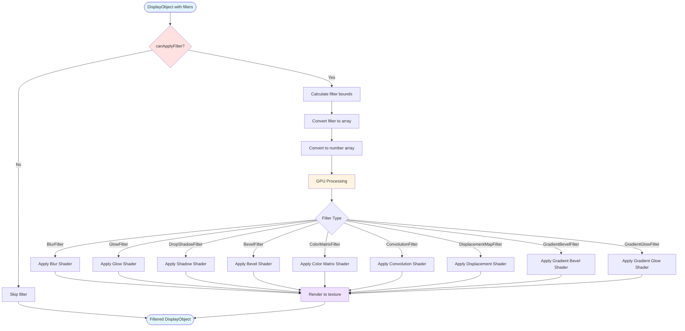

# @next2d/filters

**Important**: `@next2d/filters` prohibits importing other packages. This package is a foundational module that must remain independent to avoid circular dependencies.

**重要**: `@next2d/filters` は他の packages の import を禁止しています。このパッケージは基盤モジュールであり、循環依存を避けるために独立を維持する必要があります。

## Overview / 概要

**English:**
The `@next2d/filters` package provides GPU-accelerated visual effect filters for DisplayObjects in the Next2D player. This package includes a comprehensive set of bitmap filter effects that can be applied to any display object, offering high-performance image processing capabilities powered by WebGL.

**日本語:**
`@next2d/filters` パッケージは、Next2D プレイヤーの DisplayObject に対して GPU アクセラレーションによる視覚エフェクトフィルターを提供します。このパッケージには、任意の表示オブジェクトに適用可能なビットマップフィルター効果の包括的なセットが含まれており、WebGL によって高速化された画像処理機能を提供します。

## Installation / インストール

```bash
npm install @next2d/filters
```

## Directory Structure / ディレクトリ構造

```
src/
├── BitmapFilter.ts              # Base class for all filters / すべてのフィルターの基底クラス
├── BlurFilter.ts                # Blur effect filter / ぼかし効果フィルター
├── GlowFilter.ts                # Glow effect filter / グロー効果フィルター
├── DropShadowFilter.ts          # Drop shadow effect filter / ドロップシャドウ効果フィルター
├── BevelFilter.ts               # Bevel effect filter / ベベル効果フィルター
├── ColorMatrixFilter.ts         # Color matrix transformation filter / カラーマトリックス変換フィルター
├── ConvolutionFilter.ts         # Convolution matrix filter / 畳み込みマトリックスフィルター
├── DisplacementMapFilter.ts     # Displacement map filter / ディスプレイスメントマップフィルター
├── GradientBevelFilter.ts       # Gradient bevel effect filter / グラデーションベベル効果フィルター
├── GradientGlowFilter.ts        # Gradient glow effect filter / グラデーショングロー効果フィルター
├── FilterUtil.ts                # Utility functions for filters / フィルター用ユーティリティ関数
│
├── interface/                   # Type definitions / 型定義
│   ├── IBitmapDataChannel.ts
│   ├── IBitmapFilterType.ts
│   ├── IBounds.ts
│   ├── IDisplacementMapFilterMode.ts
│   └── IFilterQuality.ts
│
├── BlurFilter/
│   ├── service/                 # Business logic services / ビジネスロジックサービス
│   │   ├── BlurFilterCanApplyFilterService.ts
│   │   ├── BlurFilterToArrayService.ts
│   │   └── BlurFilterToNumberArrayService.ts
│   └── usecase/                 # Use case implementations / ユースケース実装
│       └── BlurFilterGetBoundsUseCase.ts
│
├── GlowFilter/
│   ├── service/
│   │   ├── GlowFilterCanApplyFilterService.ts
│   │   ├── GlowFilterToArrayService.ts
│   │   └── GlowFilterToNumberArrayService.ts
│   └── usecase/
│       └── GlowFilterGetBoundsUseCase.ts
│
├── DropShadowFilter/
│   ├── service/
│   │   ├── DropShadowFilterCanApplyFilterService.ts
│   │   ├── DropShadowFilterToArrayService.ts
│   │   └── DropShadowFilterToNumberArrayService.ts
│   └── usecase/
│       └── DropShadowFilterGetBoundsUseCase.ts
│
├── BevelFilter/
│   ├── service/
│   │   ├── BevelFilterCanApplyFilterService.ts
│   │   ├── BevelFilterToArrayService.ts
│   │   └── BevelFilterToNumberArrayService.ts
│   └── usecase/
│       └── BevelFilterGetBoundsUseCase.ts
│
├── ColorMatrixFilter/
│   └── service/
│       ├── ColorMatrixFilterToArrayService.ts
│       └── ColorMatrixFilterToNumberArrayService.ts
│
├── ConvolutionFilter/
│   └── service/
│       ├── ConvolutionFilterCanApplyFilterService.ts
│       ├── ConvolutionFilterToArrayService.ts
│       └── ConvolutionFilterToNumberArrayService.ts
│
├── DisplacementMapFilter/
│   └── service/
│       ├── DisplacementMapFilterCanApplyFilterService.ts
│       ├── DisplacementMapFilterToArrayService.ts
│       └── DisplacementMapFilterToNumberArrayService.ts
│
├── GradientBevelFilter/
│   ├── service/
│   │   ├── GradientBevelFilterCanApplyFilterService.ts
│   │   ├── GradientBevelFilterToArrayService.ts
│   │   └── GradientBevelFilterToNumberArrayService.ts
│   └── usecase/
│       └── GradientBevelFilterGetBoundsUseCase.ts
│
└── GradientGlowFilter/
    ├── service/
    │   ├── GradientGlowFilterCanApplyFilterService.ts
    │   ├── GradientGlowFilterToArrayService.ts
    │   └── GradientGlowFilterToNumberArrayService.ts
    └── usecase/
        └── GradientGlowFilterGetBoundsUseCase.ts
```

## Available Filters / 利用可能なフィルター

### BitmapFilter
**English:** Base class for all image filter effects. All filter classes extend this base class.
**日本語:** すべてのイメージフィルター効果の基底クラス。すべてのフィルタークラスはこの基底クラスを継承します。

### BlurFilter
**English:** Applies a blur visual effect to display objects. Softens image details, ranging from a soft focus to a Gaussian blur effect.
**日本語:** 表示オブジェクトにぼかし効果を適用します。ソフトフォーカスからガウスぼかしまで、イメージの細部をぼかします。

### GlowFilter
**English:** Applies a glow effect to display objects. Supports inner glow, outer glow, and knockout modes.
**日本語:** 表示オブジェクトにグロー効果を適用します。内側グロー、外側グロー、ノックアウトモードをサポートします。

### DropShadowFilter
**English:** Adds a drop shadow effect to display objects. Creates the visual effect of an object casting a shadow.
**日本語:** 表示オブジェクトにドロップシャドウ効果を追加します。オブジェクトが影を落とす視覚効果を作成します。

### BevelFilter
**English:** Adds a bevel effect that gives objects a three-dimensional appearance with highlights and shadows.
**日本語:** ハイライトとシャドウを使用してオブジェクトに立体的な外観を与えるベベル効果を追加します。

### ColorMatrixFilter
**English:** Applies color transformation using a 4x5 matrix. Enables advanced color manipulation and effects.
**日本語:** 4x5 マトリックスを使用してカラー変換を適用します。高度なカラー操作とエフェクトを可能にします。

### ConvolutionFilter
**English:** Applies a convolution matrix filter for custom image processing effects like sharpening, edge detection, and embossing.
**日本語:** 鮮鋭化、エッジ検出、エンボスなどのカスタム画像処理効果のための畳み込みマトリックスフィルターを適用します。

### DisplacementMapFilter
**English:** Uses pixel values from a BitmapData object to displace pixels in the filtered object, creating distortion effects.
**日本語:** BitmapData オブジェクトのピクセル値を使用してフィルター適用オブジェクトのピクセルを変位させ、歪み効果を作成します。

### GradientBevelFilter
**English:** Produces a bevel effect with gradient color transitions for more sophisticated three-dimensional appearances.
**日本語:** グラデーションカラー遷移を使用したベベル効果を生成し、より洗練された立体的な外観を作成します。

### GradientGlowFilter
**English:** Applies a glow effect with gradient color transitions for enhanced visual depth and richness.
**日本語:** グラデーションカラー遷移を使用したグロー効果を適用し、視覚的な深みと豊かさを向上させます。

## Filter Application Pipeline / フィルター適用パイプライン



## Architecture / アーキテクチャ

**English:**
Each filter follows a clean architecture pattern with separation of concerns:

- **Filter Class**: Main filter implementation extending `BitmapFilter`
- **Service Layer**: Business logic for filter operations (validation, conversion, serialization)
- **UseCase Layer**: Specific use cases like bounds calculation
- **Interface Layer**: Type definitions and contracts

This architecture ensures maintainability, testability, and scalability of the filter system.

**日本語:**
各フィルターは、関心の分離を伴うクリーンアーキテクチャパターンに従っています：

- **フィルタークラス**: `BitmapFilter` を継承するメインのフィルター実装
- **サービス層**: フィルター操作のビジネスロジック（検証、変換、シリアライゼーション）
- **ユースケース層**: バウンズ計算などの特定のユースケース
- **インターフェース層**: 型定義と契約

このアーキテクチャにより、フィルターシステムの保守性、テスト可能性、スケーラビリティが保証されます。

## Usage Example / 使用例

```typescript
import { BlurFilter, GlowFilter, DropShadowFilter } from '@next2d/filters';

// Create a blur filter / ぼかしフィルターを作成
const blur = new BlurFilter(4, 4, 3);

// Create a glow filter / グローフィルターを作成
const glow = new GlowFilter(0xff0000, 0.8, 10, 10, 2, 3);

// Create a drop shadow filter / ドロップシャドウフィルターを作成
const shadow = new DropShadowFilter(4, 45, 0x000000, 0.8, 4, 4, 1, 3);

// Apply to display object / 表示オブジェクトに適用
displayObject.filters = [blur, glow, shadow];
```

## Performance Considerations / パフォーマンスに関する考慮事項

**English:**
- All filters are GPU-accelerated using WebGL shaders
- Filter quality settings affect performance and visual output
- Multiple filters are processed in sequence
- Bounds calculation is optimized for minimal overhead

**日本語:**
- すべてのフィルターは WebGL シェーダーを使用して GPU アクセラレーションされています
- フィルターの品質設定はパフォーマンスと視覚出力に影響します
- 複数のフィルターは順番に処理されます
- バウンズ計算は最小限のオーバーヘッドに最適化されています

## License / ライセンス

This project is licensed under the [MIT License](https://opensource.org/licenses/MIT) - see the [LICENSE](LICENSE) file for details.

このプロジェクトは [MIT ライセンス](https://opensource.org/licenses/MIT)の下でライセンスされています - 詳細については [LICENSE](LICENSE) ファイルを参照してください。
