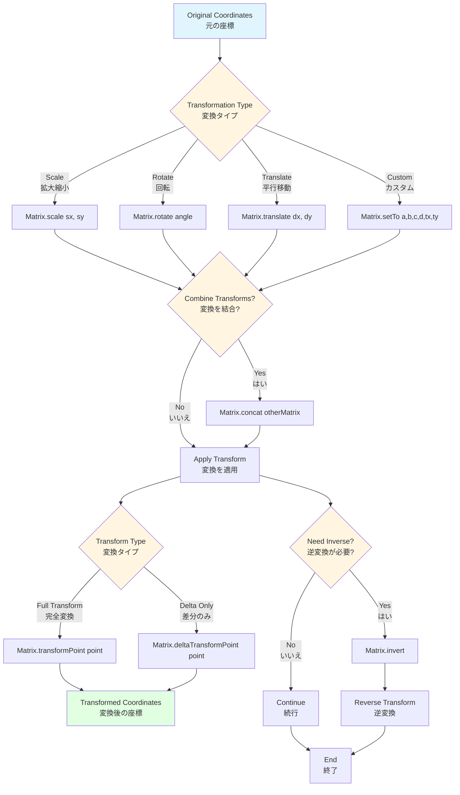

# @next2d/geom

## Overview / 概要

**English:**
The `@next2d/geom` package provides geometric primitives and utilities for 2D transformations and color manipulation. This package implements fundamental geometric classes used in graphics programming, including matrices for transformations, points for coordinates, rectangles for bounding boxes, and color transformations for visual effects.

**Japanese:**
`@next2d/geom` パッケージは、2D変換とカラー操作のための幾何プリミティブとユーティリティを提供します。このパッケージは、グラフィックスプログラミングで使用される基本的な幾何クラスを実装しており、変換用のマトリックス、座標用のポイント、境界ボックス用の矩形、視覚効果用のカラー変換が含まれます。

## Installation / インストール

```bash
npm install @next2d/geom
```

## Directory Structure / ディレクトリ構造

```
src/
├── Matrix.ts                          # 2D transformation matrix class
│   └── service/                       # Matrix operation services
│       ├── MatirxConcatService.ts     # Matrix concatenation
│       ├── MatrixCloneService.ts      # Matrix cloning
│       ├── MatrixCopyFromService.ts   # Copy matrix data
│       ├── MatrixCreateBoxService.ts  # Create transformation box
│       ├── MatrixCreateGradientBoxService.ts  # Create gradient box
│       ├── MatrixDeltaTransformPointService.ts  # Delta transformation
│       ├── MatrixIdentityService.ts   # Identity matrix
│       ├── MatrixInvertService.ts     # Matrix inversion
│       ├── MatrixRotateService.ts     # Rotation transformation
│       ├── MatrixScaleService.ts      # Scaling transformation
│       ├── MatrixSetToService.ts      # Set matrix values
│       ├── MatrixTransformPointService.ts  # Point transformation
│       └── MatrixTranslateService.ts  # Translation transformation
│
├── Point.ts                           # 2D point class
│   └── service/                       # Point operation services
│       ├── PointAddService.ts         # Add points
│       ├── PointCloneService.ts       # Clone point
│       ├── PointCopyFromService.ts    # Copy point data
│       ├── PointDistanceService.ts    # Calculate distance
│       ├── PointEqualsService.ts      # Point equality check
│       ├── PointInterpolateService.ts # Point interpolation
│       ├── PointNormalizeService.ts   # Normalize point
│       ├── PointOffsetService.ts      # Offset point
│       ├── PointPolarService.ts       # Polar to Cartesian conversion
│       ├── PointSetToService.ts       # Set point values
│       └── PointSubtractService.ts    # Subtract points
│
├── Rectangle.ts                       # Rectangle class for bounding boxes
│   └── service/                       # Rectangle operation services
│       ├── RectangleCloneService.ts   # Clone rectangle
│       ├── RectangleContainsService.ts  # Contains coordinate check
│       ├── RectangleContainsPointService.ts  # Contains point check
│       ├── RectangleContainsRectService.ts   # Contains rectangle check
│       ├── RectangleCopyFromService.ts  # Copy rectangle data
│       ├── RectangleEqualsService.ts  # Rectangle equality check
│       ├── RectangleInflateService.ts # Inflate rectangle
│       ├── RectangleInflatePointService.ts  # Inflate by point
│       ├── RectangleIntersectionService.ts  # Calculate intersection
│       ├── RectangleIntersectsService.ts    # Intersection check
│       ├── RectangleIsEmptyService.ts # Empty check
│       ├── RectangleOffsetService.ts  # Offset rectangle
│       ├── RectangleOffsetPointService.ts   # Offset by point
│       ├── RectangleSetEmptyService.ts  # Set to empty
│       ├── RectangleSetToService.ts   # Set rectangle values
│       └── RectangleUnionService.ts   # Union of rectangles
│
├── ColorTransform.ts                  # Color transformation class
│   └── service/                       # ColorTransform operation services
│       └── ColorTransformConcatService.ts  # Concatenate color transforms
│
├── GeomUtil.ts                        # Utility functions
└── index.ts                           # Package exports
```

## Classes / クラス

### Matrix

**English:**
The `Matrix` class represents a 3x2 affine transformation matrix used for 2D transformations. It determines how to map points from one coordinate space to another and supports operations like translation, rotation, scaling, and skewing.

**Japanese:**
`Matrix` クラスは、2D変換に使用される3x2のアフィン変換行列を表します。ある座標空間から別の座標空間へのポイントのマッピング方法を決定し、平行移動、回転、拡大縮小、傾斜などの操作をサポートします。

**Key Properties / 主要プロパティ:**
- `a`, `b`, `c`, `d` - Transformation matrix components / 変換行列の成分
- `tx`, `ty` - Translation values / 平行移動の値

**Common Operations / 一般的な操作:**
- `clone()` - Create a copy of the matrix / 行列のコピーを作成
- `concat(matrix)` - Combine with another matrix / 別の行列と結合
- `rotate(angle)` - Apply rotation / 回転を適用
- `scale(sx, sy)` - Apply scaling / 拡大縮小を適用
- `translate(dx, dy)` - Apply translation / 平行移動を適用
- `transformPoint(point)` - Transform a point / ポイントを変換
- `invert()` - Invert the matrix / 行列を反転
- `identity()` - Reset to identity matrix / 単位行列にリセット

### Point

**English:**
The `Point` class represents a location in a two-dimensional coordinate system, where x represents the horizontal axis and y represents the vertical axis.

**Japanese:**
`Point` クラスは2次元座標系の位置を表し、xは水平軸、yは垂直軸を表します。

**Key Properties / 主要プロパティ:**
- `x` - Horizontal coordinate / 水平座標
- `y` - Vertical coordinate / 垂直座標
- `length` - Distance from origin (0,0) / 原点(0,0)からの距離

**Common Operations / 一般的な操作:**
- `clone()` - Create a copy of the point / ポイントのコピーを作成
- `add(point)` - Add coordinates / 座標を加算
- `subtract(point)` - Subtract coordinates / 座標を減算
- `offset(dx, dy)` - Offset by specified amounts / 指定量でオフセット
- `normalize(thickness)` - Scale to set length / 指定長さにスケール
- `equals(point)` - Check equality / 等価性をチェック
- `Point.distance(p1, p2)` - Calculate distance between points / 2点間の距離を計算
- `Point.interpolate(p1, p2, f)` - Interpolate between points / 2点間を補間
- `Point.polar(length, angle)` - Convert polar to Cartesian / 極座標を直交座標に変換

### Rectangle

**English:**
The `Rectangle` class represents an area defined by its position (top-left corner point) and dimensions (width and height). It is commonly used for bounding boxes and collision detection.

**Japanese:**
`Rectangle` クラスは、位置（左上隅のポイント）と寸法（幅と高さ）によって定義される領域を表します。バウンディングボックスや衝突検出によく使用されます。

**Key Properties / 主要プロパティ:**
- `x`, `y` - Position of top-left corner / 左上隅の位置
- `width`, `height` - Dimensions / 寸法
- `left`, `right`, `top`, `bottom` - Edge coordinates / 辺の座標
- `topLeft`, `bottomRight` - Corner points / 角のポイント
- `size` - Dimensions as Point / Point型の寸法

**Common Operations / 一般的な操作:**
- `clone()` - Create a copy / コピーを作成
- `contains(x, y)` - Check if coordinates are inside / 座標が内部にあるか確認
- `containsPoint(point)` - Check if point is inside / ポイントが内部にあるか確認
- `containsRect(rect)` - Check if rectangle is inside / 矩形が内部にあるか確認
- `intersects(rect)` - Check for intersection / 交差をチェック
- `intersection(rect)` - Get intersection area / 交差領域を取得
- `union(rect)` - Get union area / 結合領域を取得
- `inflate(dx, dy)` - Increase size / サイズを増加
- `offset(dx, dy)` - Move position / 位置を移動
- `isEmpty()` - Check if empty / 空かどうか確認
- `setEmpty()` - Set to empty / 空に設定

### ColorTransform

**English:**
The `ColorTransform` class allows you to adjust color values in display objects. Color transformation can be applied to all four channels: red, green, blue, and alpha transparency. Each channel uses the formula:
```
new_value = (old_value * multiplier) + offset
```

**Japanese:**
`ColorTransform` クラスを使用すると、表示オブジェクトのカラー値を調整できます。カラー変換は、赤、緑、青、アルファ透明度の4つのチャンネルすべてに適用できます。各チャンネルは次の式を使用します:
```
新しい値 = (古い値 * 乗数) + オフセット
```

**Key Properties / 主要プロパティ:**
- `redMultiplier`, `greenMultiplier`, `blueMultiplier`, `alphaMultiplier` - Channel multipliers (0-1) / チャンネル乗数(0-1)
- `redOffset`, `greenOffset`, `blueOffset`, `alphaOffset` - Channel offsets (-255 to 255) / チャンネルオフセット(-255～255)

**Common Operations / 一般的な操作:**
- `clone()` - Create a copy / コピーを作成
- `concat(colorTransform)` - Combine color transformations / カラー変換を結合

### GeomUtil

**English:**
The `GeomUtil` module provides utility functions for geometry operations, including object pooling for Float32Array instances to optimize memory usage and performance.

**Japanese:**
`GeomUtil` モジュールは、メモリ使用量とパフォーマンスを最適化するためのFloat32Arrayインスタンスのオブジェクトプーリングを含む、幾何演算用のユーティリティ関数を提供します。

**Key Functions / 主要な関数:**
- `$getFloat32Array6()` - Get pooled 6-element array for Matrix / Matrix用の6要素配列をプールから取得
- `$poolFloat32Array6()` - Return array to pool / 配列をプールに返却
- `$getFloat32Array8()` - Get pooled 8-element array for ColorTransform / ColorTransform用の8要素配列をプールから取得
- `$poolFloat32Array8()` - Return array to pool / 配列をプールに返却
- `$clamp()` - Clamp value between min and max / 値を最小値と最大値の間に制限

## Matrix Transformation Pipeline / 行列変換パイプライン



## Usage Example / 使用例

```typescript
import { Matrix, Point, Rectangle, ColorTransform } from '@next2d/geom';

// Matrix transformation
const matrix = new Matrix();
matrix.translate(100, 100);
matrix.rotate(Math.PI / 4); // 45 degrees
matrix.scale(2, 2);

const point = new Point(50, 50);
const transformed = matrix.transformPoint(point);

// Rectangle operations
const rect1 = new Rectangle(0, 0, 100, 100);
const rect2 = new Rectangle(50, 50, 100, 100);

if (rect1.intersects(rect2)) {
    const intersection = rect1.intersection(rect2);
    console.log('Intersection:', intersection);
}

// Color transformation
const colorTransform = new ColorTransform();
colorTransform.redMultiplier = 0.5;
colorTransform.greenOffset = 128;
```

## Performance Optimization / パフォーマンス最適化

**English:**
This package uses object pooling for Float32Array instances to minimize memory allocations and improve performance. The `GeomUtil` module provides pooling functions that reuse array instances, reducing garbage collection overhead in performance-critical applications.

**Japanese:**
このパッケージは、Float32Arrayインスタンスにオブジェクトプーリングを使用して、メモリ割り当てを最小限に抑え、パフォーマンスを向上させます。`GeomUtil` モジュールは、配列インスタンスを再利用するプーリング関数を提供し、パフォーマンスクリティカルなアプリケーションでのガベージコレクションのオーバーヘッドを削減します。

## License

This project is licensed under the [MIT License](https://opensource.org/licenses/MIT) - see the [LICENSE](LICENSE) file for details.
