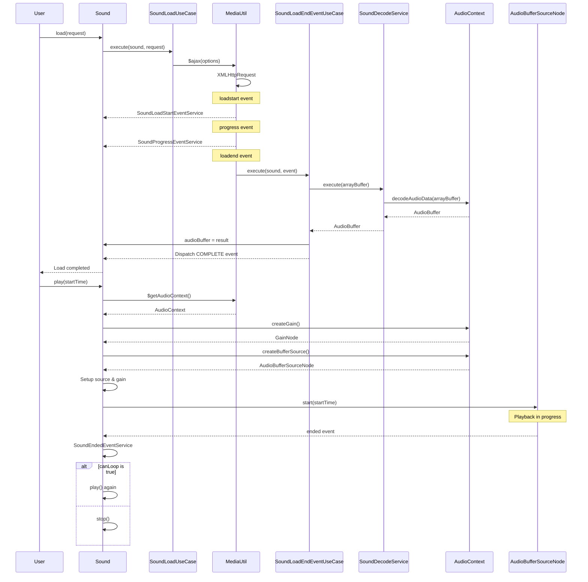
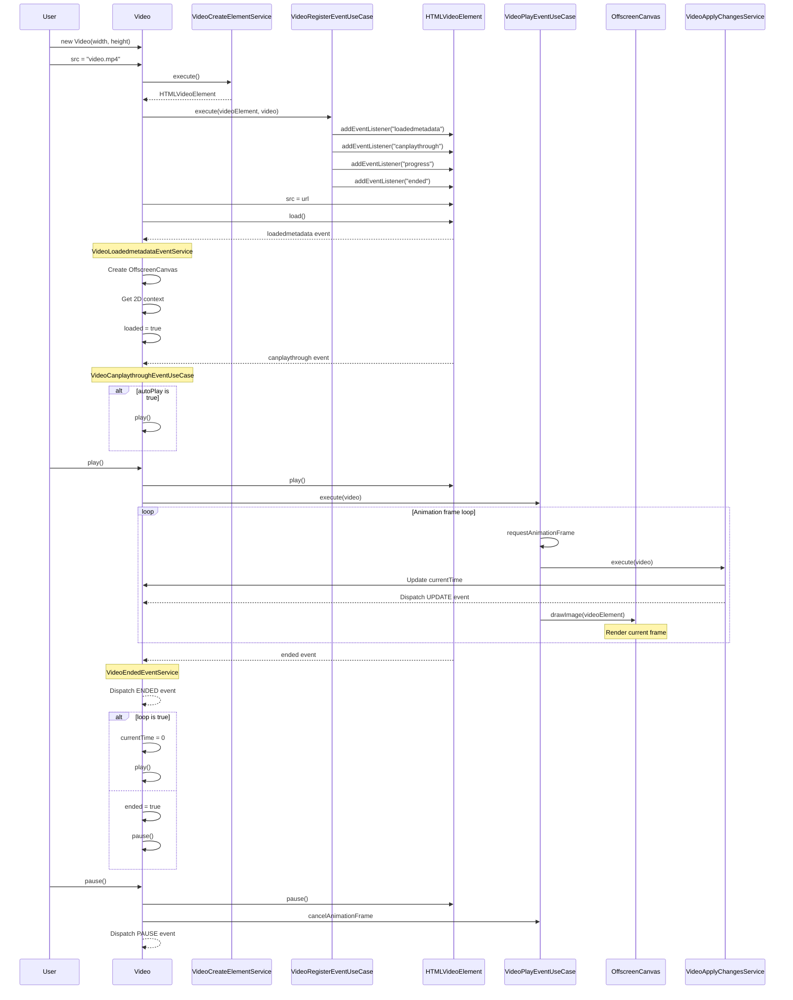

# @next2d/media

## Overview / 概要

The `@next2d/media` package provides audio and video playback management using Web Audio API and HTML5 Video. This package enables Flash-like multimedia experiences in modern web applications.

`@next2d/media` パッケージは、Web Audio API と HTML5 Video を使用した音声および動画の再生管理を提供します。このパッケージにより、モダンなWebアプリケーションでFlashのようなマルチメディア体験を実現できます。

## Features / 機能

- **Sound Playback**: MP3/audio file loading and playback with Web Audio API / Web Audio APIを使用したMP3/音声ファイルの読み込みと再生
- **Video Playback**: HTML5 video element integration with custom rendering pipeline / HTML5動画要素の統合とカスタムレンダリングパイプライン
- **Global Audio Control**: Application-wide volume and playback management / アプリケーション全体の音量と再生管理
- **Sound Transform**: Volume and loop control for individual sounds / 個別のサウンドの音量とループ制御

## Installation / インストール

```bash
npm install @next2d/media
```

## Directory Structure / ディレクトリ構造

```
src/
├── Sound.ts                          # Sound class for audio playback / 音声再生用のSoundクラス
├── Sound/
│   ├── service/                      # Sound-related services / Sound関連のサービス
│   │   ├── SoundDecodeService.ts     # ArrayBuffer to AudioBuffer decoding / ArrayBufferからAudioBufferへのデコード
│   │   ├── SoundEndedEventService.ts # Sound ended event handling / サウンド終了イベント処理
│   │   ├── SoundLoadStartEventService.ts # Load start event / 読み込み開始イベント
│   │   └── SoundProgressEventService.ts  # Load progress event / 読み込み進捗イベント
│   └── usecase/                      # Sound use cases / Soundユースケース
│       ├── SoundBuildFromCharacterUseCase.ts # Build from character data / キャラクターデータからの構築
│       ├── SoundLoadEndEventUseCase.ts # Load completion handling / 読み込み完了処理
│       └── SoundLoadUseCase.ts       # External sound loading / 外部サウンドの読み込み
│
├── SoundMixer.ts                     # Global sound controller / グローバルサウンドコントローラー
├── SoundMixer/
│   └── service/                      # SoundMixer services / SoundMixerサービス
│       ├── SoundMixerStopAllService.ts # Stop all sounds / 全サウンド停止
│       └── SoundMixerUpdateVolumeService.ts # Update global volume / グローバル音量更新
│
├── SoundTransform.ts                 # Volume and loop properties / 音量とループのプロパティ
│
├── Video.ts                          # Video class for video playback / 動画再生用のVideoクラス
├── Video/
│   ├── service/                      # Video-related services / Video関連のサービス
│   │   ├── VideoApplyChangesService.ts # Apply video state changes / 動画状態変更の適用
│   │   ├── VideoCreateElementService.ts # Create video element / 動画要素の作成
│   │   ├── VideoEndedEventService.ts # Video ended event / 動画終了イベント
│   │   ├── VideoLoadedmetadataEventService.ts # Metadata loaded event / メタデータ読み込みイベント
│   │   └── VideoProgressEventService.ts # Video progress event / 動画進捗イベント
│   └── usecase/                      # Video use cases / Videoユースケース
│       ├── VideoBuildFromCharacterUseCase.ts # Build from character / キャラクターからの構築
│       ├── VideoCanplaythroughEventUseCase.ts # Can play through event / 再生可能イベント
│       ├── VideoPlayEventUseCase.ts  # Play event handling / 再生イベント処理
│       └── VideoRegisterEventUseCase.ts # Register video events / 動画イベント登録
│
├── MediaUtil.ts                      # Utility functions for media / メディア用ユーティリティ関数
│                                     # - AudioContext management / AudioContext管理
│                                     # - Volume control / 音量制御
│                                     # - Playing sounds/videos tracking / 再生中サウンド/動画の追跡
│                                     # - AJAX helper / AJAXヘルパー
│
└── interface/                        # TypeScript interfaces / TypeScript インターフェース
    ├── ISoundCharacter.ts            # Sound character definition / サウンドキャラクター定義
    ├── IVideoCharacter.ts            # Video character definition / 動画キャラクター定義
    ├── IAjaxOption.ts                # AJAX options / AJAXオプション
    ├── IAjaxEvent.ts                 # AJAX events / AJAXイベント
    ├── IURLRequestMethod.ts          # URL request methods / URLリクエストメソッド
    ├── IURLRequestHeader.ts          # URL request headers / URLリクエストヘッダー
    ├── IURLLoaderDataFormat.ts       # URL loader data format / URLローダーデータフォーマット
    ├── IBlendMode.ts                 # Blend mode types / ブレンドモード型
    ├── IBounds.ts                    # Bounds interface / バウンズインターフェース
    ├── ICharacter.ts                 # Character interface / キャラクターインターフェース
    ├── IDictionaryTag.ts             # Dictionary tag interface / 辞書タグインターフェース
    ├── IFilterArray.ts               # Filter array interface / フィルター配列インターフェース
    ├── IGrid.ts                      # Grid interface / グリッドインターフェース
    ├── ILoopConfig.ts                # Loop config interface / ループ設定インターフェース
    ├── ILoopType.ts                  # Loop type interface / ループタイプインターフェース
    ├── IMovieClipActionObject.ts     # MovieClip action object / MovieClipアクションオブジェクト
    ├── IMovieClipCharacter.ts        # MovieClip character / MovieClipキャラクター
    ├── IMovieClipLabelObject.ts      # MovieClip label object / MovieClipラベルオブジェクト
    ├── IMovieClipSoundObject.ts      # MovieClip sound object / MovieClipサウンドオブジェクト
    ├── IPlaceObject.ts               # Place object interface / 配置オブジェクトインターフェース
    ├── IShapeCharacter.ts            # Shape character / Shapeキャラクター
    ├── ISoundTag.ts                  # Sound tag interface / サウンドタグインターフェース
    ├── ISurfaceFilter.ts             # Surface filter interface / サーフェスフィルターインターフェース
    ├── ITextFieldCharacter.ts        # TextField character / TextFieldキャラクター
    ├── ITextFieldType.ts             # TextField type / TextFieldタイプ
    └── ITextFormatAlign.ts           # TextFormat align / TextFormat配置
```

## API Overview / API概要

### Sound Class / Soundクラス

```typescript
import { Sound } from "@next2d/media";
import { URLRequest } from "@next2d/net";

const sound = new Sound();
sound.volume = 0.8;
sound.loopCount = 3; // Loop 3 times / 3回ループ

// Load external MP3 / 外部MP3を読み込み
await sound.load(new URLRequest("path/to/audio.mp3"));

// Play sound / サウンドを再生
sound.play();

// Stop sound / サウンドを停止
sound.stop();
```

### SoundMixer Class / SoundMixerクラス

```typescript
import { SoundMixer } from "@next2d/media";

// Global volume control (0.0 - 1.0) / グローバル音量制御 (0.0 - 1.0)
SoundMixer.volume = 0.5;

// Stop all playing sounds and videos / 全ての再生中サウンドと動画を停止
SoundMixer.stopAll();
```

### Video Class / Videoクラス

```typescript
import { Video } from "@next2d/media";

const video = new Video(640, 480);
video.smoothing = true;
video.loop = true;
video.autoPlay = true;
video.volume = 0.8;

// Set video source / 動画ソースを設定
video.src = "path/to/video.mp4";

// Play video / 動画を再生
await video.play();

// Pause video / 動画を一時停止
video.pause();

// Seek to position / 位置をシーク
video.seek(5.0); // Seek to 5 seconds / 5秒の位置にシーク
```

### SoundTransform Class / SoundTransformクラス

```typescript
import { SoundTransform } from "@next2d/media";

const transform = new SoundTransform(0.8, 2);
// volume: 0.8, loopCount: 2
```

## Sound Loading and Playback Flow / サウンド読み込みと再生フロー



## Video Rendering Pipeline / 動画レンダリングパイプライン



## Key Components / 主要コンポーネント

### MediaUtil.ts

Provides core utility functions for media handling:
メディア処理のためのコアユーティリティ関数を提供します:

- **AudioContext Management / AudioContext管理**: `$getAudioContext()`, `$bootAudioContext()`
- **Volume Control / 音量制御**: `$getVolume()`, `$setVolume()`
- **Playing Media Tracking / 再生中メディア追跡**: `$getPlayingSounds()`, `$getPlayingVideos()`
- **AJAX Helper / AJAXヘルパー**: `$ajax()` for loading external resources / 外部リソース読み込み用
- **Utility Functions / ユーティリティ関数**: `$clamp()` for value range limiting / 値の範囲制限用

### Service Layer / サービス層

Services handle specific operations and events:
サービスは特定の操作とイベントを処理します:

- **Sound Services**: Decoding, event handling (loadstart, progress, ended)
  - **Soundサービス**: デコード、イベント処理 (loadstart, progress, ended)
- **SoundMixer Services**: Global volume updates, stop all functionality
  - **SoundMixerサービス**: グローバル音量更新、全停止機能
- **Video Services**: Element creation, state changes, event handling
  - **Videoサービス**: 要素作成、状態変更、イベント処理

### Use Case Layer / ユースケース層

Use cases orchestrate complex workflows:
ユースケースは複雑なワークフローを調整します:

- **Sound Use Cases**: Loading external audio, building from character data, load completion
  - **Soundユースケース**: 外部音声読み込み、キャラクターデータからの構築、読み込み完了
- **Video Use Cases**: Event registration, playback management, character building
  - **Videoユースケース**: イベント登録、再生管理、キャラクター構築

## Architecture / アーキテクチャ

This package follows a clean architecture pattern:
このパッケージはクリーンアーキテクチャパターンに従っています:

1. **Domain Layer**: Core classes (`Sound`, `Video`, `SoundMixer`, `SoundTransform`)
   - **ドメイン層**: コアクラス (`Sound`, `Video`, `SoundMixer`, `SoundTransform`)

2. **Use Case Layer**: Business logic orchestration (`usecase/` folders)
   - **ユースケース層**: ビジネスロジックの調整 (`usecase/` フォルダ)

3. **Service Layer**: Specific operations and event handling (`service/` folders)
   - **サービス層**: 特定の操作とイベント処理 (`service/` フォルダ)

4. **Utility Layer**: Shared utilities (`MediaUtil.ts`)
   - **ユーティリティ層**: 共有ユーティリティ (`MediaUtil.ts`)

5. **Interface Layer**: TypeScript type definitions (`interface/` folder)
   - **インターフェース層**: TypeScript型定義 (`interface/` フォルダ)

## Browser Compatibility / ブラウザ互換性

This package requires:
このパッケージには以下が必要です:

- Web Audio API support / Web Audio APIサポート
- HTML5 Video support / HTML5 Videoサポート
- OffscreenCanvas support (for Video) / OffscreenCanvasサポート (Video用)
- XMLHttpRequest / ArrayBuffer support / XMLHttpRequest / ArrayBufferサポート

## License

This project is licensed under the [MIT License](https://opensource.org/licenses/MIT) - see the [LICENSE](LICENSE) file for details.
