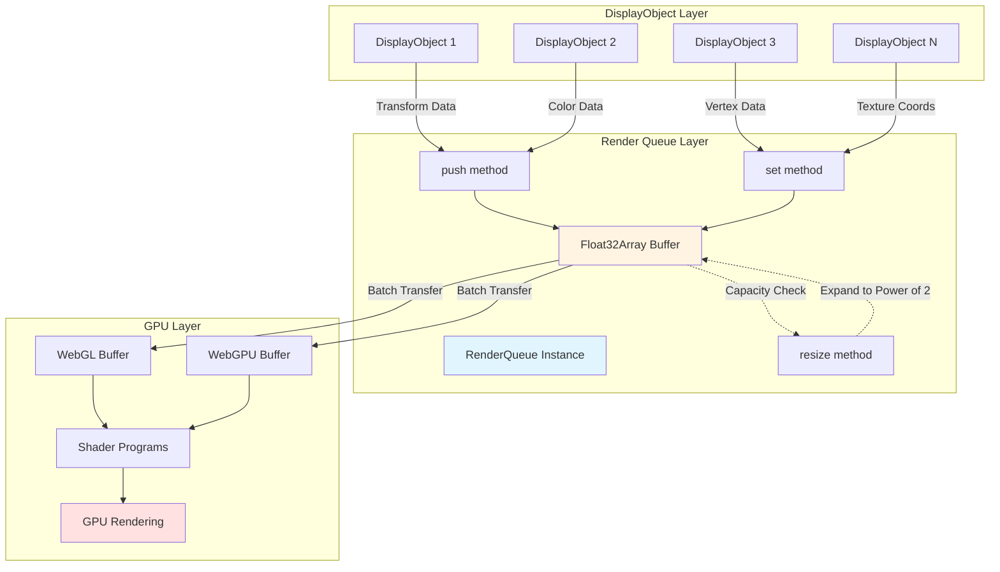

# @next2d/render-queue

## 概要 / Overview

**日本語:**

`@next2d/render-queue`は、Next2D Playerのレンダリングパイプラインにおいて、描画データを効率的に管理するためのレンダーキューパッケージです。Float32Array型のバッファを使用し、DisplayObjectsからの描画命令をバッチ処理してWebGL/WebGPUに送信することで、高速なGPUレンダリングを実現します。

**English:**

`@next2d/render-queue` is a render queue package that efficiently manages rendering data in the Next2D Player rendering pipeline. It uses a Float32Array-based buffer to batch rendering commands from DisplayObjects and send them to WebGL/WebGPU for high-performance GPU rendering.

## 特徴 / Features

- **Float32Array型バッファ**: GPU最適化された高速なデータ構造
- **動的リサイズ**: 2の累乗サイズで自動的にバッファを拡張
- **バッチ処理**: 複数の描画命令をまとめてGPUに送信
- **シングルトンパターン**: グローバルな`renderQueue`インスタンスで一元管理

---

- **Float32Array-based buffer**: GPU-optimized high-performance data structure
- **Dynamic resizing**: Automatically expands buffer to power-of-two sizes
- **Batch processing**: Groups multiple rendering commands for GPU submission
- **Singleton pattern**: Centralized management via global `renderQueue` instance

## インストール / Installation

```bash
npm install @next2d/render-queue
```

## ディレクトリ構成 / Directory Structure

```
packages/render-queue/
├── src/
│   ├── RenderQueue.ts          # レンダーキュー管理クラス / Render queue management class
│   ├── RenderQueueUtil.ts      # ユーティリティ関数 / Utility functions
│   └── index.ts                # エクスポート定義 / Export definitions
├── README.md
└── package.json
```

### ファイル説明 / File Descriptions

#### RenderQueue.ts
**日本語:** レンダーキューの主要クラス。Float32Array型のバッファを管理し、描画データの追加とリサイズを処理します。

**English:** Main render queue class. Manages Float32Array buffer and handles adding rendering data and resizing.

**主要メソッド / Key Methods:**
- `push(...args: number[])`: 個別の数値をバッファに追加 / Add individual numbers to buffer
- `set(array: Float32Array | Uint8Array)`: 配列をバッファにセット / Set array to buffer
- `resize(length: number)`: バッファを拡張 / Expand buffer

#### RenderQueueUtil.ts
**日本語:** バッファサイズの最適化のための2の累乗計算関数を提供します。

**English:** Provides power-of-two calculation function for buffer size optimization.

**主要関数 / Key Functions:**
- `$upperPowerOfTwo(v: number)`: 指定値を2の累乗に切り上げ / Round up to power of two

## レンダリングパイプラインにおける役割 / Role in Rendering Pipeline

### 日本語

レンダーキューは、Next2D Playerのレンダリングパイプラインにおいて中心的な役割を果たします:

1. **データ収集フェーズ**: DisplayObjectsのツリー構造を走査し、各オブジェクトの描画に必要なデータ（座標、色、変換行列など）をFloat32Arrayバッファに収集します。

2. **バッチ処理**: 複数のDisplayObjectsからのデータを単一のバッファにまとめることで、GPUへの呼び出し回数を削減し、レンダリングパフォーマンスを大幅に向上させます。

3. **GPU転送**: 収集されたデータはWebGL/WebGPUのバッファオブジェクトに転送され、シェーダープログラムで処理されます。

4. **動的メモリ管理**: 描画データ量に応じて自動的にバッファサイズを調整し、メモリ効率を最適化します。バッファは常に2の累乗サイズで管理されるため、GPUでの処理効率が向上します。

### English

The render queue plays a central role in the Next2D Player rendering pipeline:

1. **Data Collection Phase**: Traverses the DisplayObjects tree structure and collects data required for rendering each object (coordinates, colors, transformation matrices, etc.) into the Float32Array buffer.

2. **Batch Processing**: Combines data from multiple DisplayObjects into a single buffer, reducing GPU call count and significantly improving rendering performance.

3. **GPU Transfer**: Collected data is transferred to WebGL/WebGPU buffer objects and processed by shader programs.

4. **Dynamic Memory Management**: Automatically adjusts buffer size according to rendering data volume, optimizing memory efficiency. Buffers are always managed in power-of-two sizes, improving GPU processing efficiency.

## アーキテクチャ図 / Architecture Diagram



### フロー説明 / Flow Description

**日本語:**

1. **データ追加**: 各DisplayObjectは、レンダリングに必要なデータ（変換行列、色、頂点座標、テクスチャ座標など）を`push()`または`set()`メソッドを通じてバッファに追加します。

2. **容量チェック**: データ追加時、バッファ容量が不足している場合、`resize()`メソッドが自動的に呼び出され、2の累乗サイズにバッファが拡張されます。

3. **バッチ転送**: フレームの描画準備が完了すると、蓄積されたバッファデータがWebGL/WebGPUのバッファオブジェクトに一括転送されます。

4. **GPU処理**: 転送されたデータはシェーダープログラムで処理され、最終的にGPUでレンダリングされます。

**English:**

1. **Data Addition**: Each DisplayObject adds rendering data (transformation matrices, colors, vertex coordinates, texture coordinates, etc.) to the buffer via `push()` or `set()` methods.

2. **Capacity Check**: When adding data, if buffer capacity is insufficient, the `resize()` method is automatically called to expand the buffer to a power-of-two size.

3. **Batch Transfer**: Once frame rendering preparation is complete, accumulated buffer data is batch-transferred to WebGL/WebGPU buffer objects.

4. **GPU Processing**: Transferred data is processed by shader programs and finally rendered by the GPU.

## 使用例 / Usage Example

```typescript
import { renderQueue } from "@next2d/render-queue";

// 個別の数値を追加 / Add individual numbers
renderQueue.push(1.0, 0.0, 0.0, 1.0); // 変換行列 / Transformation matrix
renderQueue.push(255, 128, 64, 255);  // RGBA色 / RGBA color

// 配列をセット / Set array
const vertices = new Float32Array([
    0.0, 0.0,   // 頂点1 / Vertex 1
    1.0, 0.0,   // 頂点2 / Vertex 2
    1.0, 1.0,   // 頂点3 / Vertex 3
    0.0, 1.0    // 頂点4 / Vertex 4
]);
renderQueue.set(vertices);

// バッファデータを取得 / Get buffer data
const buffer = renderQueue.buffer;
const offset = renderQueue.offset;

// フレーム終了後にリセット / Reset after frame
renderQueue.offset = 0;
```

## パフォーマンス最適化 / Performance Optimization

### 日本語

1. **2の累乗リサイズ**: バッファサイズは常に2の累乗（256, 512, 1024, ...）で管理され、メモリアライメントとGPU効率が最適化されます。

2. **Float32Array使用**: JavaScriptの通常の配列ではなく、型付き配列を使用することで、メモリフットプリントを削減し、GPU転送を高速化します。

3. **シングルトンパターン**: グローバルな`renderQueue`インスタンスを使用することで、インスタンス生成のオーバーヘッドを排除します。

4. **バッチ処理**: 個別のGPU呼び出しを削減し、ドローコールを最小化することでレンダリング性能を向上させます。

### English

1. **Power-of-Two Resizing**: Buffer sizes are always managed as powers of two (256, 512, 1024, ...), optimizing memory alignment and GPU efficiency.

2. **Float32Array Usage**: Uses typed arrays instead of regular JavaScript arrays, reducing memory footprint and accelerating GPU transfer.

3. **Singleton Pattern**: Uses a global `renderQueue` instance, eliminating instance creation overhead.

4. **Batch Processing**: Improves rendering performance by reducing individual GPU calls and minimizing draw calls.

## API リファレンス / API Reference

### RenderQueue Class

#### Properties

| Property | Type | Description (日本語) | Description (English) |
|----------|------|---------------------|----------------------|
| `buffer` | `Float32Array` | レンダリングデータを格納するバッファ | Buffer storing rendering data |
| `offset` | `number` | バッファ内の現在の書き込み位置 | Current write position in buffer |

#### Methods

##### `push(...args: number[]): void`

**日本語:** 可変長引数として渡された数値をバッファに追加します。必要に応じて自動的にバッファをリサイズします。

**English:** Adds numbers passed as variadic arguments to the buffer. Automatically resizes buffer if necessary.

**Parameters:**
- `...args: number[]` - 追加する数値 / Numbers to add

##### `set(array: Float32Array | Uint8Array): void`

**日本語:** 型付き配列をバッファにセットします。大量のデータを一度に追加する際に`push()`より効率的です。

**English:** Sets typed array to buffer. More efficient than `push()` when adding large amounts of data at once.

**Parameters:**
- `array: Float32Array | Uint8Array` - セットする配列 / Array to set

##### `resize(length: number): void`

**日本語:** バッファを指定された長さに対応できるよう、2の累乗サイズにリサイズします。既存のデータは保持されます。

**English:** Resizes buffer to power-of-two size to accommodate specified length. Existing data is preserved.

**Parameters:**
- `length: number` - 必要な追加容量 / Required additional capacity

### Utility Functions

#### `$upperPowerOfTwo(v: number): number`

**日本語:** 指定された値を2の累乗に切り上げます。バッファサイズの最適化に使用されます。

**English:** Rounds up specified value to power of two. Used for buffer size optimization.

**Parameters:**
- `v: number` - 入力値 / Input value

**Returns:**
- `number` - 2の累乗に切り上げられた値 / Value rounded up to power of two

**Example:**
```typescript
$upperPowerOfTwo(100);  // 128
$upperPowerOfTwo(256);  // 256
$upperPowerOfTwo(300);  // 512
```

## ライセンス / License

This project is licensed under the [MIT License](https://opensource.org/licenses/MIT) - see the [LICENSE](LICENSE) file for details.
