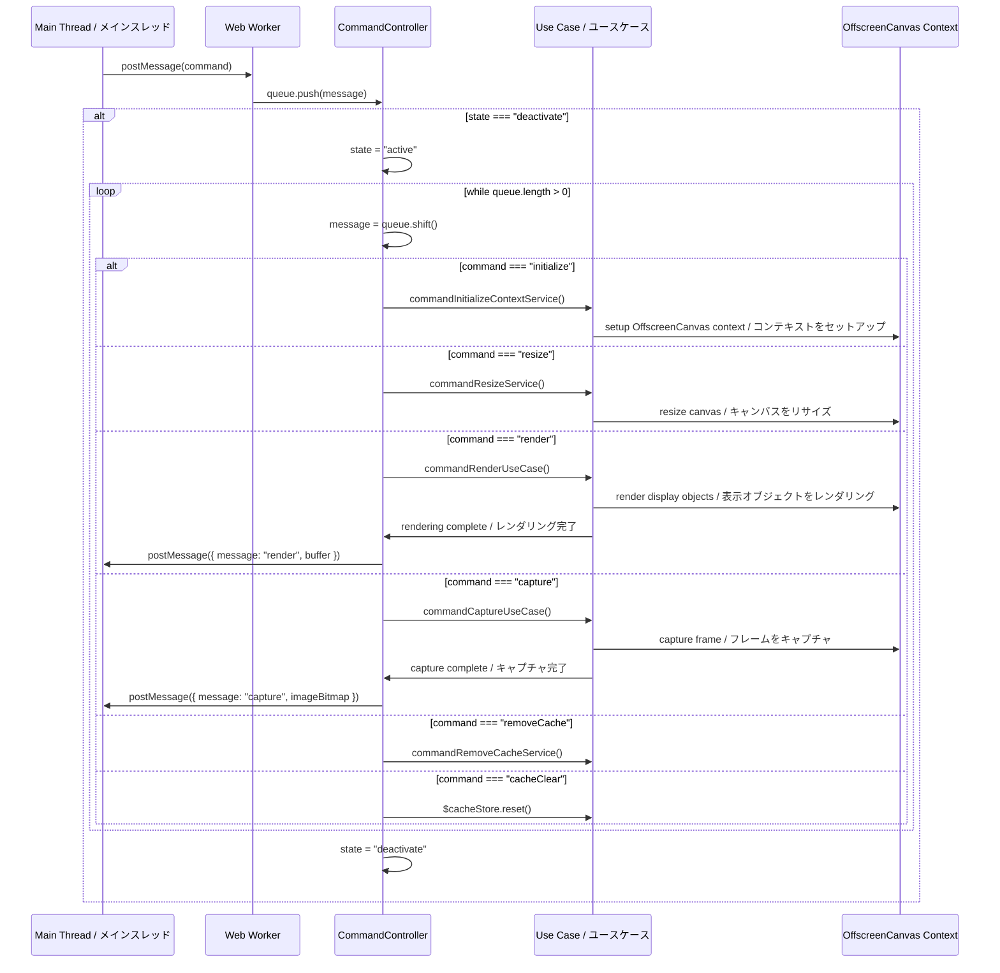

# @next2d/renderer

## 概要 / Overview

`@next2d/renderer`は、Web Workerで動作するOffscreenCanvasベースのレンダリングエンジンです。Next2Dアプリケーション向けに高性能でノンブロッキングなレンダリングを提供します。レンダリング処理を別スレッドにオフロードすることで、スムーズなUI操作と効率的なグラフィックス処理を実現します。

`@next2d/renderer` is an OffscreenCanvas-based rendering engine that runs in a Web Worker, providing high-performance, non-blocking rendering for Next2D applications. By offloading rendering operations to a separate thread, it ensures smooth UI interactions and efficient graphics processing.

## 主な特徴 / Key Features

- **Web Workerアーキテクチャ**: ノンブロッキングレンダリングのため完全にWeb Worker内で動作
  - Runs entirely in a Web Worker for non-blocking rendering
- **OffscreenCanvas**: ハードウェアアクセラレーションによるグラフィックス処理にOffscreenCanvas APIを活用
  - Leverages OffscreenCanvas API for hardware-accelerated graphics
- **コマンドキューパターン**: レンダリングコマンドを非同期で効率的に処理
  - Efficiently processes rendering commands asynchronously
- **モジュラー設計**: 各表示オブジェクトタイプごとにサービスとユースケースをクリーンに分離
  - Clean separation of services and use cases for each display object type

## インストール / Installation

```bash
npm install @next2d/renderer
```

## アーキテクチャ / Architecture

### ディレクトリ構造 / Directory Structure

```
src/
├── index.ts                           # Workerエントリポイント / Worker entry point
├── CommandController.ts               # メインコマンドキューコントローラー / Main command queue controller
├── RendererUtil.ts                    # レンダリング用ユーティリティ関数 / Utility functions for rendering
├── Command/
│   ├── service/                       # コマンド処理サービス / Command processing services
│   │   ├── CommandInitializeContextService.ts
│   │   ├── CommandResizeService.ts
│   │   └── CommandRemoveCacheService.ts
│   └── usecase/                       # コマンドユースケース / Command use cases
│       ├── CommandRenderUseCase.ts
│       └── CommandCaptureUseCase.ts
├── DisplayObject/
│   └── service/                       # 基本表示オブジェクトサービス / Base display object services
│       └── DisplayObjectGetBlendModeService.ts
├── DisplayObjectContainer/
│   └── usecase/                       # コンテナレンダリングロジック / Container rendering logic
│       ├── DisplayObjectContainerRenderUseCase.ts
│       └── DisplayObjectContainerClipRenderUseCase.ts
├── Shape/
│   ├── service/                       # Shapeコマンド処理 / Shape command processing
│   │   └── ShapeCommandService.ts
│   └── usecase/                       # Shapeレンダリングロジック / Shape rendering logic
│       ├── ShapeRenderUseCase.ts
│       └── ShapeClipRenderUseCase.ts
├── TextField/
│   ├── service/                       # テキスト処理サービス / Text processing services
│   │   ├── TextFieldGenerateFontStyleService.ts
│   │   └── TextFiledGetAlignOffsetService.ts
│   └── usecase/                       # テキストレンダリングロジック / Text rendering logic
│       ├── TextFieldRenderUseCase.ts
│       └── TextFieldDrawOffscreenCanvasUseCase.ts
├── Video/
│   └── usecase/                       # ビデオレンダリングロジック / Video rendering logic
│       └── VideoRenderUseCase.ts
└── interface/                         # TypeScriptインターフェース / TypeScript interfaces
    ├── IMessage.ts
    ├── INode.ts
    ├── IRGBA.ts
    ├── IBlendMode.ts
    ├── ITextFormat.ts
    ├── ITextObject.ts
    └── ...
```

### コンポーネントの役割 / Component Roles

- **index.ts**: メッセージイベントリスナーをセットアップするWorkerエントリポイント / Worker entry point that sets up the message event listener
- **CommandController**: コマンドキューを管理し、適切なハンドラーにコマンドをディスパッチ / Manages the command queue and dispatches commands to appropriate handlers
- **Command/service/**: 低レベルのコマンド処理(コンテキスト初期化、リサイズ、キャッシュ削除) / Low-level command processing (context initialization, resize, cache removal)
- **Command/usecase/**: 高レベルのコマンド操作(レンダリング、キャプチャ) / High-level command operations (render, capture)
- **DisplayObject/service/**: すべての表示オブジェクト共通のサービス / Shared services for all display objects
- **DisplayObjectContainer/usecase/**: コンテナオブジェクトのレンダリングロジック / Rendering logic for container objects
- **Shape/service/ & usecase/**: ベクターグラフィックスのレンダリング / Vector graphics rendering
- **TextField/service/ & usecase/**: テキストレンダリングとフォント処理 / Text rendering and font processing
- **Video/usecase/**: ビデオ要素のレンダリング / Video element rendering
- **RendererUtil.ts**: レンダリング操作用の共通ユーティリティ関数 / Common utility functions for rendering operations
- **interface/**: TypeScript型定義とインターフェース / TypeScript type definitions and interfaces

## メッセージフロー / Message Flow



## コマンドキューパターン / Command Queue Pattern

レンダラーは、非同期レンダリング操作を効率的に管理するためにコマンドキューパターンを使用しています。

The renderer uses a command queue pattern to efficiently manage asynchronous rendering operations.

### キュー管理 / Queue Management

1. **メッセージ受信 / Message Reception**: メインスレッドからメッセージが到着すると、`queue`配列にプッシュされます / When a message arrives from the main thread, it's pushed into the `queue` array
2. **状態チェック / State Check**: Workerが`deactivate`状態(アイドル)の場合、実行を開始します / If the worker is in `deactivate` state (idle), it begins execution
3. **逐次処理 / Sequential Processing**: `queue.shift()`を使用してコマンドを1つずつ処理します / Commands are processed one by one using `queue.shift()`
4. **状態管理 / State Management**: Workerは`active`と`deactivate`状態の間で遷移します / The worker transitions between `active` and `deactivate` states

### サポートされるコマンド / Supported Commands

- **initialize**: デバイスピクセル比を使用してOffscreenCanvasコンテキストをセットアップ / Set up OffscreenCanvas context with device pixel ratio
- **resize**: キャンバスの寸法を更新し、必要に応じてキャッシュをクリア / Update canvas dimensions and clear cache if needed
- **render**: 表示オブジェクトのレンダリングパイプラインを実行 / Execute rendering pipeline for display objects
- **capture**: 現在のフレームをImageBitmapとしてキャプチャ / Capture current frame as ImageBitmap
- **removeCache**: 特定のキャッシュアイテムを削除 / Remove specific cached items
- **cacheClear**: キャッシュストア全体をクリア / Clear entire cache store

### メリット / Benefits

- **ノンブロッキング / Non-blocking**: レンダリング中もメインスレッドはレスポンシブなまま / Main thread remains responsive during rendering
- **効率的 / Efficient**: コマンドはバッチ処理され、非同期で処理されます / Commands are batched and processed asynchronously
- **スレッドセーフ / Thread-safe**: Workerの分離により競合状態を防止 / Worker isolation prevents race conditions
- **転送可能オブジェクト / Transferable Objects**: ゼロコピーメッセージパッシングのために転送可能オブジェクト(ArrayBuffer、ImageBitmap)を使用 / Uses Transferable objects (ArrayBuffer, ImageBitmap) for zero-copy message passing

## 使用例 / Usage Example

```typescript
// メインスレッド / Main thread
const worker = new Worker('renderer.js');
const canvas = document.getElementById('canvas') as HTMLCanvasElement;
const offscreen = canvas.transferControlToOffscreen();

// レンダラーの初期化 / Initialize renderer
worker.postMessage({
  command: 'initialize',
  canvas: offscreen,
  devicePixelRatio: window.devicePixelRatio
}, [offscreen]);

// フレームのレンダリング / Render frame
worker.postMessage({
  command: 'render',
  buffer: renderDataBuffer,
  length: dataLength,
  imageBitmaps: bitmaps
}, [renderDataBuffer.buffer, ...bitmaps]);

// 完了の待機 / Listen for completion
worker.addEventListener('message', (event) => {
  if (event.data.message === 'render') {
    // レンダリング完了、バッファが返却されました
    // Rendering complete, buffer returned
    console.log('フレームがレンダリングされました / Frame rendered');
  }
});
```

## ライセンス / License

This project is licensed under the [MIT License](LICENSE) - see the LICENSE file for details.
