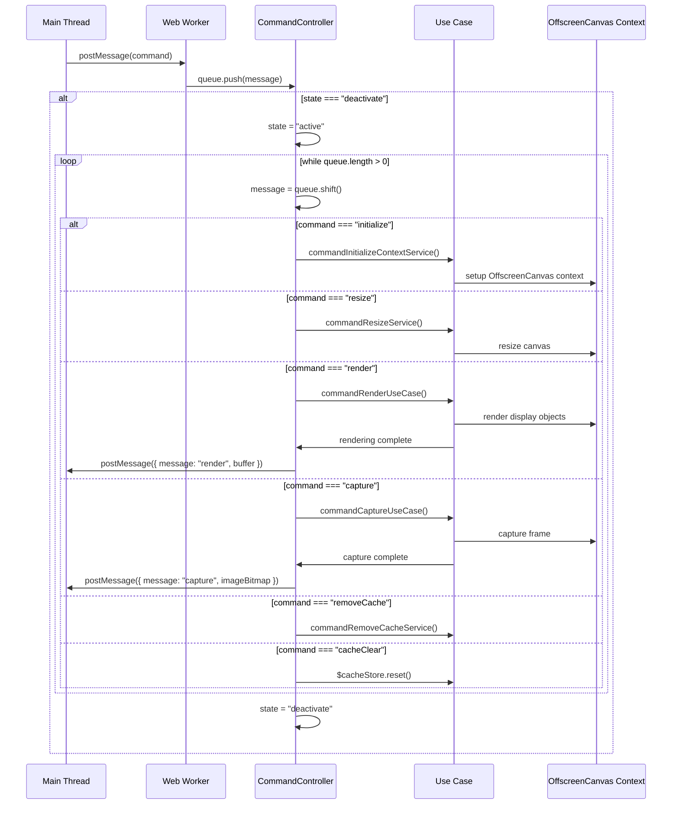
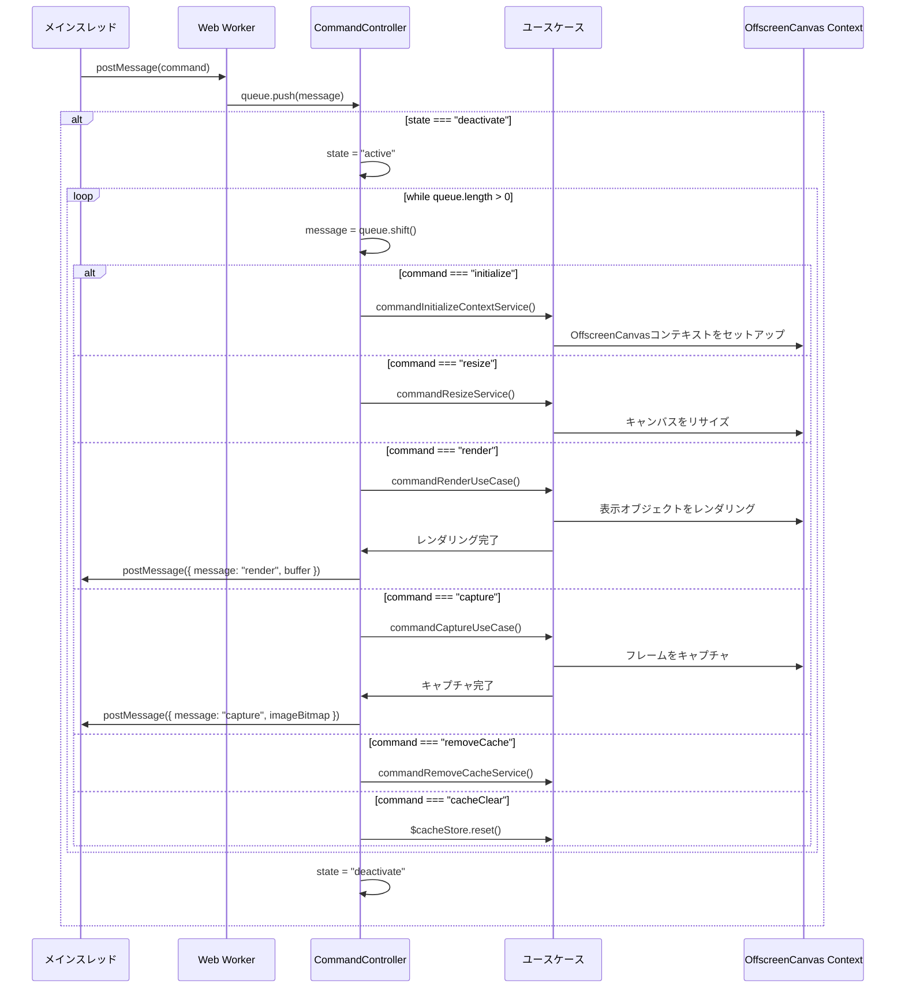

# @next2d/renderer

[English](#english) | [日本語](#japanese)

---

<a name="english"></a>

## Overview

`@next2d/renderer` is an OffscreenCanvas-based rendering engine that runs in a Web Worker, providing high-performance, non-blocking rendering for Next2D applications. By offloading rendering operations to a separate thread, it ensures smooth UI interactions and efficient graphics processing.

### Key Features

- **Web Worker Architecture**: Runs entirely in a Web Worker for non-blocking rendering
- **OffscreenCanvas**: Leverages OffscreenCanvas API for hardware-accelerated graphics
- **Command Queue Pattern**: Efficiently processes rendering commands asynchronously
- **Modular Design**: Clean separation of services and use cases for each display object type

## Installation

```bash
npm install @next2d/renderer
```

## Architecture

### Directory Structure

```
src/
├── index.ts                           # Worker entry point with message listener
├── CommandController.ts               # Main command queue controller
├── RendererUtil.ts                    # Utility functions for rendering
├── Command/
│   ├── service/                       # Command processing services
│   │   ├── CommandInitializeContextService.ts
│   │   ├── CommandResizeService.ts
│   │   └── CommandRemoveCacheService.ts
│   └── usecase/                       # Command use cases
│       ├── CommandRenderUseCase.ts
│       └── CommandCaptureUseCase.ts
├── DisplayObject/
│   └── service/                       # Base display object services
│       └── DisplayObjectGetBlendModeService.ts
├── DisplayObjectContainer/
│   └── usecase/                       # Container rendering logic
│       ├── DisplayObjectContainerRenderUseCase.ts
│       └── DisplayObjectContainerClipRenderUseCase.ts
├── Shape/
│   ├── service/                       # Shape command processing
│   │   └── ShapeCommandService.ts
│   └── usecase/                       # Shape rendering logic
│       ├── ShapeRenderUseCase.ts
│       └── ShapeClipRenderUseCase.ts
├── TextField/
│   ├── service/                       # Text processing services
│   │   ├── TextFieldGenerateFontStyleService.ts
│   │   └── TextFiledGetAlignOffsetService.ts
│   └── usecase/                       # Text rendering logic
│       ├── TextFieldRenderUseCase.ts
│       └── TextFieldDrawOffscreenCanvasUseCase.ts
├── Video/
│   └── usecase/                       # Video rendering logic
│       └── VideoRenderUseCase.ts
└── interface/                         # TypeScript interfaces
    ├── IMessage.ts
    ├── INode.ts
    ├── IRGBA.ts
    ├── IBlendMode.ts
    ├── ITextFormat.ts
    ├── ITextObject.ts
    └── ...
```

### Component Roles

- **index.ts**: Worker entry point that sets up the message event listener
- **CommandController**: Manages the command queue and dispatches commands to appropriate handlers
- **Command/service/**: Low-level command processing (context initialization, resize, cache removal)
- **Command/usecase/**: High-level command operations (render, capture)
- **DisplayObject/service/**: Shared services for all display objects
- **DisplayObjectContainer/usecase/**: Rendering logic for container objects
- **Shape/service/ & usecase/**: Vector graphics rendering
- **TextField/service/ & usecase/**: Text rendering and font processing
- **Video/usecase/**: Video element rendering
- **RendererUtil.ts**: Common utility functions for rendering operations
- **interface/**: TypeScript type definitions and interfaces

## Message Flow



## Command Queue Pattern

The renderer uses a command queue pattern to efficiently manage asynchronous rendering operations:

### Queue Management

1. **Message Reception**: When a message arrives from the main thread, it's pushed into the `queue` array
2. **State Check**: If the worker is in `deactivate` state (idle), it begins execution
3. **Sequential Processing**: Commands are processed one by one using `queue.shift()`
4. **State Management**: The worker transitions between `active` and `deactivate` states

### Supported Commands

- **initialize**: Set up OffscreenCanvas context with device pixel ratio
- **resize**: Update canvas dimensions and clear cache if needed
- **render**: Execute rendering pipeline for display objects
- **capture**: Capture current frame as ImageBitmap
- **removeCache**: Remove specific cached items
- **cacheClear**: Clear entire cache store

### Benefits

- **Non-blocking**: Main thread remains responsive during rendering
- **Efficient**: Commands are batched and processed asynchronously
- **Thread-safe**: Worker isolation prevents race conditions
- **Transferable Objects**: Uses Transferable objects (ArrayBuffer, ImageBitmap) for zero-copy message passing

## Usage Example

```typescript
// Main thread
const worker = new Worker('renderer.js');
const canvas = document.getElementById('canvas') as HTMLCanvasElement;
const offscreen = canvas.transferControlToOffscreen();

// Initialize renderer
worker.postMessage({
  command: 'initialize',
  canvas: offscreen,
  devicePixelRatio: window.devicePixelRatio
}, [offscreen]);

// Render frame
worker.postMessage({
  command: 'render',
  buffer: renderDataBuffer,
  length: dataLength,
  imageBitmaps: bitmaps
}, [renderDataBuffer.buffer, ...bitmaps]);

// Listen for completion
worker.addEventListener('message', (event) => {
  if (event.data.message === 'render') {
    // Rendering complete, buffer returned
    console.log('Frame rendered');
  }
});
```

## License

This project is licensed under the [MIT License](LICENSE) - see the LICENSE file for details.

---

<a name="japanese"></a>

## 概要

`@next2d/renderer`は、Web Workerで動作するOffscreenCanvasベースのレンダリングエンジンです。Next2Dアプリケーション向けに高性能でノンブロッキングなレンダリングを提供します。レンダリング処理を別スレッドにオフロードすることで、スムーズなUI操作と効率的なグラフィックス処理を実現します。

### 主な特徴

- **Web Workerアーキテクチャ**: ノンブロッキングレンダリングのため完全にWeb Worker内で動作
- **OffscreenCanvas**: ハードウェアアクセラレーションによるグラフィックス処理にOffscreenCanvas APIを活用
- **コマンドキューパターン**: レンダリングコマンドを非同期で効率的に処理
- **モジュラー設計**: 各表示オブジェクトタイプごとにサービスとユースケースをクリーンに分離

## インストール

```bash
npm install @next2d/renderer
```

## アーキテクチャ

### ディレクトリ構造

```
src/
├── index.ts                           # Workerエントリポイント(メッセージリスナー付き)
├── CommandController.ts               # メインコマンドキューコントローラー
├── RendererUtil.ts                    # レンダリング用ユーティリティ関数
├── Command/
│   ├── service/                       # コマンド処理サービス
│   │   ├── CommandInitializeContextService.ts
│   │   ├── CommandResizeService.ts
│   │   └── CommandRemoveCacheService.ts
│   └── usecase/                       # コマンドユースケース
│       ├── CommandRenderUseCase.ts
│       └── CommandCaptureUseCase.ts
├── DisplayObject/
│   └── service/                       # 基本表示オブジェクトサービス
│       └── DisplayObjectGetBlendModeService.ts
├── DisplayObjectContainer/
│   └── usecase/                       # コンテナレンダリングロジック
│       ├── DisplayObjectContainerRenderUseCase.ts
│       └── DisplayObjectContainerClipRenderUseCase.ts
├── Shape/
│   ├── service/                       # Shapeコマンド処理
│   │   └── ShapeCommandService.ts
│   └── usecase/                       # Shapeレンダリングロジック
│       ├── ShapeRenderUseCase.ts
│       └── ShapeClipRenderUseCase.ts
├── TextField/
│   ├── service/                       # テキスト処理サービス
│   │   ├── TextFieldGenerateFontStyleService.ts
│   │   └── TextFiledGetAlignOffsetService.ts
│   └── usecase/                       # テキストレンダリングロジック
│       ├── TextFieldRenderUseCase.ts
│       └── TextFieldDrawOffscreenCanvasUseCase.ts
├── Video/
│   └── usecase/                       # ビデオレンダリングロジック
│       └── VideoRenderUseCase.ts
└── interface/                         # TypeScriptインターフェース
    ├── IMessage.ts
    ├── INode.ts
    ├── IRGBA.ts
    ├── IBlendMode.ts
    ├── ITextFormat.ts
    ├── ITextObject.ts
    └── ...
```

### コンポーネントの役割

- **index.ts**: メッセージイベントリスナーをセットアップするWorkerエントリポイント
- **CommandController**: コマンドキューを管理し、適切なハンドラーにコマンドをディスパッチ
- **Command/service/**: 低レベルのコマンド処理(コンテキスト初期化、リサイズ、キャッシュ削除)
- **Command/usecase/**: 高レベルのコマンド操作(レンダリング、キャプチャ)
- **DisplayObject/service/**: すべての表示オブジェクト共通のサービス
- **DisplayObjectContainer/usecase/**: コンテナオブジェクトのレンダリングロジック
- **Shape/service/ & usecase/**: ベクターグラフィックスのレンダリング
- **TextField/service/ & usecase/**: テキストレンダリングとフォント処理
- **Video/usecase/**: ビデオ要素のレンダリング
- **RendererUtil.ts**: レンダリング操作用の共通ユーティリティ関数
- **interface/**: TypeScript型定義とインターフェース

## メッセージフロー



## コマンドキューパターン

レンダラーは、非同期レンダリング操作を効率的に管理するためにコマンドキューパターンを使用しています。

### キュー管理

1. **メッセージ受信**: メインスレッドからメッセージが到着すると、`queue`配列にプッシュされます
2. **状態チェック**: Workerが`deactivate`状態(アイドル)の場合、実行を開始します
3. **逐次処理**: `queue.shift()`を使用してコマンドを1つずつ処理します
4. **状態管理**: Workerは`active`と`deactivate`状態の間で遷移します

### サポートされるコマンド

- **initialize**: デバイスピクセル比を使用してOffscreenCanvasコンテキストをセットアップ
- **resize**: キャンバスの寸法を更新し、必要に応じてキャッシュをクリア
- **render**: 表示オブジェクトのレンダリングパイプラインを実行
- **capture**: 現在のフレームをImageBitmapとしてキャプチャ
- **removeCache**: 特定のキャッシュアイテムを削除
- **cacheClear**: キャッシュストア全体をクリア

### メリット

- **ノンブロッキング**: レンダリング中もメインスレッドはレスポンシブなまま
- **効率的**: コマンドはバッチ処理され、非同期で処理されます
- **スレッドセーフ**: Workerの分離により競合状態を防止
- **転送可能オブジェクト**: ゼロコピーメッセージパッシングのために転送可能オブジェクト(ArrayBuffer、ImageBitmap)を使用

## 使用例

```typescript
// メインスレッド
const worker = new Worker('renderer.js');
const canvas = document.getElementById('canvas') as HTMLCanvasElement;
const offscreen = canvas.transferControlToOffscreen();

// レンダラーの初期化
worker.postMessage({
  command: 'initialize',
  canvas: offscreen,
  devicePixelRatio: window.devicePixelRatio
}, [offscreen]);

// フレームのレンダリング
worker.postMessage({
  command: 'render',
  buffer: renderDataBuffer,
  length: dataLength,
  imageBitmaps: bitmaps
}, [renderDataBuffer.buffer, ...bitmaps]);

// 完了の待機
worker.addEventListener('message', (event) => {
  if (event.data.message === 'render') {
    // レンダリング完了、バッファが返却されました
    console.log('フレームがレンダリングされました');
  }
});
```

## ライセンス

このプロジェクトは[MITライセンス](LICENSE)の下でライセンスされています。詳細はLICENSEファイルを参照してください。
