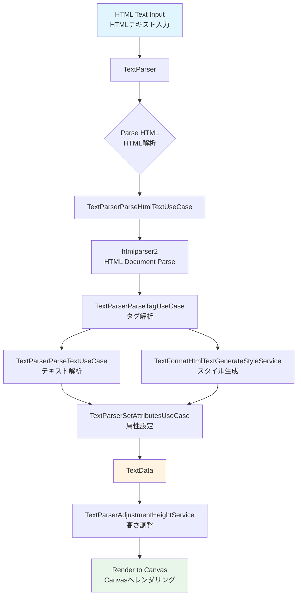
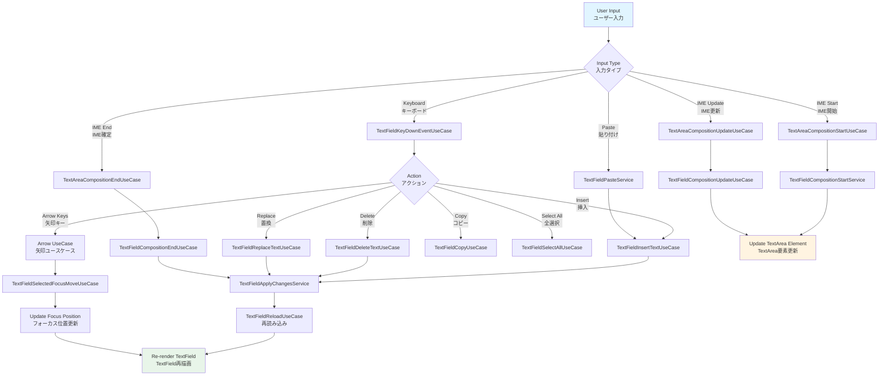
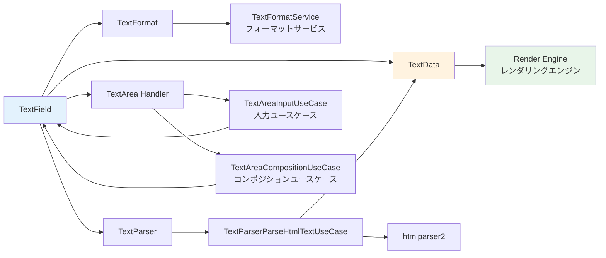

# @next2d/text

## Overview / 概要

The `@next2d/text` package provides comprehensive TextField rendering capabilities with rich HTML text support, interactive input handling, and advanced text formatting. This package is the core text engine for the Next2D player framework.

`@next2d/text` パッケージは、リッチHTMLテキストサポート、インタラクティブな入力処理、高度なテキストフォーマット機能を備えた包括的なTextFieldレンダリング機能を提供します。このパッケージは、Next2Dプレイヤーフレームワークのコアテキストエンジンです。

### Key Features / 主な機能

- **TextField Rendering**: Display text with various formatting options
- **HTML Text Support**: Parse and render HTML-formatted text with tags like `<b>`, `<i>`, `<font>`, etc.
- **Text Input Handling**: Interactive text input with composition events (IME support)
- **Text Formatting**: Rich text formatting with TextFormat class
- **Auto-sizing**: Automatic text field resizing based on content
- **Scrolling**: Horizontal and vertical text scrolling

---

- **TextFieldレンダリング**: 様々なフォーマットオプションでテキストを表示
- **HTMLテキストサポート**: `<b>`, `<i>`, `<font>` などのタグを含むHTML形式のテキストを解析・レンダリング
- **テキスト入力処理**: コンポジションイベント（IMEサポート）を備えたインタラクティブなテキスト入力
- **テキストフォーマット**: TextFormatクラスによるリッチテキストフォーマット
- **自動サイズ調整**: コンテンツに基づいた自動テキストフィールドリサイズ
- **スクロール**: 水平・垂直テキストスクロール

## Installation / インストール

```bash
npm install @next2d/text
```

## Directory Structure / ディレクトリ構造

```
src/
├── TextField.ts                    # Main TextField class / メインTextFieldクラス
│   ├── TextField/service/          # TextField services / TextFieldサービス
│   │   ├── TextFieldApplyChangesService.ts
│   │   ├── TextFieldBlinkingClearTimeoutService.ts
│   │   ├── TextFieldCompositionStartService.ts
│   │   └── TextFieldPasteService.ts
│   └── TextField/usecase/          # TextField use cases / TextFieldユースケース
│       ├── TextFieldArrowDownUseCase.ts
│       ├── TextFieldArrowLeftUseCase.ts
│       ├── TextFieldArrowRightUseCase.ts
│       ├── TextFieldArrowUpUseCase.ts
│       ├── TextFieldBlinkingUseCase.ts
│       ├── TextFieldBuildFromCharacterUseCase.ts
│       ├── TextFieldCompositionEndUseCase.ts
│       ├── TextFieldCompositionUpdateUseCase.ts
│       ├── TextFieldCopyUseCase.ts
│       ├── TextFieldDeleteTextUseCase.ts
│       ├── TextFieldGetLineTextUseCase.ts
│       ├── TextFieldGetTextDataUseCase.ts
│       ├── TextFieldHtmlTextToRawTextUseCase.ts
│       ├── TextFieldInsertTextUseCase.ts
│       ├── TextFieldKeyDownEventUseCase.ts
│       ├── TextFieldReloadUseCase.ts
│       ├── TextFieldReplaceTextUseCase.ts
│       ├── TextFieldResetUseCase.ts
│       ├── TextFieldResizeAutoFontSizeUseCase.ts
│       ├── TextFieldResizeUseCase.ts
│       ├── TextFieldSelectAllUseCase.ts
│       ├── TextFieldSelectedFocusMoveUseCase.ts
│       ├── TextFieldSetFocusIndexUseCase.ts
│       ├── TextFieldSetFocusUseCase.ts
│       ├── TextFieldSetScrollXUseCase.ts
│       ├── TextFieldSetScrollYUseCase.ts
│       └── TextFieldUpdateStopIndexUseCase.ts
│
├── TextFormat.ts                   # Text formatting class / テキストフォーマットクラス
│   └── TextFormat/service/         # TextFormat services / TextFormatサービス
│       ├── TextFormatGenerateFontStyleService.ts
│       ├── TextFormatGetWidthMarginService.ts
│       ├── TextFormatHtmlTextGenerateStyleService.ts
│       ├── TextFormatIsSameService.ts
│       └── TextFormatSetDefaultService.ts
│
├── TextData.ts                     # Text data container / テキストデータコンテナ
│
├── TextArea/                       # Input handling / 入力処理
│   ├── TextArea/service/           # TextArea services / TextAreaサービス
│   │   └── TextAreaMovePositionService.ts
│   └── TextArea/usecase/           # TextArea use cases / TextAreaユースケース
│       ├── TextAreaCompositionEndUseCase.ts
│       ├── TextAreaCompositionStartUseCase.ts
│       ├── TextAreaCompositionUpdateUseCase.ts
│       ├── TextAreaInputUseCase.ts
│       └── TextAreaRegisterEventUseCase.ts
│
├── TextParser/                     # HTML parsing / HTML解析
│   ├── TextParser/service/         # TextParser services / TextParserサービス
│   │   ├── TextParserAdjustmentHeightService.ts
│   │   └── TextParserParseStyleService.ts
│   └── TextParser/usecase/         # TextParser use cases / TextParserユースケース
│       ├── TextParserCreateNewLineUseCase.ts
│       ├── TextParserParseHtmlTextUseCase.ts
│       ├── TextParserParseTagUseCase.ts
│       ├── TextParserParseTextUseCase.ts
│       └── TextParserSetAttributesUseCase.ts
│
├── TextUtil.ts                     # Utility functions / ユーティリティ関数
│
└── interface/                      # TypeScript interfaces / TypeScriptインターフェース
    ├── IAttributeObject.ts
    ├── IBlendMode.ts
    ├── IBounds.ts
    ├── ICharacter.ts
    ├── IDictionaryTag.ts
    ├── IElementPosition.ts
    ├── IFilterArray.ts
    ├── IGrid.ts
    ├── ILoopConfig.ts
    ├── ILoopType.ts
    ├── IMovieClipActionObject.ts
    ├── IMovieClipCharacter.ts
    ├── IMovieClipLabelObject.ts
    ├── IMovieClipSoundObject.ts
    ├── IOptions.ts
    ├── IPlaceObject.ts
    ├── IRGBA.ts
    ├── IShapeCharacter.ts
    ├── ISoundTag.ts
    ├── ISurfaceFilter.ts
    ├── ITextFieldAutoSize.ts
    ├── ITextFieldCharacter.ts
    ├── ITextFieldType.ts
    ├── ITextFormatAlign.ts
    ├── ITextFormatObject.ts
    ├── ITextObject.ts
    ├── ITextObjectMode.ts
    └── IVideoCharacter.ts
```

## Text Processing Flow / テキスト処理フロー

### HTML Text Rendering Flow / HTMLテキストレンダリングフロー



### Text Input Handling Flow / テキスト入力処理フロー



### Component Relationships / コンポーネント関係図



## Core Components / コアコンポーネント

### TextField

The main class for text display and input handling. TextField manages text rendering, user interactions, scrolling, and selection.

テキスト表示と入力処理のメインクラス。TextFieldはテキストレンダリング、ユーザーインタラクション、スクロール、選択を管理します。

**Key Responsibilities / 主な責務:**
- Text rendering and layout / テキストレンダリングとレイアウト
- User input event handling / ユーザー入力イベント処理
- Text selection and cursor management / テキスト選択とカーソル管理
- Scrolling support / スクロールサポート
- Auto-sizing / 自動サイズ調整

### TextFormat

Represents character formatting information including font, size, color, alignment, and other text properties.

フォント、サイズ、色、配置、その他のテキストプロパティを含む文字フォーマット情報を表します。

**Properties / プロパティ:**
- `align`: Text alignment / テキスト配置
- `bold`: Bold text / 太字
- `color`: Text color / テキスト色
- `font`: Font family / フォントファミリー
- `size`: Font size / フォントサイズ
- `italic`: Italic text / 斜体
- `underline`: Underlined text / 下線
- `url`: Hyperlink URL / ハイパーリンクURL

### TextData

Container for parsed text data with layout information. Stores text objects, dimensions, and line metrics.

レイアウト情報を含む解析済みテキストデータのコンテナ。テキストオブジェクト、寸法、行メトリクスを格納します。

**Data Structure / データ構造:**
- `textTable`: Text objects per line / 行ごとのテキストオブジェクト
- `widthTable`: Width per line / 行ごとの幅
- `heightTable`: Height per line / 行ごとの高さ
- `ascentTable`: Ascent per line / 行ごとのアセント

### TextParser

Parses HTML text and converts it into TextData objects ready for rendering. Supports various HTML tags and CSS-like styling.

HTMLテキストを解析し、レンダリング準備が整ったTextDataオブジェクトに変換します。様々なHTMLタグとCSSライクなスタイリングをサポートします。

**Supported HTML Tags / サポートされるHTMLタグ:**
- `<b>`: Bold / 太字
- `<i>`: Italic / 斜体
- `<u>`: Underline / 下線
- `<font>`: Font properties (color, size, face) / フォントプロパティ
- `<p>`: Paragraph / 段落
- `<br>`: Line break / 改行
- `<a>`: Hyperlink / ハイパーリンク
- `<span>`: Inline styling / インラインスタイル

### TextArea Handler

Manages text input through a hidden HTML textarea element, handling keyboard input, IME composition, and clipboard operations.

非表示のHTMLテキストエリア要素を介してテキスト入力を管理し、キーボード入力、IMEコンポジション、クリップボード操作を処理します。

**Input Event Handling / 入力イベント処理:**
1. **Composition Start**: IME input begins / IME入力開始
2. **Composition Update**: IME input updates / IME入力更新
3. **Composition End**: IME input confirmed / IME入力確定
4. **Input**: Direct text input / 直接テキスト入力
5. **Paste**: Clipboard paste / クリップボード貼り付け
6. **Copy**: Copy selected text / 選択テキストのコピー

### TextUtil

Utility functions for text processing, color conversion, and element positioning.

テキスト処理、色変換、要素位置決めのためのユーティリティ関数。

## Usage Example / 使用例

```typescript
import { TextField } from "@next2d/text";
import { TextFormat } from "@next2d/text";

// Create a text field
// テキストフィールドを作成
const textField = new TextField();
textField.width = 300;
textField.height = 200;

// Set text format
// テキストフォーマットを設定
const format = new TextFormat();
format.font = "Arial";
format.size = 24;
format.color = 0x000000;
format.bold = true;

textField.defaultTextFormat = format;

// Set HTML text
// HTMLテキストを設定
textField.htmlText = "<p>Hello <b>World</b>!</p><p>Welcome to <font color='#FF0000'>Next2D</font></p>";

// Enable input
// 入力を有効化
textField.type = "input";
textField.selectable = true;

// Handle text changes
// テキスト変更を処理
textField.addEventListener("change", (event) => {
    console.log("Text changed:", textField.text);
});
```

## Testing / テスト

All major components include comprehensive unit tests with `.test.ts` files.

すべての主要コンポーネントには、`.test.ts` ファイルによる包括的なユニットテストが含まれています。

```bash
npm test
```

## Architecture Notes / アーキテクチャノート

### Service vs UseCase / サービス vs ユースケース

- **Service**: Low-level, reusable business logic / 低レベルで再利用可能なビジネスロジック
- **UseCase**: High-level application logic orchestrating multiple services / 複数のサービスを統合する高レベルのアプリケーションロジック

### Clean Architecture / クリーンアーキテクチャ

The package follows clean architecture principles with clear separation between:

このパッケージは、以下の間で明確に分離されたクリーンアーキテクチャの原則に従っています:

- **Domain Layer**: TextField, TextFormat, TextData classes / ドメイン層
- **Use Case Layer**: Business logic orchestration / ユースケース層
- **Service Layer**: Reusable utilities and helpers / サービス層
- **Interface Layer**: TypeScript type definitions / インターフェース層

## License / ライセンス

This project is licensed under the [MIT License](https://opensource.org/licenses/MIT) - see the [LICENSE](LICENSE) file for details.

このプロジェクトは [MITライセンス](https://opensource.org/licenses/MIT) の下でライセンスされています。詳細については [LICENSE](LICENSE) ファイルをご覧ください。
