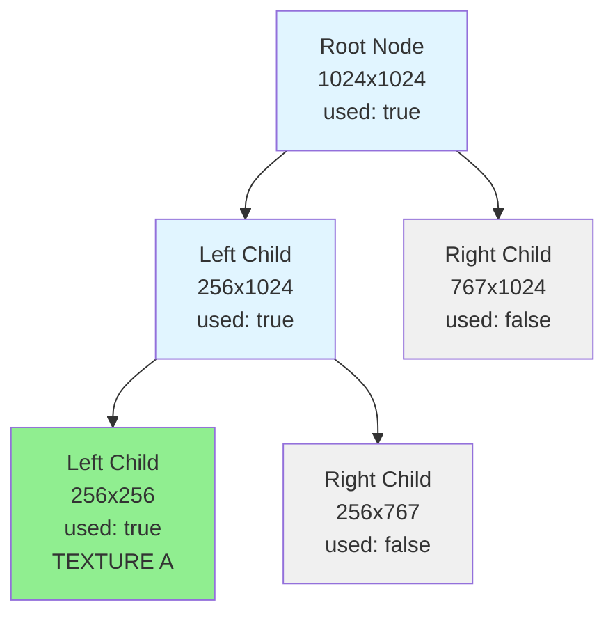
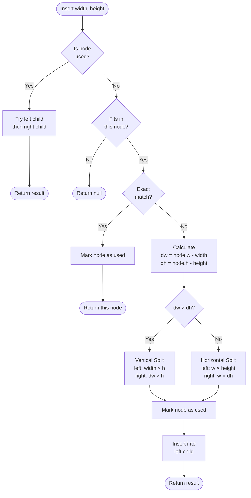
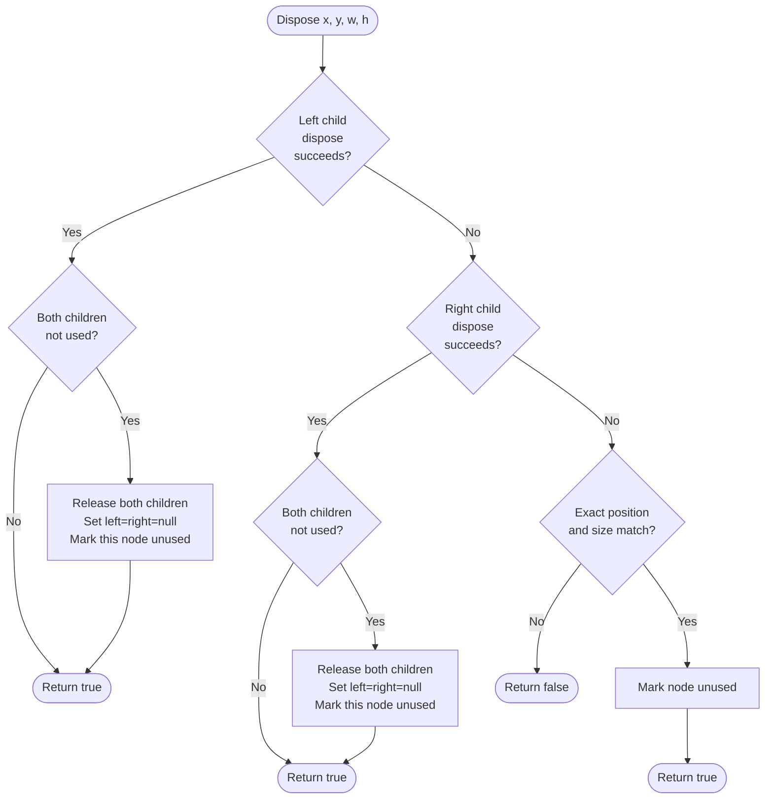
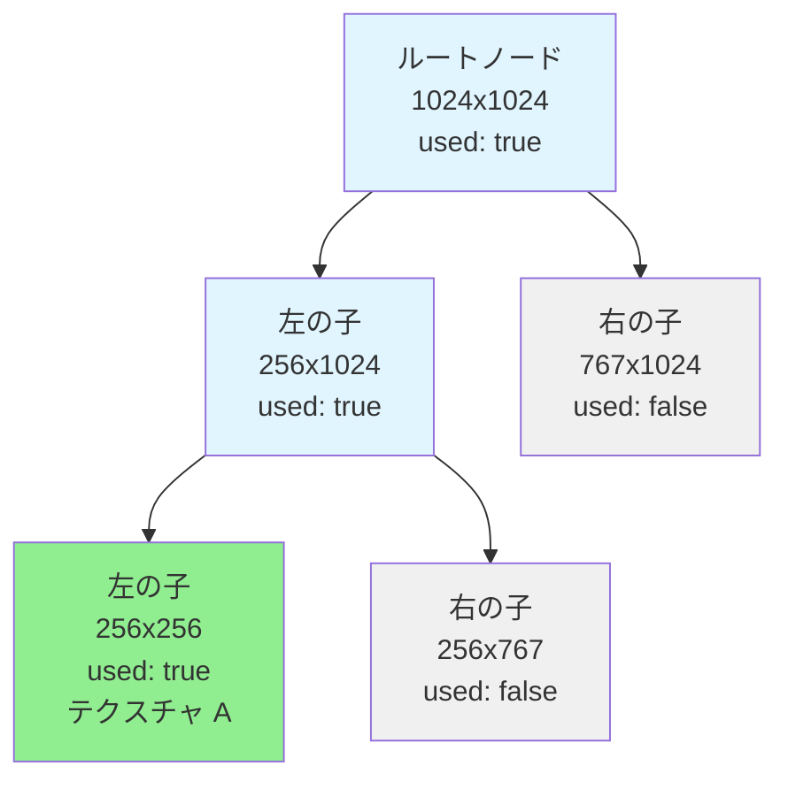
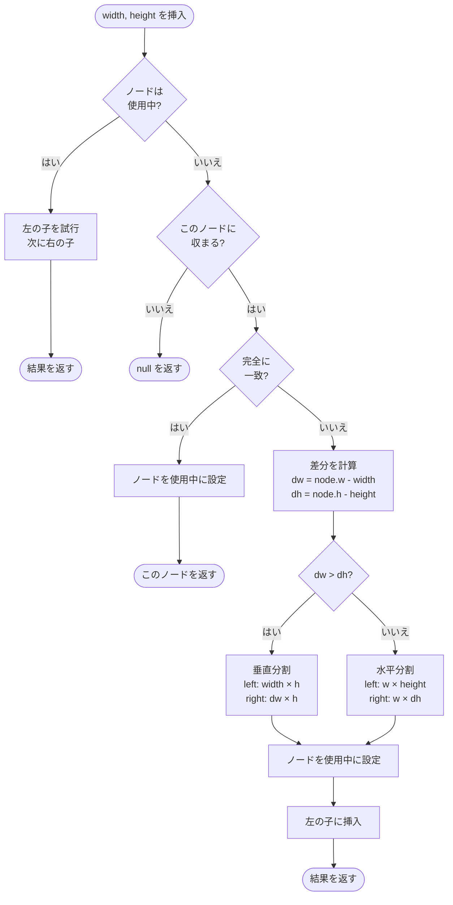
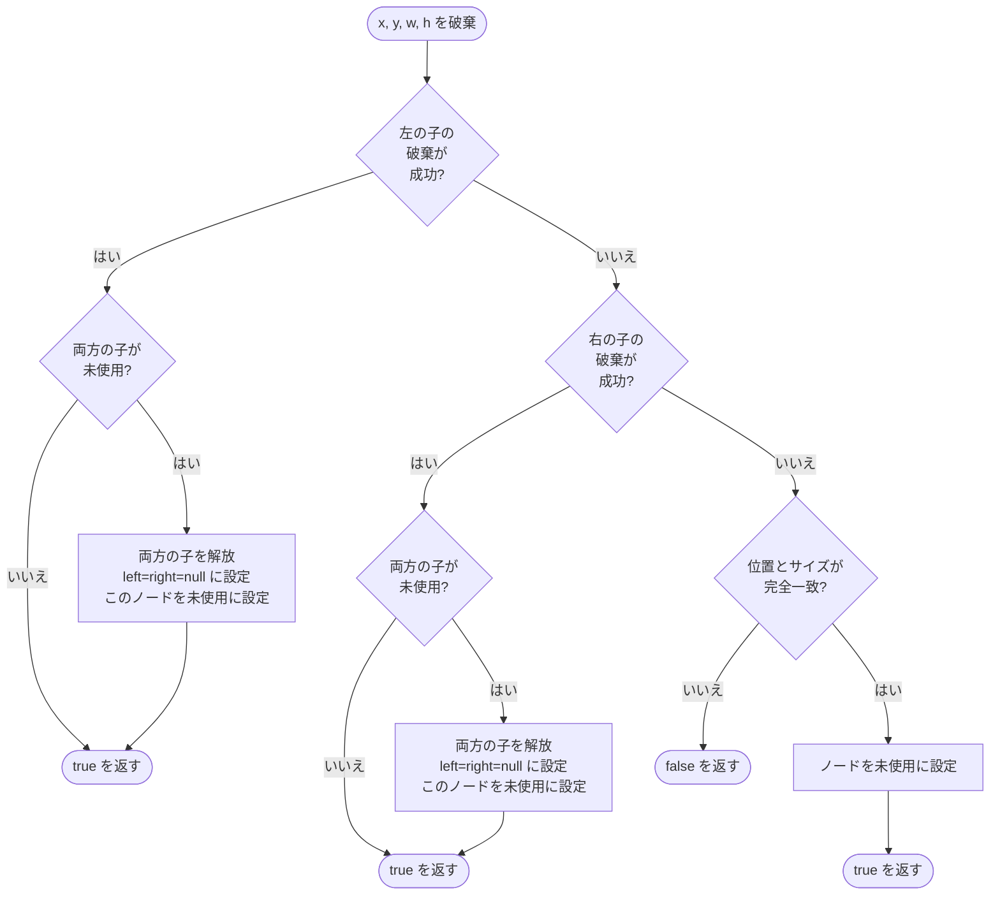

# @next2d/texture-packer

[English](#english) | [日本語](#japanese)

**Important**: `@next2d/texture-packer` prohibits importing other packages. This package is a foundational module that must remain independent to avoid circular dependencies.

**重要**: `@next2d/texture-packer` は他の packages の import を禁止しています。このパッケージは基盤モジュールであり、循環依存を避けるために独立を維持する必要があります。

---

<a name="english"></a>

## Overview

`@next2d/texture-packer` is a high-performance texture atlas management library that implements a binary tree-based packing algorithm optimized for GPU texture allocation. This package efficiently manages the placement and removal of textures within a fixed-size atlas, minimizing texture memory fragmentation and maximizing space utilization.

### Key Features

- **Binary Tree Algorithm**: Uses a recursive binary space partitioning approach for optimal texture placement
- **Dynamic Allocation/Deallocation**: Supports runtime insertion and disposal of textures
- **Memory Pool Optimization**: Employs object pooling to reduce garbage collection overhead
- **GPU-Optimized**: Designed specifically for WebGL/GPU texture atlas management
- **TypeScript Support**: Fully typed for enhanced developer experience

## Installation

```bash
npm install @next2d/texture-packer
```

## Directory Structure

```
texture-packer/
├── src/
│   ├── TexturePacker.ts          # Main texture packer class
│   ├── Node.ts                    # Binary tree node class
│   ├── Node/
│   │   └── service/
│   │       ├── NodeInsertService.ts    # Texture insertion algorithm
│   │       └── NodeDisposeService.ts   # Texture disposal algorithm
│   └── index.ts                   # Package entry point
└── README.md
```

### File Descriptions

- **TexturePacker.ts**: Public API that manages the root node and provides insert/dispose methods
- **Node.ts**: Binary tree node implementation with left/right children and object pooling
- **NodeInsertService.ts**: Core algorithm for finding and allocating space for new textures
- **NodeDisposeService.ts**: Core algorithm for releasing allocated texture space and merging nodes

## Binary Tree Structure

The texture packer uses a binary tree structure where each node represents a rectangular region in the texture atlas. The tree dynamically splits as textures are inserted.



### Node Properties

Each node contains:
- `x, y`: Position in the atlas
- `w, h`: Width and height of the region
- `index`: Atlas texture index
- `left, right`: Child nodes (null if leaf)
- `used`: Whether this space is allocated

## Algorithms

### Insert Algorithm

The insertion algorithm recursively searches the binary tree for available space:



**Algorithm Steps:**

1. **Check if used**: If the node is already used, recursively try left then right children
2. **Size validation**: Return null if the texture doesn't fit
3. **Exact match**: If dimensions match exactly, mark as used and return
4. **Split decision**: Compare remaining space (dw vs dh) to decide split direction
   - If `dw > dh`: Split vertically (better for wider remaining space)
   - Otherwise: Split horizontally (better for taller remaining space)
5. **Create children**: Create left child with exact size, right child with remaining space
6. **Recursive insert**: Insert into the left child (guaranteed to fit)

**Padding**: The algorithm adds 1-pixel padding (`requiredWidth = width + 1`) to prevent texture bleeding.

### Dispose Algorithm

The disposal algorithm removes a texture and merges adjacent free space:



**Algorithm Steps:**

1. **Recursive search**: Try to dispose in left child, then right child
2. **Match check**: If found, verify exact position and dimensions match
3. **Mark unused**: Set the node's `used` flag to false
4. **Merge optimization**: If both children are unused, release them to the object pool and merge
5. **Propagation**: The merge check propagates up the tree, maximizing available contiguous space

**Memory Management**: Released nodes are returned to the object pool for reuse, reducing allocation overhead.

## Usage Example

```typescript
import { TexturePacker } from '@next2d/texture-packer';

// Create a 1024x1024 texture atlas (index 0)
const packer = new TexturePacker(0, 1024, 1024);

// Insert a 256x256 texture
const node1 = packer.insert(256, 256);
if (node1) {
    console.log(`Texture allocated at (${node1.x}, ${node1.y})`);
    // Use node1.x, node1.y for UV coordinates
}

// Insert another texture
const node2 = packer.insert(128, 128);

// Dispose a texture when no longer needed
if (node1) {
    const success = packer.dispose(node1.x, node1.y, node1.w, node1.h);
    console.log(`Disposal ${success ? 'succeeded' : 'failed'}`);
}

// The space from node1 can now be reused
const node3 = packer.insert(200, 200);
```

## API Reference

### TexturePacker

#### `constructor(index: number, width: number, height: number)`

Creates a new texture packer with the specified atlas dimensions.

- `index`: Atlas texture index
- `width`: Atlas width in pixels
- `height`: Atlas height in pixels

#### `insert(width: number, height: number): Node | null`

Attempts to insert a texture with the given dimensions.

- Returns: `Node` with position if successful, `null` if no space available

#### `dispose(x: number, y: number, width: number, height: number): boolean`

Releases the texture at the specified position and dimensions.

- Returns: `true` if disposal succeeded, `false` otherwise

### Node

#### Properties

- `index: number` - Atlas texture index
- `x: number` - X coordinate in atlas
- `y: number` - Y coordinate in atlas
- `w: number` - Width of allocated region
- `h: number` - Height of allocated region
- `left: Node | null` - Left child node
- `right: Node | null` - Right child node
- `used: boolean` - Whether space is allocated

## License

This project is licensed under the [MIT License](https://opensource.org/licenses/MIT) - see the LICENSE file for details.

---

<a name="japanese"></a>

## 概要

`@next2d/texture-packer` は、GPU テクスチャ割り当てに最適化された二分木ベースのパッキングアルゴリズムを実装した、高性能なテクスチャアトラス管理ライブラリです。このパッケージは、固定サイズのアトラス内でテクスチャの配置と削除を効率的に管理し、テクスチャメモリの断片化を最小限に抑え、スペース利用率を最大化します。

### 主な機能

- **二分木アルゴリズム**: 最適なテクスチャ配置のための再帰的な二分空間分割アプローチを使用
- **動的な割り当て/解放**: 実行時のテクスチャの挿入と破棄をサポート
- **メモリプール最適化**: オブジェクトプーリングを採用し、ガベージコレクションのオーバーヘッドを削減
- **GPU 最適化**: WebGL/GPU テクスチャアトラス管理専用に設計
- **TypeScript サポート**: 完全な型定義による優れた開発者体験

## インストール

```bash
npm install @next2d/texture-packer
```

## ディレクトリ構造

```
texture-packer/
├── src/
│   ├── TexturePacker.ts          # メインのテクスチャパッカークラス
│   ├── Node.ts                    # 二分木ノードクラス
│   ├── Node/
│   │   └── service/
│   │       ├── NodeInsertService.ts    # テクスチャ挿入アルゴリズム
│   │       └── NodeDisposeService.ts   # テクスチャ破棄アルゴリズム
│   └── index.ts                   # パッケージエントリーポイント
└── README.md
```

### ファイル説明

- **TexturePacker.ts**: ルートノードを管理し、insert/dispose メソッドを提供するパブリック API
- **Node.ts**: 左右の子ノードとオブジェクトプーリングを持つ二分木ノードの実装
- **NodeInsertService.ts**: 新しいテクスチャのためのスペースを見つけて割り当てるコアアルゴリズム
- **NodeDisposeService.ts**: 割り当てられたテクスチャスペースを解放し、ノードをマージするコアアルゴリズム

## 二分木構造

テクスチャパッカーは二分木構造を使用し、各ノードはテクスチャアトラス内の矩形領域を表します。テクスチャが挿入されると、ツリーは動的に分割されます。



### ノードのプロパティ

各ノードには以下が含まれます：
- `x, y`: アトラス内の位置
- `w, h`: 領域の幅と高さ
- `index`: アトラステクスチャのインデックス
- `left, right`: 子ノード（リーフの場合は null）
- `used`: このスペースが割り当てられているか

## アルゴリズム

### 挿入アルゴリズム

挿入アルゴリズムは、利用可能なスペースを見つけるために二分木を再帰的に検索します：



**アルゴリズムのステップ:**

1. **使用状態の確認**: ノードが既に使用中の場合、左の子、次に右の子を再帰的に試行
2. **サイズ検証**: テクスチャが収まらない場合は null を返す
3. **完全一致**: サイズが完全に一致する場合、使用中に設定して返す
4. **分割方向の決定**: 残りのスペース（dw vs dh）を比較して分割方向を決定
   - `dw > dh` の場合: 垂直分割（幅が広い残りスペースに適している）
   - それ以外: 水平分割（高さが高い残りスペースに適している）
5. **子ノードの作成**: 左の子は正確なサイズ、右の子は残りのスペースで作成
6. **再帰的挿入**: 左の子に挿入（確実に収まる）

**パディング**: アルゴリズムはテクスチャのにじみを防ぐために 1 ピクセルのパディング（`requiredWidth = width + 1`）を追加します。

### 破棄アルゴリズム

破棄アルゴリズムはテクスチャを削除し、隣接する空きスペースをマージします：



**アルゴリズムのステップ:**

1. **再帰的検索**: 左の子、次に右の子で破棄を試行
2. **一致確認**: 見つかった場合、正確な位置とサイズが一致することを確認
3. **未使用に設定**: ノードの `used` フラグを false に設定
4. **マージ最適化**: 両方の子が未使用の場合、それらをオブジェクトプールに解放してマージ
5. **伝播**: マージチェックはツリーを上方向に伝播し、利用可能な連続スペースを最大化

**メモリ管理**: 解放されたノードはオブジェクトプールに返却され、再利用されることで割り当てのオーバーヘッドを削減します。

## 使用例

```typescript
import { TexturePacker } from '@next2d/texture-packer';

// 1024x1024 のテクスチャアトラスを作成（インデックス 0）
const packer = new TexturePacker(0, 1024, 1024);

// 256x256 のテクスチャを挿入
const node1 = packer.insert(256, 256);
if (node1) {
    console.log(`テクスチャは (${node1.x}, ${node1.y}) に割り当てられました`);
    // UV 座標に node1.x, node1.y を使用
}

// 別のテクスチャを挿入
const node2 = packer.insert(128, 128);

// 不要になったテクスチャを破棄
if (node1) {
    const success = packer.dispose(node1.x, node1.y, node1.w, node1.h);
    console.log(`破棄に${success ? '成功' : '失敗'}しました`);
}

// node1 のスペースは再利用可能になりました
const node3 = packer.insert(200, 200);
```

## API リファレンス

### TexturePacker

#### `constructor(index: number, width: number, height: number)`

指定されたアトラスサイズで新しいテクスチャパッカーを作成します。

- `index`: アトラステクスチャのインデックス
- `width`: アトラスの幅（ピクセル）
- `height`: アトラスの高さ（ピクセル）

#### `insert(width: number, height: number): Node | null`

指定されたサイズのテクスチャを挿入しようと試みます。

- 戻り値: 成功した場合は位置を持つ `Node`、スペースがない場合は `null`

#### `dispose(x: number, y: number, width: number, height: number): boolean`

指定された位置とサイズのテクスチャを解放します。

- 戻り値: 破棄に成功した場合は `true`、それ以外は `false`

### Node

#### プロパティ

- `index: number` - アトラステクスチャのインデックス
- `x: number` - アトラス内の X 座標
- `y: number` - アトラス内の Y 座標
- `w: number` - 割り当てられた領域の幅
- `h: number` - 割り当てられた領域の高さ
- `left: Node | null` - 左の子ノード
- `right: Node | null` - 右の子ノード
- `used: boolean` - スペースが割り当てられているか

## ライセンス

このプロジェクトは [MIT License](https://opensource.org/licenses/MIT) の下でライセンスされています。詳細は LICENSE ファイルを参照してください。
