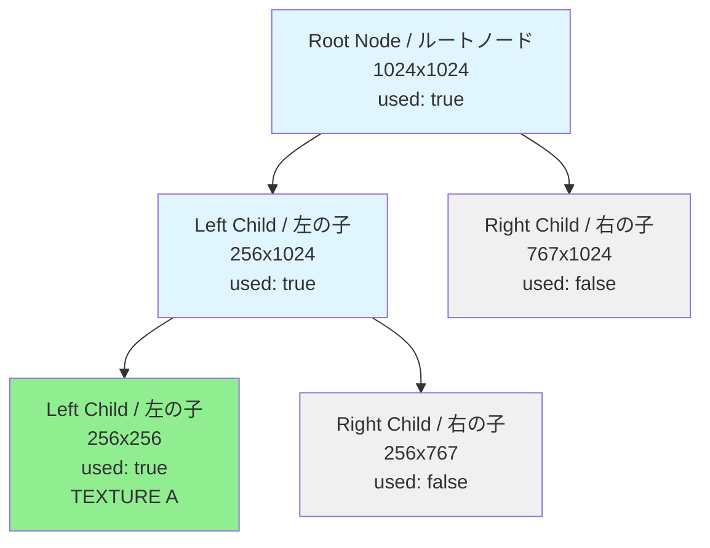
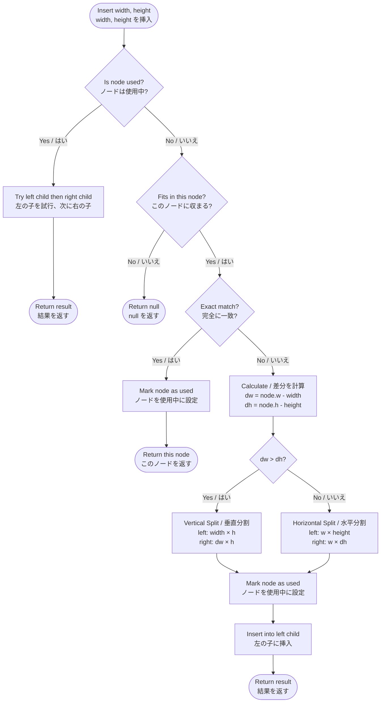
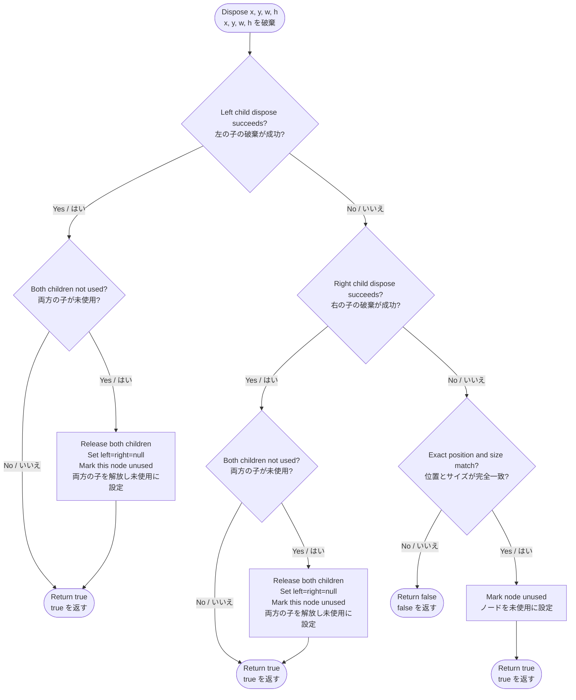

# @next2d/texture-packer

**重要**: `@next2d/texture-packer` は他の packages の import を禁止しています。このパッケージは基盤モジュールであり、循環依存を避けるために独立を維持する必要があります。

**Important**: `@next2d/texture-packer` prohibits importing other packages. This package is a foundational module that must remain independent to avoid circular dependencies.

## 概要 / Overview

`@next2d/texture-packer` は、GPU テクスチャ割り当てに最適化された二分木ベースのパッキングアルゴリズムを実装した、高性能なテクスチャアトラス管理ライブラリです。このパッケージは、固定サイズのアトラス内でテクスチャの配置と削除を効率的に管理し、テクスチャメモリの断片化を最小限に抑え、スペース利用率を最大化します。

`@next2d/texture-packer` is a high-performance texture atlas management library that implements a binary tree-based packing algorithm optimized for GPU texture allocation. This package efficiently manages the placement and removal of textures within a fixed-size atlas, minimizing texture memory fragmentation and maximizing space utilization.

## 主な機能 / Key Features

- **二分木アルゴリズム**: 最適なテクスチャ配置のための再帰的な二分空間分割アプローチを使用
  - Uses a recursive binary space partitioning approach for optimal texture placement
- **動的な割り当て/解放**: 実行時のテクスチャの挿入と破棄をサポート
  - Supports runtime insertion and disposal of textures
- **メモリプール最適化**: オブジェクトプーリングを採用し、ガベージコレクションのオーバーヘッドを削減
  - Employs object pooling to reduce garbage collection overhead
- **GPU 最適化**: WebGL/GPU テクスチャアトラス管理専用に設計
  - Designed specifically for WebGL/GPU texture atlas management
- **TypeScript サポート**: 完全な型定義による優れた開発者体験
  - Fully typed for enhanced developer experience

## インストール / Installation

```bash
npm install @next2d/texture-packer
```

## ディレクトリ構造 / Directory Structure

```
texture-packer/
├── src/
│   ├── TexturePacker.ts          # メインのテクスチャパッカークラス / Main texture packer class
│   ├── Node.ts                    # 二分木ノードクラス / Binary tree node class
│   ├── Node/
│   │   └── service/
│   │       ├── NodeInsertService.ts    # テクスチャ挿入アルゴリズム / Texture insertion algorithm
│   │       └── NodeDisposeService.ts   # テクスチャ破棄アルゴリズム / Texture disposal algorithm
│   └── index.ts                   # パッケージエントリーポイント / Package entry point
└── README.md
```

### ファイル説明 / File Descriptions

- **TexturePacker.ts**: ルートノードを管理し、insert/dispose メソッドを提供するパブリック API / Public API that manages the root node and provides insert/dispose methods
- **Node.ts**: 左右の子ノードとオブジェクトプーリングを持つ二分木ノードの実装 / Binary tree node implementation with left/right children and object pooling
- **NodeInsertService.ts**: 新しいテクスチャのためのスペースを見つけて割り当てるコアアルゴリズム / Core algorithm for finding and allocating space for new textures
- **NodeDisposeService.ts**: 割り当てられたテクスチャスペースを解放し、ノードをマージするコアアルゴリズム / Core algorithm for releasing allocated texture space and merging nodes

## 二分木構造 / Binary Tree Structure

テクスチャパッカーは二分木構造を使用し、各ノードはテクスチャアトラス内の矩形領域を表します。テクスチャが挿入されると、ツリーは動的に分割されます。

The texture packer uses a binary tree structure where each node represents a rectangular region in the texture atlas. The tree dynamically splits as textures are inserted.



### ノードのプロパティ / Node Properties

各ノードには以下が含まれます / Each node contains:
- `x, y`: アトラス内の位置 / Position in the atlas
- `w, h`: 領域の幅と高さ / Width and height of the region
- `index`: アトラステクスチャのインデックス / Atlas texture index
- `left, right`: 子ノード（リーフの場合は null） / Child nodes (null if leaf)
- `used`: このスペースが割り当てられているか / Whether this space is allocated

## アルゴリズム / Algorithms

### 挿入アルゴリズム / Insert Algorithm

挿入アルゴリズムは、利用可能なスペースを見つけるために二分木を再帰的に検索します。

The insertion algorithm recursively searches the binary tree for available space.



**アルゴリズムのステップ / Algorithm Steps:**

1. **使用状態の確認 / Check if used**: ノードが既に使用中の場合、左の子、次に右の子を再帰的に試行 / If the node is already used, recursively try left then right children
2. **サイズ検証 / Size validation**: テクスチャが収まらない場合は null を返す / Return null if the texture doesn't fit
3. **完全一致 / Exact match**: サイズが完全に一致する場合、使用中に設定して返す / If dimensions match exactly, mark as used and return
4. **分割方向の決定 / Split decision**: 残りのスペース（dw vs dh）を比較して分割方向を決定 / Compare remaining space (dw vs dh) to decide split direction
   - `dw > dh` の場合: 垂直分割 / Split vertically (better for wider remaining space)
   - それ以外: 水平分割 / Otherwise: Split horizontally (better for taller remaining space)
5. **子ノードの作成 / Create children**: 左の子は正確なサイズ、右の子は残りのスペースで作成 / Create left child with exact size, right child with remaining space
6. **再帰的挿入 / Recursive insert**: 左の子に挿入（確実に収まる） / Insert into the left child (guaranteed to fit)

**パディング / Padding**: アルゴリズムはテクスチャのにじみを防ぐために 1 ピクセルのパディング（`requiredWidth = width + 1`）を追加します。 / The algorithm adds 1-pixel padding (`requiredWidth = width + 1`) to prevent texture bleeding.

### 破棄アルゴリズム / Dispose Algorithm

破棄アルゴリズムはテクスチャを削除し、隣接する空きスペースをマージします。

The disposal algorithm removes a texture and merges adjacent free space.



**アルゴリズムのステップ / Algorithm Steps:**

1. **再帰的検索 / Recursive search**: 左の子、次に右の子で破棄を試行 / Try to dispose in left child, then right child
2. **一致確認 / Match check**: 見つかった場合、正確な位置とサイズが一致することを確認 / If found, verify exact position and dimensions match
3. **未使用に設定 / Mark unused**: ノードの `used` フラグを false に設定 / Set the node's `used` flag to false
4. **マージ最適化 / Merge optimization**: 両方の子が未使用の場合、それらをオブジェクトプールに解放してマージ / If both children are unused, release them to the object pool and merge
5. **伝播 / Propagation**: マージチェックはツリーを上方向に伝播し、利用可能な連続スペースを最大化 / The merge check propagates up the tree, maximizing available contiguous space

**メモリ管理 / Memory Management**: 解放されたノードはオブジェクトプールに返却され、再利用されることで割り当てのオーバーヘッドを削減します。 / Released nodes are returned to the object pool for reuse, reducing allocation overhead.

## 使用例 / Usage Example

```typescript
import { TexturePacker } from '@next2d/texture-packer';

// 1024x1024 のテクスチャアトラスを作成（インデックス 0）
// Create a 1024x1024 texture atlas (index 0)
const packer = new TexturePacker(0, 1024, 1024);

// 256x256 のテクスチャを挿入 / Insert a 256x256 texture
const node1 = packer.insert(256, 256);
if (node1) {
    console.log(`テクスチャは (${node1.x}, ${node1.y}) に割り当てられました`);
    // Texture allocated at (${node1.x}, ${node1.y})
    // UV 座標に node1.x, node1.y を使用 / Use node1.x, node1.y for UV coordinates
}

// 別のテクスチャを挿入 / Insert another texture
const node2 = packer.insert(128, 128);

// 不要になったテクスチャを破棄 / Dispose a texture when no longer needed
if (node1) {
    const success = packer.dispose(node1.x, node1.y, node1.w, node1.h);
    console.log(`破棄に${success ? '成功' : '失敗'}しました`);
    // Disposal ${success ? 'succeeded' : 'failed'}
}

// node1 のスペースは再利用可能になりました
// The space from node1 can now be reused
const node3 = packer.insert(200, 200);
```

## API リファレンス / API Reference

### TexturePacker

#### `constructor(index: number, width: number, height: number)`

指定されたアトラスサイズで新しいテクスチャパッカーを作成します。

Creates a new texture packer with the specified atlas dimensions.

- `index`: アトラステクスチャのインデックス / Atlas texture index
- `width`: アトラスの幅（ピクセル） / Atlas width in pixels
- `height`: アトラスの高さ（ピクセル） / Atlas height in pixels

#### `insert(width: number, height: number): Node | null`

指定されたサイズのテクスチャを挿入しようと試みます。

Attempts to insert a texture with the given dimensions.

- 戻り値 / Returns: 成功した場合は位置を持つ `Node`、スペースがない場合は `null` / `Node` with position if successful, `null` if no space available

#### `dispose(x: number, y: number, width: number, height: number): boolean`

指定された位置とサイズのテクスチャを解放します。

Releases the texture at the specified position and dimensions.

- 戻り値 / Returns: 破棄に成功した場合は `true`、それ以外は `false` / `true` if disposal succeeded, `false` otherwise

### Node

#### プロパティ / Properties

- `index: number` - アトラステクスチャのインデックス / Atlas texture index
- `x: number` - アトラス内の X 座標 / X coordinate in atlas
- `y: number` - アトラス内の Y 座標 / Y coordinate in atlas
- `w: number` - 割り当てられた領域の幅 / Width of allocated region
- `h: number` - 割り当てられた領域の高さ / Height of allocated region
- `left: Node | null` - 左の子ノード / Left child node
- `right: Node | null` - 右の子ノード / Right child node
- `used: boolean` - スペースが割り当てられているか / Whether space is allocated

## ライセンス / License

This project is licensed under the [MIT License](https://opensource.org/licenses/MIT) - see the LICENSE file for details.
