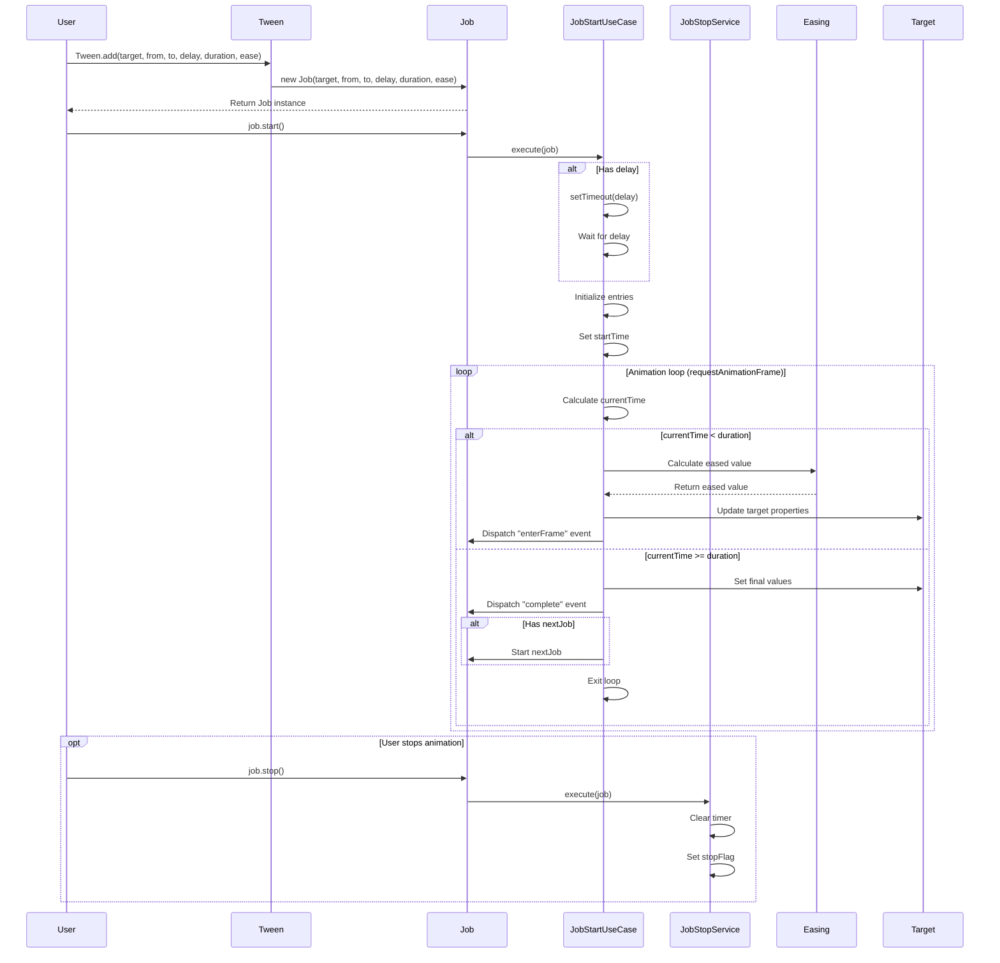

# @next2d/ui

Animation utilities package for Next2D Player / Next2Dプレイヤー向けアニメーションユーティリティパッケージ

## Overview / 概要

`@next2d/ui` provides a powerful animation system with Tween and comprehensive Easing functions for creating smooth, professional animations in your Next2D applications.

`@next2d/ui` は、Next2Dアプリケーションでスムーズでプロフェッショナルなアニメーションを作成するための、TweenとEasing機能を備えた強力なアニメーションシステムを提供します。

### Key Features / 主な機能

- **Tween System**: Easy-to-use tweening API for animating object properties / オブジェクトプロパティをアニメーションするための使いやすいトゥイーンAPI
- **Easing Functions**: 32 built-in easing functions for natural motion / 自然な動きのための32種類のイージング関数
- **Job Chaining**: Chain multiple animations sequentially / 複数のアニメーションを連続して実行
- **Event-Driven**: EventDispatcher-based architecture for animation lifecycle events / アニメーションライフサイクルイベント用のEventDispatcherベースアーキテクチャ

## Installation / インストール

```bash
npm install @next2d/ui
```

## Usage / 使い方

### Basic Tween Animation / 基本的なトゥイーンアニメーション

```typescript
import { Tween, Easing } from "@next2d/ui";

// Create a target object / 対象オブジェクトを作成
const sprite = { x: 0, y: 0, alpha: 1 };

// Create a tween animation / トゥイーンアニメーションを作成
const job = Tween.add(
    sprite,                    // Target object / 対象オブジェクト
    { x: 0, y: 0, alpha: 0 },  // Start values / 開始値
    { x: 100, y: 100, alpha: 1 }, // End values / 終了値
    0,                         // Delay (seconds) / 遅延時間（秒）
    2,                         // Duration (seconds) / 実行時間（秒）
    Easing.inOutQuad           // Easing function / イージング関数
);

// Start the animation / アニメーションを開始
job.start();
```

### Chaining Animations / アニメーションの連結

```typescript
const job1 = Tween.add(sprite, { x: 0 }, { x: 100 }, 0, 1, Easing.outQuad);
const job2 = Tween.add(sprite, { x: 100 }, { x: 200 }, 0, 1, Easing.inQuad);

// Chain animations / アニメーションを連結
job1.chain(job2);
job1.start();
```

## Directory Structure / ディレクトリ構造

```
src/
├── Tween.ts                    # Tween class / Tweenクラス
├── Job.ts                      # Job class / Jobクラス
│   ├── service/                # Job service layer / Jobサービスレイヤー
│   │   ├── JobStopService.ts           # Stop animation / アニメーション停止
│   │   ├── JobEntriesService.ts        # Property entries management / プロパティエントリ管理
│   │   ├── JobUpdateFrameService.ts    # Frame update processing / フレーム更新処理
│   │   └── JobUpdatePropertyService.ts # Property update processing / プロパティ更新処理
│   └── usecase/                # Job use case layer / Jobユースケースレイヤー
│       ├── JobStartUseCase.ts          # Start animation / アニメーション開始
│       └── JobBootUseCase.ts           # Boot animation loop / アニメーションループ起動
├── Easing.ts                   # Easing class / Easingクラス
│   └── service/                # All easing implementations (32 functions) / 全イージング実装（32関数）
│       ├── EasingLinearService.ts
│       ├── EasingInQuadService.ts / EasingOutQuadService.ts / EasingInOutQuadService.ts
│       ├── EasingInCubicService.ts / EasingOutCubicService.ts / EasingInOutCubicService.ts
│       ├── EasingInQuartService.ts / EasingOutQuartService.ts / EasingInOutQuartService.ts
│       ├── EasingInQuintService.ts / EasingOutQuintService.ts / EasingInOutQuintService.ts
│       ├── EasingInSineService.ts / EasingOutSineService.ts / EasingInOutSineService.ts
│       ├── EasingInExpoService.ts / EasingOutExpoService.ts / EasingInOutExpoService.ts
│       ├── EasingInCircService.ts / EasingOutCircService.ts / EasingInOutCircService.ts
│       ├── EasingInElasticService.ts / EasingOutElasticService.ts / EasingInOutElasticService.ts
│       ├── EasingInBackService.ts / EasingOutBackService.ts / EasingInOutBackService.ts
│       └── EasingInBounceService.ts / EasingOutBounceService.ts / EasingInOutBounceService.ts
├── interface/                  # TypeScript interfaces / TypeScriptインターフェース
│   ├── IObject.ts
│   └── IEntriesObject.ts
└── index.ts                    # Package exports / パッケージエクスポート
```

## Available Easing Functions / 利用可能なイージング関数

The `Easing` class provides 32 easing functions across 11 easing types with In, Out, and InOut variants.

`Easing`クラスは、11種類のイージングタイプでIn、Out、InOutのバリエーションを含む32種類のイージング関数を提供します。

### Linear / リニア
- `Easing.linear` - Constant speed / 一定速度

### Quadratic (Quad) / 二次関数
- `Easing.inQuad` - Accelerating from zero velocity / ゼロ速度から加速
- `Easing.outQuad` - Decelerating to zero velocity / ゼロ速度まで減速
- `Easing.inOutQuad` - Acceleration until halfway, then deceleration / 中間まで加速、その後減速

### Cubic / 三次関数
- `Easing.inCubic` - Accelerating from zero velocity / ゼロ速度から加速
- `Easing.outCubic` - Decelerating to zero velocity / ゼロ速度まで減速
- `Easing.inOutCubic` - Acceleration until halfway, then deceleration / 中間まで加速、その後減速

### Quartic (Quart) / 四次関数
- `Easing.inQuart` - Accelerating from zero velocity / ゼロ速度から加速
- `Easing.outQuart` - Decelerating to zero velocity / ゼロ速度まで減速
- `Easing.inOutQuart` - Acceleration until halfway, then deceleration / 中間まで加速、その後減速

### Quintic (Quint) / 五次関数
- `Easing.inQuint` - Accelerating from zero velocity / ゼロ速度から加速
- `Easing.outQuint` - Decelerating to zero velocity / ゼロ速度まで減速
- `Easing.inOutQuint` - Acceleration until halfway, then deceleration / 中間まで加速、その後減速

### Sinusoidal (Sine) / 正弦波
- `Easing.inSine` - Accelerating from zero velocity / ゼロ速度から加速
- `Easing.outSine` - Decelerating to zero velocity / ゼロ速度まで減速
- `Easing.inOutSine` - Acceleration until halfway, then deceleration / 中間まで加速、その後減速

### Exponential (Expo) / 指数関数
- `Easing.inExpo` - Accelerating from zero velocity / ゼロ速度から加速
- `Easing.outExpo` - Decelerating to zero velocity / ゼロ速度まで減速
- `Easing.inOutExpo` - Acceleration until halfway, then deceleration / 中間まで加速、その後減速

### Circular (Circ) / 円形
- `Easing.inCirc` - Accelerating from zero velocity / ゼロ速度から加速
- `Easing.outCirc` - Decelerating to zero velocity / ゼロ速度まで減速
- `Easing.inOutCirc` - Acceleration until halfway, then deceleration / 中間まで加速、その後減速

### Elastic / 弾性
- `Easing.inElastic` - Elastic effect at the beginning / 開始時に弾性効果
- `Easing.outElastic` - Elastic effect at the end / 終了時に弾性効果
- `Easing.inOutElastic` - Elastic effect at both ends / 両端で弾性効果

### Back / バック
- `Easing.inBack` - Back up before moving forward / 前進する前に後退
- `Easing.outBack` - Overshoot and settle / オーバーシュートして落ち着く
- `Easing.inOutBack` - Back up and overshoot / 後退とオーバーシュート

### Bounce / バウンス
- `Easing.inBounce` - Bounce at the beginning / 開始時にバウンス
- `Easing.outBounce` - Bounce at the end / 終了時にバウンス
- `Easing.inOutBounce` - Bounce at both ends / 両端でバウンス

### Easing Function Parameters / イージング関数のパラメータ

All easing functions accept four parameters: / すべてのイージング関数は4つのパラメータを受け取ります:

```typescript
ease(t: number, b: number, c: number, d: number): number
```

- `t`: Current time / 現在の時間 (0 to d)
- `b`: Beginning value / 開始値
- `c`: Change in value / 変化量 (end value - beginning value)
- `d`: Duration / 継続時間

## Animation Flow / アニメーションフロー



## API Reference / APIリファレンス

### Tween Class

#### `Tween.add(target, from, to, delay, duration, ease): Job`

Creates and returns a new Job instance for animation.

アニメーション用の新しいJobインスタンスを作成して返します。

**Parameters / パラメータ:**
- `target: any` - Target object to animate / アニメーション対象オブジェクト
- `from: IObject` - Starting property values / 開始プロパティ値
- `to: IObject` - Ending property values / 終了プロパティ値
- `delay: number = 0` - Delay before animation starts (seconds) / アニメーション開始前の遅延（秒）
- `duration: number = 1` - Animation duration (seconds) / アニメーション継続時間（秒）
- `ease: Function | null = null` - Easing function (defaults to linear) / イージング関数（デフォルトはlinear）

**Returns / 戻り値:**
- `Job` - Job instance / Jobインスタンス

### Job Class

Job class extends EventDispatcher and manages individual animation jobs.

JobクラスはEventDispatcherを継承し、個別のアニメーションジョブを管理します。

#### `job.start(): void`

Starts the animation. / アニメーションを開始します。

#### `job.stop(): void`

Stops the animation. / アニメーションを停止します。

#### `job.chain(nextJob: Job | null): Job | null`

Chains another job to start after this one completes.

このジョブの完了後に別のジョブを連結します。

**Parameters / パラメータ:**
- `nextJob: Job | null` - Next job to execute, or null to clear / 実行する次のジョブ、またはクリアするnull

**Returns / 戻り値:**
- `Job | null` - The chained job / 連結されたジョブ

#### Properties / プロパティ

- `target: any` - Target object / 対象オブジェクト
- `from: IObject` - Start values / 開始値
- `to: IObject` - End values / 終了値
- `delay: number` - Delay time / 遅延時間
- `duration: number` - Duration time / 継続時間
- `ease: Function` - Easing function / イージング関数
- `currentTime: number` - Current animation time / 現在のアニメーション時間
- `nextJob: Job | null` - Next chained job / 次の連結ジョブ

## Events / イベント

Job class dispatches the following events: / Jobクラスは以下のイベントを発行します:

- `enterFrame` - Dispatched on each animation frame / 各アニメーションフレームで発行
- `complete` - Dispatched when animation completes / アニメーション完了時に発行

```typescript
job.addEventListener("complete", (event) => {
    console.log("Animation completed!");
});

job.addEventListener("enterFrame", (event) => {
    console.log("Current time:", job.currentTime);
});
```

## License / ライセンス

This project is licensed under the [MIT License](https://opensource.org/licenses/MIT) - see the [LICENSE](LICENSE) file for details.

このプロジェクトは[MITライセンス](https://opensource.org/licenses/MIT)の下でライセンスされています - 詳細は[LICENSE](LICENSE)ファイルを参照してください。
