# WebGL Rendering Flow - Detailed Technical Specification
# WebGL レンダリングフロー - 詳細技術仕様書

This document provides a comprehensive analysis of the WebGL rendering pipeline for porting to WebGPU.

このドキュメントは、WebGPUへの移植のためのWebGLレンダリングパイプラインの包括的な分析を提供します。

---

## Table of Contents / 目次

1. [High-Level Architecture](#1-high-level-architecture)
2. [Complete Rendering Pipeline](#2-complete-rendering-pipeline)
3. [Context State Management](#3-context-state-management)
4. [Path Command Processing](#4-path-command-processing)
5. [Mesh Generation](#5-mesh-generation)
6. [Fill Operations](#6-fill-operations)
7. [Stroke Operations](#7-stroke-operations)
8. [Gradient System](#8-gradient-system)
9. [Blend Mode System](#9-blend-mode-system)
10. [Mask System](#10-mask-system)
11. [Filter System](#11-filter-system)
12. [Shader System](#12-shader-system)
13. [FrameBuffer Management](#13-framebuffer-management)
14. [Atlas Management](#14-atlas-management)
15. [Vertex Array Object](#15-vertex-array-object)
16. [Data Structures](#16-data-structures)
17. [WebGPU Porting Notes](#17-webgpu-porting-notes)

---

## 1. High-Level Architecture

### System Overview / システム概要

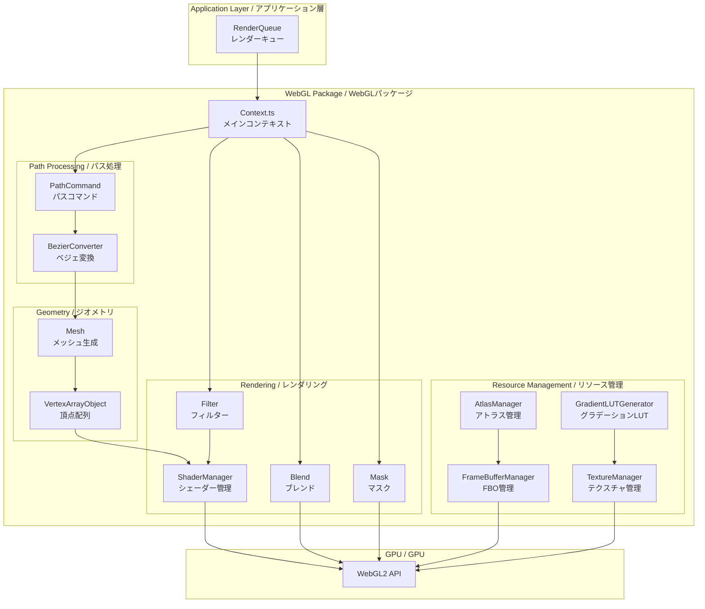
```mermaid
graph TB
    subgraph "Application Layer / アプリケーション層"
        RQ[RenderQueue<br/>レンダーキュー]
    end

    subgraph "WebGL Package / WebGLパッケージ"
        CTX[Context.ts<br/>メインコンテキスト]

        subgraph "Path Processing / パス処理"
            PC[PathCommand<br/>パスコマンド]
            BC[BezierConverter<br/>ベジェ変換]
        end

        subgraph "Geometry / ジオメトリ"
            MESH[Mesh<br/>メッシュ生成]
            VAO[VertexArrayObject<br/>頂点配列]
        end

        subgraph "Rendering / レンダリング"
            SHADER[ShaderManager<br/>シェーダー管理]
            BLEND[Blend<br/>ブレンド]
            MASK[Mask<br/>マスク]
            FILTER[Filter<br/>フィルター]
        end

        subgraph "Resource Management / リソース管理"
            FBM[FrameBufferManager<br/>FBO管理]
            ATLAS[AtlasManager<br/>アトラス管理]
            TEX[TextureManager<br/>テクスチャ管理]
            GRAD[GradientLUTGenerator<br/>グラデーションLUT]
        end
    end

    subgraph "GPU / GPU"
        GL[WebGL2 API]
    end

    RQ --> CTX
    CTX --> PC
    PC --> BC
    BC --> MESH
    MESH --> VAO
    VAO --> SHADER
    SHADER --> GL

    CTX --> BLEND
    CTX --> MASK
    CTX --> FILTER

    BLEND --> GL
    MASK --> GL
    FILTER --> SHADER

    FBM --> GL
    ATLAS --> FBM
    TEX --> GL
    GRAD --> TEX
```

---

## 2. Complete Rendering Pipeline

### Main Rendering Flow / メインレンダリングフロー

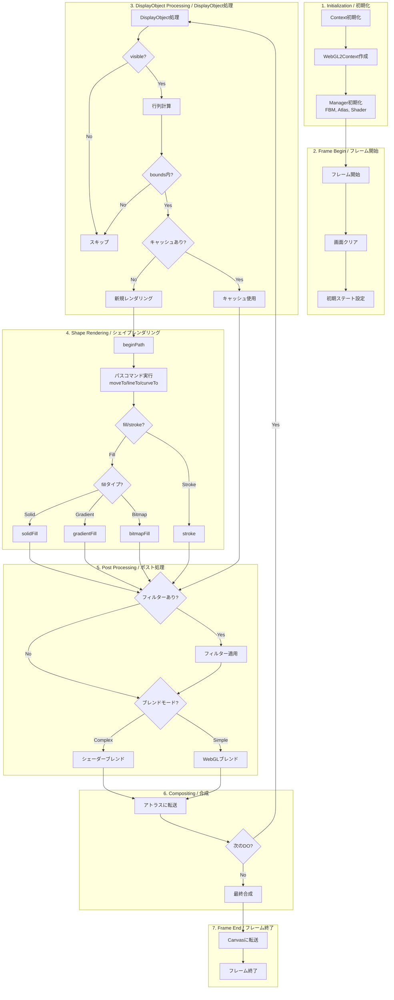
```mermaid
flowchart TB
    subgraph "1. Initialization / 初期化"
        INIT[Context初期化]
        INIT --> CREATE_CTX[WebGL2Context作成]
        CREATE_CTX --> INIT_MANAGERS[Manager初期化<br/>FBM, Atlas, Shader]
    end

    subgraph "2. Frame Begin / フレーム開始"
        FRAME_START[フレーム開始]
        FRAME_START --> CLEAR[画面クリア]
        CLEAR --> SETUP_STATE[初期ステート設定]
    end

    subgraph "3. DisplayObject Processing / DisplayObject処理"
        PROCESS_DO[DisplayObject処理]
        PROCESS_DO --> CHECK_VISIBLE{visible?}
        CHECK_VISIBLE -->|No| SKIP[スキップ]
        CHECK_VISIBLE -->|Yes| CALC_MATRIX[行列計算]
        CALC_MATRIX --> CHECK_BOUNDS{bounds内?}
        CHECK_BOUNDS -->|No| SKIP
        CHECK_BOUNDS -->|Yes| CHECK_CACHE{キャッシュあり?}
        CHECK_CACHE -->|Yes| USE_CACHE[キャッシュ使用]
        CHECK_CACHE -->|No| RENDER_NEW[新規レンダリング]
    end

    subgraph "4. Shape Rendering / シェイプレンダリング"
        RENDER_NEW --> BEGIN_PATH[beginPath]
        BEGIN_PATH --> PATH_CMDS[パスコマンド実行<br/>moveTo/lineTo/curveTo]
        PATH_CMDS --> FILL_OR_STROKE{fill/stroke?}

        FILL_OR_STROKE -->|Fill| FILL_TYPE{fillタイプ?}
        FILL_TYPE -->|Solid| SOLID_FILL[solidFill]
        FILL_TYPE -->|Gradient| GRADIENT_FILL[gradientFill]
        FILL_TYPE -->|Bitmap| BITMAP_FILL[bitmapFill]

        FILL_OR_STROKE -->|Stroke| STROKE[stroke]
    end

    subgraph "5. Post Processing / ポスト処理"
        SOLID_FILL --> CHECK_FILTER{フィルターあり?}
        GRADIENT_FILL --> CHECK_FILTER
        BITMAP_FILL --> CHECK_FILTER
        STROKE --> CHECK_FILTER
        USE_CACHE --> CHECK_FILTER

        CHECK_FILTER -->|Yes| APPLY_FILTER[フィルター適用]
        CHECK_FILTER -->|No| CHECK_BLEND{ブレンドモード?}
        APPLY_FILTER --> CHECK_BLEND

        CHECK_BLEND -->|Complex| BLEND_COMPOSITE[シェーダーブレンド]
        CHECK_BLEND -->|Simple| BLEND_SIMPLE[WebGLブレンド]
    end

    subgraph "6. Compositing / 合成"
        BLEND_COMPOSITE --> COMPOSITE[アトラスに転送]
        BLEND_SIMPLE --> COMPOSITE
        COMPOSITE --> NEXT_DO{次のDO?}
        NEXT_DO -->|Yes| PROCESS_DO
        NEXT_DO -->|No| FINAL_COMPOSITE[最終合成]
    end

    subgraph "7. Frame End / フレーム終了"
        FINAL_COMPOSITE --> TRANSFER_CANVAS[Canvasに転送]
        TRANSFER_CANVAS --> FRAME_END[フレーム終了]
    end

    INIT_MANAGERS --> FRAME_START
```

---

## 3. Context State Management

### State Stack / ステートスタック

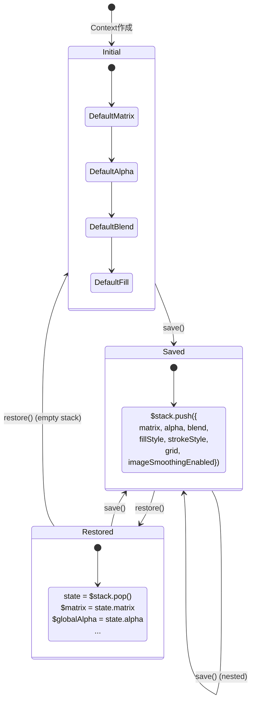
```mermaid
stateDiagram-v2
    [*] --> Initial: Context作成

    Initial --> Saved: save()
    Saved --> Saved: save() (nested)
    Saved --> Restored: restore()
    Restored --> Saved: save()
    Restored --> Initial: restore() (empty stack)

    state Initial {
        [*] --> DefaultMatrix
        DefaultMatrix --> DefaultAlpha
        DefaultAlpha --> DefaultBlend
        DefaultBlend --> DefaultFill
    }

    state Saved {
        [*] --> PushStack
        PushStack: $stack.push({<br/>matrix, alpha, blend,<br/>fillStyle, strokeStyle,<br/>grid, imageSmoothingEnabled})
    }

    state Restored {
        [*] --> PopStack
        PopStack: state = $stack.pop()<br/>$matrix = state.matrix<br/>$globalAlpha = state.alpha<br/>...
    }
```

### Context State Variables / コンテキスト状態変数

| Variable | Type | Description |
|----------|------|-------------|
| `$matrix` | `Float32Array[6]` | Current transformation matrix (a,b,c,d,tx,ty) |
| `$stack` | `Array<CanvasState>` | Save/restore state stack |
| `$globalAlpha` | `number` | Global alpha value (0.0-1.0) |
| `$globalCompositeOperation` | `string` | Current blend mode |
| `$fillStyle` | `IFillStyle` | Current fill style |
| `$strokeStyle` | `IStrokeStyle` | Current stroke style |
| `$imageSmoothingEnabled` | `boolean` | Texture smoothing flag |
| `$grid` | `IGrid` | 9-slice grid settings |

### Transformation Matrix Operations / 変換行列操作

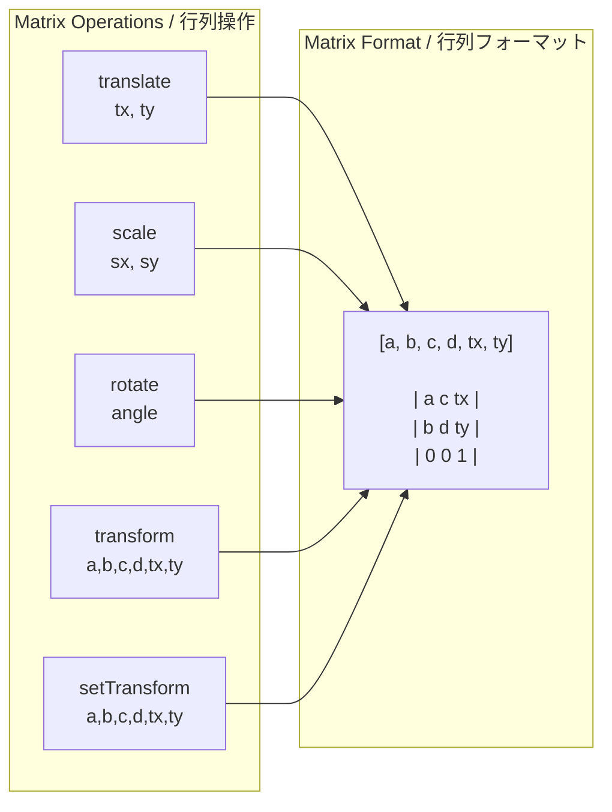
```mermaid
flowchart LR
    subgraph "Matrix Operations / 行列操作"
        T[translate<br/>tx, ty]
        S[scale<br/>sx, sy]
        R[rotate<br/>angle]
        TF[transform<br/>a,b,c,d,tx,ty]
        SET[setTransform<br/>a,b,c,d,tx,ty]
    end

    subgraph "Matrix Format / 行列フォーマット"
        M["[a, b, c, d, tx, ty]<br/><br/>| a  c  tx |<br/>| b  d  ty |<br/>| 0  0   1 |"]
    end

    T --> M
    S --> M
    R --> M
    TF --> M
    SET --> M
```

---

## 4. Path Command Processing

### Path Data Flow / パスデータフロー

```mermaid
flowchart TB
    subgraph "Input / 入力"
        MOVE[moveTo x,y]
        LINE[lineTo x,y]
        QUAD[quadraticCurveTo<br/>cx,cy, x,y]
        CUBIC[bezierCurveTo<br/>c1x,c1y, c2x,c2y, x,y]
        ARC[arc<br/>cx,cy, r, start, end]
        RECT[rect<br/>x,y, w,h]
    end

    subgraph "PathCommand Processing / PathCommand処理"
        BEGIN[beginPath<br/>$currentPath = []<br/>$vertices = []]

        MOVE --> ADD_MOVE["$currentPath.push(x, y, 0)"]
        LINE --> ADD_LINE["$currentPath.push(x, y, 0)"]

        QUAD --> ADD_QUAD["$currentPath.push(<br/>cx, cy, 1,<br/>x, y, 0)"]

        CUBIC --> CONVERT_CUBIC[Cubic→Quadratic変換<br/>8分割]
        CONVERT_CUBIC --> ADD_QUADS["8個のQuadratic追加"]

        ARC --> CONVERT_ARC[Arc→Cubic変換<br/>4分割]
        CONVERT_ARC --> CONVERT_CUBIC
    end

    subgraph "Output / 出力"
        CLOSE[closePath]
        CLOSE --> STORE["$vertices.push($currentPath)<br/>$currentPath = []"]

        OUTPUT["$vertices = [<br/>[x,y,0, x,y,0, ...],<br/>[x,y,0, cx,cy,1, x,y,0, ...],<br/>...]"]
    end

    BEGIN --> MOVE
    ADD_MOVE --> LINE
    ADD_LINE --> QUAD
    ADD_QUAD --> CUBIC
    ADD_QUADS --> ARC
    STORE --> OUTPUT
```

### Cubic to Quadratic Conversion / Cubic→Quadratic変換

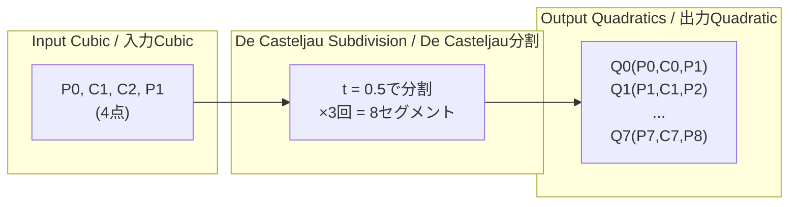
```mermaid
flowchart LR
    subgraph "Input Cubic / 入力Cubic"
        C["P0, C1, C2, P1<br/>(4点)"]
    end

    subgraph "De Casteljau Subdivision / De Casteljau分割"
        DIV["t = 0.5で分割<br/>×3回 = 8セグメント"]
    end

    subgraph "Output Quadratics / 出力Quadratic"
        Q["Q0(P0,C0,P1)<br/>Q1(P1,C1,P2)<br/>...<br/>Q7(P7,C7,P8)"]
    end

    C --> DIV --> Q
```

**Algorithm / アルゴリズム:**
```
for each cubic segment:
    subdivide at t=0.5 → 2 cubics
    subdivide each at t=0.5 → 4 cubics
    subdivide each at t=0.5 → 8 cubics
    approximate each cubic as quadratic:
        Q_control = (3*C1 - P0 + 3*C2 - P1) / 4
```

---

## 5. Mesh Generation

### Fill Mesh - Fan Triangulation / フィルメッシュ - ファン三角形分割

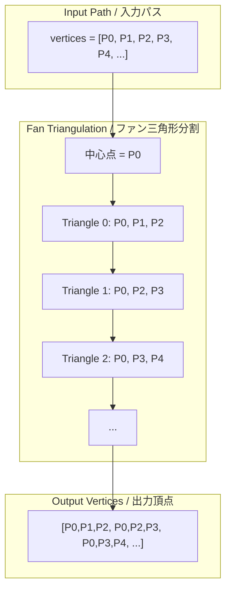
```mermaid
flowchart TB
    subgraph "Input Path / 入力パス"
        PATH["vertices = [P0, P1, P2, P3, P4, ...]"]
    end

    subgraph "Fan Triangulation / ファン三角形分割"
        CENTER["中心点 = P0"]
        TRI1["Triangle 0: P0, P1, P2"]
        TRI2["Triangle 1: P0, P2, P3"]
        TRI3["Triangle 2: P0, P3, P4"]
        TRIN["..."]
    end

    subgraph "Output Vertices / 出力頂点"
        OUT["[P0,P1,P2, P0,P2,P3, P0,P3,P4, ...]"]
    end

    PATH --> CENTER
    CENTER --> TRI1
    TRI1 --> TRI2
    TRI2 --> TRI3
    TRI3 --> TRIN
    TRIN --> OUT
```

### Vertex Data Layout (Fill) / 頂点データレイアウト (フィル)

```
Total: 68 bytes per vertex / 頂点あたり68バイト

┌─────────────────────────────────────────────────────────────────┐
│ Attribute      │ Type       │ Size   │ Offset │ Description    │
├─────────────────────────────────────────────────────────────────┤
│ a_vertex       │ vec2       │ 8B     │ 0      │ Position x,y   │
│ a_bezier       │ vec4       │ 16B    │ 8      │ Bezier control │
│ a_color        │ vec4       │ 16B    │ 24     │ RGBA color     │
│ a_matrix0      │ vec3       │ 12B    │ 40     │ Matrix row 0   │
│ a_matrix1      │ vec3       │ 12B    │ 52     │ Matrix row 1   │
│ a_matrix2      │ vec2       │ 8B     │ 64     │ tx, ty         │
└─────────────────────────────────────────────────────────────────┘

Stride = 72 bytes (aligned) / ストライド = 72バイト (アライン済み)
```

### Stroke to Fill Conversion / ストロークからフィル変換

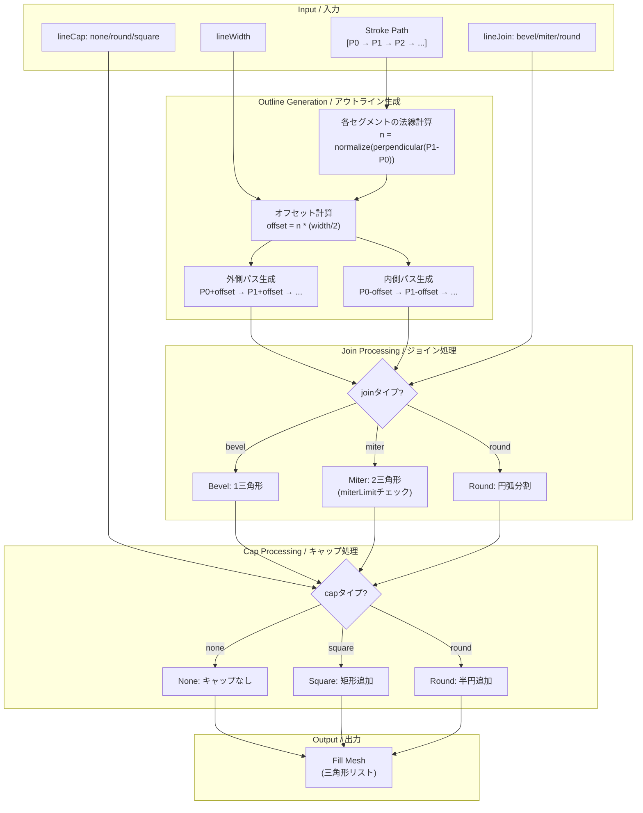
```mermaid
flowchart TB
    subgraph "Input / 入力"
        STROKE_PATH["Stroke Path<br/>[P0 → P1 → P2 → ...]"]
        WIDTH["lineWidth"]
        CAP["lineCap: none/round/square"]
        JOIN["lineJoin: bevel/miter/round"]
    end

    subgraph "Outline Generation / アウトライン生成"
        CALC_NORMAL["各セグメントの法線計算<br/>n = normalize(perpendicular(P1-P0))"]

        OFFSET["オフセット計算<br/>offset = n * (width/2)"]

        OUTER["外側パス生成<br/>P0+offset → P1+offset → ..."]
        INNER["内側パス生成<br/>P0-offset → P1-offset → ..."]
    end

    subgraph "Join Processing / ジョイン処理"
        JOIN_CHECK{joinタイプ?}
        BEVEL["Bevel: 1三角形"]
        MITER["Miter: 2三角形<br/>(miterLimitチェック)"]
        ROUND_J["Round: 円弧分割"]
    end

    subgraph "Cap Processing / キャップ処理"
        CAP_CHECK{capタイプ?}
        NONE["None: キャップなし"]
        SQUARE["Square: 矩形追加"]
        ROUND_C["Round: 半円追加"]
    end

    subgraph "Output / 出力"
        FILL_MESH["Fill Mesh<br/>(三角形リスト)"]
    end

    STROKE_PATH --> CALC_NORMAL
    WIDTH --> OFFSET
    CALC_NORMAL --> OFFSET
    OFFSET --> OUTER
    OFFSET --> INNER

    OUTER --> JOIN_CHECK
    INNER --> JOIN_CHECK
    JOIN --> JOIN_CHECK

    JOIN_CHECK -->|bevel| BEVEL
    JOIN_CHECK -->|miter| MITER
    JOIN_CHECK -->|round| ROUND_J

    CAP --> CAP_CHECK
    BEVEL --> CAP_CHECK
    MITER --> CAP_CHECK
    ROUND_J --> CAP_CHECK

    CAP_CHECK -->|none| NONE
    CAP_CHECK -->|square| SQUARE
    CAP_CHECK -->|round| ROUND_C

    NONE --> FILL_MESH
    SQUARE --> FILL_MESH
    ROUND_C --> FILL_MESH
```

---

## 6. Fill Operations

### Two-Pass Stencil Fill / 2パスステンシルフィル

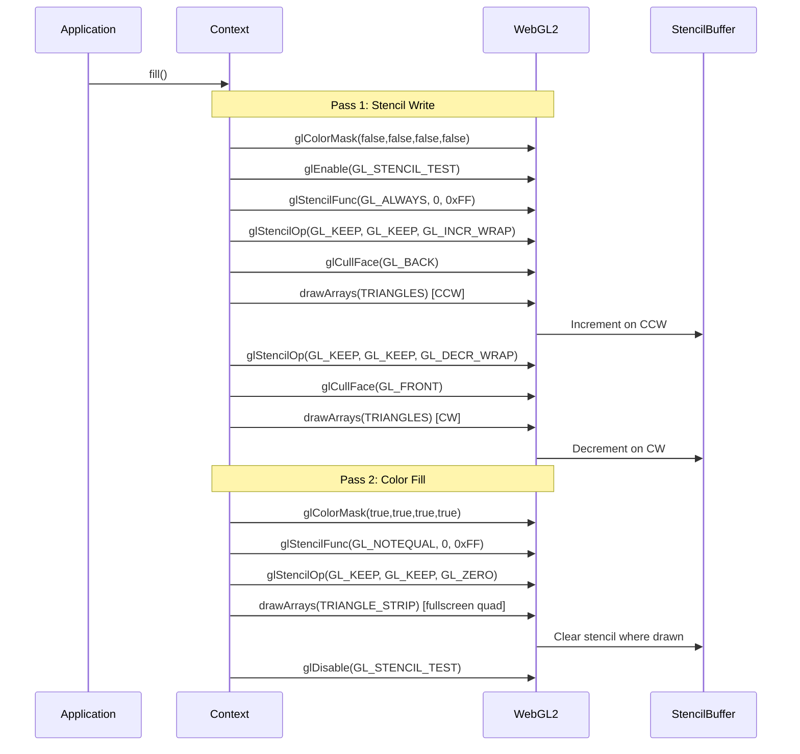
```mermaid
sequenceDiagram
    participant App as Application
    participant CTX as Context
    participant GL as WebGL2
    participant Stencil as StencilBuffer

    App->>CTX: fill()

    Note over CTX,GL: Pass 1: Stencil Write
    CTX->>GL: glColorMask(false,false,false,false)
    CTX->>GL: glEnable(GL_STENCIL_TEST)
    CTX->>GL: glStencilFunc(GL_ALWAYS, 0, 0xFF)
    CTX->>GL: glStencilOp(GL_KEEP, GL_KEEP, GL_INCR_WRAP)
    CTX->>GL: glCullFace(GL_BACK)
    CTX->>GL: drawArrays(TRIANGLES) [CCW]
    GL->>Stencil: Increment on CCW

    CTX->>GL: glStencilOp(GL_KEEP, GL_KEEP, GL_DECR_WRAP)
    CTX->>GL: glCullFace(GL_FRONT)
    CTX->>GL: drawArrays(TRIANGLES) [CW]
    GL->>Stencil: Decrement on CW

    Note over CTX,GL: Pass 2: Color Fill
    CTX->>GL: glColorMask(true,true,true,true)
    CTX->>GL: glStencilFunc(GL_NOTEQUAL, 0, 0xFF)
    CTX->>GL: glStencilOp(GL_KEEP, GL_KEEP, GL_ZERO)
    CTX->>GL: drawArrays(TRIANGLE_STRIP) [fullscreen quad]
    GL->>Stencil: Clear stencil where drawn

    CTX->>GL: glDisable(GL_STENCIL_TEST)
```

### Fill Type Decision Flow / フィルタイプ決定フロー

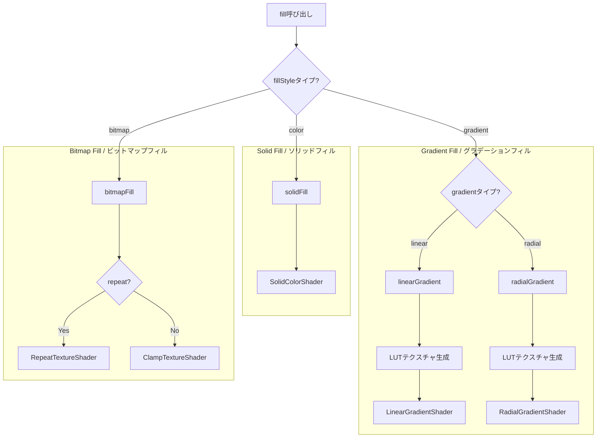
```mermaid
flowchart TB
    FILL[fill呼び出し]

    CHECK_STYLE{fillStyleタイプ?}

    subgraph "Solid Fill / ソリッドフィル"
        SOLID[solidFill]
        SOLID --> SOLID_SHADER[SolidColorShader]
    end

    subgraph "Gradient Fill / グラデーションフィル"
        GRAD_TYPE{gradientタイプ?}
        LINEAR[linearGradient]
        RADIAL[radialGradient]

        LINEAR --> GEN_LUT_L[LUTテクスチャ生成]
        RADIAL --> GEN_LUT_R[LUTテクスチャ生成]

        GEN_LUT_L --> LINEAR_SHADER[LinearGradientShader]
        GEN_LUT_R --> RADIAL_SHADER[RadialGradientShader]
    end

    subgraph "Bitmap Fill / ビットマップフィル"
        BITMAP[bitmapFill]
        BITMAP --> CHECK_REPEAT{repeat?}
        CHECK_REPEAT -->|Yes| REPEAT_SHADER[RepeatTextureShader]
        CHECK_REPEAT -->|No| CLAMP_SHADER[ClampTextureShader]
    end

    FILL --> CHECK_STYLE
    CHECK_STYLE -->|color| SOLID
    CHECK_STYLE -->|gradient| GRAD_TYPE
    GRAD_TYPE -->|linear| LINEAR
    GRAD_TYPE -->|radial| RADIAL
    CHECK_STYLE -->|bitmap| BITMAP
```

---

## 7. Stroke Operations

### Stroke Processing Pipeline / ストローク処理パイプライン

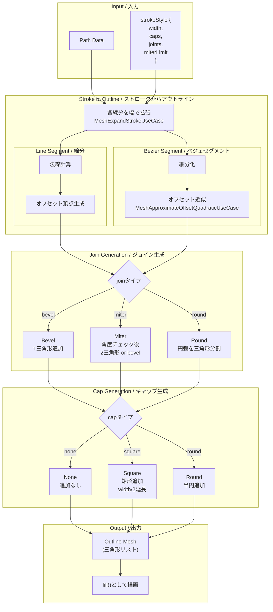
```mermaid
flowchart TB
    subgraph "Input / 入力"
        PATH[Path Data]
        STYLE["strokeStyle {<br/>  width,<br/>  caps,<br/>  joints,<br/>  miterLimit<br/>}"]
    end

    subgraph "Stroke to Outline / ストロークからアウトライン"
        EXPAND["各線分を幅で拡張<br/>MeshExpandStrokeUseCase"]

        subgraph "Line Segment / 線分"
            SEG_NORMAL["法線計算"]
            SEG_OFFSET["オフセット頂点生成"]
        end

        subgraph "Bezier Segment / ベジェセグメント"
            BEZ_SUBDIVIDE["細分化"]
            BEZ_OFFSET["オフセット近似<br/>MeshApproximateOffsetQuadraticUseCase"]
        end
    end

    subgraph "Join Generation / ジョイン生成"
        JOIN_TYPE{joinタイプ}

        BEVEL_JOIN["Bevel<br/>1三角形追加"]
        MITER_JOIN["Miter<br/>角度チェック後<br/>2三角形 or bevel"]
        ROUND_JOIN["Round<br/>円弧を三角形分割"]
    end

    subgraph "Cap Generation / キャップ生成"
        CAP_TYPE{capタイプ}

        NONE_CAP["None<br/>追加なし"]
        SQUARE_CAP["Square<br/>矩形追加<br/>width/2延長"]
        ROUND_CAP["Round<br/>半円追加"]
    end

    subgraph "Output / 出力"
        OUTLINE["Outline Mesh<br/>(三角形リスト)"]
        FILL_RENDER["fill()として描画"]
    end

    PATH --> EXPAND
    STYLE --> EXPAND

    EXPAND --> SEG_NORMAL
    SEG_NORMAL --> SEG_OFFSET

    EXPAND --> BEZ_SUBDIVIDE
    BEZ_SUBDIVIDE --> BEZ_OFFSET

    SEG_OFFSET --> JOIN_TYPE
    BEZ_OFFSET --> JOIN_TYPE

    JOIN_TYPE -->|bevel| BEVEL_JOIN
    JOIN_TYPE -->|miter| MITER_JOIN
    JOIN_TYPE -->|round| ROUND_JOIN

    BEVEL_JOIN --> CAP_TYPE
    MITER_JOIN --> CAP_TYPE
    ROUND_JOIN --> CAP_TYPE

    CAP_TYPE -->|none| NONE_CAP
    CAP_TYPE -->|square| SQUARE_CAP
    CAP_TYPE -->|round| ROUND_CAP

    NONE_CAP --> OUTLINE
    SQUARE_CAP --> OUTLINE
    ROUND_CAP --> OUTLINE

    OUTLINE --> FILL_RENDER
```

---

## 8. Gradient System

### Gradient LUT Generation / グラデーションLUT生成

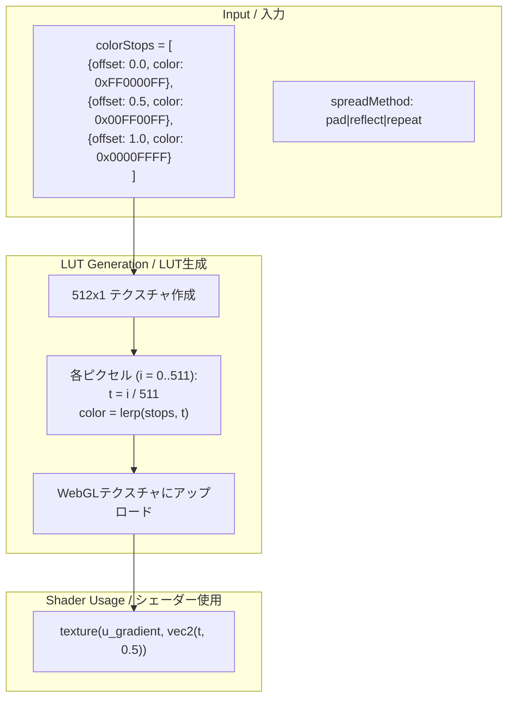
```mermaid
flowchart TB
    subgraph "Input / 入力"
        STOPS["colorStops = [<br/>  {offset: 0.0, color: 0xFF0000FF},<br/>  {offset: 0.5, color: 0x00FF00FF},<br/>  {offset: 1.0, color: 0x0000FFFF}<br/>]"]
        SPREAD["spreadMethod: pad|reflect|repeat"]
    end

    subgraph "LUT Generation / LUT生成"
        CREATE_TEX["512x1 テクスチャ作成"]

        INTERPOLATE["各ピクセル (i = 0..511):<br/>t = i / 511<br/>color = lerp(stops, t)"]

        UPLOAD["WebGLテクスチャにアップロード"]
    end

    subgraph "Shader Usage / シェーダー使用"
        SAMPLE["texture(u_gradient, vec2(t, 0.5))"]
    end

    STOPS --> CREATE_TEX
    CREATE_TEX --> INTERPOLATE
    INTERPOLATE --> UPLOAD
    UPLOAD --> SAMPLE
```

### Linear Gradient Calculation / 線形グラデーション計算

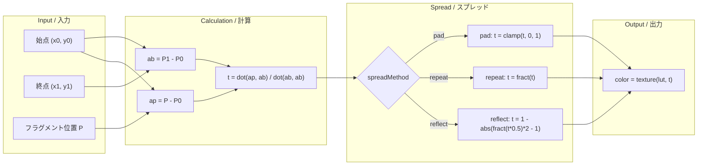
```mermaid
flowchart LR
    subgraph "Input / 入力"
        P0["始点 (x0, y0)"]
        P1["終点 (x1, y1)"]
        FRAG["フラグメント位置 P"]
    end

    subgraph "Calculation / 計算"
        AB["ab = P1 - P0"]
        AP["ap = P - P0"]
        DOT["t = dot(ap, ab) / dot(ab, ab)"]
    end

    subgraph "Spread / スプレッド"
        SPREAD_CHECK{spreadMethod}
        PAD["pad: t = clamp(t, 0, 1)"]
        REPEAT["repeat: t = fract(t)"]
        REFLECT["reflect: t = 1 - abs(fract(t*0.5)*2 - 1)"]
    end

    subgraph "Output / 出力"
        SAMPLE["color = texture(lut, t)"]
    end

    P0 --> AB
    P1 --> AB
    FRAG --> AP
    P0 --> AP
    AB --> DOT
    AP --> DOT

    DOT --> SPREAD_CHECK
    SPREAD_CHECK -->|pad| PAD
    SPREAD_CHECK -->|repeat| REPEAT
    SPREAD_CHECK -->|reflect| REFLECT

    PAD --> SAMPLE
    REPEAT --> SAMPLE
    REFLECT --> SAMPLE
```

### Radial Gradient Calculation / 放射グラデーション計算

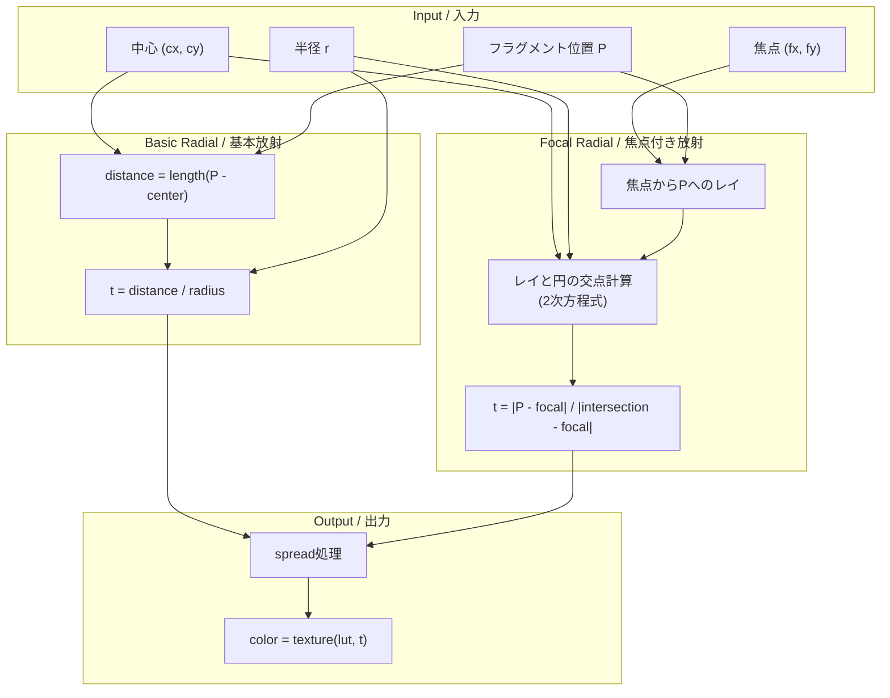
```mermaid
flowchart TB
    subgraph "Input / 入力"
        CENTER["中心 (cx, cy)"]
        RADIUS["半径 r"]
        FOCAL["焦点 (fx, fy)"]
        FRAG["フラグメント位置 P"]
    end

    subgraph "Basic Radial / 基本放射"
        DIST["distance = length(P - center)"]
        T_BASIC["t = distance / radius"]
    end

    subgraph "Focal Radial / 焦点付き放射"
        RAY["焦点からPへのレイ"]
        INTERSECT["レイと円の交点計算<br/>(2次方程式)"]
        T_FOCAL["t = |P - focal| / |intersection - focal|"]
    end

    subgraph "Output / 出力"
        SPREAD["spread処理"]
        COLOR["color = texture(lut, t)"]
    end

    CENTER --> DIST
    FRAG --> DIST
    DIST --> T_BASIC
    RADIUS --> T_BASIC

    FOCAL --> RAY
    FRAG --> RAY
    CENTER --> INTERSECT
    RADIUS --> INTERSECT
    RAY --> INTERSECT
    INTERSECT --> T_FOCAL

    T_BASIC --> SPREAD
    T_FOCAL --> SPREAD
    SPREAD --> COLOR
```

---

## 9. Blend Mode System

### Blend Mode Classification / ブレンドモード分類

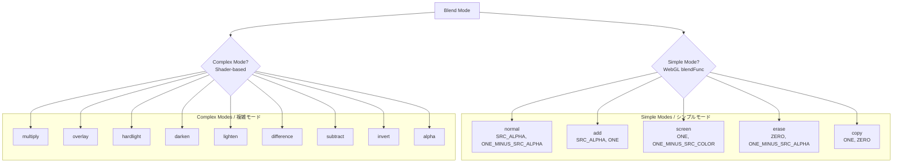
```mermaid
flowchart TB
    BLEND[Blend Mode]

    SIMPLE{Simple Mode?<br/>WebGL blendFunc}
    COMPLEX{Complex Mode?<br/>Shader-based}

    subgraph "Simple Modes / シンプルモード"
        NORMAL["normal<br/>SRC_ALPHA, ONE_MINUS_SRC_ALPHA"]
        ADD["add<br/>SRC_ALPHA, ONE"]
        SCREEN["screen<br/>ONE, ONE_MINUS_SRC_COLOR"]
        ERASE["erase<br/>ZERO, ONE_MINUS_SRC_ALPHA"]
        COPY["copy<br/>ONE, ZERO"]
    end

    subgraph "Complex Modes / 複雑モード"
        MULTIPLY["multiply"]
        OVERLAY["overlay"]
        HARDLIGHT["hardlight"]
        DARKEN["darken"]
        LIGHTEN["lighten"]
        DIFFERENCE["difference"]
        SUBTRACT["subtract"]
        INVERT["invert"]
        ALPHA["alpha"]
    end

    BLEND --> SIMPLE
    BLEND --> COMPLEX

    SIMPLE --> NORMAL
    SIMPLE --> ADD
    SIMPLE --> SCREEN
    SIMPLE --> ERASE
    SIMPLE --> COPY

    COMPLEX --> MULTIPLY
    COMPLEX --> OVERLAY
    COMPLEX --> HARDLIGHT
    COMPLEX --> DARKEN
    COMPLEX --> LIGHTEN
    COMPLEX --> DIFFERENCE
    COMPLEX --> SUBTRACT
    COMPLEX --> INVERT
    COMPLEX --> ALPHA
```

### Complex Blend Mode Rendering / 複雑ブレンドモードレンダリング

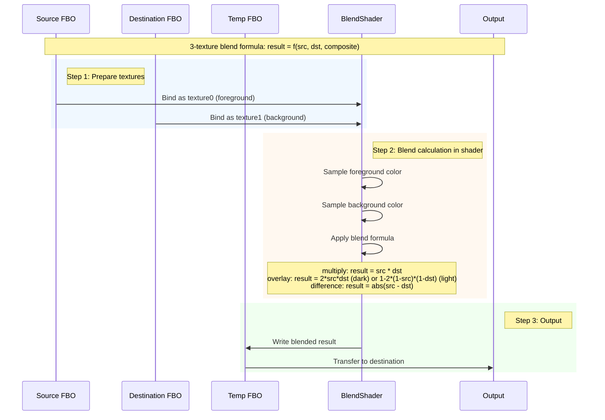
```mermaid
sequenceDiagram
    participant SRC as Source FBO
    participant DST as Destination FBO
    participant TMP as Temp FBO
    participant SHADER as BlendShader
    participant OUT as Output

    Note over SRC,OUT: 3-texture blend formula: result = f(src, dst, composite)

    rect rgb(240, 248, 255)
    Note right of SRC: Step 1: Prepare textures
    SRC->>SHADER: Bind as texture0 (foreground)
    DST->>SHADER: Bind as texture1 (background)
    end

    rect rgb(255, 248, 240)
    Note right of SHADER: Step 2: Blend calculation in shader
    SHADER->>SHADER: Sample foreground color
    SHADER->>SHADER: Sample background color
    SHADER->>SHADER: Apply blend formula
    Note over SHADER: multiply: result = src * dst<br/>overlay: result = 2*src*dst (dark) or 1-2*(1-src)*(1-dst) (light)<br/>difference: result = abs(src - dst)
    end

    rect rgb(240, 255, 240)
    Note right of OUT: Step 3: Output
    SHADER->>TMP: Write blended result
    TMP->>OUT: Transfer to destination
    end
```

### Instanced Blend Rendering / インスタンスブレンドレンダリング

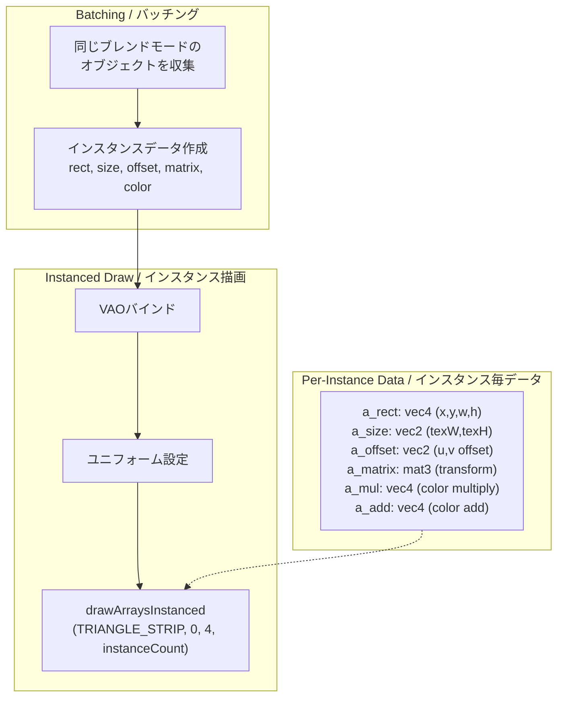
```mermaid
flowchart TB
    subgraph "Batching / バッチング"
        COLLECT["同じブレンドモードの<br/>オブジェクトを収集"]
        INSTANCE_DATA["インスタンスデータ作成<br/>rect, size, offset, matrix, color"]
    end

    subgraph "Instanced Draw / インスタンス描画"
        BIND_VAO["VAOバインド"]
        SET_UNIFORMS["ユニフォーム設定"]
        DRAW["drawArraysInstanced<br/>(TRIANGLE_STRIP, 0, 4, instanceCount)"]
    end

    subgraph "Per-Instance Data / インスタンス毎データ"
        ATTR["a_rect: vec4 (x,y,w,h)<br/>a_size: vec2 (texW,texH)<br/>a_offset: vec2 (u,v offset)<br/>a_matrix: mat3 (transform)<br/>a_mul: vec4 (color multiply)<br/>a_add: vec4 (color add)"]
    end

    COLLECT --> INSTANCE_DATA
    INSTANCE_DATA --> BIND_VAO
    BIND_VAO --> SET_UNIFORMS
    SET_UNIFORMS --> DRAW
    ATTR -.-> DRAW
```

---

## 10. Mask System

### Stencil Mask Architecture / ステンシルマスクアーキテクチャ

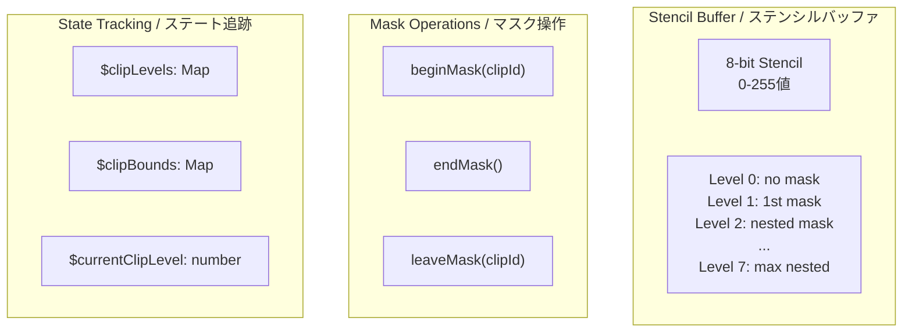
```mermaid
flowchart TB
    subgraph "Stencil Buffer / ステンシルバッファ"
        STENCIL["8-bit Stencil<br/>0-255値"]
        LEVELS["Level 0: no mask<br/>Level 1: 1st mask<br/>Level 2: nested mask<br/>...<br/>Level 7: max nested"]
    end

    subgraph "Mask Operations / マスク操作"
        BEGIN["beginMask(clipId)"]
        END["endMask()"]
        LEAVE["leaveMask(clipId)"]
    end

    subgraph "State Tracking / ステート追跡"
        CLIP_LEVELS["$clipLevels: Map<clipId, level>"]
        CLIP_BOUNDS["$clipBounds: Map<level, bounds>"]
        CURRENT["$currentClipLevel: number"]
    end
```

### Mask Begin/End Flow / マスク開始/終了フロー

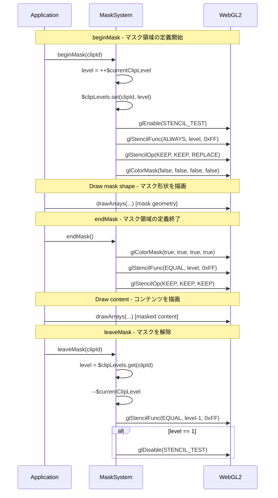
```mermaid
sequenceDiagram
    participant App as Application
    participant Mask as MaskSystem
    participant GL as WebGL2

    Note over App,GL: beginMask - マスク領域の定義開始
    App->>Mask: beginMask(clipId)
    Mask->>Mask: level = ++$currentClipLevel
    Mask->>Mask: $clipLevels.set(clipId, level)
    Mask->>GL: glEnable(STENCIL_TEST)
    Mask->>GL: glStencilFunc(ALWAYS, level, 0xFF)
    Mask->>GL: glStencilOp(KEEP, KEEP, REPLACE)
    Mask->>GL: glColorMask(false, false, false, false)

    Note over App,GL: Draw mask shape - マスク形状を描画
    App->>GL: drawArrays(...) [mask geometry]

    Note over App,GL: endMask - マスク領域の定義終了
    App->>Mask: endMask()
    Mask->>GL: glColorMask(true, true, true, true)
    Mask->>GL: glStencilFunc(EQUAL, level, 0xFF)
    Mask->>GL: glStencilOp(KEEP, KEEP, KEEP)

    Note over App,GL: Draw content - コンテンツを描画
    App->>GL: drawArrays(...) [masked content]

    Note over App,GL: leaveMask - マスクを解除
    App->>Mask: leaveMask(clipId)
    Mask->>Mask: level = $clipLevels.get(clipId)
    Mask->>Mask: --$currentClipLevel
    Mask->>GL: glStencilFunc(EQUAL, level-1, 0xFF)
    alt level == 1
        Mask->>GL: glDisable(STENCIL_TEST)
    end
```

### Union Mask (Level > 7) / ユニオンマスク (レベル > 7)

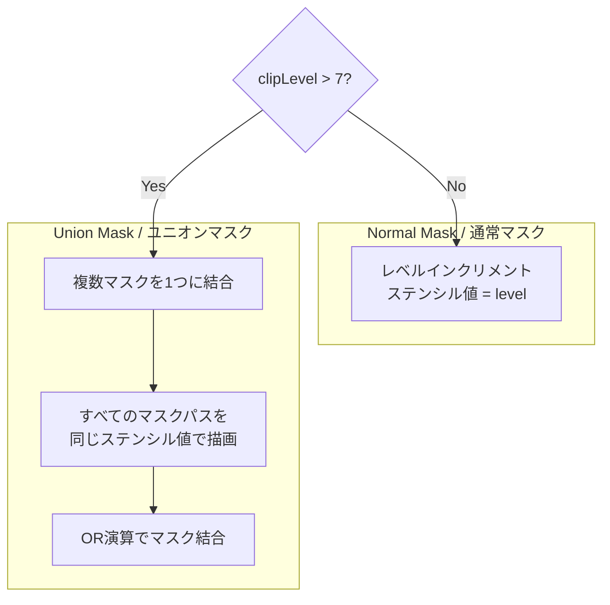
```mermaid
flowchart TB
    CHECK{clipLevel > 7?}

    subgraph "Normal Mask / 通常マスク"
        NORMAL["レベルインクリメント<br/>ステンシル値 = level"]
    end

    subgraph "Union Mask / ユニオンマスク"
        UNION["複数マスクを1つに結合"]
        RENDER_ALL["すべてのマスクパスを<br/>同じステンシル値で描画"]
        OR_OP["OR演算でマスク結合"]
    end

    CHECK -->|No| NORMAL
    CHECK -->|Yes| UNION
    UNION --> RENDER_ALL
    RENDER_ALL --> OR_OP
```

---

## 11. Filter System

### Filter Processing Overview / フィルター処理概要

```mermaid
flowchart TB
    subgraph "Input / 入力"
        SRC_TEX["Source Texture<br/>フィルター対象"]
        FILTERS["Filter Array<br/>[filter1, filter2, ...]"]
    end

    subgraph "Filter Chain / フィルターチェーン"
        LOOP["for each filter"]

        subgraph "Single Filter / 単一フィルター"
            ALLOC["バッファ確保<br/>frameBufferManager"]
            PROCESS["フィルター処理"]
            SWAP["結果を次の入力に"]
        end
    end

    subgraph "Output / 出力"
        RESULT["Filtered Texture"]
    end

    SRC_TEX --> LOOP
    FILTERS --> LOOP
    LOOP --> ALLOC
    ALLOC --> PROCESS
    PROCESS --> SWAP
    SWAP --> LOOP
    SWAP --> RESULT
```

### Blur Filter - Separable Gaussian / ブラーフィルター - 分離可能ガウシアン

```mermaid
flowchart TB
    subgraph "Input / 入力"
        SRC["Source"]
        BLUR_X["blurX"]
        BLUR_Y["blurY"]
        QUALITY["quality (iterations)"]
    end

    subgraph "Adaptive Scaling / 適応スケーリング"
        CHECK_SIZE{blur > threshold?}
        SCALE_DOWN["ダウンスケール<br/>0.0625x ~ 1x"]
        NO_SCALE["スケールなし"]
    end

    subgraph "Horizontal Pass / 水平パス"
        H_PASS["Horizontal Blur<br/>texture(src, uv + vec2(offset, 0))"]
    end

    subgraph "Vertical Pass / 垂直パス"
        V_PASS["Vertical Blur<br/>texture(src, uv + vec2(0, offset))"]
    end

    subgraph "Quality Iterations / 品質イテレーション"
        ITER["for i = 0 to quality:<br/>  H_PASS → V_PASS"]
    end

    subgraph "Output / 出力"
        SCALE_UP["アップスケール<br/>(必要な場合)"]
        RESULT["Blurred Result"]
    end

    SRC --> CHECK_SIZE
    BLUR_X --> CHECK_SIZE
    BLUR_Y --> CHECK_SIZE
    CHECK_SIZE -->|Yes| SCALE_DOWN
    CHECK_SIZE -->|No| NO_SCALE

    SCALE_DOWN --> H_PASS
    NO_SCALE --> H_PASS

    H_PASS --> V_PASS
    V_PASS --> ITER
    QUALITY --> ITER
    ITER --> SCALE_UP
    SCALE_UP --> RESULT
```

### Filter Types and Parameters / フィルタータイプとパラメータ

| Filter | Parameters | Passes | Description |
|--------|------------|--------|-------------|
| **Blur** | blurX, blurY, quality | 2 × quality | Separable Gaussian blur |
| **Glow** | color, alpha, blurX, blurY, strength, quality, inner, knockout | 2 × quality + 1 | Blur + color overlay |
| **DropShadow** | distance, angle, color, alpha, blurX, blurY, strength, quality, inner, knockout, hideObject | 2 × quality + 2 | Offset blur + composite |
| **Bevel** | distance, angle, highlightColor, shadowColor, blurX, blurY, strength, quality, type, knockout | 2 × quality + 2 | Highlight/shadow emboss |
| **ColorMatrix** | matrix[20] | 1 | 4x5 color transformation |
| **Convolution** | matrixX, matrixY, matrix[], divisor, bias, preserveAlpha, clamp, color, alpha | 1 | Kernel convolution |
| **DisplacementMap** | mapTexture, mapPoint, componentX, componentY, scaleX, scaleY, mode, color, alpha | 1 | UV displacement |
| **GradientBevel** | distance, angle, colors[], alphas[], ratios[], blurX, blurY, strength, quality, type, knockout | 2 × quality + 2 | Gradient emboss |
| **GradientGlow** | distance, angle, colors[], alphas[], ratios[], blurX, blurY, strength, quality, type, knockout | 2 × quality + 2 | Gradient glow |

### Ping-Pong Buffer Rendering / ピンポンバッファレンダリング

```mermaid
sequenceDiagram
    participant SRC as Source
    participant A as Buffer A
    participant B as Buffer B
    participant OUT as Output

    Note over SRC,OUT: Ping-Pong for multi-pass filters

    SRC->>A: Initial copy

    loop Each pass
        A->>B: Render pass (read A, write B)
        B->>A: Render pass (read B, write A)
    end

    alt Even passes
        A->>OUT: Final result
    else Odd passes
        B->>OUT: Final result
    end
```

---

## 12. Shader System

### Shader Architecture / シェーダーアーキテクチャ

```mermaid
flowchart TB
    subgraph "Shader Templates / シェーダーテンプレート"
        V_TEX["TEXTURE_TEMPLATE<br/>テクスチャ用頂点"]
        V_FILL["FILL_TEMPLATE<br/>フィル用頂点"]
        V_INST["INSTANCE_TEMPLATE<br/>インスタンス用頂点"]

        F_SOLID["Solid Color Fragment"]
        F_GRAD["Gradient Fragment"]
        F_TEX["Texture Fragment"]
        F_BLEND["Blend Mode Fragment"]
        F_FILTER["Filter Fragment"]
    end

    subgraph "Shader Manager / シェーダーマネージャー"
        CACHE["Shader Cache<br/>Map<key, WebGLProgram>"]

        COMPILE["compile(source)"]
        LINK["link(vertex, fragment)"]
        GET["getProgram(key)"]
    end

    subgraph "Variant System / バリアントシステム"
        KEY_GEN["キー生成<br/>s{grid}, b{repeat}{grid}"]
        VARIANT["シェーダーバリアント<br/>9-slice, repeat, etc."]
    end

    V_TEX --> COMPILE
    V_FILL --> COMPILE
    V_INST --> COMPILE
    F_SOLID --> COMPILE
    F_GRAD --> COMPILE
    F_TEX --> COMPILE
    F_BLEND --> COMPILE
    F_FILTER --> COMPILE

    COMPILE --> LINK
    LINK --> CACHE
    KEY_GEN --> GET
    GET --> CACHE
    VARIANT --> KEY_GEN
```

### Uniform Packing / ユニフォームパッキング

```mermaid
flowchart LR
    subgraph "Input Uniforms / 入力ユニフォーム"
        U1["float a"]
        U2["float b"]
        U3["float c"]
        U4["float d"]
        U5["vec2 e"]
        U6["vec3 f"]
    end

    subgraph "Packed vec4 / パックされたvec4"
        V1["u_data0 = vec4(a, b, c, d)"]
        V2["u_data1 = vec4(e.x, e.y, f.x, f.y)"]
        V3["u_data2 = vec4(f.z, 0, 0, 0)"]
    end

    U1 --> V1
    U2 --> V1
    U3 --> V1
    U4 --> V1
    U5 --> V2
    U6 --> V2
    U6 --> V3
```

### Vertex Shader Structure / 頂点シェーダー構造

```glsl
#version 300 es
precision highp float;

// Attributes
in vec2 a_vertex;      // Position
in vec4 a_bezier;      // Bezier control (optional)
in vec4 a_color;       // Vertex color
in vec3 a_matrix0;     // Transform row 0
in vec3 a_matrix1;     // Transform row 1
in vec2 a_matrix2;     // tx, ty

// Uniforms (packed as vec4)
uniform vec4 u_viewport;    // width, height, 1/width, 1/height
uniform vec4 u_transform;   // Additional transform

// Outputs
out vec4 v_color;
out vec2 v_uv;

void main() {
    // Apply transformation
    vec2 pos = a_vertex;
    pos = vec2(
        a_matrix0.x * pos.x + a_matrix0.y * pos.y + a_matrix0.z,
        a_matrix1.x * pos.x + a_matrix1.y * pos.y + a_matrix1.z
    );
    pos += a_matrix2;

    // Convert to clip space
    pos = pos * u_viewport.zw * 2.0 - 1.0;
    pos.y = -pos.y;

    gl_Position = vec4(pos, 0.0, 1.0);
    v_color = a_color;
}
```

### Fragment Shader Structure / フラグメントシェーダー構造

```glsl
#version 300 es
precision highp float;

// Inputs
in vec4 v_color;
in vec2 v_uv;

// Uniforms
uniform sampler2D u_texture;
uniform vec4 u_colorMul;    // Color multiply
uniform vec4 u_colorAdd;    // Color add

// Output
out vec4 fragColor;

void main() {
    vec4 color = texture(u_texture, v_uv);

    // Apply color transform
    color *= u_colorMul;
    color += u_colorAdd;

    // Premultiplied alpha
    color.rgb *= color.a;

    fragColor = color;
}
```

---

## 13. FrameBuffer Management

### Attachment Object Pool / アタッチメントオブジェクトプール

```mermaid
flowchart TB
    subgraph "Object Pool / オブジェクトプール"
        POOL["$objectPool: IAttachmentObject[]"]

        CREATE["create()"]
        RELEASE["release(obj)"]
        GET["getFromPool()"]
    end

    subgraph "Attachment Object / アタッチメントオブジェクト"
        ATTACH["IAttachmentObject {<br/>  width, height,<br/>  clipLevel,<br/>  msaa: boolean,<br/>  mask: boolean,<br/>  color: WebGLRenderbuffer,<br/>  texture: WebGLTexture,<br/>  stencil: WebGLRenderbuffer,<br/>  frameBuffer: WebGLFramebuffer<br/>}"]
    end

    subgraph "Usage / 使用"
        ALLOC["allocate(w, h, options)"]
        BIND["bind()"]
        UNBIND["unbind()"]
        TRANSFER["transfer()"]
    end

    GET --> ATTACH
    CREATE --> ATTACH
    ATTACH --> POOL
    RELEASE --> POOL

    ALLOC --> GET
    BIND --> ATTACH
    UNBIND --> ATTACH
    TRANSFER --> ATTACH
```

### FrameBuffer Workflow / フレームバッファワークフロー

```mermaid
sequenceDiagram
    participant App as Application
    participant FBM as FrameBufferManager
    participant GL as WebGL2
    participant Atlas as AtlasManager

    Note over App,Atlas: Render to temporary buffer

    App->>FBM: createAttachment(width, height)
    FBM->>FBM: Check pool for reusable object
    alt Pool has matching object
        FBM->>FBM: Return from pool
    else No match
        FBM->>GL: glGenFramebuffer()
        FBM->>GL: glGenTexture() or glGenRenderbuffer()
        FBM->>GL: glFramebufferTexture2D() or glFramebufferRenderbuffer()
    end

    App->>FBM: bind(attachment)
    FBM->>GL: glBindFramebuffer(GL_FRAMEBUFFER, fbo)
    FBM->>GL: glViewport(0, 0, width, height)

    Note over App,GL: Render content
    App->>GL: draw calls...

    App->>FBM: unbind()
    FBM->>GL: glBindFramebuffer(GL_FRAMEBUFFER, null)

    App->>FBM: transferToAtlas(attachment, atlasNode)
    FBM->>Atlas: Get atlas texture coordinates
    FBM->>GL: glCopyTexSubImage2D(atlas, ...)

    App->>FBM: releaseAttachment(attachment)
    FBM->>FBM: Return to pool
```

### MSAA vs Texture Mode / MSAA vs テクスチャモード

```mermaid
flowchart TB
    CHECK{MSAA required?}

    subgraph "MSAA Mode / MSAAモード"
        MSAA_CREATE["Renderbuffer + MSAA samples"]
        MSAA_RENDER["Render to MSAA buffer"]
        MSAA_RESOLVE["glBlitFramebuffer to texture"]
    end

    subgraph "Texture Mode / テクスチャモード"
        TEX_CREATE["Texture attachment"]
        TEX_RENDER["Render directly to texture"]
        TEX_USE["Use texture directly"]
    end

    CHECK -->|Yes| MSAA_CREATE
    MSAA_CREATE --> MSAA_RENDER
    MSAA_RENDER --> MSAA_RESOLVE

    CHECK -->|No| TEX_CREATE
    TEX_CREATE --> TEX_RENDER
    TEX_RENDER --> TEX_USE
```

---

## 14. Atlas Management

### Binary Tree Packing Algorithm / バイナリツリーパッキングアルゴリズム

```mermaid
flowchart TB
    subgraph "TexturePacker / テクスチャパッカー"
        ROOT["Root Node<br/>2048x2048"]

        subgraph "Binary Tree / バイナリツリー"
            N1["Node A<br/>1024x2048"]
            N2["Node B<br/>1024x2048"]
            N3["Node C<br/>1024x1024"]
            N4["Node D<br/>1024x1024"]
        end
    end

    subgraph "Insert Algorithm / 挿入アルゴリズム"
        INSERT["insert(width, height)"]
        CHECK_FIT{fits in node?}
        CHECK_LEAF{is leaf?}
        SPLIT["split node<br/>(horizontal or vertical)"]
        OCCUPY["mark as occupied<br/>return node"]
        TRY_CHILDREN["try children"]
    end

    ROOT --> N1
    ROOT --> N2
    N1 --> N3
    N1 --> N4

    INSERT --> CHECK_FIT
    CHECK_FIT -->|No| FAIL[return null]
    CHECK_FIT -->|Yes| CHECK_LEAF
    CHECK_LEAF -->|Yes, empty| SPLIT
    CHECK_LEAF -->|Yes, occupied| FAIL
    CHECK_LEAF -->|No| TRY_CHILDREN
    SPLIT --> OCCUPY
    TRY_CHILDREN --> CHECK_FIT
```

### Atlas Transfer Flow / アトラス転送フロー

```mermaid
sequenceDiagram
    participant RQ as RenderQueue
    participant CTX as Context
    participant FBM as FrameBufferManager
    participant Atlas as AtlasManager
    participant GL as WebGL2

    Note over RQ,GL: Object rendering and atlas transfer

    RQ->>CTX: Render DisplayObject
    CTX->>FBM: Create temp buffer
    CTX->>CTX: Render to temp buffer

    CTX->>Atlas: requestNode(width, height)
    Atlas->>Atlas: Find or create space
    Atlas-->>CTX: Return AtlasNode {x, y, atlasIndex}

    CTX->>FBM: transferToAtlas(buffer, node)
    FBM->>GL: glBindFramebuffer(READ, tempBuffer)
    FBM->>GL: glBindTexture(atlasTexture)
    FBM->>GL: glCopyTexSubImage2D(x, y, width, height)

    Atlas->>Atlas: Update $transferBounds

    Note over Atlas,GL: Final composition
    Atlas->>GL: Bind atlas texture
    Atlas->>GL: Draw all nodes as instanced quads
```

### Multi-Atlas Management / マルチアトラス管理

```mermaid
flowchart TB
    subgraph "Atlas Manager / アトラスマネージャー"
        ROOT_NODES["$rootNodes: Node[]"]
        ATLAS_OBJS["$atlasAttachmentObjects: IAttachmentObject[]"]
        TRANSFER_BOUNDS["$transferBounds: IBounds[]"]
    end

    subgraph "Allocation / 割り当て"
        TRY_INSERT["Try insert in existing atlas"]
        CHECK_ALL{All atlases full?}
        CREATE_NEW["Create new atlas<br/>(2048x2048, max 4096)"]
        INSERT_SUCCESS["Insert successful"]
    end

    subgraph "Atlas Texture / アトラステクスチャ"
        ATLAS_0["Atlas 0<br/>2048x2048"]
        ATLAS_1["Atlas 1<br/>2048x2048"]
        ATLAS_N["Atlas N..."]
    end

    TRY_INSERT --> CHECK_ALL
    CHECK_ALL -->|No| INSERT_SUCCESS
    CHECK_ALL -->|Yes| CREATE_NEW
    CREATE_NEW --> INSERT_SUCCESS

    ROOT_NODES --> ATLAS_0
    ROOT_NODES --> ATLAS_1
    ROOT_NODES --> ATLAS_N
```

---

## 15. Vertex Array Object

### VAO Management / VAO管理

```mermaid
flowchart TB
    subgraph "Object Pool / オブジェクトプール"
        FILL_POOL["$objectPool (fill)"]
        STROKE_POOL["$strokeObjectPool"]
    end

    subgraph "VAO Structure / VAO構造"
        VAO["WebGLVertexArrayObject"]
        VBO["Vertex Buffer<br/>頂点データ"]
        IBO["Index Buffer<br/>(optional)"]
        ATTRS["Attribute Pointers<br/>location, size, type, stride, offset"]
    end

    subgraph "Operations / 操作"
        CREATE["create()"]
        BIND["bind()"]
        UNBIND["unbind()"]
        DRAW["draw()"]
        RELEASE["release()"]
    end

    CREATE --> VAO
    VAO --> VBO
    VAO --> IBO
    VAO --> ATTRS

    BIND --> VAO
    DRAW --> VAO
    UNBIND --> VAO
    RELEASE --> FILL_POOL
    RELEASE --> STROKE_POOL
```

### Instance Vertex Layout / インスタンス頂点レイアウト

```
Total: 88 bytes per instance / インスタンスあたり88バイト

┌─────────────────────────────────────────────────────────────────────┐
│ Attribute      │ Type       │ Size   │ Offset │ Divisor │ Desc     │
├─────────────────────────────────────────────────────────────────────┤
│ a_rect         │ vec4       │ 16B    │ 0      │ 1       │ x,y,w,h  │
│ a_size         │ vec2       │ 8B     │ 16     │ 1       │ tex size │
│ a_offset       │ vec2       │ 8B     │ 24     │ 1       │ uv offset│
│ a_matrix       │ mat3 (3xv3)│ 36B    │ 32     │ 1       │ transform│
│ a_mul          │ vec4       │ 16B    │ 68     │ 1       │ color mul│
│ a_add          │ vec4       │ 16B    │ 84     │ 1       │ color add│
└─────────────────────────────────────────────────────────────────────┘

Stride = 100 bytes (aligned to 4) / ストライド = 100バイト
```

### Buffer Growth Strategy / バッファ成長戦略

```mermaid
flowchart TB
    CHECK{data size > buffer size?}

    GROW["新サイズ = 次の2のべき乗"]
    REALLOC["gl.bufferData(newSize)"]

    NO_GROW["既存バッファ使用"]
    UPDATE["gl.bufferSubData(data)"]

    CHECK -->|Yes| GROW
    GROW --> REALLOC
    REALLOC --> UPDATE

    CHECK -->|No| NO_GROW
    NO_GROW --> UPDATE
```

---

## 16. Data Structures

### Core Interfaces / コアインターフェース

```typescript
// Fill Style / フィルスタイル
interface IFillStyle {
    type: "solid" | "gradient" | "bitmap";
    color?: number;          // 0xRRGGBBAA
    gradient?: IGradient;
    bitmap?: IBitmapFill;
}

// Gradient / グラデーション
interface IGradient {
    type: "linear" | "radial";
    colors: number[];        // 0xRRGGBBAA[]
    ratios: number[];        // 0-255
    matrix: Float32Array;    // 6 elements
    spreadMethod: "pad" | "reflect" | "repeat";
    focalPointRatio?: number;  // for radial
}

// Stroke Style / ストロークスタイル
interface IStrokeStyle {
    width: number;
    caps: "none" | "round" | "square";
    joints: "bevel" | "miter" | "round";
    miterLimit: number;
    fill: IFillStyle;
}

// Attachment Object / アタッチメントオブジェクト
interface IAttachmentObject {
    width: number;
    height: number;
    clipLevel: number;
    msaa: boolean;
    mask: boolean;
    color: WebGLRenderbuffer | null;
    texture: WebGLTexture | null;
    stencil: WebGLRenderbuffer | null;
    frameBuffer: WebGLFramebuffer;
}

// Atlas Node / アトラスノード
interface IAtlasNode {
    x: number;
    y: number;
    width: number;
    height: number;
    atlasIndex: number;
    used: boolean;
}
```

### Render Command Structure / レンダーコマンド構造

```typescript
// From render-queue package
interface IRenderCommand {
    type: CommandType;
    data: Float32Array | Uint32Array;
}

enum CommandType {
    BEGIN_PATH = 0,
    MOVE_TO = 1,
    LINE_TO = 2,
    CURVE_TO = 3,
    FILL = 4,
    STROKE = 5,
    CLIP = 6,
    SAVE = 7,
    RESTORE = 8,
    TRANSFORM = 9,
    // ... etc
}
```

### Cache Key Generation / キャッシュキー生成

```typescript
// FNV-1a hash for cache keys
function generateCacheKey(data: Uint32Array): number {
    let hash = 2166136261; // FNV offset basis
    for (let i = 0; i < data.length; i++) {
        hash ^= data[i];
        hash = Math.imul(hash, 16777619); // FNV prime
    }
    return hash >>> 0; // Convert to unsigned 32-bit
}
```

---

## 17. WebGPU Porting Notes

### API Mapping / API マッピング

| WebGL2 | WebGPU | Notes |
|--------|--------|-------|
| `WebGL2RenderingContext` | `GPUDevice` | Main API entry point |
| `WebGLProgram` | `GPURenderPipeline` | Shader + state |
| `WebGLShader` | `GPUShaderModule` | GLSL → WGSL |
| `WebGLBuffer` | `GPUBuffer` | Same concept |
| `WebGLTexture` | `GPUTexture` | Similar |
| `WebGLFramebuffer` | `GPURenderPassEncoder` | Different paradigm |
| `WebGLVertexArrayObject` | Implicit in pipeline | No direct equivalent |
| `glUniform*` | Bind groups | Completely different |
| `glDrawArrays` | `pass.draw()` | Similar |
| `glDrawArraysInstanced` | `pass.draw(vertexCount, instanceCount)` | Similar |

### Key Architectural Differences / 主なアーキテクチャの違い

```mermaid
flowchart TB
    subgraph "WebGL (Immediate Mode) / WebGL (即時モード)"
        GL_BIND["glBindTexture/Buffer/..."]
        GL_SET["glUniform/VertexAttrib/..."]
        GL_DRAW["glDraw*"]
        GL_BIND --> GL_SET --> GL_DRAW
    end

    subgraph "WebGPU (Command Buffer) / WebGPU (コマンドバッファ)"
        GPU_ENCODER["GPUCommandEncoder"]
        GPU_PASS["beginRenderPass"]
        GPU_BIND["setBindGroup/Pipeline/VertexBuffer"]
        GPU_DRAW["draw()"]
        GPU_END["end()"]
        GPU_SUBMIT["queue.submit([commandBuffer])"]

        GPU_ENCODER --> GPU_PASS
        GPU_PASS --> GPU_BIND
        GPU_BIND --> GPU_DRAW
        GPU_DRAW --> GPU_END
        GPU_END --> GPU_SUBMIT
    end
```

### Shader Language Conversion / シェーダー言語変換

```
GLSL ES 300 → WGSL

// GLSL
#version 300 es
precision highp float;
in vec2 a_vertex;
uniform vec4 u_data;
out vec4 v_color;

void main() {
    gl_Position = vec4(a_vertex, 0.0, 1.0);
}

// WGSL
struct VertexInput {
    @location(0) vertex: vec2<f32>,
}

struct Uniforms {
    data: vec4<f32>,
}

@group(0) @binding(0) var<uniform> uniforms: Uniforms;

@vertex
fn main(input: VertexInput) -> @builtin(position) vec4<f32> {
    return vec4<f32>(input.vertex, 0.0, 1.0);
}
```

### Recommended Porting Strategy / 推奨移植戦略

1. **Phase 1: Infrastructure / インフラストラクチャ**
   - Create GPUDevice initialization
   - Implement buffer management (GPUBuffer pools)
   - Create texture/sampler management
   - Build bind group system for uniforms

2. **Phase 2: Shader Conversion / シェーダー変換**
   - Convert vertex shaders to WGSL
   - Convert fragment shaders to WGSL
   - Build shader module caching
   - Create render pipeline factory

3. **Phase 3: Rendering / レンダリング**
   - Implement fill operations with stencil
   - Implement stroke (reuse mesh generation)
   - Implement gradient rendering
   - Implement bitmap rendering

4. **Phase 4: Advanced Features / 高度な機能**
   - Implement blend modes (custom pipelines)
   - Implement filter system (compute shaders)
   - Implement masking
   - Implement atlas management

5. **Phase 5: Optimization / 最適化**
   - Implement instanced rendering
   - Add batch coalescing
   - Optimize bind group usage
   - Profile and tune

### Critical Implementation Notes / 重要な実装メモ

1. **Stencil Operations**: WebGPU stencil works similarly, but configured via `GPURenderPipelineDescriptor.depthStencil`

2. **Blend Modes**: Simple modes map to `GPUBlendState`, complex modes need shader implementation

3. **Uniform Buffers**: WebGPU requires explicit alignment (16-byte for vec4), use `@size` and `@align` in WGSL

4. **Instanced Rendering**: WebGPU natively supports instancing, similar to WebGL2

5. **Command Encoding**: Batch commands before submission for optimal performance

6. **Resource Binding**: Use bind groups efficiently - group by update frequency

---

## Appendix: File References / 付録: ファイル参照

| Component | Main File | Key Functions |
|-----------|-----------|---------------|
| Context | `Context.ts` | save, restore, fill, stroke, clip |
| PathCommand | `PathCommand.ts` | beginPath, moveTo, lineTo, curveTo |
| Mesh | `Mesh.ts` | generateFillMesh, generateStrokeMesh |
| Blend | `Blend.ts` | setBlendMode, blendDraw |
| Mask | `Mask.ts` | beginMask, endMask, leaveMask |
| Filter | `Filter.ts` | applyFilter |
| Shader | `Shader/ShaderManager.ts` | getProgram, compile |
| FrameBuffer | `FrameBufferManager.ts` | create, bind, transfer |
| Atlas | `AtlasManager.ts` | requestNode, releaseNode |
| VAO | `VertexArrayObject.ts` | create, bind, draw |
| Gradient | `Shader/GradientLUTGenerator.ts` | generateLUT |

---

*Document generated for WebGPU porting reference*
*WebGPU移植参考用に生成されたドキュメント*
