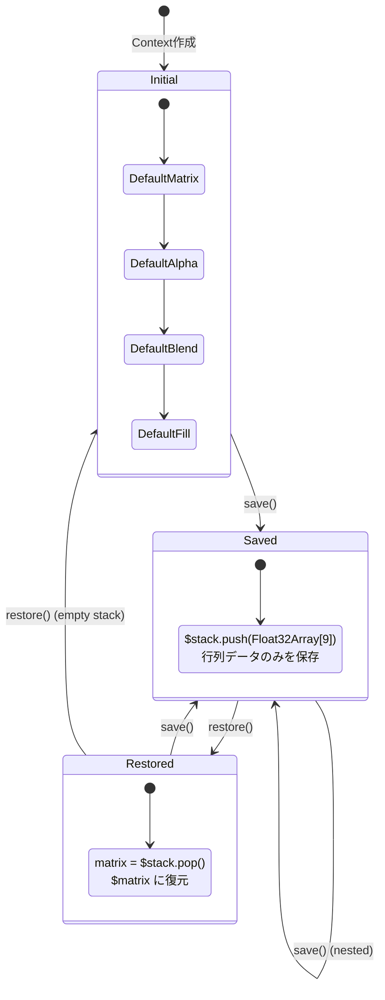
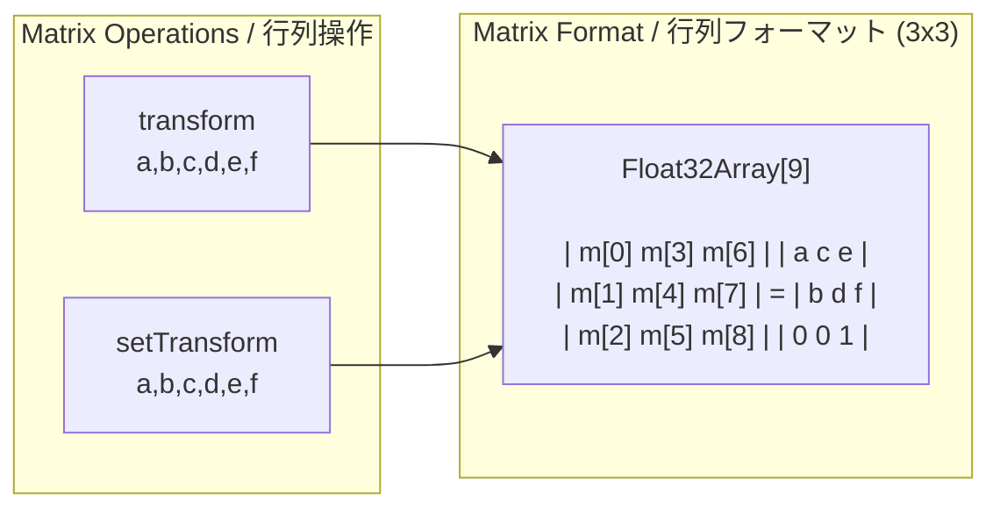
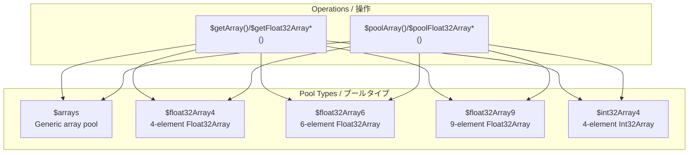
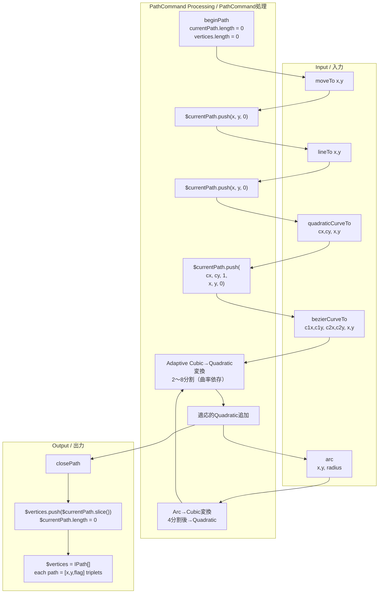
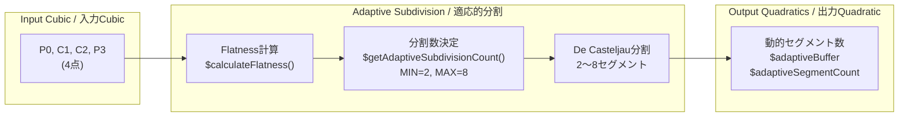
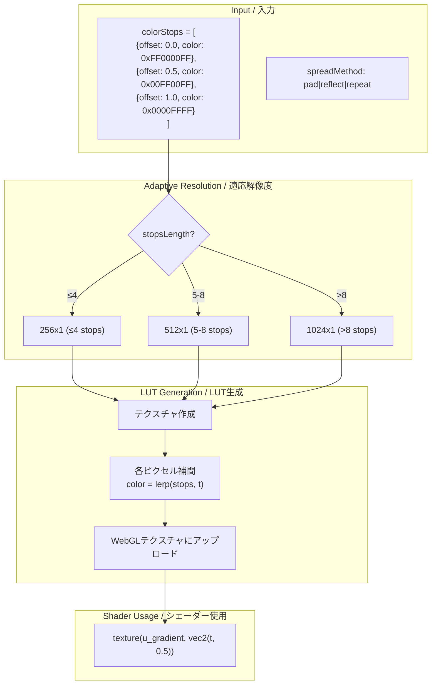
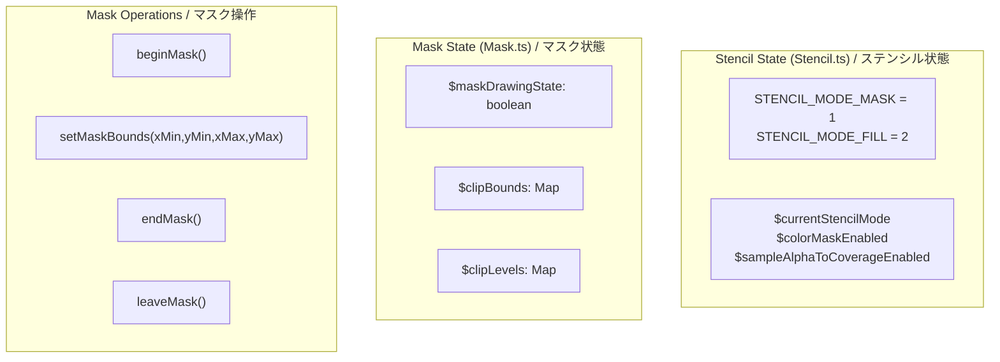

# WebGL Rendering Flow - Detailed Technical Specification
# WebGL レンダリングフロー - 詳細技術仕様書

This document provides a comprehensive analysis of the WebGL rendering pipeline for porting to WebGPU.

このドキュメントは、WebGPUへの移植のためのWebGLレンダリングパイプラインの包括的な分析を提供します。

---

## Table of Contents / 目次

1. [High-Level Architecture](#1-high-level-architecture)
2. [Complete Rendering Pipeline](#2-complete-rendering-pipeline)
3. [Context State Management](#3-context-state-management)
4. [Path Command Processing](#4-path-command-processing)
5. [Mesh Generation](#5-mesh-generation)
6. [Fill Operations](#6-fill-operations)
7. [Stroke Operations](#7-stroke-operations)
8. [Gradient System](#8-gradient-system)
9. [Blend Mode System](#9-blend-mode-system)
10. [Mask System](#10-mask-system)
11. [Filter System](#11-filter-system)
12. [Shader System](#12-shader-system)
13. [FrameBuffer Management](#13-framebuffer-management)
14. [Atlas Management](#14-atlas-management)
15. [Vertex Array Object](#15-vertex-array-object)
16. [Data Structures](#16-data-structures)
17. [WebGPU Porting Notes](#17-webgpu-porting-notes)

---

## 1. High-Level Architecture

### System Overview / システム概要


---

## 2. Complete Rendering Pipeline

### Main Rendering Flow / メインレンダリングフロー


---

## 3. Context State Management

### State Stack / ステートスタック



### Context State Variables / コンテキスト状態変数

| Variable | Type | Description |
|----------|------|-------------|
| `$matrix` | `Float32Array[9]` | Current 3x3 transformation matrix |
| `$stack` | `Float32Array[]` | Save/restore matrix stack |
| `globalAlpha` | `number` | Global alpha value (0.0-1.0) |
| `globalCompositeOperation` | `IBlendMode` | Current blend mode |
| `$fillStyle` | `Float32Array[4]` | Current fill RGBA color |
| `$strokeStyle` | `Float32Array[4]` | Current stroke RGBA color |
| `imageSmoothingEnabled` | `boolean` | Texture smoothing flag |
| `$mainAttachmentObject` | `IAttachmentObject \| null` | Main attachment object |
| `$stackAttachmentObject` | `IAttachmentObject[]` | Attachment object stack |
| `maskBounds` | `IBounds` | Mask drawing bounds |
| `thickness` | `number` | Stroke thickness (default: 1) |
| `caps` | `number` | Stroke cap style (0=butt, 1=round, 2=square, default: 1) |
| `joints` | `number` | Stroke joint style (0=bevel, 1=round, 2=miter, default: 2) |
| `miterLimit` | `number` | Miter limit (default: 0) |
| `$clearColorR/G/B/A` | `number` | Background clear color |

### Transformation Matrix Operations / 変換行列操作



### Global State Management (WebGLUtil.ts) / グローバル状態管理

| Variable | Type | Description |
|----------|------|-------------|
| `$RENDER_MAX_SIZE` | `number` | Maximum render size (default: 2048, max: 4096) |
| `$samples` | `number` | MSAA sample count (default: 4) |
| `$gl` | `WebGL2RenderingContext` | WebGL2 context |
| `$context` | `Context` | Context instance |
| `$devicePixelRatio` | `number` | Device pixel ratio (default: 1) |
| `$viewportWidth/Height` | `number` | Current viewport dimensions |

### Array Pooling System / 配列プーリングシステム



---

## 4. Path Command Processing

### Path Data Structure / パスデータ構造

```typescript
// PathCommand.ts
export const $currentPath: IPath = [];     // 現在操作中のパス配列
export const $vertices: IPath[] = [];       // 完了したパス配列

// IPath = number[] (x, y, flag の triplets)
// flag: 0 = line point, 1 = quadratic control point
```

### Path Data Flow / パスデータフロー



### Adaptive Cubic to Quadratic Conversion / 適応的Cubic→Quadratic変換



**BezierConverter.ts Constants / 定数:**
```typescript
FLATNESS_THRESHOLD = 0.5     // 平坦度閾値
MIN_SUBDIVISIONS = 2         // 最小分割数
MAX_SUBDIVISIONS = 8         // 最大分割数

$bezierBuffer: Float32Array(32)    // 固定サイズバッファ
$adaptiveBuffer: Float32Array      // 動的サイズバッファ
$adaptiveSegmentCount: number      // 実際のセグメント数
```

**Algorithm / アルゴリズム:**
```
1. $calculateFlatness(p0, p1, p2, p3):
   - 制御点から直線P0-P3への最大距離を計算
   - ux = 3*p1 - 2*p0 - p3
   - uy = 3*p1y - 2*p0y - p3y
   - vx = 3*p2 - 2*p3 - p0
   - vy = 3*p2y - 2*p3y - p0y
   - return max(ux*ux + uy*uy, vx*vx + vy*vy)

2. $getAdaptiveSubdivisionCount():
   - if flatness < threshold² → MIN_SUBDIVISIONS
   - level = ceil(log2(sqrt(flatness)/threshold) / 2)
   - return clamp(level + MIN, MIN, MAX)
```

---

## 5. Mesh Generation

### Fill Mesh - Fan Triangulation / フィルメッシュ - ファン三角形分割


### Vertex Data Layout (Fill) / 頂点データレイアウト (フィル)

```
Total: 68 bytes per vertex / 頂点あたり68バイト

┌─────────────────────────────────────────────────────────────────┐
│ Attribute      │ Type       │ Size   │ Offset │ Description    │
├─────────────────────────────────────────────────────────────────┤
│ a_vertex       │ vec2       │ 8B     │ 0      │ Position x,y   │
│ a_bezier       │ vec4       │ 16B    │ 8      │ Bezier control │
│ a_color        │ vec4       │ 16B    │ 24     │ RGBA color     │
│ a_matrix0      │ vec3       │ 12B    │ 40     │ Matrix row 0   │
│ a_matrix1      │ vec3       │ 12B    │ 52     │ Matrix row 1   │
│ a_matrix2      │ vec2       │ 8B     │ 64     │ tx, ty         │
└─────────────────────────────────────────────────────────────────┘

Stride = 72 bytes (aligned) / ストライド = 72バイト (アライン済み)
```

### Fill Buffer Management (Mesh.ts) / フィルバッファ管理

```typescript
// 動的フィルバッファプーリング
export let $fillBuffer: Float32Array = new Float32Array(128);  // 成長するバッファ
export let $fillBufferOffset: number = 0;                       // 現在のオフセット

export const $fillBufferIndexes: number[] = [];  // フィルごとの頂点数
export const $fillTypes: IFillType[] = [];       // フィルタイプ配列

// バッファ操作
$getFillBuffer(): Float32Array
$getFillBufferOffset(): number
$addFillBuffer(buffer: Float32Array): void
$clearFillBufferSetting(): void              // 新フレーム時にリセット
$upperPowerOfTwo(v: number): number          // 2のべき乗に切り上げ
```

### Stroke to Fill Conversion / ストロークからフィル変換


---

## 6. Fill Operations

### Two-Pass Stencil Fill / 2パスステンシルフィル


### Fill Type Decision Flow / フィルタイプ決定フロー


---

## 7. Stroke Operations

### Stroke Processing Pipeline / ストローク処理パイプライン


---

## 8. Gradient System

### Gradient LUT Generation / グラデーションLUT生成



**GradientLUTGenerator.ts - Adaptive Resolution / 適応解像度:**
```typescript
$getAdaptiveResolution(stopsLength: number): number
  - stopsLength ≤ 4 → 256
  - stopsLength ≤ 8 → 512
  - stopsLength > 8 → 1024

// Color space conversion tables
$rgbToLinearTable: Float32Array(256)  // pow(t, 2.23333333)
$rgbIdentityTable: Float32Array(256)  // linear t
```

### Linear Gradient Calculation / 線形グラデーション計算


### Radial Gradient Calculation / 放射グラデーション計算


---

## 9. Blend Mode System

### Blend Mode Classification / ブレンドモード分類


### Complex Blend Mode Rendering / 複雑ブレンドモードレンダリング


### Instanced Blend Rendering / インスタンスブレンドレンダリング


**Blend.ts State Functions / ブレンド状態関数:**
```typescript
$setCurrentBlendMode(blend_mode: IBlendMode): void
$getCurrentBlendMode(): IBlendMode

$setFuncCode(func_code: number): void    // default: 600
$getFuncCode(): number
```

---

## 10. Mask System

### Stencil Mask Architecture / ステンシルマスクアーキテクチャ



**Stencil.ts State Functions / ステンシル状態関数:**
```typescript
// モード管理
$getStencilMode(): number
$setStencilMode(mode: number): void
$resetStencilMode(): void

// カラーマスク状態
$getColorMaskEnabled(): boolean
$setColorMaskEnabled(enabled: boolean): void

// MSAA SAMPLE_ALPHA_TO_COVERAGE状態
$getSampleAlphaToCoverageEnabled(): boolean
$setSampleAlphaToCoverageEnabled(enabled: boolean): void
```

**Mask.ts State Functions / マスク状態関数:**
```typescript
$setMaskDrawing(state: boolean): void
$isMaskDrawing(): boolean
$clipBounds: Map<number, Float32Array>  // レイヤーIDごとのクリップ境界
$clipLevels: Map<number, number>        // マスクネストレベル追跡
```

### Mask Begin/End Flow / マスク開始/終了フロー


### Union Mask (Level > 7) / ユニオンマスク (レベル > 7)

```mermaid
flowchart TB
    CHECK{clipLevel > 7?}

    subgraph "Normal Mask / 通常マスク"
        NORMAL["レベルインクリメント<br/>ステンシル値 = level"]
    end

    subgraph "Union Mask / ユニオンマスク"
        UNION["複数マスクを1つに結合"]
        RENDER_ALL["すべてのマスクパスを<br/>同じステンシル値で描画"]
        OR_OP["OR演算でマスク結合"]
    end

    CHECK -->|No| NORMAL
    CHECK -->|Yes| UNION
    UNION --> RENDER_ALL
    RENDER_ALL --> OR_OP
```

---

## 11. Filter System

### Filter Processing Overview / フィルター処理概要

```mermaid
flowchart TB
    subgraph "Input / 入力"
        SRC_TEX["Source Texture<br/>フィルター対象"]
        FILTERS["Filter Array<br/>[filter1, filter2, ...]"]
    end

    subgraph "Filter Chain / フィルターチェーン"
        LOOP["for each filter"]

        subgraph "Single Filter / 単一フィルター"
            ALLOC["バッファ確保<br/>frameBufferManager"]
            PROCESS["フィルター処理"]
            SWAP["結果を次の入力に"]
        end
    end

    subgraph "Output / 出力"
        RESULT["Filtered Texture"]
    end

    SRC_TEX --> LOOP
    FILTERS --> LOOP
    LOOP --> ALLOC
    ALLOC --> PROCESS
    PROCESS --> SWAP
    SWAP --> LOOP
    SWAP --> RESULT
```

### Blur Filter - Separable Gaussian / ブラーフィルター - 分離可能ガウシアン

```mermaid
flowchart TB
    subgraph "Input / 入力"
        SRC["Source"]
        BLUR_X["blurX"]
        BLUR_Y["blurY"]
        QUALITY["quality (iterations)"]
    end

    subgraph "Adaptive Scaling / 適応スケーリング"
        CHECK_SIZE{blur > threshold?}
        SCALE_DOWN["ダウンスケール<br/>0.0625x ~ 1x"]
        NO_SCALE["スケールなし"]
    end

    subgraph "Horizontal Pass / 水平パス"
        H_PASS["Horizontal Blur<br/>texture(src, uv + vec2(offset, 0))"]
    end

    subgraph "Vertical Pass / 垂直パス"
        V_PASS["Vertical Blur<br/>texture(src, uv + vec2(0, offset))"]
    end

    subgraph "Quality Iterations / 品質イテレーション"
        ITER["for i = 0 to quality:<br/>  H_PASS → V_PASS"]
    end

    subgraph "Output / 出力"
        SCALE_UP["アップスケール<br/>(必要な場合)"]
        RESULT["Blurred Result"]
    end

    SRC --> CHECK_SIZE
    BLUR_X --> CHECK_SIZE
    BLUR_Y --> CHECK_SIZE
    CHECK_SIZE -->|Yes| SCALE_DOWN
    CHECK_SIZE -->|No| NO_SCALE

    SCALE_DOWN --> H_PASS
    NO_SCALE --> H_PASS

    H_PASS --> V_PASS
    V_PASS --> ITER
    QUALITY --> ITER
    ITER --> SCALE_UP
    SCALE_UP --> RESULT
```

### Filter Types and Parameters / フィルタータイプとパラメータ

| Filter | Parameters | Passes | Description |
|--------|------------|--------|-------------|
| **Blur** | blurX, blurY, quality | 2 × quality | Separable Gaussian blur |
| **Glow** | color, alpha, blurX, blurY, strength, quality, inner, knockout | 2 × quality + 1 | Blur + color overlay |
| **DropShadow** | distance, angle, color, alpha, blurX, blurY, strength, quality, inner, knockout, hideObject | 2 × quality + 2 | Offset blur + composite |
| **Bevel** | distance, angle, highlightColor, shadowColor, blurX, blurY, strength, quality, type, knockout | 2 × quality + 2 | Highlight/shadow emboss |
| **ColorMatrix** | matrix[20] | 1 | 4x5 color transformation |
| **Convolution** | matrixX, matrixY, matrix[], divisor, bias, preserveAlpha, clamp, color, alpha | 1 | Kernel convolution |
| **DisplacementMap** | mapTexture, mapPoint, componentX, componentY, scaleX, scaleY, mode, color, alpha | 1 | UV displacement |
| **GradientBevel** | distance, angle, colors[], alphas[], ratios[], blurX, blurY, strength, quality, type, knockout | 2 × quality + 2 | Gradient emboss |
| **GradientGlow** | distance, angle, colors[], alphas[], ratios[], blurX, blurY, strength, quality, type, knockout | 2 × quality + 2 | Gradient glow |
| **Bitmap** | - | 1 | Basic bitmap rendering |

### Filter Color Utilities (Filter.ts) / フィルターカラーユーティリティ

```typescript
// オフセット位置追跡
export const $offset: IPoint = { x: 0, y: 0 };

// カラー成分抽出（プリマルチプライドアルファ対応）
export const $intToR = (color: number, alpha: number, premultiplied: boolean): number
export const $intToG = (color: number, alpha: number, premultiplied: boolean): number
export const $intToB = (color: number, alpha: number, premultiplied: boolean): number
```

### DisplacementMap Component & Mode / ディスプレースメントマップコンポーネント＆モード

```typescript
// コンポーネントチャンネル選択
RED = 1, GREEN = 2, BLUE = 4, ALPHA = 8

// モードパラメータ
Mode 0: 直接テクスチャサンプリング
Mode 1: 代替色でクランプ
Mode 2: 小数UV折り返し
Mode 3: 軸ごとのフォールバック付きクランプ
```

### Ping-Pong Buffer Rendering / ピンポンバッファレンダリング

```mermaid
sequenceDiagram
    participant SRC as Source
    participant A as Buffer A
    participant B as Buffer B
    participant OUT as Output

    Note over SRC,OUT: Ping-Pong for multi-pass filters

    SRC->>A: Initial copy

    loop Each pass
        A->>B: Render pass (read A, write B)
        B->>A: Render pass (read B, write A)
    end

    alt Even passes
        A->>OUT: Final result
    else Odd passes
        B->>OUT: Final result
    end
```

---

## 12. Shader System

### Shader Architecture / シェーダーアーキテクチャ

```mermaid
flowchart TB
    subgraph "ShaderManager Class / ShaderManagerクラス"
        PROG["_$programObject: IProgramObject"]
        UNIFORM["_$uniformMap: Map<string, IUniformData>"]

        METHODS["useProgram()<br/>bindUniform()<br/>get highp/mediump/textures"]
    end

    subgraph "Shader Sources / シェーダーソース"
        V_SRC["Vertex/VertexShaderSource.ts<br/>VertexShaderSourceFill.ts"]
        F_SRC["Fragment/FragmentShaderSource.ts<br/>FragmentShaderSourceBlend.ts<br/>FragmentShaderSourceGradient.ts<br/>FragmentShaderSourceTexture.ts"]
    end

    subgraph "Variants / バリアント"
        SHAPE["Variants/Shape"]
        GRADIENT["Variants/Gradient"]
        GRADIENT_LUT["Variants/GradientLUT"]
        BITMAP["Variants/Bitmap"]
        BLEND["Variants/Blend"]
        FILTER["Variants/Filter"]
    end

    subgraph "Uniform System / ユニフォームシステム"
        HIGHP["u_highp: Int32Array | Float32Array"]
        MEDIUMP["u_mediump: Int32Array | Float32Array"]
        TEXTURES["u_textures: Int32Array | Float32Array"]
    end

    V_SRC --> PROG
    F_SRC --> PROG
    PROG --> UNIFORM
    UNIFORM --> HIGHP
    UNIFORM --> MEDIUMP
    UNIFORM --> TEXTURES
```

### ShaderManager Class / ShaderManagerクラス

```typescript
class ShaderManager {
    private readonly _$programObject: IProgramObject;
    private readonly _$uniformMap: Map<string, IUniformData>;

    constructor(vertex_source: string, fragment_source: string, atlas?: boolean);

    useProgram(): void;      // プログラムをアクティブ化
    bindUniform(): void;     // ユニフォーム変数をバインド

    get highp(): Int32Array | Float32Array;     // u_highp
    get mediump(): Int32Array | Float32Array;   // u_mediump
    get textures(): Int32Array | Float32Array;  // u_textures
}

// ShaderInstancedManager - インスタンス描画用拡張
class ShaderInstancedManager extends ShaderManager {
    // drawArraysInstanced用のcount管理
    // ShaderInstancedManagerDrawArraysInstancedUseCase.ts
}
```

### GradientLUT Generator / グラデーションLUTジェネレーター

```typescript
// GradientLUTGenerator.ts
$getAdaptiveResolution(stopsLength: number): number    // 256/512/1024
$getGradientAttachmentObjectWithResolution(resolution: number): IAttachmentObject
$getGradientAttachmentObject(): IAttachmentObject      // デフォルト512

$getGradientLUTGeneratorMaxLength(): number
$setGradientLUTGeneratorMaxLength(gl: WebGL2RenderingContext): void

// プリコンパイルされたカラーテーブル
$rgbToLinearTable: Float32Array(256)   // pow(t, 2.23333333)
$rgbIdentityTable: Float32Array(256)   // linear t

// GradientLUTGenerator usecases
GradientLUTGenerateFilterTextureUseCase  // フィルター用LUT生成
GradientLUTGenerateShapeTextureUseCase   // シェイプ用LUT生成
GradientLUTGeneratorFillTextureUseCase   // フィル用LUT生成
```

### Shader Directory Structure / シェーダーディレクトリ構成

```
Shader/
├── ShaderManager.ts              # メインシェーダー管理クラス
├── ShaderInstancedManager.ts     # インスタンス描画用
├── GradientLUTGenerator.ts       # グラデーションLUT生成
├── GradientLUTCache.ts           # LUTキャッシュ
│
├── ShaderManager/
│   └── service/
│       ├── ShaderManagerCreateProgramService.ts
│       ├── ShaderManagerInitializeUniformService.ts
│       ├── ShaderManagerUseProgramService.ts
│       ├── ShaderManagerBindUniformService.ts
│       ├── ShaderManagerSetFillUniformService.ts
│       ├── ShaderManagerSetGradientFillUniformService.ts
│       ├── ShaderManagerSetBlendUniformService.ts
│       ├── ShaderManagerSetTextureUniformService.ts
│       ├── ShaderManagerSetBitmapFillUniformService.ts
│       ├── ShaderManagerSetMaskUniformService.ts
│       ├── ShaderManagerSetMatrixTextureUniformService.ts
│       ├── ShaderManagerSetMatrixTextureWithColorTransformUniformService.ts
│       ├── ShaderManagerSetBlendWithColorTransformUniformService.ts
│       ├── ShaderManagerSetBlurFilterUniformService.ts
│       ├── ShaderManagerSetColorMatrixFilterUniformService.ts
│       ├── ShaderManagerSetConvolutionFilterUniformService.ts
│       ├── ShaderManagerSetBitmapFilterUniformService.ts
│       └── ShaderManagerSetDisplacementMapFilterUniformService.ts
│
├── Fragment/                     # フラグメントシェーダー
│   ├── FragmentShaderSource.ts
│   ├── FragmentShaderSourceBlend.ts
│   ├── FragmentShaderSourceGradient.ts
│   ├── FragmentShaderSourceGradientLUT.ts
│   ├── FragmentShaderSourceTexture.ts
│   ├── FragmentShaderLibrary.ts
│   └── Filter/                   # フィルター用シェーダー
│
├── Vertex/                       # 頂点シェーダー
│   ├── VertexShaderSource.ts
│   ├── VertexShaderSourceFill.ts
│   └── VertexShaderLibrary.ts
│
└── Variants/                     # シェーダーバリアント
    ├── Shape/
    ├── Gradient/
    ├── GradientLUT/
    ├── Bitmap/
    ├── Blend/
    └── Filter/
```

### Shader Variant Collections / シェーダーバリアントコレクション

```typescript
// 各バリアントタイプのランタイムキャッシュ
ShapeVariants.$collection: Map<string, ShaderManager>
GradientVariants.$collection: Map<string, ShaderManager>
GradientLUTVariants.$collection: Map<string, ShaderManager>  // LRU: max 16
BitmapVariants.$collection: Map<string, ShaderManager>
BlendVariants.$collection: Map<string, ShaderManager | ShaderInstancedManager>
FilterVariants.$collection: Map<string, ShaderManager>
```

### Shader Template Functions / シェーダーテンプレート関数

```typescript
// VertexShaderSource.ts - 頂点シェーダーバリアント
TEXTURE_TEMPLATE(): string
VECTOR_TEMPLATE(): string
BLEND_MATRIX_TEMPLATE(): string
BLEND_TEMPLATE(): string
INSTANCE_TEMPLATE(): string

// VertexShaderSourceFill.ts - フィル頂点シェーダー
FILL_TEMPLATE(with_bezier, with_matrix, with_uv, with_color): string
FILL_RECT_TEMPLATE(): string
ATTRIBUTE_BEZIER_ON/VARYING_BEZIER_ON/STATEMENT_BEZIER_ON(): string
ATTRIBUTE_MATRIX_ON/VARYING_UV_ON/STATEMENT_UV_ON(): string
ATTRIBUTE_COLOR_ON/VARYING_COLOR_ON/STATEMENT_COLOR_ON(): string

// FragmentShaderSource.ts - フラグメントシェーダーバリアント
SOLID_FILL_COLOR(): string
BITMAP_CLIPPED(): string
BITMAP_PATTERN(): string
MASK(): string
FILL_RECT_COLOR(): string

// FragmentShaderSourceTexture.ts
TEXTURE(with_color_transform: boolean): string
INSTANCE_TEXTURE(): string

// FragmentShaderSourceBlend.ts
BLEND_TEMPLATE(operation: string, with_color_transform: boolean): string

// FragmentShaderSourceGradient.ts
GRADIENT_TEMPLATE(gradient_type, with_focal_point, ...): string

// FragmentShaderSourceGradientLUT.ts
GRADIENT_LUT_TEMPLATE(mediump_length, ...): string

// FragmentShaderLibrary.ts - ユーティリティ
FUNCTION_IS_INSIDE(): string
STATEMENT_COLOR_TRANSFORM_ON(mediump_index): string

// VertexShaderLibrary.ts - グリッドヘルパー
FUNCTION_GRID_OFF(): string
FUNCTION_GRID_ON(index: number): string
```

### LRU Cache System / LRUキャッシュシステム

```mermaid
flowchart TB
    subgraph "GradientLUT Cache / グラデーションLUTキャッシュ"
        LUT_CACHE["$lutCache: Map<string, IGradientLUTCacheEntry>"]
        LUT_MAX["MAX_CACHE_SIZE = 32"]
        LUT_FRAME["$currentFrame: フレームベース有効期限"]
        LUT_KEY["$generateCacheKey(stops, interpolation)<br/>→ base36固定小数点キー"]
    end

    subgraph "Shader Variant Cache / シェーダーバリアントキャッシュ"
        SHADER_CACHE["$collection: Map<string, ShaderManager>"]
        SHADER_MAX["MAX_SHADER_CACHE_SIZE = 16"]
        SHADER_ORDER["$usageOrder: string[]<br/>LRU順序追跡"]
    end

    subgraph "Operations / 操作"
        GET["$getCachedLUT() / $getFromCache()"]
        SET["$setCachedLUT() / $addToCache()"]
        EVICT["古いエントリを自動削除"]
    end

    GET --> LUT_CACHE
    GET --> SHADER_CACHE
    SET --> EVICT
    EVICT --> LUT_MAX
    EVICT --> SHADER_MAX
```

**Cache Implementation / キャッシュ実装:**
```typescript
// GradientLUTCache.ts - LUTテクスチャキャッシュ
interface IGradientLUTCacheEntry {
    texture: ITextureObject;
    lastUsed: number;           // フレーム番号
}
MAX_CACHE_SIZE = 32
$generateCacheKey(stops, interpolation): string  // 衝突防止のためbase36キー生成
$getCachedLUT(key): ITextureObject | null        // キャッシュから取得
$setCachedLUT(key, texture): void                // キャッシュに追加
$advanceFrame(): void                            // フレームカウンタ進行
$clearLUTCache(): void                           // キャッシュクリア
$getLUTCacheSize(): number                       // キャッシュサイズ取得

// GradientLUTVariants.ts - シェーダーバリアントキャッシュ
MAX_SHADER_CACHE_SIZE = 16
$addToCache(key, shader)        // LRU方式で追加
$getFromCache(key)              // 使用順序を更新して取得
```

### Uniform Packing / ユニフォームパッキング

```mermaid
flowchart LR
    subgraph "Input Uniforms / 入力ユニフォーム"
        U1["float a"]
        U2["float b"]
        U3["float c"]
        U4["float d"]
        U5["vec2 e"]
        U6["vec3 f"]
    end

    subgraph "Packed vec4 / パックされたvec4"
        V1["u_data0 = vec4(a, b, c, d)"]
        V2["u_data1 = vec4(e.x, e.y, f.x, f.y)"]
        V3["u_data2 = vec4(f.z, 0, 0, 0)"]
    end

    U1 --> V1
    U2 --> V1
    U3 --> V1
    U4 --> V1
    U5 --> V2
    U6 --> V2
    U6 --> V3
```

### Vertex Shader Structure / 頂点シェーダー構造

```glsl
#version 300 es
precision highp float;

// Attributes
in vec2 a_vertex;      // Position
in vec4 a_bezier;      // Bezier control (optional)
in vec4 a_color;       // Vertex color
in vec3 a_matrix0;     // Transform row 0
in vec3 a_matrix1;     // Transform row 1
in vec2 a_matrix2;     // tx, ty

// Uniforms (packed as vec4)
uniform vec4 u_viewport;    // width, height, 1/width, 1/height
uniform vec4 u_transform;   // Additional transform

// Outputs
out vec4 v_color;
out vec2 v_uv;

void main() {
    // Apply transformation
    vec2 pos = a_vertex;
    pos = vec2(
        a_matrix0.x * pos.x + a_matrix0.y * pos.y + a_matrix0.z,
        a_matrix1.x * pos.x + a_matrix1.y * pos.y + a_matrix1.z
    );
    pos += a_matrix2;

    // Convert to clip space
    pos = pos * u_viewport.zw * 2.0 - 1.0;
    pos.y = -pos.y;

    gl_Position = vec4(pos, 0.0, 1.0);
    v_color = a_color;
}
```

### Fragment Shader Structure / フラグメントシェーダー構造

```glsl
#version 300 es
precision highp float;

// Inputs
in vec4 v_color;
in vec2 v_uv;

// Uniforms
uniform sampler2D u_texture;
uniform vec4 u_colorMul;    // Color multiply
uniform vec4 u_colorAdd;    // Color add

// Output
out vec4 fragColor;

void main() {
    vec4 color = texture(u_texture, v_uv);

    // Apply color transform
    color *= u_colorMul;
    color += u_colorAdd;

    // Premultiplied alpha
    color.rgb *= color.a;

    fragColor = color;
}
```

---

## 13. FrameBuffer Management

### FrameBuffer Types / フレームバッファタイプ

```mermaid
flowchart TB
    subgraph "FrameBuffer Objects / フレームバッファオブジェクト"
        READ["$readFrameBuffer<br/>READ_FRAMEBUFFER専用"]
        DRAW["$drawFrameBuffer<br/>DRAW_FRAMEBUFFER専用"]
        ATLAS["$atlasFrameBuffer<br/>アトラス専用"]
        READ_BMP["$readBitmapFramebuffer<br/>ビットマップ読み込み"]
        DRAW_BMP["$drawBitmapFramebuffer<br/>ビットマップ書き込み"]
        PIXEL["$pixelFrameBuffer<br/>PBO用"]
    end

    subgraph "PBO / Pixel Buffer Object"
        PBO["$pixelBufferObject<br/>PIXEL_PACK_BUFFER"]
    end
```

**FrameBufferManager State Functions / フレームバッファ状態関数:**
```typescript
// ビットマップ専用フレームバッファ
$setBitmapFrameBuffer(gl: WebGL2RenderingContext): void
$getReadBitmapFrameBuffer(): WebGLFramebuffer
$getDrawBitmapFrameBuffer(): WebGLFramebuffer

// PBO (Pixel Buffer Object) 操作
$getPixelFrameBuffer(): WebGLFramebuffer
$getPixelBufferObject(): WebGLBuffer

// アタッチメント状態管理
$setCurrentAttachment(attachment_object: IAttachmentObject | null): void
$getCurrentAttachment(): IAttachmentObject | null
$setFramebufferBound(state: boolean): void
$useFramebufferBound(): boolean
```

### Attachment Object Interface / アタッチメントオブジェクトインターフェース

```typescript
interface IAttachmentObject {
    id: number;                           // 一意のID
    width: number;                        // 幅
    height: number;                       // 高さ
    clipLevel: number;                    // クリップレベル
    msaa: boolean;                        // MSAAフラグ
    mask: boolean;                        // マスクフラグ
    color: IColorBufferObject | null;     // カラーバッファ
    texture: ITextureObject | null;       // テクスチャ
    stencil: IStencilBufferObject | null; // ステンシルバッファ
}
```

### Attachment Object Pool / アタッチメントオブジェクトプール

```mermaid
flowchart TB
    subgraph "Object Pool / オブジェクトプール"
        POOL["$objectPool: IAttachmentObject[]"]
        CURRENT["$currentAttachment: IAttachmentObject | null"]
        BOUND["$isFramebufferBound: boolean"]
    end

    subgraph "Operations / 操作"
        GET["FrameBufferManagerGetAttachmentObjectUseCase"]
        BIND["FrameBufferManagerBindService"]
        RELEASE["FrameBufferManagerReleaseAttachmentObjectUseCase"]
        TRANSFER["FrameBufferManagerTransferMainCanvasService"]
    end

    GET --> POOL
    BIND --> CURRENT
    RELEASE --> POOL
```

### ColorBufferObject Pool Management / カラーバッファプール管理

```typescript
// ColorBufferObject.ts
$objectPool: IColorBufferObject[]              // カラーバッファプール

// ColorBufferObject/service/
ColorBufferObjectMeguruBinarySearchService     // 二分探索によるプール検索最適化

// ColorBufferObject/usecase/
ColorBufferObjectAcquireObjectUseCase          // width/heightマッチでプールから取得
ColorBufferObjectReleaseColorBufferObjectUseCase  // プールに返却
ColorBufferObjectGetColorBufferObjectUseCase   // 取得または新規作成
```

### StencilBufferObject Pool Management / ステンシルバッファプール管理

```typescript
// StencilBufferObject.ts
$objectPool: IStencilBufferObject[]            // ステンシルバッファプール

// StencilBufferObject/service/
StencilBufferObjectCreateService               // 新規ステンシルバッファ作成
StencilBufferObjectReleaseColorBufferObjectService  // プールに返却

// StencilBufferObject/usecase/
StencilBufferObjectAcquireObjectUseCase        // width/heightマッチでプールから取得
StencilBufferObjectGetStencilBufferObjectUseCase   // 取得または新規作成
```

### FrameBuffer Workflow / フレームバッファワークフロー

```mermaid
sequenceDiagram
    participant App as Application
    participant FBM as FrameBufferManager
    participant GL as WebGL2
    participant Atlas as AtlasManager

    Note over App,Atlas: Render to temporary buffer

    App->>FBM: createAttachment(width, height)
    FBM->>FBM: Check pool for reusable object
    alt Pool has matching object
        FBM->>FBM: Return from pool
    else No match
        FBM->>GL: glGenFramebuffer()
        FBM->>GL: glGenTexture() or glGenRenderbuffer()
        FBM->>GL: glFramebufferTexture2D() or glFramebufferRenderbuffer()
    end

    App->>FBM: bind(attachment)
    FBM->>GL: glBindFramebuffer(GL_FRAMEBUFFER, fbo)
    FBM->>GL: glViewport(0, 0, width, height)

    Note over App,GL: Render content
    App->>GL: draw calls...

    App->>FBM: unbind()
    FBM->>GL: glBindFramebuffer(GL_FRAMEBUFFER, null)

    App->>FBM: transferToAtlas(attachment, atlasNode)
    FBM->>Atlas: Get atlas texture coordinates
    FBM->>GL: glCopyTexSubImage2D(atlas, ...)

    App->>FBM: releaseAttachment(attachment)
    FBM->>FBM: Return to pool
```

### MSAA vs Texture Mode / MSAA vs テクスチャモード

```mermaid
flowchart TB
    CHECK{MSAA required?}

    subgraph "MSAA Mode / MSAAモード"
        MSAA_CREATE["Renderbuffer + MSAA samples"]
        MSAA_RENDER["Render to MSAA buffer"]
        MSAA_RESOLVE["glBlitFramebuffer to texture"]
    end

    subgraph "Texture Mode / テクスチャモード"
        TEX_CREATE["Texture attachment"]
        TEX_RENDER["Render directly to texture"]
        TEX_USE["Use texture directly"]
    end

    CHECK -->|Yes| MSAA_CREATE
    MSAA_CREATE --> MSAA_RENDER
    MSAA_RENDER --> MSAA_RESOLVE

    CHECK -->|No| TEX_CREATE
    TEX_CREATE --> TEX_RENDER
    TEX_RENDER --> TEX_USE
```

---

## 14. Atlas Management

### Atlas Manager State / アトラスマネージャー状態

```typescript
// AtlasManager.ts - 状態変数
$activeAtlasIndex: number = 0;                          // アクティブなアトラスインデックス
$currentAtlasIndex: number = 0;                         // 現在のアトラスインデックス
$atlasAttachmentObjects: IAttachmentObject[] = [];      // アタッチメントオブジェクト配列
$rootNodes: TexturePacker[] = [];                       // ルートノード配列
$atlasTexture: ITextureObject | null = null;            // アトラステクスチャ
$transferBounds: Float32Array[] = [];                   // 転送範囲（ノード描画時）
$allTransferBounds: Float32Array[] = [];                // 全転送範囲（切り替え時）

// AtlasManager.ts - 状態関数
$setActiveAtlasIndex(index: number): void
$getActiveAtlasIndex(): number
$setCurrentAtlasIndex(index: number): void
$getCurrentAtlasIndex(): number

// 転送範囲管理
$getActiveTransferBounds(index: number): Float32Array
$getActiveAllTransferBounds(index: number): Float32Array
$clearTransferBounds(): void

// アタッチメント管理
$getAtlasAttachmentObjects(): IAttachmentObject[]
$setAtlasAttachmentObject(attachment_object: IAttachmentObject): void
$getAtlasAttachmentObject(): IAttachmentObject
$hasAtlasAttachmentObject(): boolean

// テクスチャ取得
$getAtlasTextureObject(): ITextureObject
```

### Binary Tree Packing Algorithm / バイナリツリーパッキングアルゴリズム

```mermaid
flowchart TB
    subgraph "TexturePacker (@next2d/texture-packer)"
        ROOT["Root Node<br/>$RENDER_MAX_SIZE × $RENDER_MAX_SIZE"]

        subgraph "Binary Tree / バイナリツリー"
            N1["Node A"]
            N2["Node B"]
            N3["Node C"]
            N4["Node D"]
        end
    end

    subgraph "Insert Algorithm / 挿入アルゴリズム"
        INSERT["createNode(width, height)"]
        CHECK_FIT{fits in node?}
        CHECK_LEAF{is leaf?}
        SPLIT["split node"]
        OCCUPY["return Node {x,y,w,h}"]
        TRY_CHILDREN["try children"]
    end

    ROOT --> N1
    ROOT --> N2
    N1 --> N3
    N1 --> N4

    INSERT --> CHECK_FIT
    CHECK_FIT -->|No| FAIL[return null]
    CHECK_FIT -->|Yes| CHECK_LEAF
    CHECK_LEAF -->|Yes, empty| SPLIT
    CHECK_LEAF -->|Yes, occupied| FAIL
    CHECK_LEAF -->|No| TRY_CHILDREN
    SPLIT --> OCCUPY
    TRY_CHILDREN --> CHECK_FIT
```

### Atlas Transfer Flow / アトラス転送フロー

```mermaid
sequenceDiagram
    participant CTX as Context
    participant Atlas as AtlasManager
    participant GL as WebGL2

    Note over CTX,GL: Node creation and rendering

    CTX->>Atlas: createNode(width, height)
    Atlas->>Atlas: atlasManagerCreateNodeService
    Atlas-->>CTX: Return Node {x, y, w, h}

    CTX->>CTX: beginNodeRendering(node)
    CTX->>CTX: contextUpdateTransferBoundsService(node)
    CTX->>CTX: contextBeginNodeRenderingService

    Note over CTX,GL: Draw content
    CTX->>GL: fill(), stroke(), etc.

    CTX->>CTX: endNodeRendering()
    CTX->>CTX: contextEndNodeRenderingService

    Note over CTX,GL: DisplayObject rendering
    CTX->>CTX: drawDisplayObject(node, ...)
    CTX->>CTX: contextUpdateAllTransferBoundsService(node)
    CTX->>CTX: blnedDrawDisplayObjectUseCase

    Note over CTX,GL: Final instanced draw
    CTX->>CTX: drawArraysInstanced()
    CTX->>GL: Instanced quad rendering
```

### Multi-Atlas Management / マルチアトラス管理

```mermaid
flowchart TB
    subgraph "Atlas Manager / アトラスマネージャー"
        ROOT_NODES["$rootNodes: TexturePacker[]"]
        ATLAS_OBJS["$atlasAttachmentObjects: IAttachmentObject[]"]
        TRANSFER["$transferBounds: Float32Array[]<br/>[xMin, yMin, xMax, yMax]"]
        ALL_TRANSFER["$allTransferBounds: Float32Array[]"]
    end

    subgraph "Index Management / インデックス管理"
        ACTIVE["$activeAtlasIndex<br/>アクティブなアトラス"]
        CURRENT["$currentAtlasIndex<br/>現在のアトラス"]
    end

    subgraph "Atlas Texture / アトラステクスチャ"
        TEX["$atlasTexture: ITextureObject"]
        SIZE["Size: $RENDER_MAX_SIZE<br/>(default: 2048, max: 4096)"]
    end

    ROOT_NODES --> ACTIVE
    ATLAS_OBJS --> CURRENT
    TEX --> SIZE
```

### Transfer Bounds Management / 転送範囲管理

```typescript
// 転送範囲の初期値
const $MAX_VALUE = Number.MAX_VALUE;
const $MIN_VALUE = -Number.MAX_VALUE;

// 転送範囲の構造
$transferBounds[index] = new Float32Array([
    $MAX_VALUE,   // xMin
    $MAX_VALUE,   // yMin
    $MIN_VALUE,   // xMax
    $MIN_VALUE    // yMax
]);

// クリア処理 ($clearTransferBounds)
bounds[0] = bounds[1] = $MAX_VALUE;
bounds[2] = bounds[3] = $MIN_VALUE;
```

---

## 15. Vertex Array Object

### VAO Management / VAO管理

```mermaid
flowchart TB
    subgraph "Object Pool / オブジェクトプール"
        FILL_POOL["$objectPool (fill)"]
        STROKE_POOL["$strokeObjectPool"]
    end

    subgraph "VAO Structure / VAO構造"
        VAO["WebGLVertexArrayObject"]
        VBO["Vertex Buffer<br/>頂点データ"]
        IBO["Index Buffer<br/>(optional)"]
        ATTRS["Attribute Pointers<br/>location, size, type, stride, offset"]
    end

    subgraph "Operations / 操作"
        CREATE["create()"]
        BIND["bind()"]
        UNBIND["unbind()"]
        DRAW["draw()"]
        RELEASE["release()"]
    end

    CREATE --> VAO
    VAO --> VBO
    VAO --> IBO
    VAO --> ATTRS

    BIND --> VAO
    DRAW --> VAO
    UNBIND --> VAO
    RELEASE --> FILL_POOL
    RELEASE --> STROKE_POOL
```

### Instance Vertex Layout / インスタンス頂点レイアウト

```
Total: 88 bytes per instance / インスタンスあたり88バイト

┌─────────────────────────────────────────────────────────────────────┐
│ Attribute      │ Type       │ Size   │ Offset │ Divisor │ Desc     │
├─────────────────────────────────────────────────────────────────────┤
│ a_rect         │ vec4       │ 16B    │ 0      │ 1       │ x,y,w,h  │
│ a_size         │ vec2       │ 8B     │ 16     │ 1       │ tex size │
│ a_offset       │ vec2       │ 8B     │ 24     │ 1       │ uv offset│
│ a_matrix       │ mat3 (3xv3)│ 36B    │ 32     │ 1       │ transform│
│ a_mul          │ vec4       │ 16B    │ 68     │ 1       │ color mul│
│ a_add          │ vec4       │ 16B    │ 84     │ 1       │ color add│
└─────────────────────────────────────────────────────────────────────┘

Stride = 100 bytes (aligned to 4) / ストライド = 100バイト
```

### Buffer Growth Strategy / バッファ成長戦略

```mermaid
flowchart TB
    CHECK{data size > buffer size?}

    GROW["新サイズ = 次の2のべき乗"]
    REALLOC["gl.bufferData(newSize)"]

    NO_GROW["既存バッファ使用"]
    UPDATE["gl.bufferSubData(data)"]

    CHECK -->|Yes| GROW
    GROW --> REALLOC
    REALLOC --> UPDATE

    CHECK -->|No| NO_GROW
    NO_GROW --> UPDATE
```

---

## 16. Data Structures

### Core Interfaces / コアインターフェース

```typescript
// IAttachmentObject - フレームバッファアタッチメント
interface IAttachmentObject {
    id: number;                           // 一意のID
    width: number;                        // 幅
    height: number;                       // 高さ
    clipLevel: number;                    // クリップレベル
    msaa: boolean;                        // MSAAフラグ
    mask: boolean;                        // マスクフラグ
    color: IColorBufferObject | null;     // カラーバッファ
    texture: ITextureObject | null;       // テクスチャ
    stencil: IStencilBufferObject | null; // ステンシルバッファ
}

// IBounds - 境界情報
interface IBounds {
    xMin: number;
    yMin: number;
    xMax: number;
    yMax: number;
}

// IBlendMode - ブレンドモード (15 modes)
type IBlendMode =
    | "normal" | "layer" | "add" | "subtract" | "multiply"
    | "screen" | "lighten" | "darken" | "difference"
    | "overlay" | "hardlight" | "invert" | "alpha" | "erase" | "copy";

// IFillType - フィルタイプ
type IFillType = "fill" | "linear" | "radial" | "bitmap" | "stroke";

// IGradientType - グラデーションタイプ
type IGradientType = 0 | 1; // 0: linear, 1: radial

// ISpreadMethod - グラデーション拡張方法
type ISpreadMethod = 0 | 1 | 2; // 0: pad, 1: reflect, 2: repeat

// IInterpolationMethod - 補間方法
type IInterpolationMethod = 0 | 1; // 0: RGB, 1: linearRGB

// IJointStyle - 線接続スタイル
type IJointStyle = 0 | 1 | 2; // 0: round, 1: bevel, 2: miter

// IPath - パスデータ
type IPath = number[]; // [x, y, flag, x, y, flag, ...]

// IFillMesh - フィルメッシュ
interface IFillMesh {
    buffer: Float32Array;  // 頂点データバッファ
    indexCount: number;    // インデックス数
}

// IPoint - 点情報
interface IPoint {
    x: number;
    y: number;
}

// ITextureObject - テクスチャオブジェクト
interface ITextureObject {
    resource: WebGLTexture;
    width: number;
    height: number;
    smoothing: boolean;
}

// IColorBufferObject - カラーバッファオブジェクト
interface IColorBufferObject {
    id: number;
    resource: WebGLRenderbuffer;
    width: number;
    height: number;
    samples: number;
}

// IStencilBufferObject - ステンシルバッファオブジェクト
interface IStencilBufferObject {
    id: number;
    resource: WebGLRenderbuffer;
    width: number;
    height: number;
    samples: number;
}

// IProgramObject - シェーダープログラム
interface IProgramObject {
    id: number;
    resource: WebGLProgram;
}

// IUniformData - ユニフォーム変数
interface IUniformData {
    location: WebGLUniformLocation;
    type: string;
    array: Int32Array | Float32Array;
}

// IVertexArrayObject - VAOオブジェクト
interface IVertexArrayObject {
    id: string;
    resource: WebGLVertexArrayObject;
    vertexBuffer: WebGLBuffer;
    vertexLength: number;
}

// IStrokeVertexArrayObject - ストローク用VAO（IVertexArrayObject拡張）
interface IStrokeVertexArrayObject extends IVertexArrayObject {
    indexBuffer: WebGLBuffer;
    indexLength: number;
    indexCount: number;
}

// IClipObject - クリッピングオブジェクト（3x3行列+ビューポート）
interface IClipObject {
    vertexArrayObject: WebGLVertexArrayObject;
    matrixA-I: number;                // 3x3 matrix components (9)
    viewportWidth: number;
    viewportHeight: number;
}

// IGrid - グリッド情報（9-slice用）
interface IGrid {
    x: number;
    y: number;
    w: number;
    h: number;
}
```

### Global Data Storage / グローバルデータストレージ

```typescript
// TextureManager.ts - テクスチャユニット管理
export let $activeTextureUnit: number = -1;
export const $boundTextures: Array<ITextureObject | null> = [null, null, null]; // 3スロット
$setActiveTextureUnit(unit: number): void

// Bitmap.ts - ビットマップデータ配列
export const $bitmapData: Array<boolean | number | Uint8Array | Float32Array> = [];

// Gradient.ts - グラデーションデータ配列
export const $gradientData: Array<number | number[] | Float32Array> = [];

// Grid.ts - グリッドデータキャッシュ
export const $gridDataMap: Map<number, Float32Array | null> = new Map();
export const $terminateGrid = (): void  // グリッドデータクリア
```

### Context API Methods / Context APIメソッド

```typescript
// Context.ts - Public API

// コンテキスト管理
constructor(gl: WebGL2RenderingContext, samples: number, device_pixel_ratio?: number)
clearTransferBounds(): void
updateBackgroundColor(red: number, green: number, blue: number, alpha: number): void
fillBackgroundColor(): void
resize(width: number, height: number, cache_clear?: boolean): void
reset(): void

// 変換管理
save(): void
restore(): void
setTransform(a: number, b: number, c: number, d: number, e: number, f: number): void
transform(a: number, b: number, c: number, d: number, e: number, f: number): void

// パス描画
beginPath(): void
moveTo(x: number, y: number): void
lineTo(x: number, y: number): void
quadraticCurveTo(cx: number, cy: number, x: number, y: number): void
bezierCurveTo(cx1: number, cy1: number, cx2: number, cy2: number, x: number, y: number): void
arc(x: number, y: number, radius: number): void
closePath(): void

// スタイル設定
fillStyle(red: number, green: number, blue: number, alpha: number): void
strokeStyle(red: number, green: number, blue: number, alpha: number): void

// 描画実行
fill(): void
stroke(): void
clip(): void

// グラデーション・ビットマップ
gradientFill(type: number, stops: number[], matrix: Float32Array, spread: number, interpolation: number, focal: number): void
gradientStroke(type: number, stops: number[], matrix: Float32Array, spread: number, interpolation: number, focal: number): void
bitmapFill(pixels: Uint8Array, matrix: Float32Array, width: number, height: number, repeat: boolean, smooth: boolean): void
bitmapStroke(pixels: Uint8Array, matrix: Float32Array, width: number, height: number, repeat: boolean, smooth: boolean): void

// ノード・インスタンス描画
createNode(width: number, height: number): Node
removeNode(node: Node): void
beginNodeRendering(node: Node): void
endNodeRendering(): void
drawFill(): void
drawDisplayObject(node: Node, x_min: number, y_min: number, x_max: number, y_max: number, color_transform: Float32Array): void
drawArraysInstanced(): void
clearArraysInstanced(): void

// フレームバッファ操作
bind(attachment_object: IAttachmentObject): void
transferMainCanvas(): void
drawPixels(node: Node, pixels: Uint8Array): void
drawElement(node: Node, element: OffscreenCanvas | ImageBitmap): void

// マスク処理
beginMask(): void
setMaskBounds(x_min: number, y_min: number, x_max: number, y_max: number): void
endMask(): void
leaveMask(): void

// その他
useGrid(grid_data: Float32Array | null): void
applyFilter(node: Node, unique_key: string, updated: boolean, width: number, height: number, is_bitmap: boolean, matrix: Float32Array, color_transform: Float32Array, blend_mode: IBlendMode, bounds: Float32Array, params: Float32Array): void
createImageBitmap(width: number, height: number): Promise<ImageBitmap>

// ゲッター
get currentAttachmentObject(): IAttachmentObject | null
get atlasAttachmentObject(): IAttachmentObject
```

### Utility Functions (WebGLUtil.ts) / ユーティリティ関数

```typescript
// 配列プーリング
$getArray(...args: any[]): any[]
$poolArray(array: any[]): void
$getFloat32Array4/6/9(...): Float32Array
$poolFloat32Array4/6/9(array: Float32Array): void
$getInt32Array4(...): Int32Array
$poolInt32Array4(array: Int32Array): void

// 行列操作
$inverseMatrix(m: Float32Array): Float32Array
$multiplyMatrices(a: Float32Array, b: Float32Array): Float32Array
$linearGradientXY(matrix: Float32Array): Float32Array

// ユーティリティ
$clamp(value: number, min: number, max: number, default_value?: number): number
$upperPowerOfTwo(v: number): number
$getUUID(): string

// グローバル状態
$setRenderMaxSize(size: number): void
$setWebGL2RenderingContext(gl: WebGL2RenderingContext): void
$setSamples(samples: number): void
$setContext(context: Context): void
$setDevicePixelRatio(device_pixel_ratio: number): void
$getDevicePixelRatio(): number
$setViewportSize(viewport_width: number, viewport_height: number): void
$getViewportWidth(): number
$getViewportHeight(): number
```

---

## 17. WebGPU Porting Notes

### API Mapping / API マッピング

| WebGL2 | WebGPU | Notes |
|--------|--------|-------|
| `WebGL2RenderingContext` | `GPUDevice` | Main API entry point |
| `WebGLProgram` | `GPURenderPipeline` | Shader + state |
| `WebGLShader` | `GPUShaderModule` | GLSL → WGSL |
| `WebGLBuffer` | `GPUBuffer` | Same concept |
| `WebGLTexture` | `GPUTexture` | Similar |
| `WebGLFramebuffer` | `GPURenderPassEncoder` | Different paradigm |
| `WebGLVertexArrayObject` | Implicit in pipeline | No direct equivalent |
| `glUniform*` | Bind groups | Completely different |
| `glDrawArrays` | `pass.draw()` | Similar |
| `glDrawArraysInstanced` | `pass.draw(vertexCount, instanceCount)` | Similar |

### Key Architectural Differences / 主なアーキテクチャの違い

```mermaid
flowchart TB
    subgraph "WebGL (Immediate Mode) / WebGL (即時モード)"
        GL_BIND["glBindTexture/Buffer/..."]
        GL_SET["glUniform/VertexAttrib/..."]
        GL_DRAW["glDraw*"]
        GL_BIND --> GL_SET --> GL_DRAW
    end

    subgraph "WebGPU (Command Buffer) / WebGPU (コマンドバッファ)"
        GPU_ENCODER["GPUCommandEncoder"]
        GPU_PASS["beginRenderPass"]
        GPU_BIND["setBindGroup/Pipeline/VertexBuffer"]
        GPU_DRAW["draw()"]
        GPU_END["end()"]
        GPU_SUBMIT["queue.submit([commandBuffer])"]

        GPU_ENCODER --> GPU_PASS
        GPU_PASS --> GPU_BIND
        GPU_BIND --> GPU_DRAW
        GPU_DRAW --> GPU_END
        GPU_END --> GPU_SUBMIT
    end
```

### Shader Language Conversion / シェーダー言語変換

```
GLSL ES 300 → WGSL

// GLSL
#version 300 es
precision highp float;
in vec2 a_vertex;
uniform vec4 u_data;
out vec4 v_color;

void main() {
    gl_Position = vec4(a_vertex, 0.0, 1.0);
}

// WGSL
struct VertexInput {
    @location(0) vertex: vec2<f32>,
}

struct Uniforms {
    data: vec4<f32>,
}

@group(0) @binding(0) var<uniform> uniforms: Uniforms;

@vertex
fn main(input: VertexInput) -> @builtin(position) vec4<f32> {
    return vec4<f32>(input.vertex, 0.0, 1.0);
}
```

### Recommended Porting Strategy / 推奨移植戦略

1. **Phase 1: Infrastructure / インフラストラクチャ**
   - Create GPUDevice initialization
   - Implement buffer management (GPUBuffer pools)
   - Create texture/sampler management
   - Build bind group system for uniforms

2. **Phase 2: Shader Conversion / シェーダー変換**
   - Convert vertex shaders to WGSL
   - Convert fragment shaders to WGSL
   - Build shader module caching
   - Create render pipeline factory

3. **Phase 3: Rendering / レンダリング**
   - Implement fill operations with stencil
   - Implement stroke (reuse mesh generation)
   - Implement gradient rendering
   - Implement bitmap rendering

4. **Phase 4: Advanced Features / 高度な機能**
   - Implement blend modes (custom pipelines)
   - Implement filter system (compute shaders)
   - Implement masking
   - Implement atlas management

5. **Phase 5: Optimization / 最適化**
   - Implement instanced rendering
   - Add batch coalescing
   - Optimize bind group usage
   - Profile and tune

### Critical Implementation Notes / 重要な実装メモ

1. **Stencil Operations**: WebGPU stencil works similarly, but configured via `GPURenderPipelineDescriptor.depthStencil`

2. **Blend Modes**: Simple modes map to `GPUBlendState`, complex modes need shader implementation

3. **Uniform Buffers**: WebGPU requires explicit alignment (16-byte for vec4), use `@size` and `@align` in WGSL

4. **Instanced Rendering**: WebGPU natively supports instancing, similar to WebGL2

5. **Command Encoding**: Batch commands before submission for optimal performance

6. **Resource Binding**: Use bind groups efficiently - group by update frequency

---

## Appendix A: Key Configuration / 付録A: 主要な設定値

### Constants & Limits / 定数と制限

| Category | Constant | Value | Description |
|----------|----------|-------|-------------|
| **Rendering** | `$RENDER_MAX_SIZE` | 2048 (max: 4096) | 最大レンダリングサイズ |
| **MSAA** | `$samples` | 4 | マルチサンプリング数 |
| **Blend** | `IBlendMode` | 15 types | ブレンドモード数 |
| **Stencil** | `STENCIL_MODE_MASK` | 1 | マスク描画モード |
| **Stencil** | `STENCIL_MODE_FILL` | 2 | フィル描画モード |
| **Bezier** | `FLATNESS_THRESHOLD` | 0.5 | 平坦度閾値 |
| **Bezier** | `MIN_SUBDIVISIONS` | 2 | 最小分割数 |
| **Bezier** | `MAX_SUBDIVISIONS` | 8 | 最大分割数 |
| **Gradient** | Adaptive Resolution | 256/512/1024 | ストップ数に応じた解像度 |
| **LUT Cache** | `MAX_CACHE_SIZE` | 32 | LUTテクスチャキャッシュ |
| **Shader Cache** | `MAX_SHADER_CACHE_SIZE` | 16 | シェーダーバリアントキャッシュ |
| **Texture** | Bound Slots | 3 | テクスチャスロット数 |
| **Filter** | Types | 10 | フィルター種類数 |

### Total Files Statistics / ファイル統計

| Category | Count | Description |
|----------|-------|-------------|
| Total TypeScript Files | ~393 | 全TSファイル数 |
| Interface Files | 20 | インターフェース定義 |
| Filter Types | 10 | フィルター種類 |
| Shader Variants | 6 | シェーダーバリアント |

---

## Appendix B: File References / 付録B: ファイル参照

### Main Files / メインファイル

| Component | Main File | Description |
|-----------|-----------|-------------|
| Context | `Context.ts` | メインコンテキストクラス (48 public methods) |
| WebGLUtil | `WebGLUtil.ts` | グローバル状態管理、配列プーリング |
| PathCommand | `PathCommand.ts` | パスデータ管理 ($currentPath, $vertices) |
| BezierConverter | `BezierConverter.ts` | 適応的ベジェ曲線テッセレーション |
| Mesh | `Mesh.ts` | メッシュ生成管理 |
| AtlasManager | `AtlasManager.ts` | アトラステクスチャ管理 |
| FrameBufferManager | `FrameBufferManager.ts` | フレームバッファプール管理 |
| Blend | `Blend.ts` | ブレンドモード管理 |
| Mask | `Mask.ts` | マスク状態管理 ($clipBounds, $clipLevels) |
| Stencil | `Stencil.ts` | ステンシル状態管理 |
| Filter | `Filter.ts` | フィルター管理 |
| VertexArrayObject | `VertexArrayObject.ts` | VAO管理 |
| TextureManager | `TextureManager.ts` | テクスチャリソース管理 |
| ColorBufferObject | `ColorBufferObject.ts` | カラーバッファ管理 |
| StencilBufferObject | `StencilBufferObject.ts` | ステンシルバッファ管理 |
| Bitmap | `Bitmap.ts` | ビットマップ描画管理 |
| Gradient | `Gradient.ts` | グラデーション管理 |
| Grid | `Grid.ts` | 9-slice グリッド管理 |

### Directory Structure / ディレクトリ構成

```
packages/webgl/src/
├── Context.ts                    # メインコンテキスト
├── WebGLUtil.ts                  # ユーティリティ
├── PathCommand.ts                # パス管理
├── BezierConverter.ts            # ベジェ変換
├── Mesh.ts                       # メッシュ管理
├── AtlasManager.ts               # アトラス管理
├── FrameBufferManager.ts         # FBO管理
├── Blend.ts                      # ブレンド管理
├── Mask.ts                       # マスク管理
├── Stencil.ts                    # ステンシル管理
├── Filter.ts                     # フィルター管理
├── VertexArrayObject.ts          # VAO管理
├── TextureManager.ts             # テクスチャ管理
├── ColorBufferObject.ts          # カラーバッファ
├── StencilBufferObject.ts        # ステンシルバッファ
├── Bitmap.ts, Gradient.ts, Grid.ts
│
├── Context/
│   ├── service/                  # 14 service files
│   │   ├── ContextSaveService.ts
│   │   ├── ContextRestoreService.ts
│   │   ├── ContextSetTransformService.ts
│   │   ├── ContextTransformService.ts
│   │   ├── ContextResetService.ts
│   │   └── ...
│   └── usecase/                  # 18 usecase files
│       ├── ContextFillUseCase.ts
│       ├── ContextStrokeUseCase.ts
│       ├── ContextClipUseCase.ts
│       ├── ContextGradientFillUseCase.ts
│       ├── ContextBitmapFillUseCase.ts
│       └── ...
│
├── Mesh/
│   ├── service/                  # 10 service files
│   │   ├── MeshFillGenerateService.ts
│   │   ├── MeshCalculateNormalVectorService.ts
│   │   └── ...
│   └── usecase/                  # 11 usecase files
│       ├── MeshFillGenerateUseCase.ts
│       ├── MeshStrokeGenerateUseCase.ts
│       └── ...
│
├── Shader/
│   ├── ShaderManager.ts          # シェーダープログラム管理
│   ├── ShaderInstancedManager.ts # インスタンス描画用
│   ├── GradientLUTGenerator.ts   # グラデーションLUT生成
│   ├── GradientLUTCache.ts       # LUTキャッシュ
│   ├── Fragment/                 # フラグメントシェーダー
│   ├── Vertex/                   # 頂点シェーダー
│   └── Variants/                 # シェーダーバリアント
│
├── Filter/                       # 10 filter types
│   ├── BevelFilter/
│   ├── BitmapFilter/
│   ├── BlurFilter/
│   ├── ColorMatrixFilter/
│   ├── ConvolutionFilter/
│   ├── DisplacementMapFilter/
│   ├── DropShadowFilter/
│   ├── GlowFilter/
│   ├── GradientBevelFilter/
│   └── GradientGlowFilter/
│
├── Blend/
│   ├── service/                  # 16 service files
│   │   ├── BlendAddService.ts
│   │   ├── BlendAlphaService.ts
│   │   └── ...
│   └── usecase/                  # 6 usecase files
│       ├── BlendBootUseCase.ts
│       ├── BlnedDrawDisplayObjectUseCase.ts
│       └── ...
│
├── Mask/
│   ├── service/                  # 4 files
│   └── usecase/                  # 2 files
│
├── PathCommand/
│   ├── service/                  # 5 files
│   └── usecase/                  # 6 files
│
├── BezierConverter/
│   ├── service/                  # Split services
│   └── usecase/                  # CubicToQuad conversion
│
├── Stencil/
│   └── service/                  # 5 service files
│       ├── StencilSetFillModeService.ts
│       ├── StencilSetMaskModeService.ts
│       ├── StencilResetService.ts
│       ├── StencilEnableSampleAlphaToCoverageService.ts
│       └── StencilDisableSampleAlphaToCoverageService.ts
│
├── TextureManager/
│   ├── service/                  # 3 service files
│   └── usecase/                  # 10 usecase files
│       ├── TextureManagerBind0UseCase.ts
│       ├── TextureManagerBind01UseCase.ts
│       ├── TextureManagerBind012UseCase.ts
│       ├── TextureManagerCreateAtlasTextureUseCase.ts
│       ├── TextureManagerCreateFromCanvasUseCase.ts
│       ├── TextureManagerCreateFromPixelsUseCase.ts
│       └── ...
│
├── VertexArrayObject/
│   ├── service/                  # 3 service files
│   └── usecase/                  # 8 usecase files
│       ├── VertexArrayObjectBootUseCase.ts
│       ├── VertexArrayObjectBindFillMeshUseCase.ts
│       ├── VertexArrayObjectCreateInstancedVertexArrayObjectUseCase.ts
│       └── ...
│
├── AtlasManager/, FrameBufferManager/, ColorBufferObject/
│
└── interface/                    # 20 interface files
    ├── IAttachmentObject.ts
    ├── IBlendMode.ts
    ├── IBounds.ts
    ├── IClipObject.ts
    ├── IColorBufferObject.ts
    ├── IFillMesh.ts
    ├── IFillType.ts
    ├── IGradientType.ts
    ├── IGrid.ts
    ├── IInterpolationMethod.ts
    ├── IJointStyle.ts
    ├── IPath.ts
    ├── IPoint.ts
    ├── IProgramObject.ts
    ├── ISpreadMethod.ts
    ├── IStencilBufferObject.ts
    ├── IStrokeVertexArrayObject.ts
    ├── ITextureObject.ts
    ├── IUniformData.ts
    └── IVertexArrayObject.ts
```

### Module Statistics / モジュール統計

| Module | Services | Usecases | Purpose |
|--------|----------|----------|---------|
| **Context** | 14 | 18 | メインWebGLレンダリングコンテキスト |
| **Mesh** | 10 | 11 | メッシュ生成・操作 |
| **Blend** | 16 | 6 | ブレンドモード・合成 |
| **Mask** | 4 | 2 | マスク・クリッピング |
| **Stencil** | 5 | 0 | ステンシルバッファ管理 |
| **PathCommand** | 5 | 6 | パス描画コマンド |
| **BezierConverter** | 2 | 2 | ベジェ曲線変換 |
| **TextureManager** | 3 | 10 | テクスチャ管理 |
| **VertexArrayObject** | 3 | 8 | VAO管理 |
| **FrameBufferManager** | 5 | 5 | フレームバッファ管理 |
| **AtlasManager** | 2 | 1 | テクスチャアトラス管理 |
| **ColorBufferObject** | 2 | 3 | カラーバッファ管理 |

### Key Service/UseCase Files / 主要なService/UseCaseファイル

| Category | Service/UseCase | Description |
|----------|-----------------|-------------|
| Context | ContextSaveService | 行列スタック保存 |
| Context | ContextRestoreService | 行列スタック復元 |
| Context | ContextFillUseCase | 塗りつぶし実行 |
| Context | ContextStrokeUseCase | ストローク実行 |
| Context | ContextClipUseCase | マスク処理実行 |
| Context | ContextBindUseCase | FBOバインド |
| Context | ContextResizeUseCase | リサイズ処理 |
| Mesh | MeshFillGenerateUseCase | フィルメッシュ生成 |
| Mesh | MeshStrokeGenerateUseCase | ストロークメッシュ生成 |
| Blend | BlendBootUseCase | ブレンド初期化 |
| Blend | BlnedDrawDisplayObjectUseCase | インスタンス描画 |
| Mask | MaskBeginMaskService | マスク開始 |
| Mask | MaskLeaveMaskUseCase | マスク終了 |
| PathCommand | PathCommandMoveToUseCase | パス移動 |
| BezierConverter | BezierConverterCubicToQuadUseCase | Cubic→Quad変換 |
| Stencil | StencilSetFillModeService | フィルモード設定 |
| Stencil | StencilSetMaskModeService | マスクモード設定 |
| TextureManager | TextureManagerBind0UseCase | テクスチャユニット0にバインド |
| VertexArrayObject | VertexArrayObjectBindFillMeshUseCase | フィルメッシュVAOバインド |
