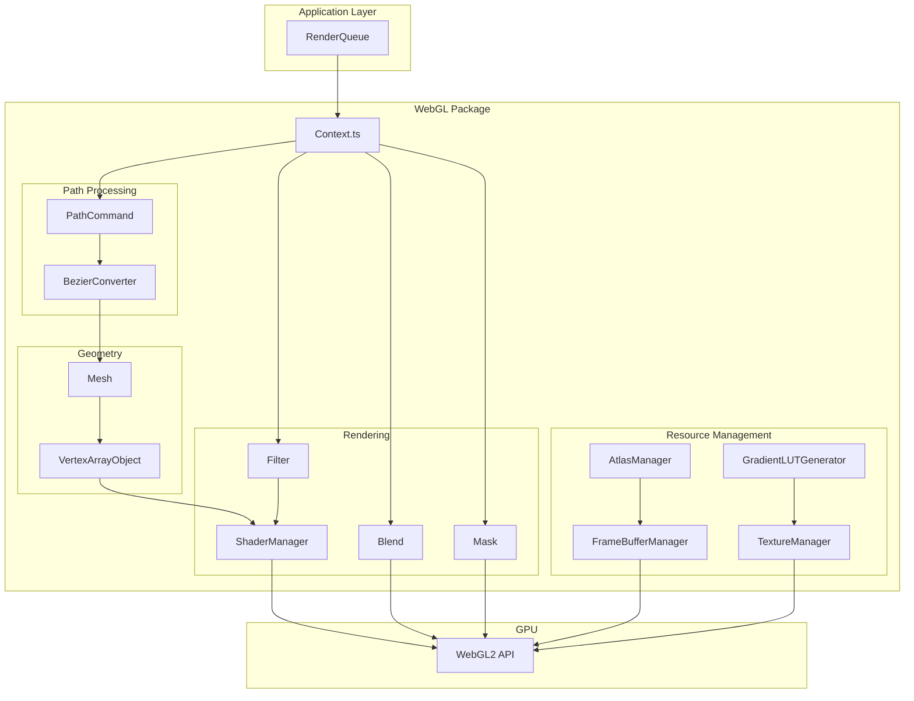
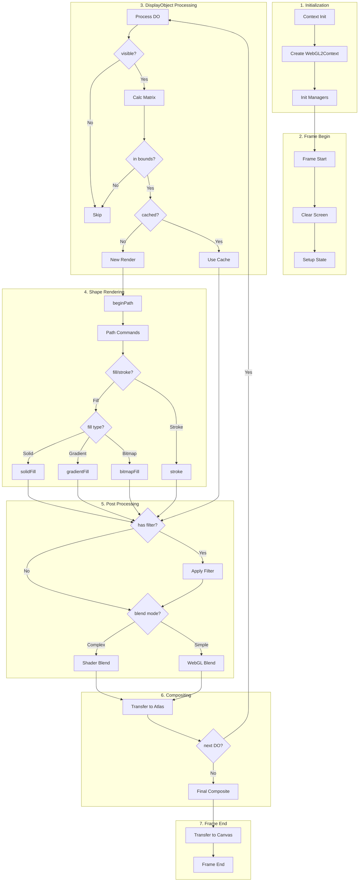

# 1. High-Level Architecture / アーキテクチャ

[← Back to Index](./README.md)

---

## System Overview / システム概要

---

# 2. Complete Rendering Pipeline / レンダリングパイプライン

## Main Rendering Flow / メインレンダリングフロー

---

[Next: Context State Management →](./02-context-state.md)
