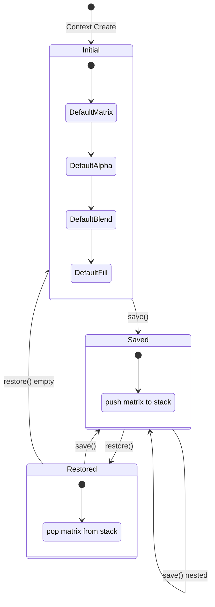
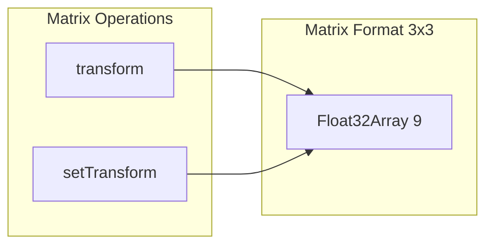
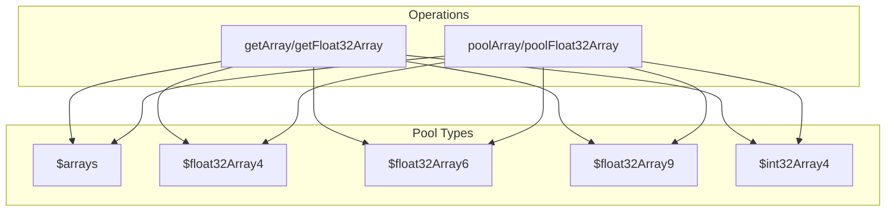

# 3. Context State Management / コンテキスト状態管理

[← Back to Index](./README.md) | [← Previous: Architecture](./01-architecture.md)

---

## State Stack / ステートスタック



---

## Context State Variables / コンテキスト状態変数

| Variable | Type | Description |
|----------|------|-------------|
| `$matrix` | `Float32Array[9]` | Current 3x3 transformation matrix |
| `$stack` | `Float32Array[]` | Save/restore matrix stack |
| `globalAlpha` | `number` | Global alpha value (0.0-1.0) |
| `globalCompositeOperation` | `IBlendMode` | Current blend mode |
| `$fillStyle` | `Float32Array[4]` | Current fill RGBA color |
| `$strokeStyle` | `Float32Array[4]` | Current stroke RGBA color |
| `imageSmoothingEnabled` | `boolean` | Texture smoothing flag |
| `$mainAttachmentObject` | `IAttachmentObject \| null` | Main attachment object |
| `$stackAttachmentObject` | `IAttachmentObject[]` | Attachment object stack |
| `maskBounds` | `IBounds` | Mask drawing bounds |
| `thickness` | `number` | Stroke thickness (default: 1) |
| `caps` | `number` | Stroke cap style (0=butt, 1=round, 2=square, default: 1) |
| `joints` | `number` | Stroke joint style (0=bevel, 1=round, 2=miter, default: 2) |
| `miterLimit` | `number` | Miter limit (default: 0) |
| `$clearColorR/G/B/A` | `number` | Background clear color |

---

## Transformation Matrix Operations / 変換行列操作



**Matrix Layout / 行列レイアウト:**
```
| m[0]  m[3]  m[6] |   | a  c  e |
| m[1]  m[4]  m[7] | = | b  d  f |
| m[2]  m[5]  m[8] |   | 0  0  1 |
```

---

## Global State Management (WebGLUtil.ts) / グローバル状態管理

| Variable | Type | Description |
|----------|------|-------------|
| `$RENDER_MAX_SIZE` | `number` | Maximum render size (default: 2048, max: 4096) |
| `$samples` | `number` | MSAA sample count (default: 4) |
| `$gl` | `WebGL2RenderingContext` | WebGL2 context |
| `$context` | `Context` | Context instance |
| `$devicePixelRatio` | `number` | Device pixel ratio (default: 1) |
| `$viewportWidth/Height` | `number` | Current viewport dimensions |

---

## Array Pooling System / 配列プーリングシステム



---

[Next: Path Command Processing →](./03-path-mesh.md)
