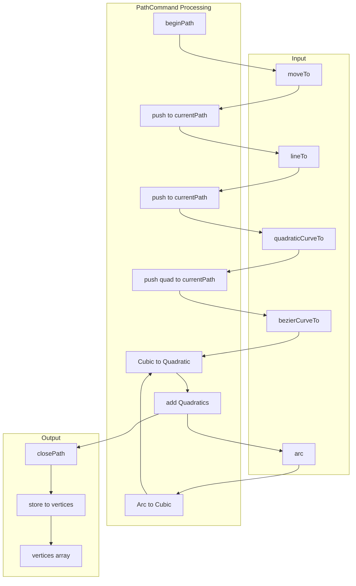
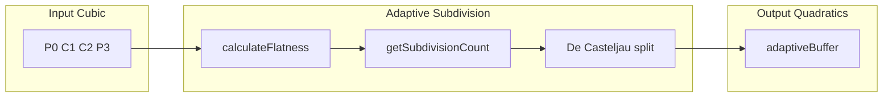
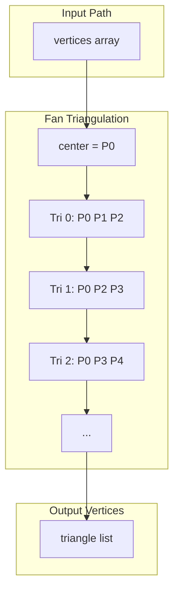
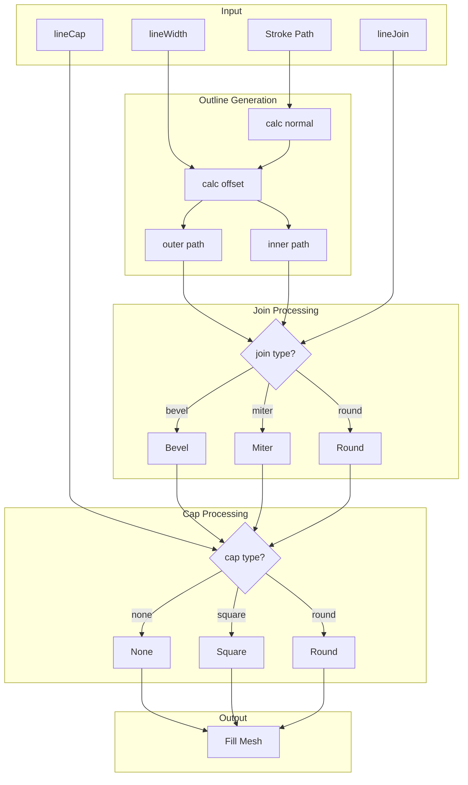

# 4. Path Command Processing / パスコマンド処理

[← Back to Index](./README.md) | [← Previous: Context State](./02-context-state.md)

---

## Path Data Structure / パスデータ構造

```typescript
// PathCommand.ts
export const $currentPath: IPath = [];     // 現在操作中のパス配列
export const $vertices: IPath[] = [];       // 完了したパス配列

// IPath = number[] (x, y, flag の triplets)
// flag: 0 = line point, 1 = quadratic control point
```

---

## Path Data Flow / パスデータフロー



---

## Adaptive Cubic to Quadratic Conversion / 適応的Cubic→Quadratic変換



**BezierConverter.ts Constants / 定数:**
```typescript
FLATNESS_THRESHOLD = 0.5     // 平坦度閾値
MIN_SUBDIVISIONS = 2         // 最小分割数
MAX_SUBDIVISIONS = 8         // 最大分割数

$bezierBuffer: Float32Array(32)    // 固定サイズバッファ
$adaptiveBuffer: Float32Array      // 動的サイズバッファ
$adaptiveSegmentCount: number      // 実際のセグメント数
```

**Algorithm / アルゴリズム:**
```
1. $calculateFlatness(p0, p1, p2, p3):
   - 制御点から直線P0-P3への最大距離を計算
   - ux = 3*p1 - 2*p0 - p3
   - uy = 3*p1y - 2*p0y - p3y
   - vx = 3*p2 - 2*p3 - p0
   - vy = 3*p2y - 2*p3y - p0y
   - return max(ux*ux + uy*uy, vx*vx + vy*vy)

2. $getAdaptiveSubdivisionCount():
   - if flatness < threshold² → MIN_SUBDIVISIONS
   - level = ceil(log2(sqrt(flatness)/threshold) / 2)
   - return clamp(level + MIN, MIN, MAX)

3. $ensureAdaptiveBufferSize(size):
   - バッファサイズ不足時に2倍のサイズで再確保
   - if $adaptiveBuffer.length < size → new Float32Array(size * 2)

4. $setAdaptiveSegmentCount(count):
   - 適応的テッセレーション結果のセグメント数を設定
```

---

# 5. Mesh Generation / メッシュ生成

## Fill Mesh - Fan Triangulation / フィルメッシュ - ファン三角形分割



---

## Vertex Data Layout (Fill) / 頂点データレイアウト (フィル)

```
Total: 68 bytes per vertex / 頂点あたり68バイト

┌─────────────────────────────────────────────────────────────────┐
│ Attribute      │ Type       │ Size   │ Offset │ Description    │
├─────────────────────────────────────────────────────────────────┤
│ a_vertex       │ vec2       │ 8B     │ 0      │ Position x,y   │
│ a_bezier       │ vec4       │ 16B    │ 8      │ Bezier control │
│ a_color        │ vec4       │ 16B    │ 24     │ RGBA color     │
│ a_matrix0      │ vec3       │ 12B    │ 40     │ Matrix row 0   │
│ a_matrix1      │ vec3       │ 12B    │ 52     │ Matrix row 1   │
│ a_matrix2      │ vec2       │ 8B     │ 64     │ tx, ty         │
└─────────────────────────────────────────────────────────────────┘

Stride = 72 bytes (aligned) / ストライド = 72バイト (アライン済み)
```

---

## Fill Buffer Management (Mesh.ts) / フィルバッファ管理

```typescript
// 動的フィルバッファプーリング
export let $fillBuffer: Float32Array = new Float32Array(128);  // 成長するバッファ
export let $fillBufferOffset: number = 0;                       // 現在のオフセット

export const $fillBufferIndexes: number[] = [];  // フィルごとの頂点数
export const $fillTypes: IFillType[] = [];       // フィルタイプ配列

// バッファ操作
$getFillBuffer(): Float32Array
$getFillBufferOffset(): number
$addFillBuffer(buffer: Float32Array): void
$clearFillBufferSetting(): void              // 新フレーム時にリセット
$upperPowerOfTwo(v: number): number          // 2のべき乗に切り上げ
```

---

## Stroke to Fill Conversion / ストロークからフィル変換



---

[Next: Fill & Stroke Operations →](./04-fill-stroke.md)
