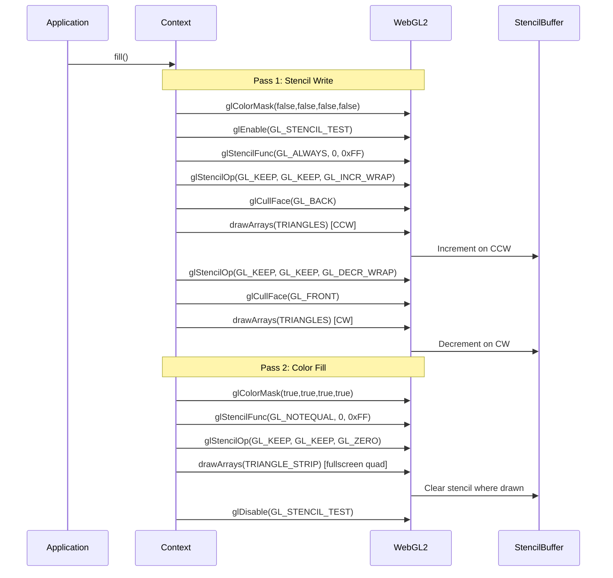
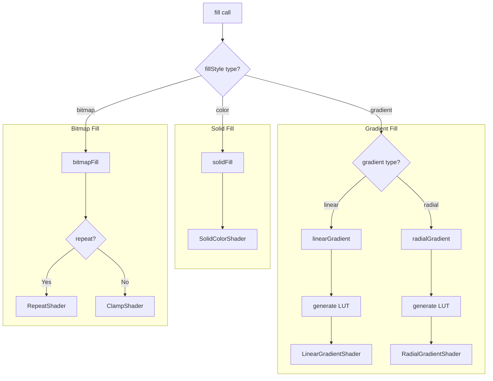
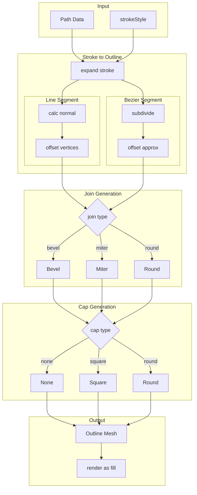

# 6. Fill Operations / フィル操作

[← Back to Index](./README.md) | [← Previous: Path & Mesh](./03-path-mesh.md)

---

## Two-Pass Stencil Fill / 2パスステンシルフィル

---

## Fill Type Decision Flow / フィルタイプ決定フロー

---

# 7. Stroke Operations / ストローク操作

## Stroke Processing Pipeline / ストローク処理パイプライン

---

[Next: Gradient System →](./05-gradient.md)
