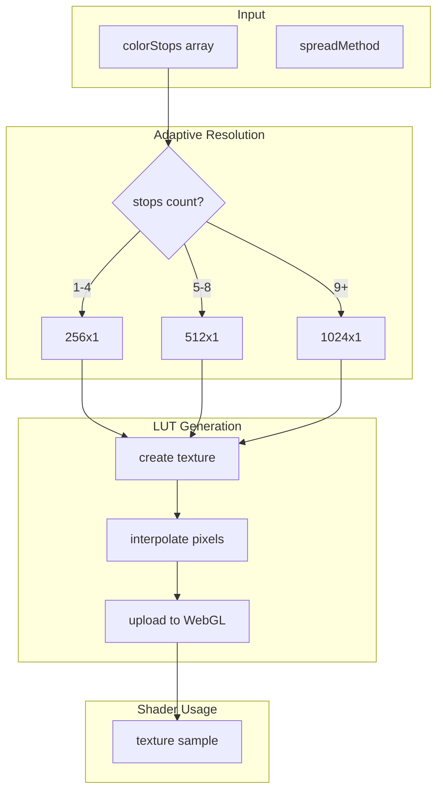
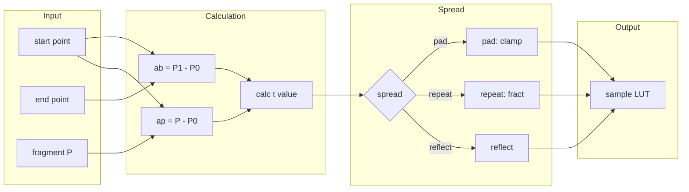
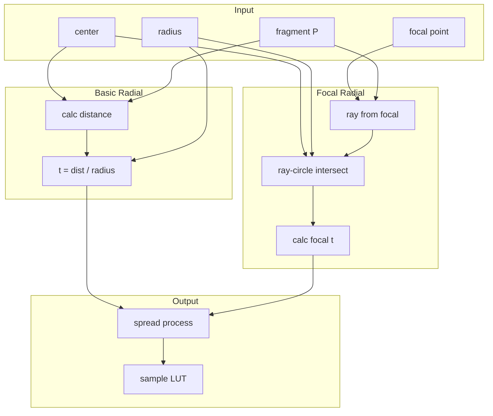

# 8. Gradient System / グラデーションシステム

[← Back to Index](./README.md) | [← Previous: Fill & Stroke](./04-fill-stroke.md)

---

## Gradient LUT Generation / グラデーションLUT生成



**GradientLUTGenerator.ts - Adaptive Resolution / 適応解像度:**
```typescript
$getAdaptiveResolution(stopsLength: number): number
  - stopsLength ≤ 4 → 256
  - stopsLength ≤ 8 → 512
  - stopsLength > 8 → 1024

// Color space conversion tables
$rgbToLinearTable: Float32Array(256)  // pow(t, 2.23333333)
$rgbIdentityTable: Float32Array(256)  // linear t
```

---

## Linear Gradient Calculation / 線形グラデーション計算



---

## Radial Gradient Calculation / 放射グラデーション計算



---

[Next: Blend Mode & Mask System →](./06-blend-mask.md)
