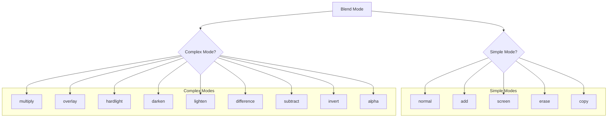
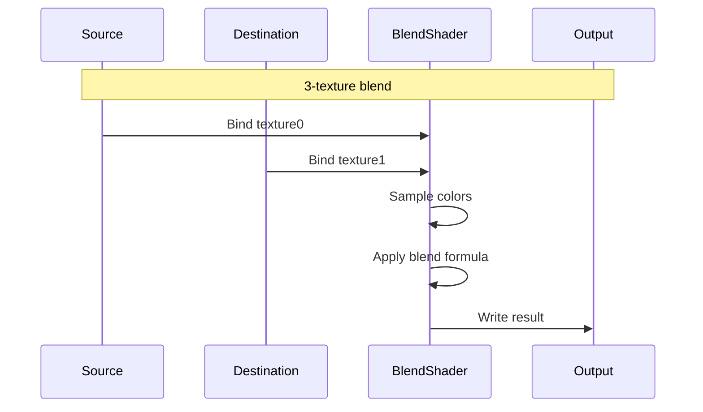
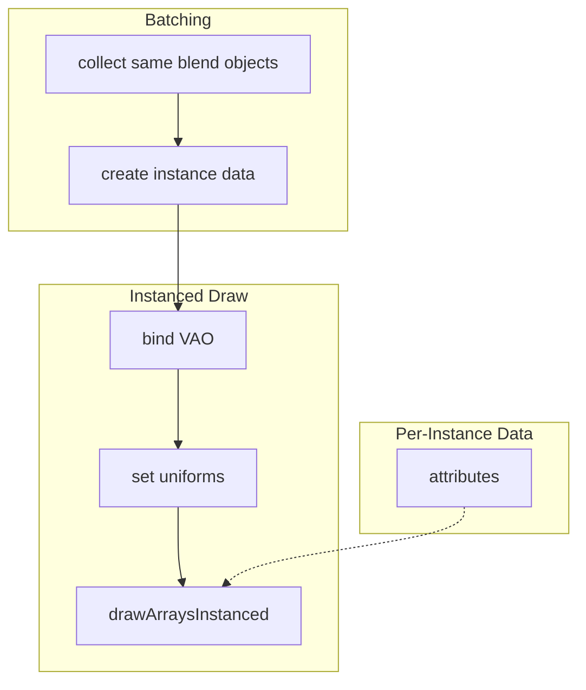
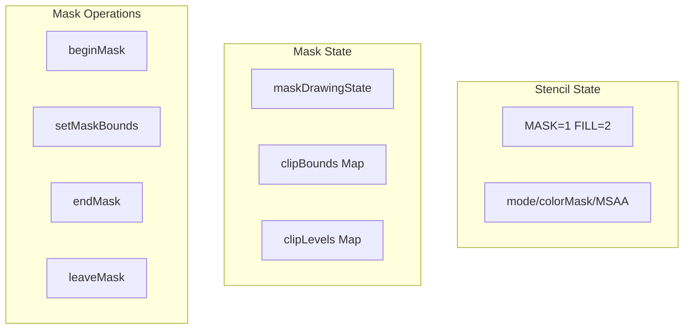
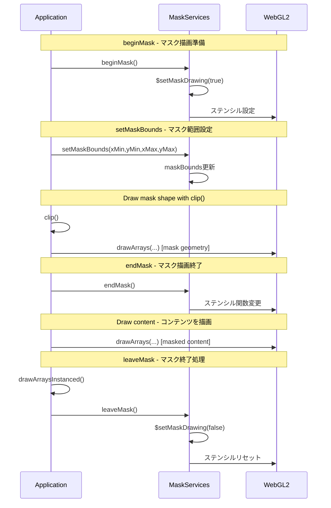
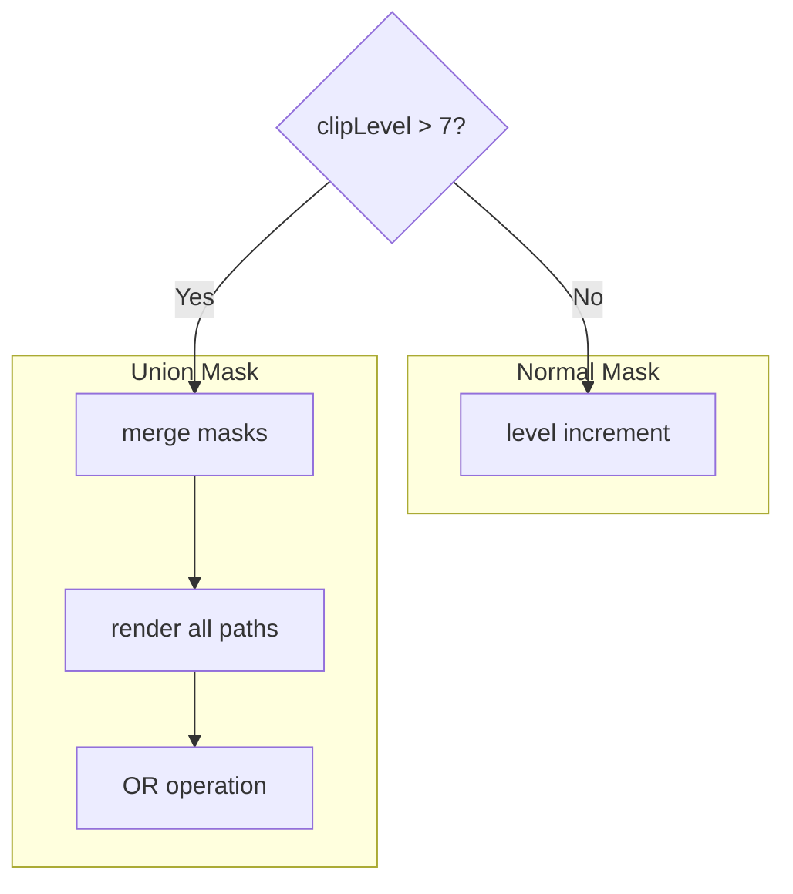

# 9. Blend Mode System / ブレンドモードシステム

[← Back to Index](./README.md) | [← Previous: Gradient](./05-gradient.md)

---

## Blend Mode Classification / ブレンドモード分類



**Simple Blend Functions:**
- normal: SRC_ALPHA, ONE_MINUS_SRC_ALPHA
- add: SRC_ALPHA, ONE
- screen: ONE, ONE_MINUS_SRC_COLOR
- erase: ZERO, ONE_MINUS_SRC_ALPHA
- copy: ONE, ZERO

---

## Complex Blend Mode Rendering / 複雑ブレンドモードレンダリング



**Complex Blend Formulas:**
- multiply: result = src * dst
- overlay: result = 2*src*dst (dark) or 1-2*(1-src)*(1-dst) (light)
- difference: result = abs(src - dst)

---

## Instanced Blend Rendering / インスタンスブレンドレンダリング



**Per-Instance Attributes:**
- a_rect: vec4 (x,y,w,h)
- a_size: vec2 (texW,texH)
- a_offset: vec2 (u,v offset)
- a_matrix: mat3 (transform)
- a_mul: vec4 (color multiply)
- a_add: vec4 (color add)

**Blend.ts State Functions / ブレンド状態関数:**
```typescript
$setCurrentBlendMode(blend_mode: IBlendMode): void
$getCurrentBlendMode(): IBlendMode

$setFuncCode(func_code: number): void    // default: 600
$getFuncCode(): number
```

---

# 10. Mask System / マスクシステム

## Stencil Mask Architecture / ステンシルマスクアーキテクチャ



**Stencil.ts State Functions / ステンシル状態関数:**
```typescript
// モード管理
$getStencilMode(): number
$setStencilMode(mode: number): void
$resetStencilMode(): void

// カラーマスク状態
$getColorMaskEnabled(): boolean
$setColorMaskEnabled(enabled: boolean): void

// MSAA SAMPLE_ALPHA_TO_COVERAGE状態
$getSampleAlphaToCoverageEnabled(): boolean
$setSampleAlphaToCoverageEnabled(enabled: boolean): void
```

**Mask.ts State Functions / マスク状態関数:**
```typescript
$setMaskDrawing(state: boolean): void
$isMaskDrawing(): boolean
$clipBounds: Map<number, Float32Array>  // レイヤーIDごとのクリップ境界
$clipLevels: Map<number, number>        // マスクネストレベル追跡
```

---

## Mask Begin/End Flow / マスク開始/終了フロー



---

## Union Mask (Level > 7) / ユニオンマスク (レベル > 7)



---

[Next: Filter System →](./07-filter.md)
