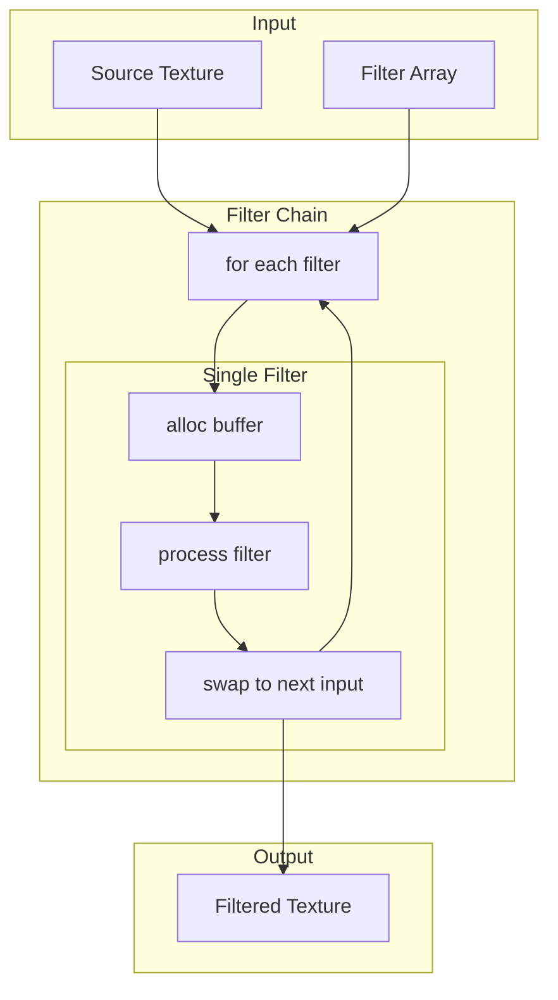
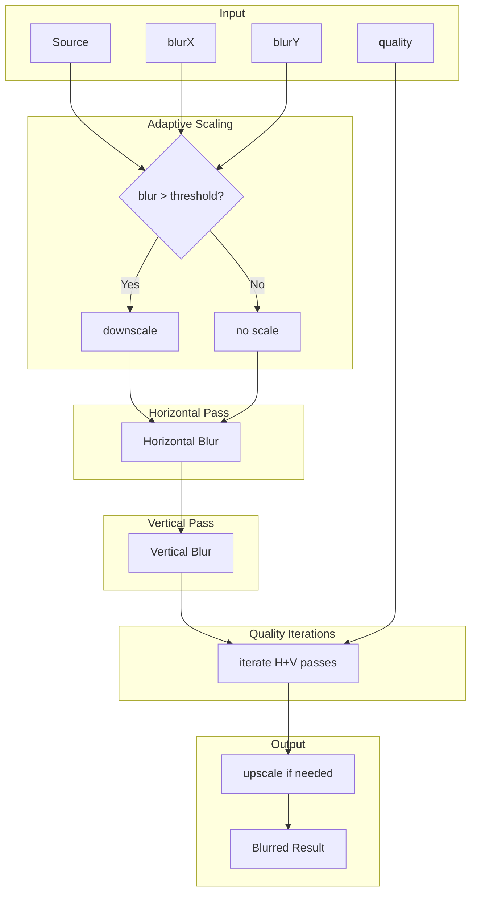
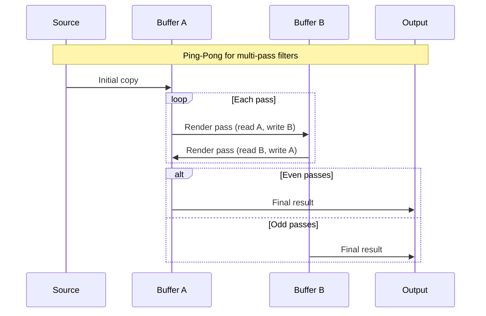

# 11. Filter System / フィルターシステム

[← Back to Index](./README.md) | [← Previous: Blend & Mask](./06-blend-mask.md)

---

## Filter Processing Overview / フィルター処理概要



---

## Blur Filter - Separable Gaussian / ブラーフィルター - 分離可能ガウシアン



---

## Filter Types and Parameters / フィルタータイプとパラメータ

| Filter | Parameters | Passes | Description |
|--------|------------|--------|-------------|
| **Blur** | blurX, blurY, quality | 2 × quality | Separable Gaussian blur |
| **Glow** | color, alpha, blurX, blurY, strength, quality, inner, knockout | 2 × quality + 1 | Blur + color overlay |
| **DropShadow** | distance, angle, color, alpha, blurX, blurY, strength, quality, inner, knockout, hideObject | 2 × quality + 2 | Offset blur + composite |
| **Bevel** | distance, angle, highlightColor, shadowColor, blurX, blurY, strength, quality, type, knockout | 2 × quality + 2 | Highlight/shadow emboss |
| **ColorMatrix** | matrix[20] | 1 | 4x5 color transformation |
| **Convolution** | matrixX, matrixY, matrix[], divisor, bias, preserveAlpha, clamp, color, alpha | 1 | Kernel convolution |
| **DisplacementMap** | mapTexture, mapPoint, componentX, componentY, scaleX, scaleY, mode, color, alpha | 1 | UV displacement |
| **GradientBevel** | distance, angle, colors[], alphas[], ratios[], blurX, blurY, strength, quality, type, knockout | 2 × quality + 2 | Gradient emboss |
| **GradientGlow** | distance, angle, colors[], alphas[], ratios[], blurX, blurY, strength, quality, type, knockout | 2 × quality + 2 | Gradient glow |
| **Bitmap** | - | 1 | Basic bitmap rendering |

---

## Filter Color Utilities (Filter.ts) / フィルターカラーユーティリティ

```typescript
// オフセット位置追跡
export const $offset: IPoint = { x: 0, y: 0 };

// カラー成分抽出（プリマルチプライドアルファ対応）
export const $intToR = (color: number, alpha: number, premultiplied: boolean): number
export const $intToG = (color: number, alpha: number, premultiplied: boolean): number
export const $intToB = (color: number, alpha: number, premultiplied: boolean): number
```

---

## DisplacementMap Component & Mode / ディスプレースメントマップコンポーネント＆モード

```typescript
// コンポーネントチャンネル選択
RED = 1, GREEN = 2, BLUE = 4, ALPHA = 8

// モードパラメータ
Mode 0: 直接テクスチャサンプリング
Mode 1: 代替色でクランプ
Mode 2: 小数UV折り返し
Mode 3: 軸ごとのフォールバック付きクランプ
```

---

## Ping-Pong Buffer Rendering / ピンポンバッファレンダリング



---

[Next: Shader System →](./08-shader.md)
