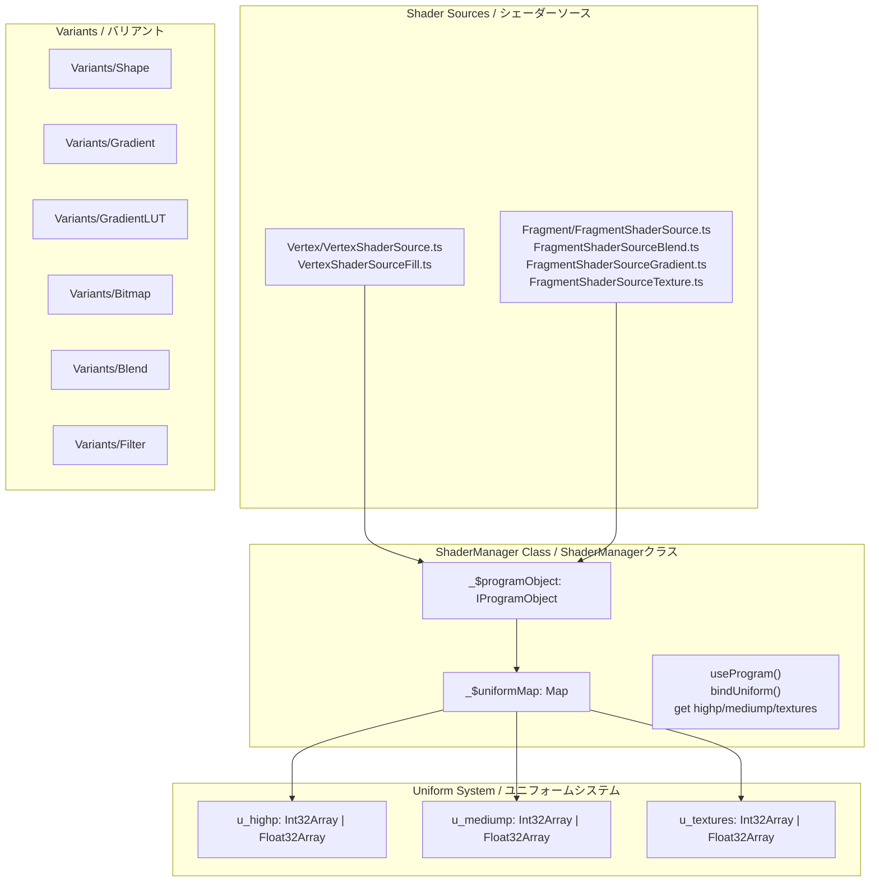
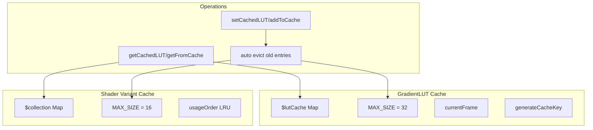
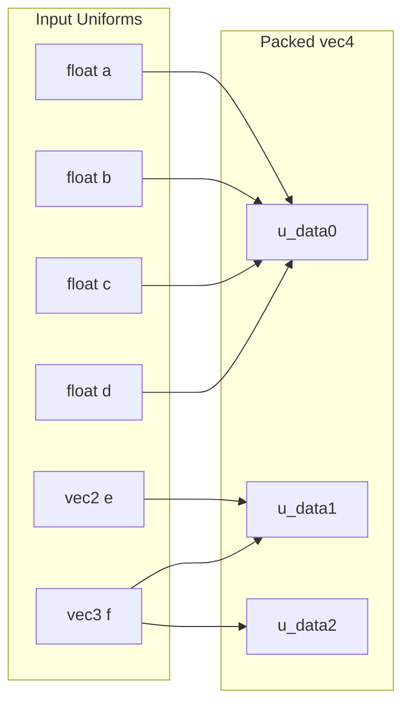

# 12. Shader System / シェーダーシステム

[← Back to Index](./README.md) | [← Previous: Filter](./07-filter.md)

---

## Shader Architecture / シェーダーアーキテクチャ



---

## ShaderManager Class / ShaderManagerクラス

```typescript
class ShaderManager {
    private readonly _$programObject: IProgramObject;
    private readonly _$uniformMap: Map<string, IUniformData>;

    constructor(vertex_source: string, fragment_source: string, atlas?: boolean);

    useProgram(): void;      // プログラムをアクティブ化
    bindUniform(): void;     // ユニフォーム変数をバインド

    get highp(): Int32Array | Float32Array;     // u_highp
    get mediump(): Int32Array | Float32Array;   // u_mediump
    get textures(): Int32Array | Float32Array;  // u_textures
}

// ShaderInstancedManager - インスタンス描画用拡張
class ShaderInstancedManager extends ShaderManager {
    // drawArraysInstanced用のcount管理
    // ShaderInstancedManagerDrawArraysInstancedUseCase.ts
}
```

---

## GradientLUT Generator / グラデーションLUTジェネレーター

```typescript
// GradientLUTGenerator.ts
$getAdaptiveResolution(stopsLength: number): number    // 256/512/1024
$getGradientAttachmentObjectWithResolution(resolution: number): IAttachmentObject
$getGradientAttachmentObject(): IAttachmentObject      // デフォルト512

$getGradientLUTGeneratorMaxLength(): number
$setGradientLUTGeneratorMaxLength(gl: WebGL2RenderingContext): void

// プリコンパイルされたカラーテーブル
$rgbToLinearTable: Float32Array(256)   // pow(t, 2.23333333)
$rgbIdentityTable: Float32Array(256)   // linear t

// GradientLUTGenerator usecases
GradientLUTGenerateFilterTextureUseCase  // フィルター用LUT生成
GradientLUTGenerateShapeTextureUseCase   // シェイプ用LUT生成
GradientLUTGeneratorFillTextureUseCase   // フィル用LUT生成
```

---

## Shader Directory Structure / シェーダーディレクトリ構成

```
Shader/
├── ShaderManager.ts              # メインシェーダー管理クラス
├── ShaderInstancedManager.ts     # インスタンス描画用
├── GradientLUTGenerator.ts       # グラデーションLUT生成
├── GradientLUTCache.ts           # LUTキャッシュ
│
├── ShaderManager/
│   ├── service/                  # 18 service files
│   │   ├── ShaderManagerCreateProgramService.ts
│   │   ├── ShaderManagerInitializeUniformService.ts
│   │   ├── ShaderManagerUseProgramService.ts
│   │   ├── ShaderManagerBindUniformService.ts
│   │   ├── ShaderManagerSetFillUniformService.ts
│   │   ├── ShaderManagerSetGradientFillUniformService.ts
│   │   ├── ShaderManagerSetBlendUniformService.ts
│   │   ├── ShaderManagerSetTextureUniformService.ts
│   │   ├── ShaderManagerSetBitmapFillUniformService.ts
│   │   ├── ShaderManagerSetMaskUniformService.ts
│   │   ├── ShaderManagerSetMatrixTextureUniformService.ts
│   │   ├── ShaderManagerSetMatrixTextureWithColorTransformUniformService.ts
│   │   ├── ShaderManagerSetBlendWithColorTransformUniformService.ts
│   │   ├── ShaderManagerSetBlurFilterUniformService.ts
│   │   ├── ShaderManagerSetColorMatrixFilterUniformService.ts
│   │   ├── ShaderManagerSetConvolutionFilterUniformService.ts
│   │   ├── ShaderManagerSetBitmapFilterUniformService.ts
│   │   └── ShaderManagerSetDisplacementMapFilterUniformService.ts
│   └── usecase/                  # 2 usecase files
│       ├── ShaderManagerDrawTextureUseCase.ts     # テクスチャ描画
│       └── ShaderManagerFillUseCase.ts            # フィル描画
│
├── ShaderInstancedManager/
│   └── usecase/                  # 1 usecase file
│       └── ShaderInstancedManagerDrawArraysInstancedUseCase.ts  # インスタンス描画
│
├── Fragment/                     # フラグメントシェーダー
│   ├── FragmentShaderSource.ts
│   ├── FragmentShaderSourceBlend.ts
│   ├── FragmentShaderSourceGradient.ts
│   ├── FragmentShaderSourceGradientLUT.ts
│   ├── FragmentShaderSourceTexture.ts
│   ├── FragmentShaderLibrary.ts
│   └── Filter/                   # フィルター用シェーダー（5 files）
│       ├── FragmentShaderSourceFilter.ts             # フィルタ基本シェーダー
│       ├── FragmentShaderSourceBlurFilter.ts         # ブラーフィルタ
│       ├── FragmentShaderSourceColorMatrixFilter.ts  # 色行列フィルタ
│       ├── FragmentShaderSourceConvolutionFilter.ts  # 畳み込みフィルタ
│       └── FragmentShaderSourceDisplacementMapFilter.ts  # 変位マップフィルタ
│
├── Vertex/                       # 頂点シェーダー
│   ├── VertexShaderSource.ts
│   ├── VertexShaderSourceFill.ts
│   └── VertexShaderLibrary.ts
│
└── Variants/                     # シェーダーバリアント
    ├── Shape/
    ├── Gradient/
    ├── GradientLUT/
    ├── Bitmap/
    ├── Blend/
    └── Filter/
```

---

## Shader Variant Collections / シェーダーバリアントコレクション

```typescript
// 各バリアントタイプのランタイムキャッシュ
ShapeVariants.$collection: Map<string, ShaderManager>
GradientVariants.$collection: Map<string, ShaderManager>
GradientLUTVariants.$collection: Map<string, ShaderManager>  // LRU: max 16
BitmapVariants.$collection: Map<string, ShaderManager>
BlendVariants.$collection: Map<string, ShaderManager | ShaderInstancedManager>
FilterVariants.$collection: Map<string, ShaderManager>
```

---

## Shader Variant Services / シェーダーバリアントサービス

```
Variants/
├── Shape/service/                    # 3 services
│   ├── VariantsShapeSolidColorShaderService.ts  # 単色シェーダー
│   ├── VariantsShapeRectShaderService.ts        # 矩形シェーダー
│   └── VariantsShapeMaskShaderService.ts        # マスクシェーダー
│
├── Gradient/                         # 1 service, 1 usecase
│   ├── service/VariantsGradientCreateCollectionKeyService.ts  # コレクションキー生成
│   └── usecase/VariantsGradientShapeShaderUseCase.ts          # グラデーションシェーダー取得
│
├── GradientLUT/service/              # 1 service
│   └── VariantsGradientLUTShaderService.ts      # LUTシェーダー
│
├── Bitmap/service/                   # 1 service
│   └── VariantsBitmapShaderService.ts           # ビットマップシェーダー
│
├── Blend/service/                    # 4 services
│   ├── VariantsBlendDrawShaderService.ts        # 描画シェーダー
│   ├── VariantsBlendInstanceShaderService.ts    # インスタンスシェーダー
│   ├── VariantsBlendMatrixTextureShaderService.ts  # 行列テクスチャシェーダー
│   └── VariantsBlendTextureShaderService.ts     # テクスチャシェーダー
│
└── Filter/service/                   # 5 services
    ├── VariantsBlurFilterShaderService.ts       # ブラーフィルタ
    ├── VariantsBitmapFilterShaderService.ts     # ビットマップフィルタ
    ├── VariantsColorMatrixFilterShaderService.ts  # 色行列フィルタ
    ├── VariantsConvolutionFilterShaderService.ts  # 畳み込みフィルタ
    └── VariantsDisplacementMapFilterShaderService.ts  # 変位マップフィルタ
```

---

## Shader Template Functions / シェーダーテンプレート関数

```typescript
// VertexShaderSource.ts - 頂点シェーダーバリアント
TEXTURE_TEMPLATE(): string
VECTOR_TEMPLATE(): string
BLEND_MATRIX_TEMPLATE(): string
BLEND_TEMPLATE(): string
INSTANCE_TEMPLATE(): string

// VertexShaderSourceFill.ts - フィル頂点シェーダー
FILL_TEMPLATE(with_bezier, with_matrix, with_uv, with_color): string
FILL_RECT_TEMPLATE(): string
ATTRIBUTE_BEZIER_ON/VARYING_BEZIER_ON/STATEMENT_BEZIER_ON(): string
ATTRIBUTE_MATRIX_ON/VARYING_UV_ON/STATEMENT_UV_ON(): string
ATTRIBUTE_COLOR_ON/VARYING_COLOR_ON/STATEMENT_COLOR_ON(): string

// FragmentShaderSource.ts - フラグメントシェーダーバリアント
SOLID_FILL_COLOR(): string
BITMAP_CLIPPED(): string
BITMAP_PATTERN(): string
MASK(): string
FILL_RECT_COLOR(): string

// FragmentShaderSourceTexture.ts
TEXTURE(with_color_transform: boolean): string
INSTANCE_TEXTURE(): string

// FragmentShaderSourceBlend.ts
BLEND_TEMPLATE(operation: string, with_color_transform: boolean): string

// FragmentShaderSourceGradient.ts
GRADIENT_TEMPLATE(gradient_type, with_focal_point, ...): string

// FragmentShaderSourceGradientLUT.ts
GRADIENT_LUT_TEMPLATE(mediump_length, ...): string

// FragmentShaderLibrary.ts - ユーティリティ
FUNCTION_IS_INSIDE(): string
STATEMENT_COLOR_TRANSFORM_ON(mediump_index): string

// VertexShaderLibrary.ts - グリッドヘルパー
FUNCTION_GRID_OFF(): string
FUNCTION_GRID_ON(index: number): string
```

---

## LRU Cache System / LRUキャッシュシステム



**Cache Implementation / キャッシュ実装:**
```typescript
// GradientLUTCache.ts - LUTテクスチャキャッシュ
interface IGradientLUTCacheEntry {
    texture: ITextureObject;
    lastUsed: number;           // フレーム番号
}
MAX_CACHE_SIZE = 32
$generateCacheKey(stops, interpolation): string  // 衝突防止のためbase36キー生成
$getCachedLUT(key): ITextureObject | null        // キャッシュから取得
$setCachedLUT(key, texture): void                // キャッシュに追加
$advanceFrame(): void                            // フレームカウンタ進行
$clearLUTCache(): void                           // キャッシュクリア
$getLUTCacheSize(): number                       // キャッシュサイズ取得

// GradientLUTVariants.ts - シェーダーバリアントキャッシュ
MAX_SHADER_CACHE_SIZE = 16
$addToCache(key, shader)        // LRU方式で追加
$getFromCache(key)              // 使用順序を更新して取得
```

---

## Uniform Packing / ユニフォームパッキング



**Packing Example:**
- u_data0 = vec4(a, b, c, d)
- u_data1 = vec4(e.x, e.y, f.x, f.y)
- u_data2 = vec4(f.z, 0, 0, 0)

---

## Vertex Shader Structure / 頂点シェーダー構造

```glsl
#version 300 es
precision highp float;

// Attributes
in vec2 a_vertex;      // Position
in vec4 a_bezier;      // Bezier control (optional)
in vec4 a_color;       // Vertex color
in vec3 a_matrix0;     // Transform row 0
in vec3 a_matrix1;     // Transform row 1
in vec2 a_matrix2;     // tx, ty

// Uniforms (packed as vec4)
uniform vec4 u_viewport;    // width, height, 1/width, 1/height
uniform vec4 u_transform;   // Additional transform

// Outputs
out vec4 v_color;
out vec2 v_uv;

void main() {
    // Apply transformation
    vec2 pos = a_vertex;
    pos = vec2(
        a_matrix0.x * pos.x + a_matrix0.y * pos.y + a_matrix0.z,
        a_matrix1.x * pos.x + a_matrix1.y * pos.y + a_matrix1.z
    );
    pos += a_matrix2;

    // Convert to clip space
    pos = pos * u_viewport.zw * 2.0 - 1.0;
    pos.y = -pos.y;

    gl_Position = vec4(pos, 0.0, 1.0);
    v_color = a_color;
}
```

---

## Fragment Shader Structure / フラグメントシェーダー構造

```glsl
#version 300 es
precision highp float;

// Inputs
in vec4 v_color;
in vec2 v_uv;

// Uniforms
uniform sampler2D u_texture;
uniform vec4 u_colorMul;    // Color multiply
uniform vec4 u_colorAdd;    // Color add

// Output
out vec4 fragColor;

void main() {
    vec4 color = texture(u_texture, v_uv);

    // Apply color transform
    color *= u_colorMul;
    color += u_colorAdd;

    // Premultiplied alpha
    color.rgb *= color.a;

    fragColor = color;
}
```

---

[Next: Resource Management →](./09-resources.md)
