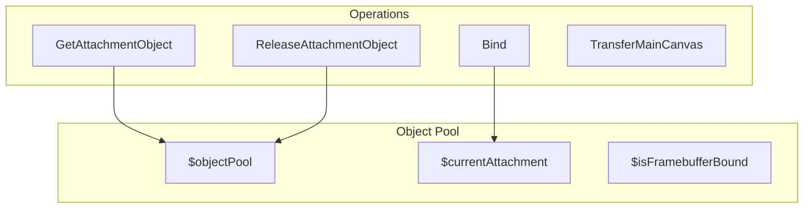
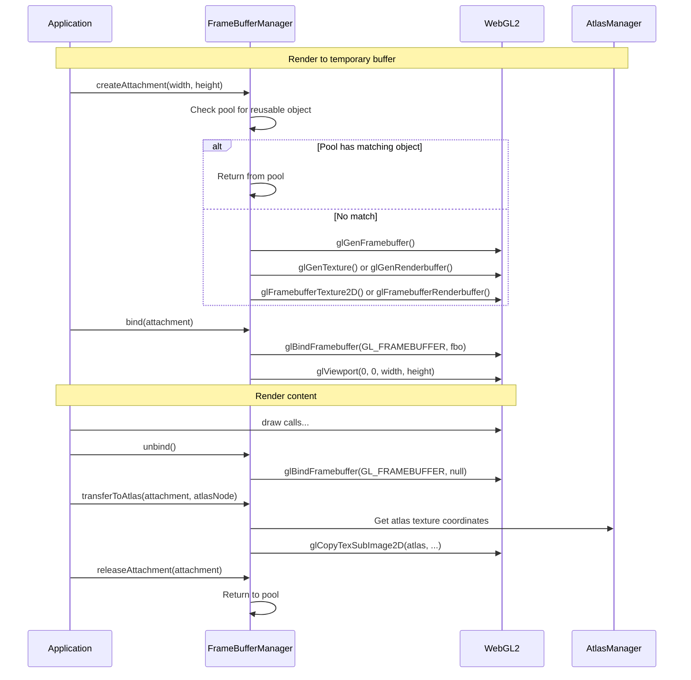
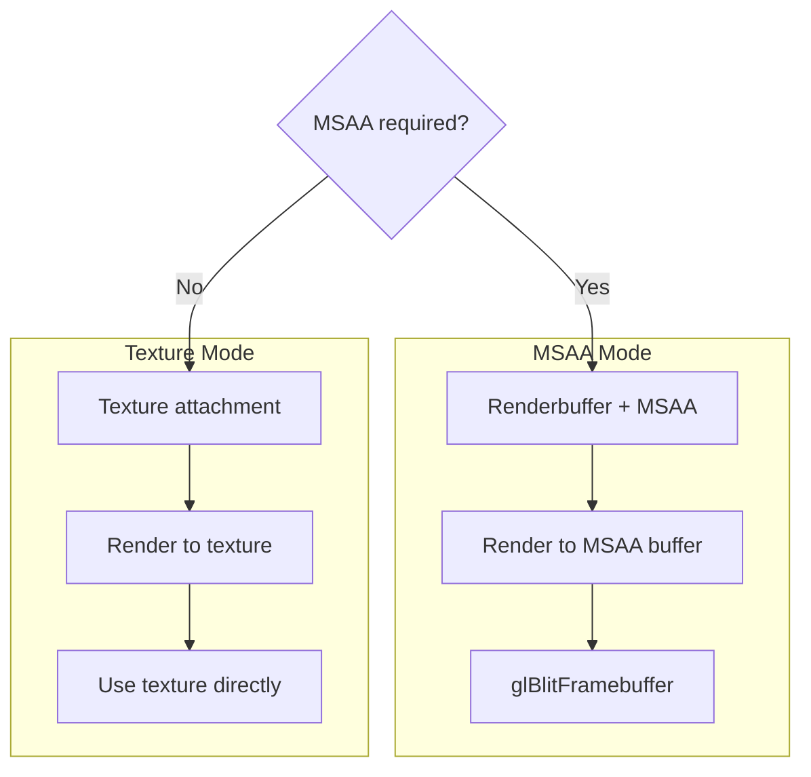
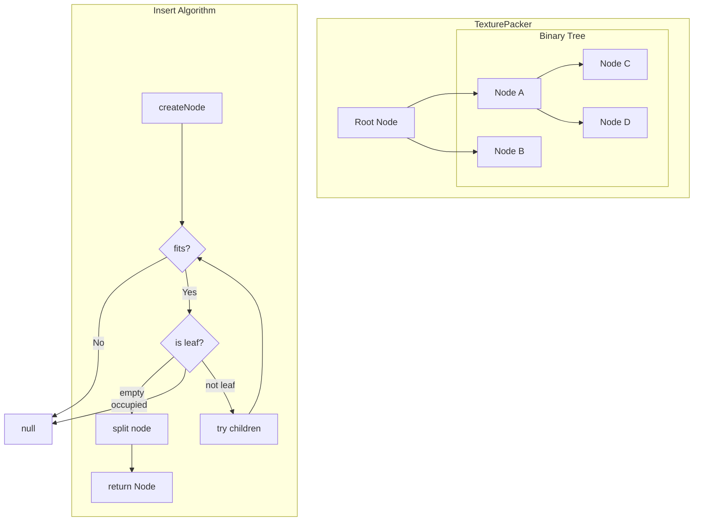
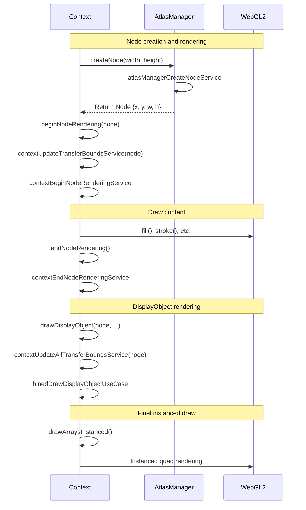
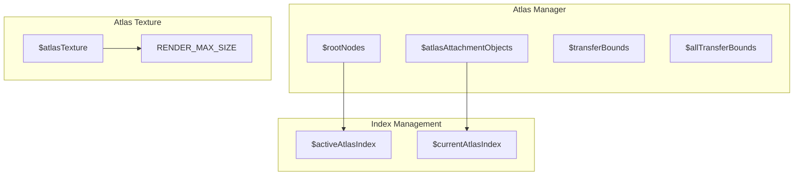
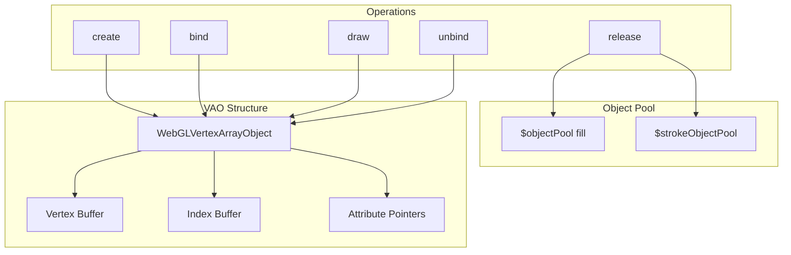
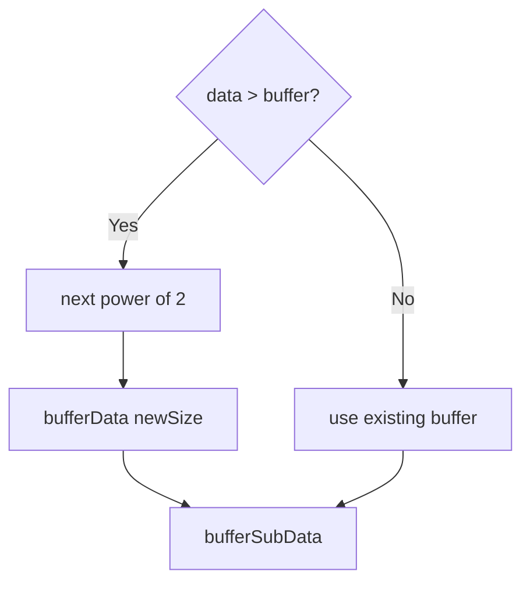

# 13. FrameBuffer Management / フレームバッファ管理

[← Back to Index](./README.md) | [← Previous: Shader](./08-shader.md)

---

## FrameBuffer Types / フレームバッファタイプ

```mermaid
flowchart TB
    subgraph "FrameBuffer Objects"
        READ[$readFrameBuffer]
        DRAW[$drawFrameBuffer]
        ATLAS[$atlasFrameBuffer]
        READ_BMP[$readBitmapFramebuffer]
        DRAW_BMP[$drawBitmapFramebuffer]
        PIXEL[$pixelFrameBuffer]
    end

    subgraph "PBO"
        PBO[$pixelBufferObject]
    end
```

**FrameBufferManager State Functions / フレームバッファ状態関数:**
```typescript
// フレームバッファオブジェクト
$readFrameBuffer: WebGLFramebuffer          // READ_FRAMEBUFFER専用
$drawFrameBuffer: WebGLFramebuffer | null   // DRAW_FRAMEBUFFER専用
$atlasFrameBuffer: WebGLFramebuffer | null  // アトラス専用
$objectPool: IAttachmentObject[]            // AttachmentObjectプール

// フレームバッファ初期化
$setReadFrameBuffer(gl: WebGL2RenderingContext): void
$setDrawFrameBuffer(gl: WebGL2RenderingContext): void
$setAtlasFrameBuffer(gl: WebGL2RenderingContext, texture_object: ITextureObject): void

// ビットマップ専用フレームバッファ
$setBitmapFrameBuffer(gl: WebGL2RenderingContext): void
$getReadBitmapFrameBuffer(): WebGLFramebuffer
$getDrawBitmapFrameBuffer(): WebGLFramebuffer

// PBO (Pixel Buffer Object) 操作
$getPixelFrameBuffer(): WebGLFramebuffer
$getPixelBufferObject(): WebGLBuffer

// アタッチメント状態管理
$setCurrentAttachment(attachment_object: IAttachmentObject | null): void
$getCurrentAttachment(): IAttachmentObject | null
$setFramebufferBound(state: boolean): void
$useFramebufferBound(): boolean
```

---

## Attachment Object Interface / アタッチメントオブジェクトインターフェース

```typescript
interface IAttachmentObject {
    id: number;                           // 一意のID
    width: number;                        // 幅
    height: number;                       // 高さ
    clipLevel: number;                    // クリップレベル
    msaa: boolean;                        // MSAAフラグ
    mask: boolean;                        // マスクフラグ
    color: IColorBufferObject | null;     // カラーバッファ
    texture: ITextureObject | null;       // テクスチャ
    stencil: IStencilBufferObject | null; // ステンシルバッファ
}
```

---

## Attachment Object Pool / アタッチメントオブジェクトプール



---

## ColorBufferObject Pool Management / カラーバッファプール管理

```typescript
// ColorBufferObject.ts
$objectPool: IColorBufferObject[]              // カラーバッファプール

// ColorBufferObject/service/
ColorBufferObjectCreateService                 // 新規カラーバッファ作成
ColorBufferObjectMeguruBinarySearchService     // 二分探索によるプール検索最適化

// ColorBufferObject/usecase/
ColorBufferObjectAcquireObjectUseCase          // width/heightマッチでプールから取得
ColorBufferObjectReleaseColorBufferObjectUseCase  // プールに返却
ColorBufferObjectGetColorBufferObjectUseCase   // 取得または新規作成
```

---

## StencilBufferObject Pool Management / ステンシルバッファプール管理

```typescript
// StencilBufferObject.ts
$objectPool: IStencilBufferObject[]            // ステンシルバッファプール

// StencilBufferObject/service/
StencilBufferObjectCreateService               // 新規ステンシルバッファ作成
StencilBufferObjectReleaseColorBufferObjectService  // プールに返却

// StencilBufferObject/usecase/
StencilBufferObjectAcquireObjectUseCase        // width/heightマッチでプールから取得
StencilBufferObjectGetStencilBufferObjectUseCase   // 取得または新規作成
```

---

## FrameBuffer Workflow / フレームバッファワークフロー



---

## MSAA vs Texture Mode / MSAA vs テクスチャモード



---

# 14. Atlas Management / アトラス管理

## Atlas Manager State / アトラスマネージャー状態

```typescript
// AtlasManager.ts - 状態変数
$activeAtlasIndex: number = 0;                          // アクティブなアトラスインデックス
$currentAtlasIndex: number = 0;                         // 現在のアトラスインデックス
$atlasAttachmentObjects: IAttachmentObject[] = [];      // アタッチメントオブジェクト配列
$rootNodes: TexturePacker[] = [];                       // ルートノード配列
$atlasTexture: ITextureObject | null = null;            // アトラステクスチャ
$transferBounds: Float32Array[] = [];                   // 転送範囲（ノード描画時）
$allTransferBounds: Float32Array[] = [];                // 全転送範囲（切り替え時）

// AtlasManager.ts - 状態関数
$setActiveAtlasIndex(index: number): void
$getActiveAtlasIndex(): number
$setCurrentAtlasIndex(index: number): void
$getCurrentAtlasIndex(): number

// 転送範囲管理
$getActiveTransferBounds(index: number): Float32Array
$getActiveAllTransferBounds(index: number): Float32Array
$clearTransferBounds(): void

// アタッチメント管理
$getAtlasAttachmentObjects(): IAttachmentObject[]
$setAtlasAttachmentObject(attachment_object: IAttachmentObject): void
$getAtlasAttachmentObject(): IAttachmentObject
$hasAtlasAttachmentObject(): boolean

// テクスチャ取得
$getAtlasTextureObject(): ITextureObject
```

---

## Binary Tree Packing Algorithm / バイナリツリーパッキングアルゴリズム



---

## Atlas Transfer Flow / アトラス転送フロー



---

## Multi-Atlas Management / マルチアトラス管理



---

## Transfer Bounds Management / 転送範囲管理

```typescript
// 転送範囲の初期値
const $MAX_VALUE = Number.MAX_VALUE;
const $MIN_VALUE = -Number.MAX_VALUE;

// 転送範囲の構造
$transferBounds[index] = new Float32Array([
    $MAX_VALUE,   // xMin
    $MAX_VALUE,   // yMin
    $MIN_VALUE,   // xMax
    $MIN_VALUE    // yMax
]);

// クリア処理 ($clearTransferBounds)
bounds[0] = bounds[1] = $MAX_VALUE;
bounds[2] = bounds[3] = $MIN_VALUE;
```

---

# 15. Vertex Array Object / 頂点配列オブジェクト

## VAO Management / VAO管理

**VertexArrayObject.ts Global Variables / グローバル変数:**
```typescript
$objectPool: IVertexArrayObject[]        // フィル用VAOプール
$strokeObjectPool: IStrokeVertexArrayObject[]  // ストローク用VAOプール
$vertexBufferData: Float32Array          // 頂点バッファデータ [0,0,0,1,1,0,1,1]
$attributeWebGLBuffer: WebGLBuffer       // インスタンス用WebGLBuffer
$instancedVertexArrayObject: IVertexArrayObject  // インスタンス用VAO

// Functions
$setAttributeWebGLBuffer(gl): void       // インスタンス用バッファ初期化
$setInstancedVertexArrayObject(vao): void  // インスタンス用VAOセット
$getRectVertexArrayObject(): IVertexArrayObject  // 矩形描画用VAO取得（遅延初期化）
```



---

## Instance Vertex Layout / インスタンス頂点レイアウト

```
Total: 88 bytes per instance / インスタンスあたり88バイト

┌─────────────────────────────────────────────────────────────────────┐
│ Attribute      │ Type       │ Size   │ Offset │ Divisor │ Desc     │
├─────────────────────────────────────────────────────────────────────┤
│ a_rect         │ vec4       │ 16B    │ 0      │ 1       │ x,y,w,h  │
│ a_size         │ vec2       │ 8B     │ 16     │ 1       │ tex size │
│ a_offset       │ vec2       │ 8B     │ 24     │ 1       │ uv offset│
│ a_matrix       │ mat3 (3xv3)│ 36B    │ 32     │ 1       │ transform│
│ a_mul          │ vec4       │ 16B    │ 68     │ 1       │ color mul│
│ a_add          │ vec4       │ 16B    │ 84     │ 1       │ color add│
└─────────────────────────────────────────────────────────────────────┘

Stride = 100 bytes (aligned to 4) / ストライド = 100バイト
```

---

## Buffer Growth Strategy / バッファ成長戦略



---

[Next: Data Structures →](./10-data-structures.md)
