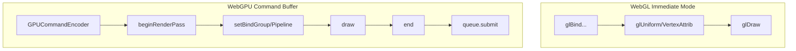

# 17. WebGPU Porting Notes / WebGPU移植メモ

[← Back to Index](./README.md) | [← Previous: Data Structures](./10-data-structures.md)

---

## API Mapping / API マッピング

| WebGL2 | WebGPU | Notes |
|--------|--------|-------|
| `WebGL2RenderingContext` | `GPUDevice` | Main API entry point |
| `WebGLProgram` | `GPURenderPipeline` | Shader + state |
| `WebGLShader` | `GPUShaderModule` | GLSL → WGSL |
| `WebGLBuffer` | `GPUBuffer` | Same concept |
| `WebGLTexture` | `GPUTexture` | Similar |
| `WebGLFramebuffer` | `GPURenderPassEncoder` | Different paradigm |
| `WebGLVertexArrayObject` | Implicit in pipeline | No direct equivalent |
| `glUniform*` | Bind groups | Completely different |
| `glDrawArrays` | `pass.draw()` | Similar |
| `glDrawArraysInstanced` | `pass.draw(vertexCount, instanceCount)` | Similar |

---

## Key Architectural Differences / 主なアーキテクチャの違い



---

## Shader Language Conversion / シェーダー言語変換

```
GLSL ES 300 → WGSL

// GLSL
#version 300 es
precision highp float;
in vec2 a_vertex;
uniform vec4 u_data;
out vec4 v_color;

void main() {
    gl_Position = vec4(a_vertex, 0.0, 1.0);
}

// WGSL
struct VertexInput {
    @location(0) vertex: vec2<f32>,
}

struct Uniforms {
    data: vec4<f32>,
}

@group(0) @binding(0) var<uniform> uniforms: Uniforms;

@vertex
fn main(input: VertexInput) -> @builtin(position) vec4<f32> {
    return vec4<f32>(input.vertex, 0.0, 1.0);
}
```

---

## Recommended Porting Strategy / 推奨移植戦略

### Phase 1: Infrastructure / インフラストラクチャ
- Create GPUDevice initialization
- Implement buffer management (GPUBuffer pools)
- Create texture/sampler management
- Build bind group system for uniforms

### Phase 2: Shader Conversion / シェーダー変換
- Convert vertex shaders to WGSL
- Convert fragment shaders to WGSL
- Build shader module caching
- Create render pipeline factory

### Phase 3: Rendering / レンダリング
- Implement fill operations with stencil
- Implement stroke (reuse mesh generation)
- Implement gradient rendering
- Implement bitmap rendering

### Phase 4: Advanced Features / 高度な機能
- Implement blend modes (custom pipelines)
- Implement filter system (compute shaders)
- Implement masking
- Implement atlas management

### Phase 5: Optimization / 最適化
- Implement instanced rendering
- Add batch coalescing
- Optimize bind group usage
- Profile and tune

---

## Critical Implementation Notes / 重要な実装メモ

1. **Stencil Operations**: WebGPU stencil works similarly, but configured via `GPURenderPipelineDescriptor.depthStencil`

2. **Blend Modes**: Simple modes map to `GPUBlendState`, complex modes need shader implementation

3. **Uniform Buffers**: WebGPU requires explicit alignment (16-byte for vec4), use `@size` and `@align` in WGSL

4. **Instanced Rendering**: WebGPU natively supports instancing, similar to WebGL2

5. **Command Encoding**: Batch commands before submission for optimal performance

6. **Resource Binding**: Use bind groups efficiently - group by update frequency

---

# Appendix A: Key Configuration / 付録A: 主要な設定値

## Constants & Limits / 定数と制限

| Category | Constant | Value | Description |
|----------|----------|-------|-------------|
| **Rendering** | `$RENDER_MAX_SIZE` | 2048 (max: 4096) | 最大レンダリングサイズ |
| **MSAA** | `$samples` | 4 | マルチサンプリング数 |
| **Blend** | `IBlendMode` | 15 types | ブレンドモード数 |
| **Stencil** | `STENCIL_MODE_MASK` | 1 | マスク描画モード |
| **Stencil** | `STENCIL_MODE_FILL` | 2 | フィル描画モード |
| **Bezier** | `FLATNESS_THRESHOLD` | 0.5 | 平坦度閾値 |
| **Bezier** | `MIN_SUBDIVISIONS` | 2 | 最小分割数 |
| **Bezier** | `MAX_SUBDIVISIONS` | 8 | 最大分割数 |
| **Gradient** | Adaptive Resolution | 256/512/1024 | ストップ数に応じた解像度 |
| **LUT Cache** | `MAX_CACHE_SIZE` | 32 | LUTテクスチャキャッシュ |
| **Shader Cache** | `MAX_SHADER_CACHE_SIZE` | 16 | シェーダーバリアントキャッシュ |
| **Texture** | Bound Slots | 3 | テクスチャスロット数 |
| **Filter** | Types | 10 | フィルター種類数 |

---

## Total Files Statistics / ファイル統計

| Category | Count | Description |
|----------|-------|-------------|
| Total TypeScript Files | ~393 | 全TSファイル数 |
| Interface Files | 20 | インターフェース定義 |
| Filter Types | 10 | フィルター種類 |
| Shader Variants | 6 | シェーダーバリアント |

---

# Appendix B: File References / 付録B: ファイル参照

## Main Files / メインファイル

| Component | Main File | Description |
|-----------|-----------|-------------|
| Context | `Context.ts` | メインコンテキストクラス (48 public methods) |
| WebGLUtil | `WebGLUtil.ts` | グローバル状態管理、配列プーリング |
| PathCommand | `PathCommand.ts` | パスデータ管理 ($currentPath, $vertices) |
| BezierConverter | `BezierConverter.ts` | 適応的ベジェ曲線テッセレーション |
| Mesh | `Mesh.ts` | メッシュ生成管理 |
| AtlasManager | `AtlasManager.ts` | アトラステクスチャ管理 |
| FrameBufferManager | `FrameBufferManager.ts` | フレームバッファプール管理 |
| Blend | `Blend.ts` | ブレンドモード管理 |
| Mask | `Mask.ts` | マスク状態管理 ($clipBounds, $clipLevels) |
| Stencil | `Stencil.ts` | ステンシル状態管理 |
| Filter | `Filter.ts` | フィルター管理 |
| VertexArrayObject | `VertexArrayObject.ts` | VAO管理 |
| TextureManager | `TextureManager.ts` | テクスチャリソース管理 |
| ColorBufferObject | `ColorBufferObject.ts` | カラーバッファ管理 |
| StencilBufferObject | `StencilBufferObject.ts` | ステンシルバッファ管理 |
| Bitmap | `Bitmap.ts` | ビットマップ描画管理 |
| Gradient | `Gradient.ts` | グラデーション管理 |
| Grid | `Grid.ts` | 9-slice グリッド管理 |

---

## Directory Structure / ディレクトリ構成

```
packages/webgl/src/
├── Context.ts                    # メインコンテキスト
├── WebGLUtil.ts                  # ユーティリティ
├── PathCommand.ts                # パス管理
├── BezierConverter.ts            # ベジェ変換
├── Mesh.ts                       # メッシュ管理
├── AtlasManager.ts               # アトラス管理
├── FrameBufferManager.ts         # FBO管理
├── Blend.ts                      # ブレンド管理
├── Mask.ts                       # マスク管理
├── Stencil.ts                    # ステンシル管理
├── Filter.ts                     # フィルター管理
├── VertexArrayObject.ts          # VAO管理
├── TextureManager.ts             # テクスチャ管理
├── ColorBufferObject.ts          # カラーバッファ
├── StencilBufferObject.ts        # ステンシルバッファ
├── Bitmap.ts                     # ビットマップ管理
├── Gradient.ts                   # グラデーション管理
├── Grid.ts                       # グリッド管理
│
├── Context/                      # Context services & usecases
├── Shader/                       # シェーダーシステム
├── Mesh/                         # メッシュ生成
├── AtlasManager/                 # アトラス管理
├── FrameBufferManager/           # FBO管理
├── Blend/                        # ブレンドモード
├── Mask/                         # マスク処理
├── Filter/                       # フィルター処理
├── VertexArrayObject/            # VAO管理
├── TextureManager/               # テクスチャ管理
├── ColorBufferObject/            # カラーバッファ
├── StencilBufferObject/          # ステンシルバッファ
└── interface/                    # インターフェース定義
```

---

[← Back to Index](./README.md)
