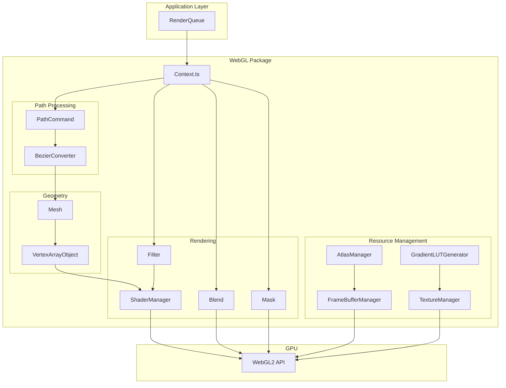

# WebGL Rendering Flow - Technical Documentation
# WebGL レンダリングフロー - 技術仕様書

This documentation provides a comprehensive analysis of the WebGL rendering pipeline for porting to WebGPU.

このドキュメントは、WebGPUへの移植のためのWebGLレンダリングパイプラインの包括的な分析を提供します。

---

## Table of Contents / 目次

| File | Contents | 内容 |
|------|----------|------|
| [01-architecture.md](./01-architecture.md) | High-Level Architecture & Rendering Pipeline | アーキテクチャ＆レンダリングパイプライン |
| [02-context-state.md](./02-context-state.md) | Context State Management | コンテキスト状態管理 |
| [03-path-mesh.md](./03-path-mesh.md) | Path Command Processing & Mesh Generation | パス処理＆メッシュ生成 |
| [04-fill-stroke.md](./04-fill-stroke.md) | Fill & Stroke Operations | フィル＆ストローク操作 |
| [05-gradient.md](./05-gradient.md) | Gradient System | グラデーションシステム |
| [06-blend-mask.md](./06-blend-mask.md) | Blend Mode & Mask System | ブレンドモード＆マスクシステム |
| [07-filter.md](./07-filter.md) | Filter System | フィルターシステム |
| [08-shader.md](./08-shader.md) | Shader System | シェーダーシステム |
| [09-resources.md](./09-resources.md) | FrameBuffer, Atlas & VAO Management | リソース管理 |
| [10-data-structures.md](./10-data-structures.md) | Data Structures & Interfaces | データ構造＆インターフェース |
| [11-webgpu-porting.md](./11-webgpu-porting.md) | WebGPU Porting Notes & Appendices | WebGPU移植メモ＆付録 |

---

## System Overview / システム概要

---

## Quick Reference / クイックリファレンス

### Main Files / メインファイル

| Component | File | Description |
|-----------|------|-------------|
| Context | `Context.ts` | メインコンテキストクラス |
| WebGLUtil | `WebGLUtil.ts` | グローバル状態管理 |
| PathCommand | `PathCommand.ts` | パスデータ管理 |
| BezierConverter | `BezierConverter.ts` | ベジェ曲線テッセレーション |
| Mesh | `Mesh.ts` | メッシュ生成 |
| AtlasManager | `AtlasManager.ts` | アトラステクスチャ管理 |
| FrameBufferManager | `FrameBufferManager.ts` | フレームバッファ管理 |

### Key Constants / 主要定数

| Constant | Value | Description |
|----------|-------|-------------|
| `$RENDER_MAX_SIZE` | 2048 (max: 4096) | 最大レンダリングサイズ |
| `$samples` | 4 | MSAAサンプリング数 |
| `FLATNESS_THRESHOLD` | 0.5 | ベジェ平坦度閾値 |
| `MAX_CACHE_SIZE` | 32 | LUTキャッシュサイズ |
| `MAX_SHADER_CACHE_SIZE` | 16 | シェーダーキャッシュサイズ |
