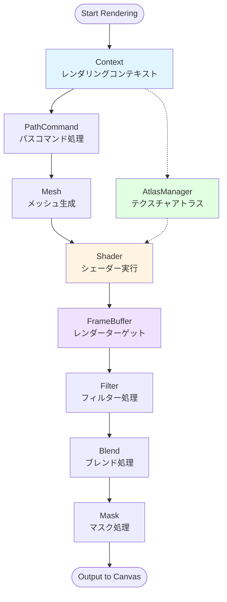

# @next2d/webgpu

WebGPU-based rendering engine for Next2D Player / Next2D Player用のWebGPUベースレンダリングエンジン

## Overview / 概要

The `@next2d/webgpu` package is a rendering backend for Next2D Player, providing a high-performance, shader-based drawing pipeline built on WebGPU. This package handles all graphics rendering operations including vector shapes, bitmaps, filters, and effects.

`@next2d/webgpu`パッケージは、Next2D Playerのレンダリングバックエンドであり、WebGPU上に構築された高性能なシェーダーベースの描画パイプラインを提供します。このパッケージは、ベクター図形、ビットマップ、フィルター、エフェクトなど、すべてのグラフィックスレンダリング操作を処理します。

### Key Features / 主な特徴

- **WebGPU-based rendering** - Hardware-accelerated graphics using modern WebGPU API / WebGPU APIを使用したハードウェアアクセラレーション
- **Shader-based pipeline** - Efficient WGSL shader processing for all rendering operations / すべてのレンダリング操作に対する効率的なWGSLシェーダー処理
- **Texture atlas management** - Optimized texture packing and management / 最適化されたテクスチャパッキングと管理
- **Advanced filters** - Full support for color matrix, blur, glow, displacement map and more / カラーマトリックス、ブラー、グロー、ディスプレースメントマップなどのフルサポート
- **Blend modes** - Multiple blend mode support with stencil operations / ステンシル操作による複数のブレンドモードサポート
- **Masking system** - Stencil buffer-based masking for complex clipping / 複雑なクリッピングのためのステンシルバッファベースのマスキング
- **Compute shaders** - GPU compute-based blur processing for high-performance filter effects / 高性能フィルターエフェクトのためのGPUコンピュートベースのブラー処理

## Installation / インストール

```bash
npm install @next2d/webgpu
```

## Directory Structure / ディレクトリ構造

```
src/
├── Context.ts                      # Main rendering context / メインレンダリングコンテキスト
├── Context/
│   ├── service/                    # Context services / コンテキストサービス
│   └── usecase/                    # Context use cases / コンテキストユースケース
├── AtlasManager.ts                 # Texture atlas management / テクスチャアトラス管理
├── FrameBufferManager.ts           # Render target management / レンダーターゲット管理
├── AttachmentManager.ts            # Color/stencil attachment management / カラー/ステンシルアタッチメント管理
├── BufferManager.ts                # Vertex/Uniform buffer management / 頂点/Uniformバッファ管理
├── TextureManager.ts               # Texture management / テクスチャ管理
├── TexturePool.ts                  # Temporary texture pooling / 一時テクスチャプーリング
├── FillTexturePool.ts              # Fill/gradient texture pooling / 塗り/グラデーションテクスチャプーリング
├── SamplerCache.ts                 # GPU sampler caching / GPUサンプラーキャッシュ
├── Blend.ts                        # Blend mode handling / ブレンドモード処理
├── Blend/
│   └── BlendInstancedManager.ts    # Blend instanced rendering / ブレンドインスタンスレンダリング
├── Mask.ts                         # Stencil-based masking / ステンシルベースのマスキング
├── Mesh/                           # Mesh generation / メッシュ生成
│   ├── service/                    # Mesh services / メッシュサービス
│   └── usecase/                    # Mesh use cases (fill, stroke, gradient stroke) / メッシュユースケース
├── PathCommand.ts                  # Path command processing / パスコマンド処理
├── Compute/                        # GPU compute shader execution / GPUコンピュートシェーダー実行
│   ├── ComputePipelineManager.ts   # Compute pipeline management / コンピュートパイプライン管理
│   └── ComputeExecuteBlurService.ts # Blur compute execution / ブラーコンピュート実行
├── Filter/                         # Filter implementations / フィルター実装
│   ├── FilterGradientLUTCache.ts   # Gradient LUT cache / グラデーションLUTキャッシュ
│   ├── FilterOffset.ts             # Filter offset calculation / フィルターオフセット計算
│   ├── BitmapFilterShader.ts       # Bitmap filter shader / ビットマップフィルターシェーダー
│   ├── BevelFilter/                # Bevel filter / ベベルフィルター
│   ├── BlurFilter/                 # Blur filter / ブラーフィルター
│   ├── ColorMatrixFilter/          # Color matrix filter / カラーマトリックスフィルター
│   ├── ConvolutionFilter/          # Convolution filter / コンボリューションフィルター
│   ├── DisplacementMapFilter/      # Displacement map filter / ディスプレースメントマップフィルター
│   ├── DropShadowFilter/           # Drop shadow filter / ドロップシャドウフィルター
│   ├── GlowFilter/                 # Glow filter / グローフィルター
│   ├── GradientBevelFilter/        # Gradient bevel filter / グラデーションベベルフィルター
│   └── GradientGlowFilter/         # Gradient glow filter / グラデーショングローフィルター
├── Gradient/
│   └── GradientLUTGenerator.ts     # Gradient LUT generation and caching / グラデーションLUT生成とキャッシュ
├── Shader/                         # WGSL shader system / WGSLシェーダーシステム
│   ├── PipelineManager.ts          # Render pipeline management / レンダーパイプライン管理
│   ├── ShaderSource.ts             # Shader source management / シェーダーソース管理
│   ├── ShaderInstancedManager.ts   # Instanced rendering manager / インスタンスレンダリング管理
│   ├── BlendModeShader.ts          # Blend mode shader definitions / ブレンドモードシェーダー定義
│   ├── GradientLUTGenerator/        # Gradient LUT generation / グラデーションLUT生成
│   │   ├── service/                # LUT generation services / LUT生成サービス
│   │   └── usecase/                # LUT generation use cases / LUT生成ユースケース
│   └── wgsl/                       # WGSL shader sources / WGSLシェーダーソース
│       ├── vertex/                 # Vertex shaders / バーテックスシェーダー
│       ├── fragment/               # Fragment shaders / フラグメントシェーダー
│       └── common/                 # Shared WGSL utilities / 共有WGSLユーティリティ
├── Grid.ts                         # Grid system for rendering / レンダリング用グリッドシステム
├── BezierConverter/                # Bezier curve conversion / ベジェ曲線変換
│   ├── BezierConverter.ts          # Main class / メインクラス
│   ├── service/                    # BezierConverter services / サービス
│   └── usecase/                    # BezierConverter use cases / ユースケース
├── TexturePool/                    # Temporary texture pooling services / 一時テクスチャプーリングサービス
│   ├── service/                    # TexturePool services / サービス
│   └── usecase/                    # TexturePool use cases / ユースケース
├── WebGPUUtil.ts                   # WebGPU utility functions / WebGPUユーティリティ関数
└── interface/                      # TypeScript interfaces / TypeScript インターフェース
```

## Rendering Pipeline / レンダリングパイプライン

The WebGPU package implements a sophisticated rendering pipeline that processes graphics commands through multiple stages:

WebGPUパッケージは、複数のステージを通じてグラフィックスコマンドを処理する洗練されたレンダリングパイプラインを実装しています:



### Pipeline Stages / パイプラインステージ

1. **Context**: Main rendering context that manages the WebGPU state and coordinates all rendering operations
   - **コンテキスト**: WebGPU状態を管理し、すべてのレンダリング操作を調整するメインレンダリングコンテキスト

2. **PathCommand**: Processes vector path commands (moveTo, lineTo, curveTo, etc.) into renderable primitives
   - **パスコマンド**: ベクターパスコマンド（moveTo、lineTo、curveToなど）をレンダリング可能なプリミティブに処理

3. **Mesh**: Generates triangle meshes from path data for fills and strokes
   - **メッシュ**: 塗りと線のパスデータから三角形メッシュを生成

4. **Shader**: Executes WGSL shaders to render meshes with appropriate materials and effects
   - **シェーダー**: 適切なマテリアルとエフェクトでメッシュをレンダリングするWGSLシェーダーを実行

5. **FrameBuffer**: Manages render targets and intermediate rendering buffers
   - **フレームバッファ**: レンダーターゲットと中間レンダリングバッファを管理

6. **AtlasManager**: Optimizes texture usage through texture atlas packing
   - **アトラスマネージャー**: テクスチャアトラスパッキングによりテクスチャ使用を最適化

7. **Filter**: Applies post-processing effects (blur, glow, color matrix, etc.)
   - **フィルター**: ポストプロセスエフェクト（ブラー、グロー、カラーマトリックスなど）を適用

8. **Blend**: Handles blend mode operations for compositing
   - **ブレンド**: 合成のためのブレンドモード操作を処理

9. **Mask**: Implements stencil-based masking for clipping and complex shapes
   - **マスク**: クリッピングと複雑な形状のためのステンシルベースのマスキングを実装

## Atlas-Based Rendering Approach / アトラスベースのレンダリングアプローチ

The WebGPU package uses a texture atlas system to optimize rendering performance:

WebGPUパッケージは、レンダリングパフォーマンスを最適化するためにテクスチャアトラスシステムを使用しています:

### Benefits / 利点

- **Reduced draw calls**: Multiple textures are packed into a single atlas, reducing the number of texture bindings
  - **描画コールの削減**: 複数のテクスチャが単一のアトラスにパックされ、テクスチャバインディングの数が削減されます

- **Memory efficiency**: Optimal packing algorithm minimizes wasted GPU memory
  - **メモリ効率**: 最適なパッキングアルゴリズムにより、無駄なGPUメモリが最小化されます

- **Cache coherency**: Better GPU cache utilization through spatial locality
  - **キャッシュコヒーレンシー**: 空間的局所性による優れたGPUキャッシュ利用

### Atlas Management / アトラス管理

The `AtlasManager` component uses the `@next2d/texture-packer` package to:

`AtlasManager`コンポーネントは`@next2d/texture-packer`パッケージを使用して以下を実行します:

- Dynamically pack textures into optimal atlas layouts
  - テクスチャを最適なアトラスレイアウトに動的にパック
- Track texture usage and automatically manage atlas allocation
  - テクスチャ使用状況を追跡し、アトラス割り当てを自動管理
- Support multiple atlas instances when texture requirements exceed single atlas capacity
  - テクスチャ要件が単一のアトラス容量を超える場合、複数のアトラスインスタンスをサポート

### Rendering with Atlases / アトラスを使用したレンダリング

1. Textures are uploaded to GPU and registered with the atlas manager
   - テクスチャがGPUにアップロードされ、アトラスマネージャーに登録されます

2. The atlas manager assigns UV coordinates for each texture region
   - アトラスマネージャーが各テクスチャ領域のUV座標を割り当てます

3. Shaders use these UV coordinates to sample from the correct atlas region
   - シェーダーがこれらのUV座標を使用して正しいアトラス領域からサンプリングします

4. Multiple objects can be rendered in a single draw call using the same atlas
   - 同じアトラスを使用して複数のオブジェクトを単一の描画コールでレンダリング可能

## Architecture Patterns / アーキテクチャパターン

The codebase follows a clean architecture approach with clear separation of concerns:

コードベースは、関心事の明確な分離を伴うクリーンアーキテクチャアプローチに従っています:

### Service Layer / サービス層

Services contain low-level operations and business logic. They are pure functions that perform specific tasks.

サービスは低レベルの操作とビジネスロジックを含みます。特定のタスクを実行する純粋な関数です。

### Use Case Layer / ユースケース層

Use cases orchestrate multiple services to accomplish higher-level operations. They represent application-specific business rules.

ユースケースは、より高レベルの操作を達成するために複数のサービスを調整します。アプリケーション固有のビジネスルールを表します。

## Dependencies / 依存関係

- `@next2d/texture-packer`: Texture atlas packing and management / テクスチャアトラスのパッキングと管理
- `@next2d/render-queue`: Rendering operation queue management / レンダリング操作キュー管理

## License / ライセンス

This project is licensed under the [MIT License](https://opensource.org/licenses/MIT) - see the [LICENSE](LICENSE) file for details.

このプロジェクトは[MITライセンス](https://opensource.org/licenses/MIT)の下でライセンスされています - 詳細は[LICENSE](LICENSE)ファイルを参照してください。
