# WebGPU Rendering Flow - Technical Specification
# WebGPU レンダリングフロー - 技術仕様書

This document describes the WebGPU rendering pipeline implementation, based on the WebGL version.

このドキュメントは、WebGL版を基にしたWebGPUレンダリングパイプラインの実装を説明します。

---

## Table of Contents / 目次

1. [High-Level Architecture](#1-high-level-architecture)
2. [WebGL to WebGPU Key Differences](#2-webgl-to-webgpu-key-differences)
3. [Rendering Pipeline](#3-rendering-pipeline)
4. [Context and State Management](#4-context-and-state-management)
5. [Path Command Processing](#5-path-command-processing)
6. [Mesh Generation with Loop-Blinn](#6-mesh-generation-with-loop-blinn)
7. [Shader System](#7-shader-system)
8. [Resource Management](#8-resource-management)
9. [Instanced Rendering](#9-instanced-rendering)
10. [Mask System](#10-mask-system)
11. [Blend Mode System](#11-blend-mode-system)
12. [Data Structures](#12-data-structures)

---

## 1. High-Level Architecture

### System Overview / システム概要

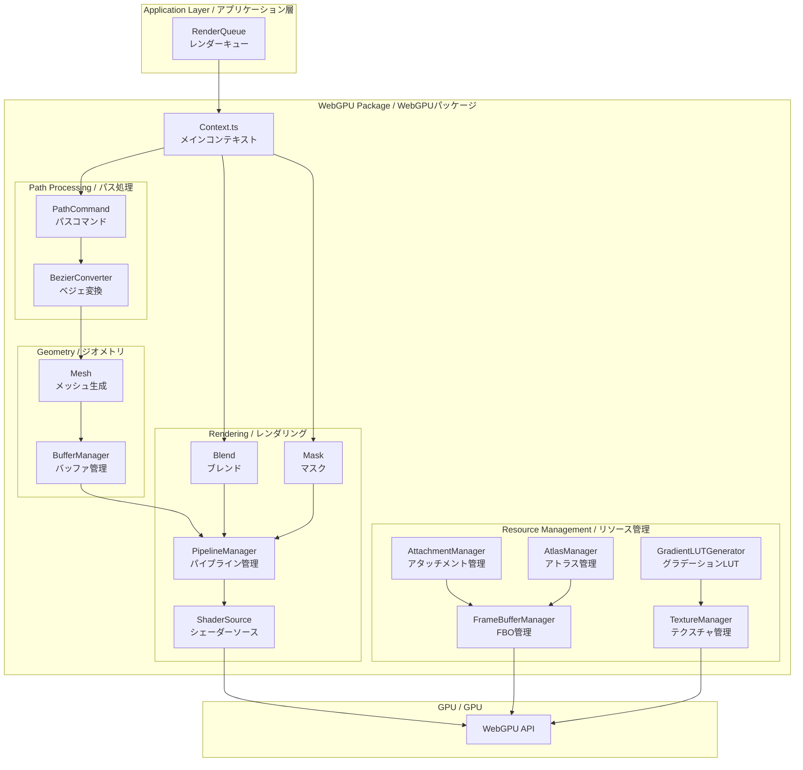

---

## 2. WebGL to WebGPU Key Differences

### API Differences / API差分

| Feature | WebGL2 | WebGPU |
|---------|--------|--------|
| Context Creation | `getContext('webgl2')` | `navigator.gpu.requestAdapter()` |
| State Management | Global mutable state | Immutable pipeline state |
| Shaders | GLSL ES 3.0 | WGSL |
| Buffer Binding | `gl.bindBuffer()` | BindGroup + Pipeline |
| Texture Binding | `gl.activeTexture()` + `gl.bindTexture()` | BindGroup |
| Draw Calls | `gl.drawArrays()` | `renderPass.draw()` |
| Frame Buffer | FBO with attachments | GPUTexture + RenderPassDescriptor |
| Blend State | `gl.blendFunc()` | Pipeline blend state |
| Stencil State | `gl.stencilFunc()` | Pipeline stencil state |

### Architecture Changes / アーキテクチャ変更

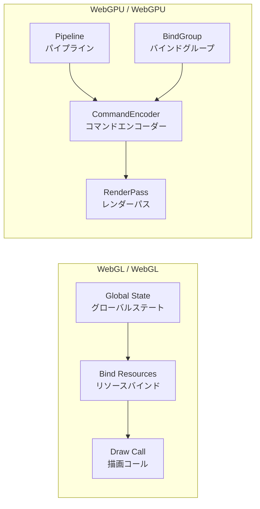

---

## 3. Rendering Pipeline

### Main Rendering Flow / メインレンダリングフロー

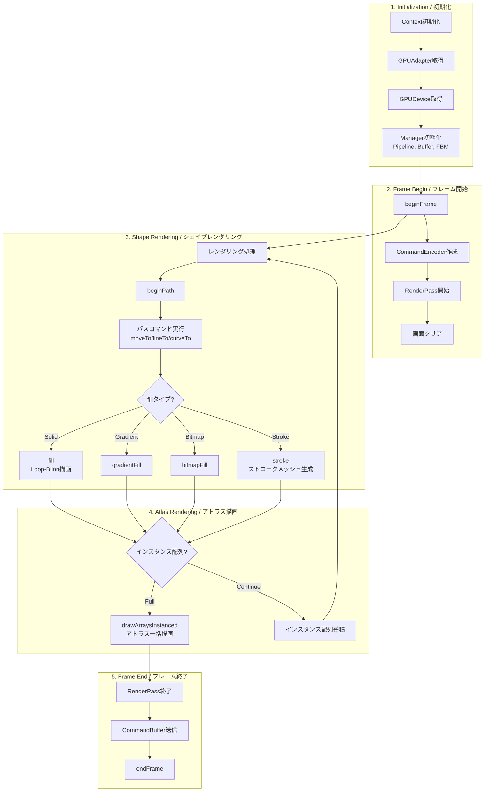

---

## 4. Context and State Management

### State Stack / ステートスタック

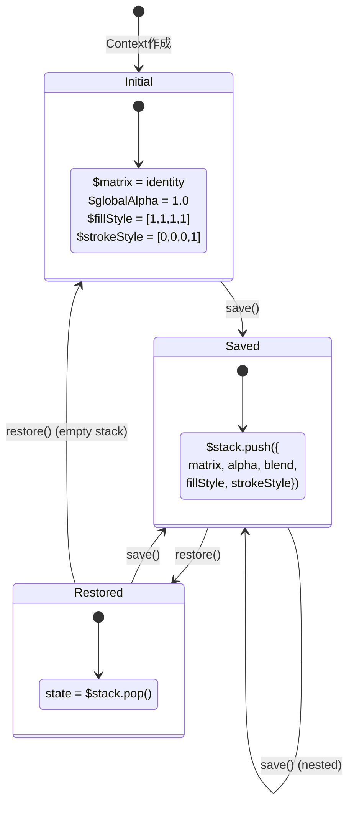

### Context State Variables / コンテキスト状態変数

| Variable | Type | Description |
|----------|------|-------------|
| `$matrix` | `Float32Array[9]` | Current 3x3 transformation matrix |
| `$stack` | `Array<CanvasState>` | Save/restore state stack |
| `$globalAlpha` | `number` | Global alpha value (0.0-1.0) |
| `$fillStyle` | `Float32Array[4]` | Current fill color (RGBA) |
| `$strokeStyle` | `Float32Array[4]` | Current stroke color (RGBA) |
| `thickness` | `number` | Current stroke width |

---

## 5. Path Command Processing

### Path Data Flow / パスデータフロー

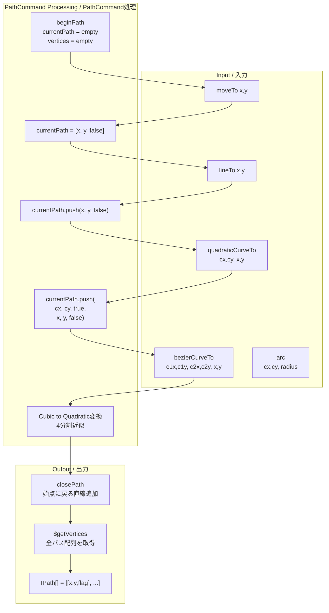

### Path Format / パスフォーマット

```
IPath = [x, y, isControlPoint, x, y, isControlPoint, ...]

isControlPoint:
  - false: 通常の頂点または終点 (lineTo endpoint)
  - true:  二次ベジェ曲線の制御点 (quadratic control point)

Example - Rectangle:
  [0, 0, false,  100, 0, false,  100, 100, false,  0, 100, false]

Example - Quadratic curve:
  [0, 0, false,  50, -50, true,  100, 0, false]
```

---

## 6. Mesh Generation with Loop-Blinn

### Loop-Blinn Method Overview / Loop-Blinn法概要

GPU Gems 3 Chapter 25に基づく二次ベジェ曲線のGPUアンチエイリアシング実装。

Reference: https://developer.nvidia.com/gpugems/gpugems3/part-iv-image-effects/chapter-25-rendering-vector-art-gpu

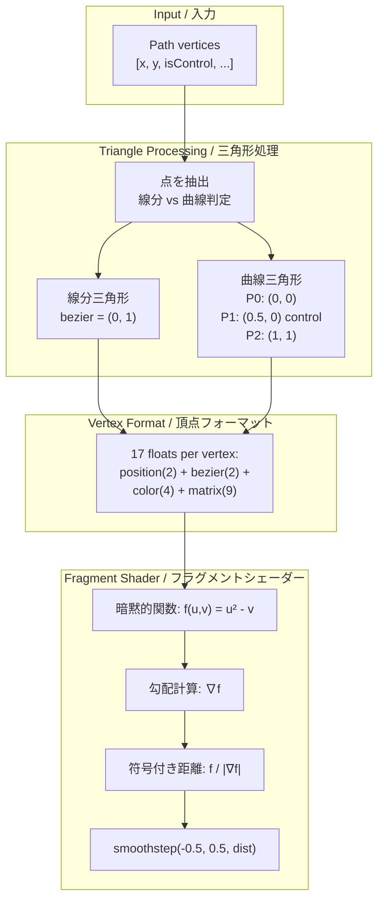

### Bezier Coordinate Assignment / ベジェ座標割り当て

```
Triangle for linear segment:
  P0: bezier = (0, 1)  // Always inside
  P1: bezier = (0, 1)  // Always inside
  P2: bezier = (0, 1)  // Always inside

Triangle for quadratic curve (P0 → Control → P2):
  P0 (start):   bezier = (0, 0)    // f = 0² - 0 = 0 (on curve)
  P1 (control): bezier = (0.5, 0)  // f = 0.25 - 0 = 0.25 (outside)
  P2 (end):     bezier = (1, 1)    // f = 1² - 1 = 0 (on curve)
```

### Vertex Data Layout (17 floats) / 頂点データレイアウト

```
Total: 68 bytes per vertex / 頂点あたり68バイト

┌─────────────────────────────────────────────────────────────────┐
│ Attribute    │ Location │ Type    │ Count │ Description         │
├─────────────────────────────────────────────────────────────────┤
│ position     │ 0        │ float32 │ 2     │ Position x, y       │
│ bezier       │ 1        │ float32 │ 2     │ Bezier u, v coords  │
│ color        │ 2        │ float32 │ 4     │ RGBA (premultiplied)│
│ matrix0      │ 3        │ float32 │ 3     │ Matrix column 0     │
│ matrix1      │ 4        │ float32 │ 3     │ Matrix column 1     │
│ matrix2      │ 5        │ float32 │ 3     │ Matrix column 2     │
└─────────────────────────────────────────────────────────────────┘

Stride = 68 bytes
```

---

## 7. Shader System

### Fill Vertex Shader / フィル頂点シェーダー

```wgsl
struct VertexInput {
    @location(0) position: vec2<f32>,
    @location(1) bezier: vec2<f32>,
    @location(2) color: vec4<f32>,
    @location(3) matrix0: vec3<f32>,
    @location(4) matrix1: vec3<f32>,
    @location(5) matrix2: vec3<f32>,
}

@vertex
fn main(input: VertexInput) -> VertexOutput {
    // Build 3x3 matrix from vertex attributes
    let matrix = mat3x3<f32>(
        input.matrix0, input.matrix1, input.matrix2
    );

    // Transform position
    let transformed = matrix * vec3<f32>(input.position, 1.0);

    // Normalize to viewport
    let pos = transformed.xy / uniforms.viewportSize;

    // Convert to NDC and flip Y
    let ndc = pos * 2.0 - 1.0;
    output.position = vec4<f32>(ndc.x, -ndc.y, 0.0, 1.0);

    // Pass through bezier coords and color (already premultiplied)
    output.bezier = input.bezier;
    output.color = input.color;
}
```

### Fill Fragment Shader with Loop-Blinn AA / フィルフラグメントシェーダー（Loop-Blinn AA）

```wgsl
@fragment
fn main(input: FragmentInput) -> @location(0) vec4<f32> {
    // Loop-Blinn implicit function: f(u,v) = u² - v
    let f_val = input.bezier.x * input.bezier.x - input.bezier.y;

    // Screen-space gradient
    let dx = dpdx(f_val);
    let dy = dpdy(f_val);

    // Signed distance normalized by gradient
    let dist = f_val / length(vec2<f32>(dx, dy));

    // Anti-aliasing with smoothstep (~1 pixel transition)
    let aa = smoothstep(0.5, -0.5, dist);

    if (aa <= 0.001) {
        discard;
    }

    // Color is already premultiplied, apply AA factor
    return input.color * aa;
}
```

### Premultiplied Alpha Flow / プリマルチプライドアルファフロー

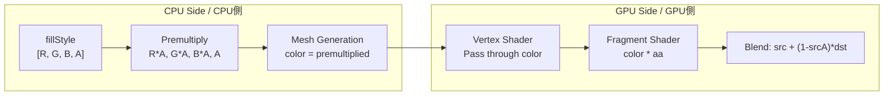

---

## 8. Resource Management

### Buffer Management / バッファ管理

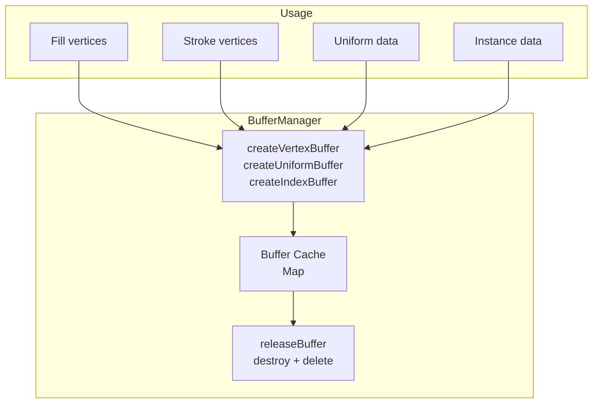

### Pipeline Management / パイプライン管理

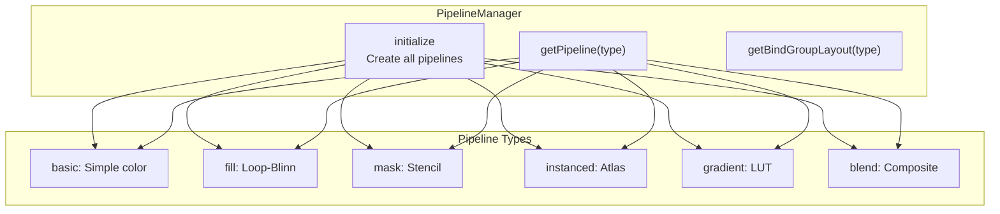

### FrameBuffer Management / フレームバッファ管理

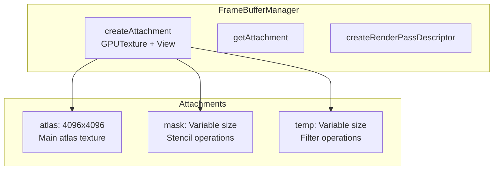

---

## 9. Instanced Rendering

### Atlas-Based Instanced Draw / アトラスベースのインスタンス描画

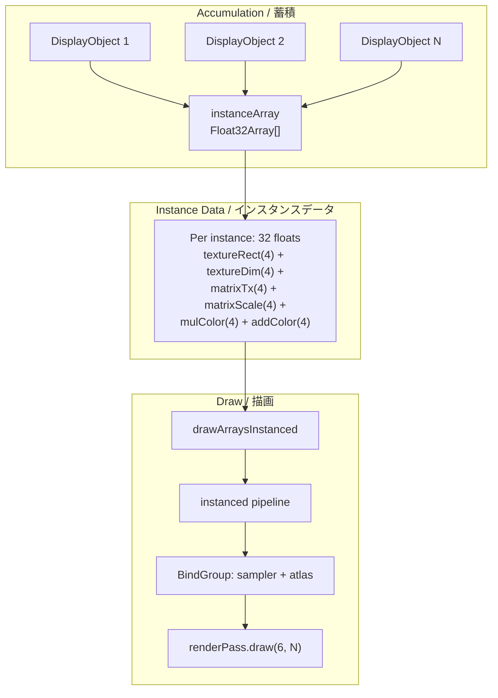

### Instanced Vertex Shader / インスタンス頂点シェーダー

```wgsl
struct VertexInput {
    @location(0) position: vec2<f32>,  // Quad vertex (0-1)
    @location(1) texCoord: vec2<f32>,  // UV (0-1)
}

struct InstanceInput {
    @location(2) textureRect: vec4<f32>,   // x, y, w, h in atlas
    @location(3) textureDim: vec4<f32>,    // w, h, viewportW, viewportH
    @location(4) matrixTx: vec4<f32>,      // tx, ty, pad, pad
    @location(5) matrixScale: vec4<f32>,   // scale0, rotate0, scale1, rotate1
    @location(6) mulColor: vec4<f32>,      // Color multiply
    @location(7) addColor: vec4<f32>,      // Color add
}

@vertex
fn main(input: VertexInput, instance: InstanceInput) -> VertexOutput {
    // Calculate texture coordinates in atlas
    let texX = instance.textureRect.x + input.texCoord.x * instance.textureRect.z;
    let texY = instance.textureRect.y + input.texCoord.y * instance.textureRect.w;

    // Apply transformation
    let pos = input.position * instance.textureDim.xy;
    let transformed = mat2x2 * pos + instance.matrixTx.xy;

    // Convert to NDC
    let ndc = (transformed / instance.textureDim.zw) * 2.0 - 1.0;
    output.position = vec4(ndc.x, 1.0 - ndc.y * 2.0, 0.0, 1.0);
}
```

### Color Transform in Fragment / フラグメントでのカラー変換

```wgsl
@fragment
fn main(input: VertexOutput) -> @location(0) vec4<f32> {
    var src = textureSample(atlas, sampler, input.texCoord);

    // Unpremultiply
    let unpremultiplied = vec4(src.rgb / max(0.0001, src.a), src.a);

    // Apply color transform: multiply + add
    var transformed = clamp(
        unpremultiplied * input.mulColor + input.addColor,
        vec4(0.0), vec4(1.0)
    );

    // Premultiply again
    return vec4(transformed.rgb * transformed.a, transformed.a);
}
```

---

## 10. Mask System

### Mask Rendering Flow / マスクレンダリングフロー

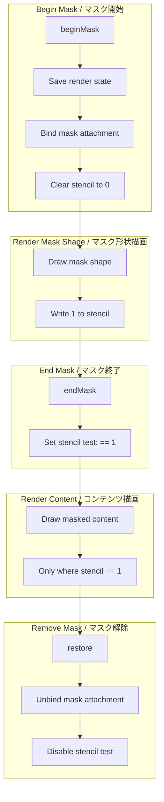

### Stencil Pipeline Configuration / ステンシルパイプライン設定

```typescript
// Mask write pipeline (write 1 to stencil)
depthStencil: {
    format: "stencil8",
    stencilFront: {
        compare: "always",
        passOp: "replace"
    },
    stencilWriteMask: 0xFF,
    stencilReadMask: 0xFF
}

// Masked content pipeline (test stencil == 1)
depthStencil: {
    format: "stencil8",
    stencilFront: {
        compare: "equal",
        passOp: "keep"
    },
    stencilReference: 1
}
```

---

## 11. Blend Mode System

### Supported Blend Modes / サポートされるブレンドモード

| Mode | WebGPU Blend State |
|------|-------------------|
| normal | src + (1-srcA) * dst |
| add | src + dst |
| multiply | src * dst |
| screen | src + dst - src * dst |
| overlay | Shader-based |
| hardlight | Shader-based |
| difference | Shader-based |

### Hardware Blend Configuration / ハードウェアブレンド設定

```typescript
// Normal blend (premultiplied alpha)
blend: {
    color: {
        srcFactor: "one",
        dstFactor: "one-minus-src-alpha",
        operation: "add"
    },
    alpha: {
        srcFactor: "one",
        dstFactor: "one-minus-src-alpha",
        operation: "add"
    }
}
```

---

## 12. Data Structures

### IAttachmentObject

```typescript
interface IAttachmentObject {
    texture: GPUTexture;
    view: GPUTextureView;
    width: number;
    height: number;
    colorTexture?: {
        texture: GPUTexture;
        view: GPUTextureView;
    };
    stencilTexture?: {
        texture: GPUTexture;
        view: GPUTextureView;
    };
}
```

### IMeshData

```typescript
interface IMeshData {
    buffer: Float32Array;  // 17 floats per vertex
    indexCount: number;    // Number of vertices to draw
}
```

### CanvasState

```typescript
interface CanvasState {
    matrix: Float32Array;
    globalAlpha: number;
    fillStyle: Float32Array;
    strokeStyle: Float32Array;
    imageSmoothingEnabled: boolean;
}
```

---

## Summary / まとめ

WebGPU版は以下の主要な特徴を持ちます：

1. **Loop-Blinn法**: 二次ベジェ曲線のGPUベースアンチエイリアシング
2. **プリマルチプライドアルファ**: CPU側で事前乗算、GPUはAAのみ適用
3. **インスタンス描画**: アトラステクスチャとバッチ描画による効率化
4. **イミュータブルパイプライン**: WebGPUのパイプライン事前定義
5. **カラートランスフォーム**: unpremultiply → transform → premultiply

WebGL版との互換性を維持しつつ、WebGPUの特性を活かした実装になっています。
