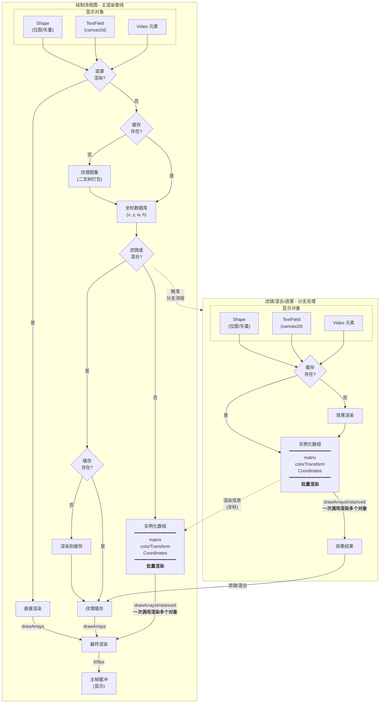

# Next2D Player

Next2D Player 是一个使用 WebGL/WebGPU 的高性能 2D 渲染引擎。它在 Web 上提供类似 Flash Player 的功能，支持矢量图形、补间动画、文本、音频、视频等。

## 主要特性

- **高速渲染**：使用 WebGL/WebGPU 进行快速 2D 渲染
- **多平台支持**：支持从桌面到移动设备
- **Flash 兼容 API**：源自 swf2js 的熟悉 API 设计
- **丰富的滤镜**：支持模糊、投影、发光、斜角等效果

## 渲染管线

Next2D Player 实现高速渲染的管线概述。



### 管线特性

- **批量渲染**：一次 GPU 调用渲染多个对象
- **纹理缓存**：高效处理滤镜和混合效果
- **二叉树打包**：纹理图集的最佳内存使用
- **60fps 渲染**：高帧率的流畅动画

## DisplayList 架构

Next2D Player 使用与 Flash Player 类似的 DisplayList 架构。

### 主要类层次结构

```
DisplayObject (基类)
├── InteractiveObject
│   ├── DisplayObjectContainer
│   │   ├── Sprite
│   │   ├── MovieClip
│   │   └── Stage
│   └── TextField
├── Shape
├── Video
└── Bitmap
```

### DisplayObjectContainer

可以容纳子对象的容器类：

- `addChild(child)`：将子对象添加到前面
- `addChildAt(child, index)`：在指定索引添加子对象
- `removeChild(child)`：移除子对象
- `getChildAt(index)`：通过索引获取子对象
- `getChildByName(name)`：通过名称获取子对象

### MovieClip

具有时间轴动画的 DisplayObject：

- `play()`：开始时间轴播放
- `stop()`：停止时间轴
- `gotoAndPlay(frame)`：跳转到帧并播放
- `gotoAndStop(frame)`：跳转到帧并停止
- `currentFrame`：当前帧号
- `totalFrames`：总帧数

## 基本用法

```javascript
const { MovieClip } = next2d.display;
const { DropShadowFilter } = next2d.filters;

// 初始化舞台
const root = await next2d.createRootMovieClip(800, 600, 60, {
    tagId: "container",
    bgColor: "#ffffff"
});

// 创建 MovieClip
const mc = new MovieClip();
root.addChild(mc);

// 设置位置和大小
mc.x = 100;
mc.y = 100;
mc.scaleX = 2;
mc.scaleY = 2;
mc.rotation = 45;

// 应用滤镜
mc.filters = [
    new DropShadowFilter(4, 45, 0x000000, 0.5)
];
```

## 加载 JSON 数据

加载并渲染使用 Open Animation Tool 创建的 JSON 文件：

```javascript
const { Loader } = next2d.display;
const { URLRequest } = next2d.net;

const loader = new Loader();
await loader.load(new URLRequest("animation.json"));

const mc = loader.content;
stage.addChild(mc);
```

## 相关文档

### 显示对象
- [DisplayObject](/cn/reference/player/display-object) - 所有显示对象的基类
- [MovieClip](/cn/reference/player/movie-clip) - 时间轴动画
- [Sprite](/cn/reference/player/sprite) - 图形绘制和交互
- [Shape](/cn/reference/player/shape) - 轻量级矢量绘制
- [TextField](/cn/reference/player/text-field) - 文本显示和输入
- [Video](/cn/reference/player/video) - 视频播放

### 系统
- [事件系统](/cn/reference/player/events) - 鼠标、键盘、触摸事件
- [滤镜](/cn/reference/player/filters) - 模糊、投影、发光等
- [Sound](/cn/reference/player/sound) - 音频播放和音效
- [补间动画](/cn/reference/player/tween) - 程序化动画
