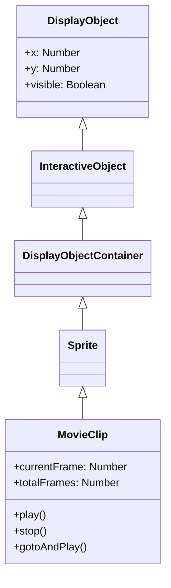

# MovieClip

MovieClip 是具有时间轴动画的 DisplayObjectContainer。使用 Open Animation Tool 创建的动画作为 MovieClip 播放。

## 继承



## 属性

### MovieClip 特有属性

| 属性 | 类型 | 说明 |
|------|------|------|
| `currentFrame` | `number` | 指定播放头在时间轴中所在帧的编号（从 1 开始，只读） |
| `totalFrames` | `number` | MovieClip 实例的总帧数（只读） |
| `currentFrameLabel` | `FrameLabel \| null` | MovieClip 实例时间轴中当前帧的标签（只读） |
| `currentLabels` | `FrameLabel[] \| null` | 返回当前场景的 FrameLabel 对象数组（只读） |
| `isPlaying` | `boolean` | 表示影片剪辑当前是否正在播放的布尔值（只读） |
| `isTimelineEnabled` | `boolean` | 返回显示对象是否具有 MovieClip 功能（只读） |

### 从 DisplayObjectContainer 继承的属性

| 属性 | 类型 | 说明 |
|------|------|------|
| `numChildren` | `number` | 返回此对象的子对象数量（只读） |
| `mouseChildren` | `boolean` | 确定对象的子对象是否启用鼠标或用户输入设备 |
| `mask` | `DisplayObject \| null` | 调用的显示对象被指定的遮罩对象遮罩 |
| `isContainerEnabled` | `boolean` | 返回显示对象是否具有容器功能（只读） |

## 方法

### MovieClip 特有方法

| 方法 | 返回类型 | 说明 |
|------|----------|------|
| `play()` | `void` | 在影片剪辑的时间轴中移动播放头 |
| `stop()` | `void` | 停止影片剪辑中的播放头 |
| `gotoAndPlay(frame: string \| number)` | `void` | 从指定帧开始播放文件 |
| `gotoAndStop(frame: string \| number)` | `void` | 将播放头移至指定帧并停止在那里 |
| `nextFrame()` | `void` | 将播放头发送到下一帧并停止 |
| `prevFrame()` | `void` | 将播放头发送到上一帧并停止 |
| `addFrameLabel(frame_label: FrameLabel)` | `void` | 动态向时间轴添加标签 |

### 从 DisplayObjectContainer 继承的方法

| 方法 | 返回类型 | 说明 |
|------|----------|------|
| `addChild(display_object: DisplayObject)` | `DisplayObject` | 将子 DisplayObject 实例添加到此 DisplayObjectContainer 实例 |
| `addChildAt(display_object: DisplayObject, index: number)` | `DisplayObject` | 在指定索引位置添加子 DisplayObject 实例 |
| `removeChild(display_object: DisplayObject)` | `void` | 从子列表中移除指定的子 DisplayObject 实例 |
| `removeChildAt(index: number)` | `void` | 从子列表中的指定索引位置移除子 DisplayObject |
| `removeChildren(...indexes: number[])` | `void` | 从容器中移除指定索引处的子对象 |
| `getChildAt(index: number)` | `DisplayObject \| null` | 返回存在于指定索引处的子显示对象实例 |
| `getChildByName(name: string)` | `DisplayObject \| null` | 返回具有指定名称的子显示对象 |
| `getChildIndex(display_object: DisplayObject)` | `number` | 返回子 DisplayObject 实例的索引位置 |
| `contains(display_object: DisplayObject)` | `boolean` | 确定指定的显示对象是 DisplayObjectContainer 实例的子对象还是实例本身 |
| `setChildIndex(display_object: DisplayObject, index: number)` | `void` | 更改显示对象容器中现有子对象的位置 |
| `swapChildren(display_object1: DisplayObject, display_object2: DisplayObject)` | `void` | 交换两个指定子对象的 z 顺序（从前到后的顺序） |
| `swapChildrenAt(index1: number, index2: number)` | `void` | 交换两个指定索引位置的子对象的 z 顺序 |

## 事件

### enterFrame

每帧发生的事件：

```javascript
movieClip.addEventListener("enterFrame", function(event) {
    console.log("帧:", event.target.currentFrame);
});
```

### frameConstructed

帧构建完成时发生：

```javascript
movieClip.addEventListener("frameConstructed", function(event) {
    // 帧脚本执行前
});
```

### exitFrame

离开帧时发生：

```javascript
movieClip.addEventListener("exitFrame", function(event) {
    // 移动到下一帧前
});
```

## 使用示例

### 基本动画控制

```javascript
const { Loader } = next2d.display;
const { URLRequest } = next2d.net;

// 从 JSON 加载 MovieClip
const loader = new Loader();
await loader.load(new URLRequest("animation.json"));

const mc = loader.content;
stage.addChild(mc);

// 初始停止
mc.stop();

// 点击按钮播放/暂停
button.addEventListener("click", function() {
    if (mc.isPlaying) {
        mc.stop();
    } else {
        mc.play();
    }
});
```

### 使用帧标签控制

```javascript
// 移动到标签位置
mc.gotoAndStop("idle");

// 状态变更
function changeState(state) {
    switch (state) {
        case "idle":
            mc.gotoAndPlay("idle");
            break;
        case "walk":
            mc.gotoAndPlay("walk_start");
            break;
        case "attack":
            mc.gotoAndPlay("attack");
            break;
    }
}
```

### 控制嵌套的 MovieClip

```javascript
// 访问子 MovieClip
const childMc = mc.getChildByName("character");
childMc.gotoAndPlay("run");

// 访问孙子 MovieClip
const grandChild = mc.character.arm;
grandChild.play();
```

### 子对象操作

```javascript
// 添加子对象
const sprite = new Sprite();
mc.addChild(sprite);

// 在特定索引添加
mc.addChildAt(sprite, 0);

// 移除子对象
mc.removeChild(sprite);

// 按索引移除
mc.removeChildAt(0);

// 移除多个子对象
mc.removeChildren(0, 1, 2);

// 获取子对象
const child = mc.getChildAt(0);
const namedChild = mc.getChildByName("myChild");

// 获取子对象索引
const index = mc.getChildIndex(sprite);

// 更改子对象索引
mc.setChildIndex(sprite, 2);

// 交换子对象顺序
mc.swapChildren(sprite1, sprite2);
mc.swapChildrenAt(0, 1);
```

### 动态添加帧标签

```javascript
const { FrameLabel } = next2d.display;

// 创建并添加新标签
const label = new FrameLabel("myLabel", 10);
mc.addFrameLabel(label);

// 使用标签导航
mc.gotoAndPlay("myLabel");
```

### 更改帧率

```javascript
// 更改舞台帧率
stage.frameRate = 30;
```

## FrameLabel

保存帧标签信息的类：

```javascript
// 获取当前场景中的所有标签
const labels = mc.currentLabels;
labels.forEach(function(label) {
    console.log(label.name + ": 帧 " + label.frame);
});
```

## 相关

- [Sprite](/cn/reference/player/sprite)
- [事件系统](/cn/reference/player/events)
