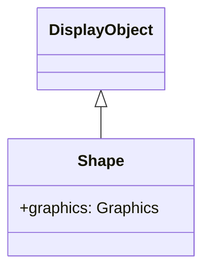

# Shape

Shape 是专用于矢量图形绘制的类。与 Sprite 不同，它不能容纳子对象，但它轻量级且性能更好。

## 继承



## 属性

| 属性 | 类型 | 说明 |
|------|------|------|
| `graphics` | Graphics | 属于此 Shape 对象的 Graphics 对象，可以在其中执行矢量绘制命令（只读） |
| `isShape` | boolean | 返回显示对象是否具有 Shape 功能（只读） |
| `cacheKey` | number | 构建的缓存键 |
| `cacheParams` | number[] | 用于构建缓存的参数（只读） |
| `isBitmap` | boolean | 位图绘制判断标志 |
| `src` | string | 从指定路径读取图像并生成 Graphics |
| `bitmapData` | BitmapData | 返回位图数据（只读） |
| `namespace` | string | 返回指定对象的空间名称（只读） |

## 方法

| 方法 | 返回类型 | 说明 |
|------|----------|------|
| `load(url: string)` | Promise\<void\> | 从指定 URL 异步加载图像并生成 Graphics |
| `clearBitmapBuffer()` | void | 释放位图数据 |
| `setBitmapBuffer(width: number, height: number, buffer: Uint8Array)` | void | 设置 RGBA 图像数据 |

## Sprite 和 Shape 的区别

| 功能 | Shape | Sprite |
|------|-------|--------|
| 子对象 | 不能容纳 | 可以容纳 |
| 交互 | 无 | 可点击等 |
| 性能 | 轻量级 | 稍重 |
| 使用场景 | 静态背景、装饰 | 按钮、容器 |

## 使用示例

### 基本绘制

```javascript
const { Shape } = next2d.display;

const shape = new Shape();

// 填充矩形
shape.graphics.beginFill(0x3498db);
shape.graphics.drawRect(0, 0, 150, 100);
shape.graphics.endFill();

stage.addChild(shape);
```

### 复合形状绘制

```javascript
const { Shape } = next2d.display;

const shape = new Shape();
const g = shape.graphics;

// 背景
g.beginFill(0xecf0f1);
g.drawRoundRect(0, 0, 200, 150, 10, 10);
g.endFill();

// 边框
g.lineStyle(2, 0x2c3e50);
g.drawRoundRect(0, 0, 200, 150, 10, 10);

// 内部装饰
g.beginFill(0xe74c3c);
g.drawCircle(100, 75, 30);
g.endFill();

stage.addChild(shape);
```

### 路径绘制

```javascript
const { Shape } = next2d.display;

const shape = new Shape();
const g = shape.graphics;

g.beginFill(0x9b59b6);

// 绘制星形
g.moveTo(50, 0);
g.lineTo(61, 35);
g.lineTo(98, 35);
g.lineTo(68, 57);
g.lineTo(79, 91);
g.lineTo(50, 70);
g.lineTo(21, 91);
g.lineTo(32, 57);
g.lineTo(2, 35);
g.lineTo(39, 35);
g.lineTo(50, 0);

g.endFill();

stage.addChild(shape);
```

### 贝塞尔曲线

```javascript
const { Shape } = next2d.display;

const shape = new Shape();
const g = shape.graphics;

g.lineStyle(3, 0x1abc9c);

// 二次贝塞尔曲线
g.moveTo(0, 100);
g.curveTo(50, 0, 100, 100);  // 控制点, 终点

g.curveTo(150, 200, 200, 100);

stage.addChild(shape);
```

### 渐变背景

```javascript
const { Shape } = next2d.display;
const { Matrix } = next2d.geom;

const shape = new Shape();
const g = shape.graphics;

// 渐变矩阵
const matrix = new Matrix();
matrix.createGradientBox(
    stage.stageWidth,
    stage.stageHeight,
    Math.PI / 2,  // 90度（垂直）
    0, 0
);

// 放射渐变
g.beginGradientFill(
    "radial",
    [0x667eea, 0x764ba2],
    [1, 1],
    [0, 255],
    matrix
);
g.drawRect(0, 0, stage.stageWidth, stage.stageHeight);
g.endFill();

// 放置在后面
stage.addChildAt(shape, 0);
```

### 动态重绘

```javascript
const { Shape } = next2d.display;

const shape = new Shape();
stage.addChild(shape);

let angle = 0;

// 每帧重绘
stage.addEventListener("enterFrame", function() {
    const g = shape.graphics;

    // 清除之前的绘制
    g.clear();

    // 在新位置绘制
    const x = 200 + Math.cos(angle) * 100;
    const y = 150 + Math.sin(angle) * 100;

    g.beginFill(0xe74c3c);
    g.drawCircle(x, y, 20);
    g.endFill();

    angle += 0.05;
});
```

### 由多个 Shape 组成

```javascript
const { Shape } = next2d.display;

// 背景层
const bgShape = new Shape();
bgShape.graphics.beginFill(0x2c3e50);
bgShape.graphics.drawRect(0, 0, 400, 300);
bgShape.graphics.endFill();

// 装饰层
const decorShape = new Shape();
decorShape.graphics.beginFill(0x3498db, 0.5);
decorShape.graphics.drawCircle(100, 100, 80);
decorShape.graphics.drawCircle(300, 200, 60);
decorShape.graphics.endFill();

// 前景层
const frontShape = new Shape();
frontShape.graphics.lineStyle(2, 0xecf0f1);
frontShape.graphics.drawRect(50, 50, 300, 200);

stage.addChild(bgShape);
stage.addChild(decorShape);
stage.addChild(frontShape);
```

## 性能提示

1. **对静态绘制使用 Shape**：Shape 对于不需要交互的背景和装饰是最佳选择
2. **最小化绘制**：如果内容不经常更改，只绘制一次
3. **使用 clear()**：动态重绘时始终调用 clear()
4. **缓存复杂形状**：使用 cacheAsBitmap 属性缓存绘制

```javascript
// 将复杂形状缓存为位图
const { Matrix } = next2d.geom;
shape.cacheAsBitmap = new Matrix(1, 0, 0, 1, 0, 0);
```

## Graphics 类

Graphics 类提供用于渲染矢量图形的绘图 API。通过 Shape.graphics 属性访问。

### 填充方法

| 方法 | 说明 |
|------|------|
| `beginFill(color: number, alpha?: number)` | 开始纯色填充。Alpha 默认为 1 |
| `beginGradientFill(type, colors, alphas, ratios, matrix?, spreadMethod?, interpolationMethod?, focalPointRatio?)` | 开始渐变填充 |
| `beginBitmapFill(bitmapData, matrix?, repeat?, smooth?)` | 开始位图填充 |
| `endFill()` | 结束当前填充 |

#### beginGradientFill 参数

| 参数 | 类型 | 说明 |
|------|------|------|
| `type` | string | "linear" 或 "radial" |
| `colors` | number[] | 颜色数组（十六进制） |
| `alphas` | number[] | 每种颜色的 Alpha 值（0-1） |
| `ratios` | number[] | 每种颜色的位置（0-255） |
| `matrix` | Matrix | 渐变的变换矩阵 |
| `spreadMethod` | string | "pad"、"reflect"、"repeat"（默认："pad"） |
| `interpolationMethod` | string | "rgb" 或 "linearRGB"（默认："rgb"） |
| `focalPointRatio` | number | 放射渐变的焦点位置（-1 到 1） |

### 线条样式方法

| 方法 | 说明 |
|------|------|
| `lineStyle(thickness?, color?, alpha?, pixelHinting?, scaleMode?, caps?, joints?, miterLimit?)` | 设置线条样式 |
| `lineGradientStyle(type, colors, alphas, ratios, matrix?, spreadMethod?, interpolationMethod?, focalPointRatio?)` | 设置渐变线条样式 |
| `lineBitmapStyle(bitmapData, matrix?, repeat?, smooth?)` | 设置位图线条样式 |
| `endLine()` | 结束线条样式 |

#### lineStyle 参数

| 参数 | 类型 | 默认值 | 说明 |
|------|------|--------|------|
| `thickness` | number | 0 | 线条粗细（像素） |
| `color` | number | 0 | 线条颜色（十六进制） |
| `alpha` | number | 1 | Alpha 透明度（0-1） |
| `pixelHinting` | boolean | false | 像素对齐 |
| `scaleMode` | string | "normal" | "normal"、"none"、"vertical"、"horizontal" |
| `caps` | string | null | "none"、"round"、"square" |
| `joints` | string | null | "bevel"、"miter"、"round" |
| `miterLimit` | number | 3 | 斜接限制 |

### 路径方法

| 方法 | 说明 |
|------|------|
| `moveTo(x: number, y: number)` | 移动绘制位置 |
| `lineTo(x: number, y: number)` | 从当前位置到指定坐标绘制线条 |
| `curveTo(controlX, controlY, anchorX, anchorY)` | 绘制二次贝塞尔曲线 |
| `cubicCurveTo(controlX1, controlY1, controlX2, controlY2, anchorX, anchorY)` | 绘制三次贝塞尔曲线 |

### 形状方法

| 方法 | 说明 |
|------|------|
| `drawRect(x, y, width, height)` | 绘制矩形 |
| `drawRoundRect(x, y, width, height, ellipseWidth, ellipseHeight?)` | 绘制圆角矩形 |
| `drawCircle(x, y, radius)` | 绘制圆形 |
| `drawEllipse(x, y, width, height)` | 绘制椭圆 |

### 实用方法

| 方法 | 说明 |
|------|------|
| `clear()` | 清除所有绘制命令 |
| `clone()` | 克隆 Graphics 对象 |
| `copyFrom(source: Graphics)` | 从另一个 Graphics 复制绘制命令 |

### 详细使用示例

#### 线性渐变

```javascript
const { Shape } = next2d.display;
const { Matrix } = next2d.geom;

const shape = new Shape();
const g = shape.graphics;

const matrix = new Matrix();
matrix.createGradientBox(200, 100, 0, 0, 0);  // 宽度, 高度, 旋转, x, y

g.beginGradientFill(
    "linear",                          // 类型
    [0xff0000, 0x00ff00, 0x0000ff],    // 颜色
    [1, 1, 1],                         // alpha
    [0, 127, 255],                     // 比例
    matrix
);
g.drawRect(0, 0, 200, 100);
g.endFill();

stage.addChild(shape);
```

#### 三次贝塞尔曲线

```javascript
const { Shape } = next2d.display;

const shape = new Shape();
const g = shape.graphics;

g.lineStyle(2, 0x3498db);

// 平滑 S 曲线
g.moveTo(0, 100);
g.cubicCurveTo(
    50, 0,     // 控制点 1
    150, 200,  // 控制点 2
    200, 100   // 锚点
);

stage.addChild(shape);
```

#### 位图填充

```typescript
const { Shape } = next2d.display;

// 使用 Shape 的 load() 方法加载图像
const textureShape = new Shape();
await textureShape.load("texture.png");

// 使用加载的 bitmapData 进行位图填充
const shape = new Shape();
const g = shape.graphics;

g.beginBitmapFill(textureShape.bitmapData, null, true, true);
g.drawRect(0, 0, 400, 300);
g.endFill();

stage.addChild(shape);
```

#### 渐变线条

```javascript
const { Shape } = next2d.display;
const { Matrix } = next2d.geom;

const shape = new Shape();
const g = shape.graphics;

const matrix = new Matrix();
matrix.createGradientBox(200, 200, 0, 0, 0);

g.lineGradientStyle(
    "linear",
    [0xff0000, 0x0000ff],
    [1, 1],
    [0, 255],
    matrix
);
g.lineStyle(5);

g.moveTo(10, 10);
g.lineTo(190, 10);
g.lineTo(190, 190);
g.lineTo(10, 190);
g.lineTo(10, 10);

stage.addChild(shape);
```

#### 复杂形状组合

```javascript
const { Shape } = next2d.display;

const shape = new Shape();
const g = shape.graphics;

// 外部矩形（填充）
g.beginFill(0x2c3e50);
g.drawRoundRect(0, 0, 200, 150, 15, 15);
g.endFill();

// 内部圆形（不同颜色填充）
g.beginFill(0xe74c3c);
g.drawCircle(100, 75, 40);
g.endFill();

// 装饰线条
g.lineStyle(2, 0xecf0f1);
g.moveTo(20, 20);
g.lineTo(180, 20);
g.moveTo(20, 130);
g.lineTo(180, 130);

stage.addChild(shape);
```

## 相关

- [DisplayObject](/cn/reference/player/display-object)
- [Sprite](/cn/reference/player/sprite)
- [滤镜](/cn/reference/player/filters)
