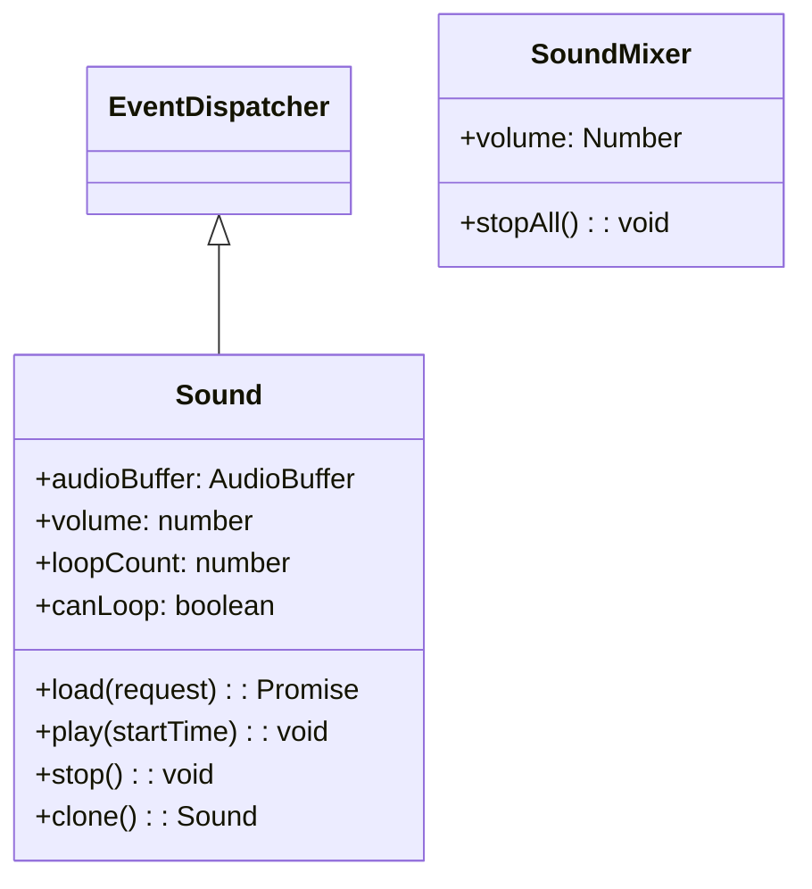

# Sound

Next2D Player 为游戏和应用程序提供音频功能，支持 BGM、音效、语音等。

## 类结构



## Sound

用于加载和播放音频文件的类。扩展自 EventDispatcher。

### 属性

| 属性 | 类型 | 默认值 | 只读 | 说明 |
|------|------|--------|:----:|------|
| `audioBuffer` | AudioBuffer \| null | null | - | 音频缓冲区。存储由 load() 加载的音频数据 |
| `loopCount` | number | 0 | - | 循环计数设置。0 表示不循环，9999 表示几乎无限循环 |
| `volume` | number | 1 | - | 音量，范围从 0（静音）到 1（最大音量）。不能超过 SoundMixer.volume 值 |
| `canLoop` | boolean | - | 是 | 表示声音是否循环 |

### 方法

| 方法 | 返回值 | 说明 |
|------|--------|------|
| `clone()` | Sound | 复制 Sound 类。复制 volume、loopCount 和 audioBuffer |
| `load(request: URLRequest)` | Promise\<void\> | 从指定 URL 开始加载外部 MP3 文件 |
| `play(startTime: number = 0)` | void | 播放声音。startTime 是播放开始时间（秒）。如果已在播放则不执行任何操作 |
| `stop()` | void | 停止通道中正在播放的声音 |

## 使用示例

### 基本音频播放

```javascript
const { Sound } = next2d.media;
const { URLRequest } = next2d.net;

// 创建 Sound 对象
const sound = new Sound();

// 加载音频文件
await sound.load(new URLRequest("bgm.mp3"));

// 开始播放
sound.play();
```

### 音效播放

```javascript
const { Sound } = next2d.media;
const { URLRequest } = next2d.net;

// 预加载音效
const seJump = new Sound();
const seHit = new Sound();
const seCoin = new Sound();

// 加载
await seJump.load(new URLRequest("se/jump.mp3"));
await seHit.load(new URLRequest("se/hit.mp3"));
await seCoin.load(new URLRequest("se/coin.mp3"));

// 播放函数
function playSE(sound) {
    sound.play();
}

// 在游戏中使用
player.addEventListener("jump", function() {
    playSE(seJump);
});
```

### BGM 循环播放

```javascript
const { Sound } = next2d.media;
const { URLRequest } = next2d.net;

const bgm = new Sound();

await bgm.load(new URLRequest("bgm/stage1.mp3"));

// 设置音量和循环次数
bgm.volume = 0.7;  // 70%
bgm.loopCount = 9999;  // 无限循环

bgm.play();

// 停止 BGM
function stopBGM() {
    bgm.stop();
}
```

### 音量控制

```javascript
const { Sound } = next2d.media;
const { URLRequest } = next2d.net;

const bgm = new Sound();
await bgm.load(new URLRequest("bgm.mp3"));
bgm.volume = 1.0;
bgm.loopCount = 9999;
bgm.play();

// 更改音量
function setVolume(volume) {
    bgm.volume = Math.max(0, Math.min(1, volume));
}

// 淡出
function fadeOut(duration) {
    duration = duration || 1000;
    const startVolume = bgm.volume;
    const startTime = Date.now();

    stage.addEventListener("enterFrame", function fade() {
        const elapsed = Date.now() - startTime;
        const progress = Math.min(1, elapsed / duration);

        setVolume(startVolume * (1 - progress));

        if (progress >= 1) {
            stage.removeEventListener("enterFrame", fade);
            bgm.stop();
        }
    });
}
```

### 音频管理器

```javascript
const { Sound } = next2d.media;
const { URLRequest } = next2d.net;

class SoundManager {
    constructor() {
        this._sounds = new Map();
        this._bgm = null;
        this._bgmVolume = 0.7;
        this._seVolume = 1.0;
        this._isMuted = false;
    }

    // 预加载声音
    async preload(id, url) {
        const sound = new Sound();
        await sound.load(new URLRequest(url));
        this._sounds.set(id, sound);
    }

    // 播放 BGM
    playBGM(id, loops) {
        loops = loops || 9999;
        this.stopBGM();

        const sound = this._sounds.get(id);
        if (sound) {
            sound.volume = this._isMuted ? 0 : this._bgmVolume;
            sound.loopCount = loops;
            sound.play();
            this._bgm = sound;
        }
    }

    // 停止 BGM
    stopBGM() {
        if (this._bgm) {
            this._bgm.stop();
            this._bgm = null;
        }
    }

    // 播放音效
    playSE(id) {
        const sound = this._sounds.get(id);
        if (sound) {
            sound.volume = this._isMuted ? 0 : this._seVolume;
            sound.loopCount = 0;
            sound.play();
        }
    }

    // 切换静音
    toggleMute() {
        this._isMuted = !this._isMuted;
        this._updateVolumes();
        return this._isMuted;
    }

    // 设置 BGM 音量
    setBGMVolume(volume) {
        this._bgmVolume = Math.max(0, Math.min(1, volume));
        this._updateVolumes();
    }

    // 设置音效音量
    setSEVolume(volume) {
        this._seVolume = Math.max(0, Math.min(1, volume));
    }

    _updateVolumes() {
        if (this._bgm) {
            this._bgm.volume = this._isMuted ? 0 : this._bgmVolume;
        }
    }
}

// 使用示例
const soundManager = new SoundManager();

// 启动时预加载
async function initSounds() {
    await soundManager.preload("bgm_title", "bgm/title.mp3");
    await soundManager.preload("bgm_stage1", "bgm/stage1.mp3");
    await soundManager.preload("se_jump", "se/jump.mp3");
    await soundManager.preload("se_coin", "se/coin.mp3");
    await soundManager.preload("se_damage", "se/damage.mp3");
}

// 游戏中
soundManager.playBGM("bgm_stage1");
soundManager.playSE("se_jump");
```

## SoundMixer

用于控制所有音频的类。

```javascript
const { SoundMixer } = next2d.media;

// 停止所有音频
SoundMixer.stopAll();

// 更改全局音量
SoundMixer.volume = 0.5;
```

## 支持的格式

| 格式 | 扩展名 | 支持 |
|------|--------|------|
| MP3 | .mp3 | 推荐 |
| AAC | .m4a, .aac | 支持 |
| Ogg Vorbis | .ogg | 取决于浏览器 |
| WAV | .wav | 支持（文件大小较大） |

## 最佳实践

1. **预加载**：在游戏开始前预加载所有音频
2. **格式**：推荐 MP3（兼容性和压缩率的平衡）
3. **音效**：短声音可以使用 WAV（延迟更低）
4. **音量管理**：分别管理 BGM 和音效的音量
5. **移动端支持**：在用户交互后开始播放

## 相关

- [事件系统](/cn/reference/player/events)
