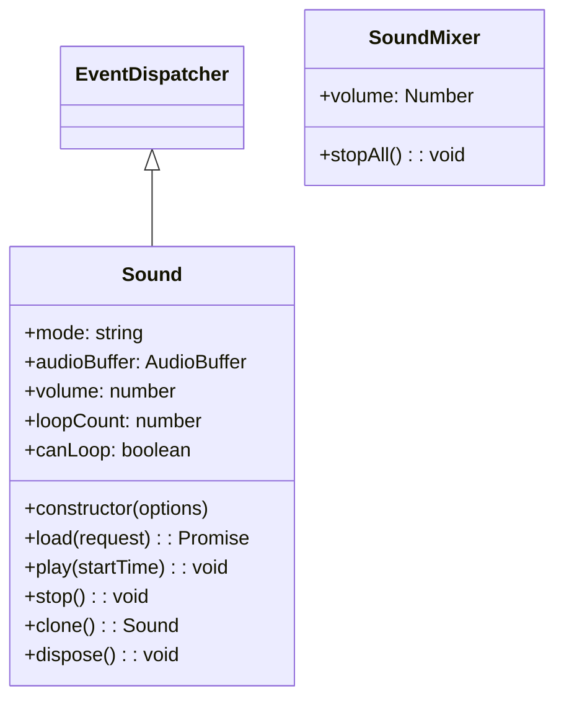

# Sound

Next2D Player 为游戏和应用程序提供音频功能，支持 BGM、音效、语音等。

## 类结构


```mermaid
classDiagram
    EventDispatcher <|-- Sound
    class Sound {
        +constructor(options)
        +mode: string
        +audioBuffer: AudioBuffer
        +volume: number
        +loopCount: number
        +canLoop: boolean
        +load(request): Promise
        +play(startTime): void
        +stop(): void
        +clone(): Sound
        +dispose(): void
    }
    class SoundMixer {
        +volume: Number
        +stopAll(): void
    }
```

## Sound

用于加载和播放音频文件的类。扩展自 EventDispatcher。

### 构造函数

```javascript
new Sound(options?: ISoundOptions)
```

| 选项 | 类型 | 默认值 | 说明 |
|------|------|--------|------|
| `mode` | "buffer" \| "stream" | "buffer" | 播放后端。省略时使用原有的 AudioBuffer 方式（`"buffer"`）。为长 BGM 指定 `"stream"` 可进行流式播放。创建后无法更改 |

### 属性

| 属性 | 类型 | 默认值 | 只读 | 说明 |
|------|------|--------|:----:|------|
| `audioBuffer` | AudioBuffer \| null | null | - | 音频缓冲区。存储由 load() 加载的音频数据 |
| `loopCount` | number | 0 | - | 循环计数设置。0 表示不循环，9999 表示几乎无限循环 |
| `volume` | number | 1 | - | 音量，范围从 0（静音）到 1（最大音量）。不能超过 SoundMixer.volume 值 |
| `canLoop` | boolean | - | 是 | 表示声音是否循环 |
| `mode` | "buffer" \| "stream" | "buffer" | 是 | 创建时指定的播放后端 |

### 方法

| 方法 | 返回值 | 说明 |
|------|--------|------|
| `clone()` | Sound | 复制 Sound 类。复制 volume、loopCount 和 audioBuffer |
| `load(request: URLRequest)` | Promise\<void\> | 从指定 URL 开始加载外部 MP3 文件 |
| `play(startTime: number = 0)` | void | 播放声音。startTime 是播放开始时间（秒）。如果已在播放则不执行任何操作 |
| `stop()` | void | 停止通道中正在播放的声音 |
| `dispose()` | void | 释放持有的资源并清除 `audioBuffer`。重新使用前请再次调用 `load()`（mode 保持不变） |

## 流式 BGM（stream 模式）

仅在指定 `new Sound({ mode: "stream" })` 时，通过 `HTMLAudioElement → MediaElementAudioSourceNode → GainNode` 进行流式播放。由于不会使用 `decodeAudioData()` 解码整首曲目，也不会将整个文件读入 ArrayBuffer/Blob，因此可以降低长 BGM 的内存占用。

`new Sound()` / `new Sound({ mode: "buffer" })` 保持原有行为（事件、`play(startTime)`、`audioBuffer`、音量规则、MovieClip 集成、clone）。不会根据文件时长或循环次数自动切换模式。

### 基本用法

```javascript
const { Sound, SoundMixer } = next2d.media;
const { URLRequest } = next2d.net;

const bgm = new Sound({ mode: "stream" });
await bgm.load(new URLRequest("bgm/stage1.mp3"));
bgm.loopCount = Infinity;
bgm.volume = 0.5;
bgm.play();

bgm.volume = 0.2;     // 播放中也会立即反映到 GainNode
bgm.stop();           // 释放媒体数据，同一个 Sound 可以再次 play()
bgm.play();
SoundMixer.stopAll(); // stream 的 Sound 也会被停止
bgm.dispose();        // 释放资源，重新使用前需要再次 load()

const se = new Sound(); // 音效使用原有的 buffer 模式
await se.load(new URLRequest("se/button.mp3"));
se.play();
```

### stream 模式规范

| 项目 | 规范 |
|------|------|
| 音量 | `Sound.volume` 和 `SoundMixer.volume` 遵循原有规则（取较小值，不相乘）。未激活的 stream 在播放开始时应用当前的 SoundMixer.volume。HTMLAudioElement 的 volume 始终为 1 |
| AudioContext | 与现有 Sound 共享 |
| `load()` | 在**元数据可用时** resolve 并派发 `Event.COMPLETE`（并非整个文件下载完成时）。加载开始时派发 `Event.OPEN`。不会派发基于字节的 `ProgressEvent.PROGRESS` |
| 请求限制 | 仅支持不带 `request.data` 或自定义 `requestHeaders` 的 GET URL。不支持的请求会以 `TypeError` reject。`withCredentials` 为 true 时使用 `crossOrigin="use-credentials"`，否则使用 `"anonymous"`。跨域时服务器需要允许 CORS |
| 加载错误 | reject 并派发 `IOErrorEvent.IO_ERROR`。不会自动回退到整体解码方式 |
| `play()` | 始终从头开始播放。向 `play(startTime)` 传入非 0 值会抛出 `RangeError`（指定开始位置仅限 buffer 模式）。`load()` 完成前调用 `play()` 会被忽略 |
| `loopCount` | 请在播放前设置。0 播放一次，N 追加播放 N 次，`Infinity` 使用原生媒体循环。有限次播放时仅在最终结束时派发一次 `Event.COMPLETE`。stop/dispose 及中途循环不会派发。不保证采样级精确的无缝循环 |
| 自动播放限制 | 自动播放被阻止时，会在 pointerdown / touchend / keydown 用户操作时重试。也会尝试恢复被中断的 AudioContext。已停止/已释放的 Sound 不会重试。非自动播放原因导致的播放失败会停止并派发 `IO_ERROR` |
| `stop()` | 如果正在加载则以 `AbortError` 取消，断开音频图，清除媒体源以释放未激活的数据。已加载的 stream 保留 URL，再次播放时复用元素/源节点。取消未完成的加载后，播放前需要再次调用 `load()` |
| `clone()` | 复制已加载 stream 的 URL、凭据模式、volume 和 loopCount。副本拥有独立的媒体元素/音频图，在播放时分配。由于没有全局 URL 缓存，请复用 BGM 实例或在不再需要时调用 `dispose()` |
| `audioBuffer` / `$build()` | 仅限 buffer 模式。stream 模式不使用 `audioBuffer`，`$build()` 会抛出 `TypeError`。嵌入在 MovieClip 中的声音继续使用 buffer 模式 |
| `dispose()` | 断开并释放自身持有的资源，清除 `audioBuffer`。不影响与其他 clone 共享的 AudioBuffer |

> **注意：** 浏览器端的缓冲仍会消耗内存。请将长曲目作为独立的音频文件 URL 提供，而不是嵌入到 JavaScript 或 data URL 中。`preload="metadata"` 只是给浏览器的提示，并不能严格限制下载量。

> **注意：** 音量的持久化以及 BGM/音效设置值的管理需由应用程序负责。对于 iOS 应用，建议在目标设备上测量长曲目播放和反复场景切换时 WebContent 进程的内存（JavaScript 堆大小不包含原生音频缓冲区）。

## 使用示例

### 基本音频播放

```javascript
const { Sound } = next2d.media;
const { URLRequest } = next2d.net;

// 创建 Sound 对象
const sound = new Sound();

// 加载音频文件
await sound.load(new URLRequest("bgm.mp3"));

// 开始播放
sound.play();
```

### 音效播放

```javascript
const { Sound } = next2d.media;
const { URLRequest } = next2d.net;

// 预加载音效
const seJump = new Sound();
const seHit = new Sound();
const seCoin = new Sound();

// 加载
await seJump.load(new URLRequest("se/jump.mp3"));
await seHit.load(new URLRequest("se/hit.mp3"));
await seCoin.load(new URLRequest("se/coin.mp3"));

// 播放函数
function playSE(sound) {
    sound.play();
}

// 在游戏中使用
player.addEventListener("jump", function() {
    playSE(seJump);
});
```

### BGM 循环播放

```javascript
const { Sound } = next2d.media;
const { URLRequest } = next2d.net;

// 长 BGM 推荐使用 stream 模式（new Sound() 也可以播放）
const bgm = new Sound({ mode: "stream" });

await bgm.load(new URLRequest("bgm/stage1.mp3"));

// 设置音量和循环次数
bgm.volume = 0.7;  // 70%
bgm.loopCount = 9999;  // 无限循环

bgm.play();

// 停止 BGM
function stopBGM() {
    bgm.stop();
}
```

### 音量控制

```javascript
const { Sound } = next2d.media;
const { URLRequest } = next2d.net;

const bgm = new Sound();
await bgm.load(new URLRequest("bgm.mp3"));
bgm.volume = 1.0;
bgm.loopCount = 9999;
bgm.play();

// 更改音量
function setVolume(volume) {
    bgm.volume = Math.max(0, Math.min(1, volume));
}

// 淡出
function fadeOut(duration) {
    duration = duration || 1000;
    const startVolume = bgm.volume;
    const startTime = Date.now();

    stage.addEventListener("enterFrame", function fade() {
        const elapsed = Date.now() - startTime;
        const progress = Math.min(1, elapsed / duration);

        setVolume(startVolume * (1 - progress));

        if (progress >= 1) {
            stage.removeEventListener("enterFrame", fade);
            bgm.stop();
        }
    });
}
```

### 音频管理器

```javascript
const { Sound } = next2d.media;
const { URLRequest } = next2d.net;

class SoundManager {
    constructor() {
        this._sounds = new Map();
        this._bgm = null;
        this._bgmVolume = 0.7;
        this._seVolume = 1.0;
        this._isMuted = false;
    }

    // 预加载声音
    async preload(id, url) {
        const sound = new Sound();
        await sound.load(new URLRequest(url));
        this._sounds.set(id, sound);
    }

    // 播放 BGM
    playBGM(id, loops) {
        loops = loops || 9999;
        this.stopBGM();

        const sound = this._sounds.get(id);
        if (sound) {
            sound.volume = this._isMuted ? 0 : this._bgmVolume;
            sound.loopCount = loops;
            sound.play();
            this._bgm = sound;
        }
    }

    // 停止 BGM
    stopBGM() {
        if (this._bgm) {
            this._bgm.stop();
            this._bgm = null;
        }
    }

    // 播放音效
    playSE(id) {
        const sound = this._sounds.get(id);
        if (sound) {
            sound.volume = this._isMuted ? 0 : this._seVolume;
            sound.loopCount = 0;
            sound.play();
        }
    }

    // 切换静音
    toggleMute() {
        this._isMuted = !this._isMuted;
        this._updateVolumes();
        return this._isMuted;
    }

    // 设置 BGM 音量
    setBGMVolume(volume) {
        this._bgmVolume = Math.max(0, Math.min(1, volume));
        this._updateVolumes();
    }

    // 设置音效音量
    setSEVolume(volume) {
        this._seVolume = Math.max(0, Math.min(1, volume));
    }

    _updateVolumes() {
        if (this._bgm) {
            this._bgm.volume = this._isMuted ? 0 : this._bgmVolume;
        }
    }
}

// 使用示例
const soundManager = new SoundManager();

// 启动时预加载
async function initSounds() {
    await soundManager.preload("bgm_title", "bgm/title.mp3");
    await soundManager.preload("bgm_stage1", "bgm/stage1.mp3");
    await soundManager.preload("se_jump", "se/jump.mp3");
    await soundManager.preload("se_coin", "se/coin.mp3");
    await soundManager.preload("se_damage", "se/damage.mp3");
}

// 游戏中
soundManager.playBGM("bgm_stage1");
soundManager.playSE("se_jump");
```

## SoundMixer

用于控制所有音频的类。

```javascript
const { SoundMixer } = next2d.media;

// 停止所有音频
SoundMixer.stopAll();

// 更改全局音量
SoundMixer.volume = 0.5;
```

## 支持的格式

| 格式 | 扩展名 | 支持 |
|------|--------|------|
| MP3 | .mp3 | 推荐 |
| AAC | .m4a, .aac | 支持 |
| Ogg Vorbis | .ogg | 取决于浏览器 |
| WAV | .wav | 支持（文件大小较大） |

## 最佳实践

1. **预加载**：在游戏开始前预加载所有音频
2. **格式**：推荐 MP3（兼容性和压缩率的平衡）
3. **音效**：短声音可以使用 WAV（延迟更低）
4. **音量管理**：分别管理 BGM 和音效的音量
5. **移动端支持**：在用户交互后开始播放
6. **BGM 使用 stream 模式**：长 BGM 使用 `new Sound({ mode: "stream" })` 避免整体解码，音效使用原有的 buffer 模式
7. **释放资源**：不再需要的 Sound 请通过 `dispose()` 释放资源

## 相关

- [事件系统](/cn/reference/player/events)
