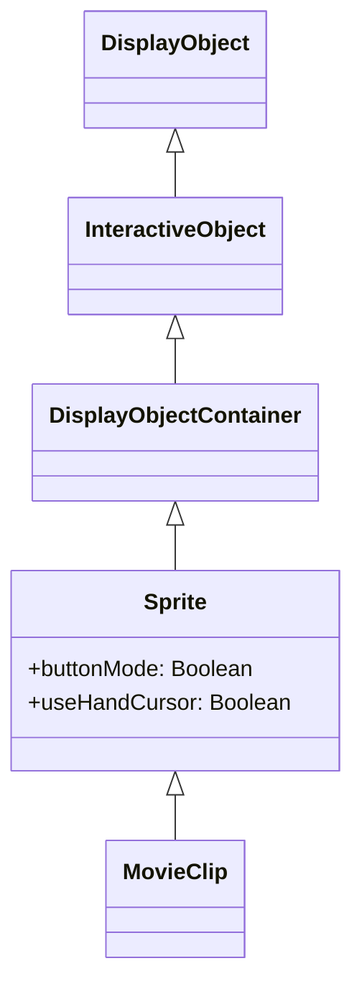

# Sprite

Sprite 是 DisplayObjectContainer。它是 MovieClip 的基类，用于不需要时间轴的动态对象管理。

## 继承



## 属性

### Sprite 特有属性

| 属性 | 类型 | 只读 | 默认值 | 说明 |
|------|------|:----:|--------|------|
| `isSprite` | boolean | 是 | true | 返回是否具有 Sprite 功能 |
| `buttonMode` | boolean | 否 | false | 指定此精灵的按钮模式 |
| `useHandCursor` | boolean | 否 | true | 当 buttonMode 为 true 时是否显示手形光标 |
| `hitArea` | Sprite \| null | 否 | null | 指定另一个精灵作为此精灵的点击区域 |
| `soundTransform` | SoundTransform \| null | 否 | null | 控制此精灵内的声音 |

### 从 DisplayObjectContainer 继承的属性

| 属性 | 类型 | 只读 | 默认值 | 说明 |
|------|------|:----:|--------|------|
| `isContainerEnabled` | boolean | 是 | true | 返回显示对象是否具有容器功能 |
| `mouseChildren` | boolean | 否 | true | 确定对象的子对象是否与鼠标或用户输入设备兼容 |
| `numChildren` | number | 是 | - | 返回此对象的子对象数量 |
| `mask` | DisplayObject \| null | 否 | null | 遮罩显示对象 |

### 从 InteractiveObject 继承的属性

| 属性 | 类型 | 只读 | 默认值 | 说明 |
|------|------|:----:|--------|------|
| `isInteractive` | boolean | 是 | true | 返回是否具有 InteractiveObject 功能 |
| `mouseEnabled` | boolean | 否 | true | 指定此对象是否接收鼠标或其他用户输入消息 |

### 从 DisplayObject 继承的属性

| 属性 | 类型 | 只读 | 默认值 | 说明 |
|------|------|:----:|--------|------|
| `instanceId` | number | 是 | - | DisplayObject 的唯一实例 ID |
| `name` | string | 否 | "" | 返回名称。用于 getChildByName() |
| `parent` | Sprite \| MovieClip \| null | 否 | null | 返回此 DisplayObject 父级的 DisplayObjectContainer |
| `x` | number | 否 | 0 | 相对于父 DisplayObjectContainer 本地坐标的 x 坐标 |
| `y` | number | 否 | 0 | 相对于父 DisplayObjectContainer 本地坐标的 y 坐标 |
| `width` | number | 否 | - | 显示对象的宽度（像素） |
| `height` | number | 否 | - | 显示对象的高度（像素） |
| `scaleX` | number | 否 | 1 | 从参考点应用的对象水平缩放值 |
| `scaleY` | number | 否 | 1 | 从参考点应用的对象垂直缩放值 |
| `rotation` | number | 否 | 0 | DisplayObject 实例相对于其原始方向的旋转角度（度） |
| `alpha` | number | 否 | 1 | 对象的 Alpha 透明度值（0.0 到 1.0） |
| `visible` | boolean | 否 | true | 显示对象是否可见 |
| `blendMode` | string | 否 | "normal" | 来自 BlendMode 类的值，指定要使用的混合模式 |
| `filters` | array \| null | 否 | null | 当前与显示对象关联的滤镜对象数组 |
| `matrix` | Matrix | 否 | - | 返回显示对象的 Matrix |
| `colorTransform` | ColorTransform | 否 | - | 返回显示对象的 ColorTransform |
| `concatenatedMatrix` | Matrix | 是 | - | 此显示对象和所有父对象的组合 Matrix |
| `scale9Grid` | Rectangle \| null | 否 | null | 当前有效的缩放网格 |
| `loaderInfo` | LoaderInfo \| null | 是 | null | 此显示对象所属文件的加载信息 |
| `root` | MovieClip \| Sprite \| null | 是 | null | DisplayObject 的根 DisplayObjectContainer |
| `mouseX` | number | 是 | - | 相对于 DisplayObject 参考点的 x 轴位置（像素） |
| `mouseY` | number | 是 | - | 相对于 DisplayObject 参考点的 y 轴位置（像素） |
| `dropTarget` | Sprite \| null | 是 | null | 精灵被拖动或放置到的显示对象 |
| `isMask` | boolean | 否 | false | 表示 DisplayObject 是否被设置为遮罩 |

## 方法

### Sprite 特有方法

| 方法 | 返回类型 | 说明 |
|------|----------|------|
| `startDrag(lockCenter?: boolean, bounds?: Rectangle)` | void | 让用户拖动指定的精灵 |
| `stopDrag()` | void | 结束 startDrag() 方法 |

### 从 DisplayObjectContainer 继承的方法

| 方法 | 返回类型 | 说明 |
|------|----------|------|
| `addChild(child: DisplayObject)` | DisplayObject | 添加子 DisplayObject 实例 |
| `addChildAt(child: DisplayObject, index: number)` | DisplayObject | 在指定索引位置添加子 DisplayObject 实例 |
| `removeChild(child: DisplayObject)` | void | 移除指定的子 DisplayObject 实例 |
| `removeChildAt(index: number)` | void | 从指定索引位置移除子 DisplayObject |
| `removeChildren(...indexes: number[])` | void | 从容器中移除数组中指定索引处的子对象 |
| `getChildAt(index: number)` | DisplayObject \| null | 返回指定索引位置的子显示对象实例 |
| `getChildByName(name: string)` | DisplayObject \| null | 返回具有指定名称的子显示对象 |
| `getChildIndex(child: DisplayObject)` | number | 返回子 DisplayObject 实例的索引位置 |
| `setChildIndex(child: DisplayObject, index: number)` | void | 更改显示对象容器中现有子对象的位置 |
| `contains(child: DisplayObject)` | boolean | 指定的 DisplayObject 是否是实例的后代 |
| `swapChildren(child1: DisplayObject, child2: DisplayObject)` | void | 交换两个指定子对象的 z 顺序 |
| `swapChildrenAt(index1: number, index2: number)` | void | 交换两个指定索引位置的子对象的 z 顺序 |

### 从 DisplayObject 继承的方法

| 方法 | 返回类型 | 说明 |
|------|----------|------|
| `getBounds(targetDisplayObject?: DisplayObject)` | Rectangle | 返回定义显示对象相对于 targetDisplayObject 坐标系统区域的矩形 |
| `globalToLocal(point: Point)` | Point | 将点对象从舞台（全局）坐标转换为显示对象（本地）坐标 |
| `localToGlobal(point: Point)` | Point | 将点对象从显示对象（本地）坐标转换为舞台（全局）坐标 |
| `hitTestObject(target: DisplayObject)` | boolean | 评估 DisplayObject 的绘制范围是否重叠或相交 |
| `hitTestPoint(x: number, y: number, shapeFlag?: boolean)` | boolean | 评估显示对象是否与 x 和 y 参数指定的点重叠或相交 |
| `remove()` | void | 移除父子关系 |
| `getLocalVariable(key: any)` | any | 从类的本地变量空间获取值 |
| `setLocalVariable(key: any, value: any)` | void | 在类的本地变量空间中存储值 |
| `hasLocalVariable(key: any)` | boolean | 确定类的本地变量空间中是否有值 |
| `deleteLocalVariable(key: any)` | void | 从类的本地变量空间中删除值 |
| `getGlobalVariable(key: any)` | any | 从全局变量空间获取值 |
| `setGlobalVariable(key: any, value: any)` | void | 在全局变量空间中存储值 |
| `hasGlobalVariable(key: any)` | boolean | 确定全局变量空间中是否有值 |
| `deleteGlobalVariable(key: any)` | void | 从全局变量空间中删除值 |
| `clearGlobalVariable()` | void | 清除全局变量空间中的所有值 |

## 使用示例

### 作为按钮使用

```typescript
const { Sprite, Shape } = next2d.display;
const { PointerEvent } = next2d.events;

const button = new Sprite();

// 启用按钮模式
button.buttonMode = true;
button.useHandCursor = true;

// 创建背景 Shape
const bg = new Shape();
bg.graphics.beginFill(0x3498db);
bg.graphics.drawRoundRect(0, 0, 120, 40, 8, 8);
bg.graphics.endFill();
button.addChild(bg);

// 点击事件
button.addEventListener(PointerEvent.POINTER_DOWN, () => {
    console.log("按钮被点击");
});

stage.addChild(button);
```

### 作为遮罩使用

```javascript
const { Sprite, Shape } = next2d.display;

const container = new Sprite();

// 内容 Shape
const content = new Shape();
content.graphics.beginFill(0xFF0000);
content.graphics.drawRect(0, 0, 200, 200);
content.graphics.endFill();
container.addChild(content);

// 遮罩 Shape
const maskShape = new Shape();
maskShape.graphics.beginFill(0xFFFFFF);
maskShape.graphics.drawCircle(100, 100, 50);
maskShape.graphics.endFill();

// 应用遮罩
container.mask = maskShape;

stage.addChild(container);
stage.addChild(maskShape);
```

### 拖放

```typescript
const { Sprite, Shape } = next2d.display;
const { PointerEvent } = next2d.events;
const { Rectangle } = next2d.geom;

const draggable = new Sprite();

// 创建背景 Shape
const bg = new Shape();
bg.graphics.beginFill(0x3498db);
bg.graphics.drawRect(0, 0, 100, 100);
bg.graphics.endFill();
draggable.addChild(bg);

// 开始拖动
draggable.addEventListener(PointerEvent.POINTER_DOWN, () => {
    // 开始拖动（锁定中心，指定边界）
    draggable.startDrag(true, new Rectangle(0, 0, 400, 300));
});

// 停止拖动
draggable.addEventListener(PointerEvent.POINTER_UP, () => {
    draggable.stopDrag();
});

stage.addChild(draggable);
```

### 管理子对象

```javascript
const { Sprite, Shape } = next2d.display;

const container = new Sprite();

// 添加多个 Shape 作为子对象
for (let i = 0; i < 5; i++) {
    const shape = new Shape();
    shape.graphics.beginFill(0xFF0000 + i * 0x003300);
    shape.graphics.drawCircle(0, 0, 20);
    shape.graphics.endFill();
    shape.x = i * 50;
    shape.name = "circle" + i;
    container.addChild(shape);
}

// 通过名称获取子对象
const circle2 = container.getChildByName("circle2");

// 获取子对象数量
console.log(container.numChildren); // 5

stage.addChild(container);
```

## 相关

- [DisplayObject](/cn/reference/player/display-object)
- [MovieClip](/cn/reference/player/movie-clip)
- [Shape](/cn/reference/player/shape)
