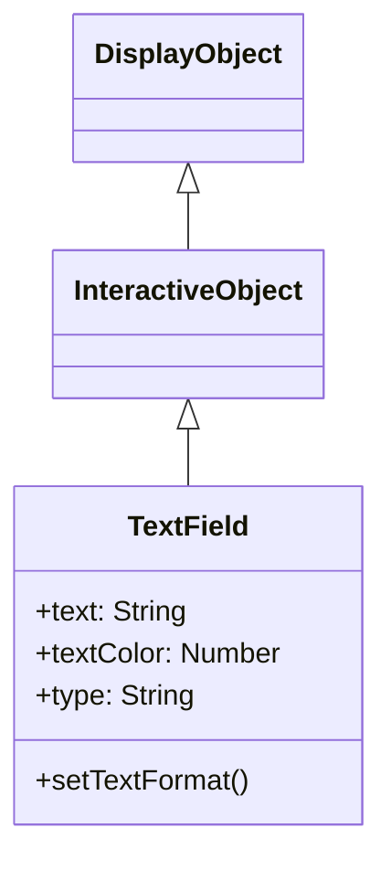

# TextField

TextField 是用于显示和编辑文本的 DisplayObject。它提供从标签显示到输入表单的文本相关功能。

## 继承



## 属性

### 文本相关

| 属性 | 类型 | 说明 |
|------|------|------|
| `text` | string | 文本字段中的当前文本字符串 |
| `htmlText` | string | 包含文本字段内容的 HTML 表示 |
| `length` | number | 文本字段中的字符数（只读） |
| `maxChars` | number | 文本字段可以包含的最大字符数（0 表示无限制） |
| `restrict` | string | 指示用户可以输入到文本字段中的字符集 |
| `defaultTextFormat` | TextFormat | 指定应用于文本的格式 |
| `stopIndex` | number | 设置文本的任意显示结束位置（默认：-1） |

### 显示相关

| 属性 | 类型 | 说明 |
|------|------|------|
| `width` | number | 显示对象的宽度（像素） |
| `height` | number | 显示对象的高度（像素） |
| `textWidth` | number | 文本的宽度（像素）（只读） |
| `textHeight` | number | 文本的高度（像素）（只读） |
| `autoSize` | string | 控制文本字段的自动调整大小和对齐（"none"、"left"、"center"、"right"） |
| `autoFontSize` | boolean | 控制文本大小的自动调整大小和对齐（默认：false） |
| `wordWrap` | boolean | 表示文本字段是否自动换行的布尔值（默认：false） |
| `multiline` | boolean | 指示字段是否为多行文本字段（默认：false） |
| `numLines` | number | 文本行数（只读） |

### 边框和背景相关

| 属性 | 类型 | 说明 |
|------|------|------|
| `background` | boolean | 指定文本字段是否具有背景填充（默认：false） |
| `backgroundColor` | number | 文本字段背景的颜色（默认：0xffffff） |
| `border` | boolean | 指定文本字段是否具有边框（默认：false） |
| `borderColor` | number | 文本字段边框的颜色（默认：0x000000） |

### 轮廓相关

| 属性 | 类型 | 说明 |
|------|------|------|
| `thickness` | number | 轮廓的文本宽度，可以用 0 禁用（默认：0） |
| `thicknessColor` | number | 轮廓文本的十六进制格式颜色（默认：0） |

### 输入相关

| 属性 | 类型 | 说明 |
|------|------|------|
| `type` | string | 文本字段的类型（"static"、"dynamic"、"input"）（默认："static"） |
| `focus` | boolean | 文本字段是否具有焦点（默认：false） |
| `focusVisible` | boolean | 控制文本字段闪烁线的可见性（默认：false） |
| `focusIndex` | number | 文本字段焦点位置的索引（默认：-1） |
| `selectIndex` | number | 文本字段选择位置的索引（默认：-1） |
| `compositionStartIndex` | number | 文本字段的组合开始索引（默认：-1） |
| `compositionEndIndex` | number | 文本字段的组合结束索引（默认：-1） |

### 滚动相关

| 属性 | 类型 | 说明 |
|------|------|------|
| `scrollX` | number | x 轴上的滚动位置（默认：0） |
| `scrollY` | number | y 轴上的滚动位置（默认：0） |
| `scrollEnabled` | boolean | 控制滚动功能的开/关（默认：true） |
| `xScrollShape` | Shape | 用于 x 滚动条显示的 Shape 对象（只读） |
| `yScrollShape` | Shape | 用于 y 滚动条显示的 Shape 对象（只读） |

## 方法

| 方法 | 返回值 | 说明 |
|------|--------|------|
| `appendText(newText: string)` | void | 将 newText 参数指定的字符串附加到文本字段文本的末尾 |
| `insertText(newText: string)` | void | 将文本添加到文本字段的焦点位置 |
| `deleteText()` | void | 删除文本字段的选择范围 |
| `getLineText(lineIndex: number)` | string | 返回 lineIndex 参数指定的行的文本 |
| `replaceText(newText: string, beginIndex: number, endIndex: number)` | void | 将 beginIndex 和 endIndex 参数指定的字符范围替换为 newText 参数的内容 |
| `selectAll()` | void | 选择文本字段中的所有文本 |
| `copy()` | void | 复制文本字段的选择 |
| `paste()` | void | 将复制的文本粘贴到选择范围 |
| `setFocusIndex(stageX: number, stageY: number, selected?: boolean)` | void | 设置文本字段的焦点位置 |
| `keyDown(event: KeyboardEvent)` | void | 处理按键按下事件 |

## TextFormat

用于设置文本样式的类。

### 属性

| 属性 | 类型 | 说明 |
|------|------|------|
| `font` | String | 字体名称 |
| `size` | Number | 字体大小 |
| `color` | Number | 文本颜色 |
| `bold` | Boolean | 粗体 |
| `italic` | Boolean | 斜体 |
| `align` | String | 对齐（"left"、"center"、"right"） |
| `leading` | Number | 行间距（像素） |
| `letterSpacing` | Number | 字母间距（像素） |

## 使用示例

### 基本文本显示

```javascript
const { TextField } = next2d.text;

const textField = new TextField();
textField.text = "Hello, Next2D!";
textField.x = 100;
textField.y = 100;

stage.addChild(textField);
```

### 应用 TextFormat

```javascript
const { TextField, TextFormat } = next2d.text;

const textField = new TextField();
textField.text = "样式文本";

// 创建 TextFormat
const format = new TextFormat();
format.font = "Arial";
format.size = 24;
format.color = 0x3498db;
format.bold = true;

// 应用格式
textField.setTextFormat(format);

// 设置为默认格式
textField.defaultTextFormat = format;

stage.addChild(textField);
```

### 自动大小

```javascript
const { TextField } = next2d.text;

const textField = new TextField();
textField.autoSize = "left";  // 自动扩展以适应文本
textField.text = "此文本将自动调整字段大小";

stage.addChild(textField);
```

### 多行文本

```javascript
const { TextField } = next2d.text;

const textField = new TextField();
textField.width = 200;
textField.multiline = true;
textField.wordWrap = true;
textField.text = "这是多行文本。它将自动换行。";

stage.addChild(textField);
```

### 输入字段

```javascript
const { TextField } = next2d.text;

const inputField = new TextField();
inputField.type = "input";
inputField.width = 200;
inputField.height = 30;
inputField.border = true;
inputField.borderColor = 0xcccccc;
inputField.background = true;
inputField.backgroundColor = 0xffffff;

// 占位符替代
inputField.text = "";

// 输入限制（仅数字）
inputField.restrict = "0-9";

// 输入事件
inputField.addEventListener("change", function(event) {
    console.log("输入值:", event.target.text);
});

stage.addChild(inputField);
```

### 密码字段

```javascript
const { TextField } = next2d.text;

const passwordField = new TextField();
passwordField.type = "input";
passwordField.displayAsPassword = true;
passwordField.width = 200;
passwordField.height = 30;
passwordField.border = true;
passwordField.borderColor = 0xcccccc;

stage.addChild(passwordField);
```

### HTML 文本

```javascript
const { TextField } = next2d.text;

const textField = new TextField();
textField.width = 300;
textField.multiline = true;
textField.htmlText = '<font face="Arial" size="20" color="#3498db">' +
    '<b>粗体文本</b><br/>' +
    '<i>斜体文本</i><br/>' +
    '<font color="#e74c3c">红色文本</font>' +
    '</font>';

stage.addChild(textField);
```

### 可滚动文本

```javascript
const { TextField } = next2d.text;

const textField = new TextField();
textField.width = 200;
textField.height = 100;
textField.multiline = true;
textField.wordWrap = true;
textField.border = true;
textField.text = "长文本...\n".repeat(20);

// 滚动操作
function scrollUp() {
    if (textField.scrollY > 0) {
        textField.scrollY -= 10;
    }
}

function scrollDown() {
    textField.scrollY += 10;
}

stage.addChild(textField);
```

### 动态文本更新

```javascript
const { TextField, TextFormat } = next2d.text;

const scoreField = new TextField();
scoreField.autoSize = "left";

const format = new TextFormat();
format.font = "Arial";
format.size = 32;
format.color = 0xffffff;
scoreField.defaultTextFormat = format;

let score = 0;

function updateScore(points) {
    score += points;
    scoreField.text = "分数: " + score;
}

updateScore(0);
stage.addChild(scoreField);
```

### 文本轮廓效果

```javascript
const { TextField, TextFormat } = next2d.text;

const textField = new TextField();
textField.autoSize = "left";

const format = new TextFormat();
format.font = "Arial";
format.size = 48;
format.color = 0xffffff;
textField.defaultTextFormat = format;

textField.text = "轮廓文本";
textField.thickness = 2;
textField.thicknessColor = 0x000000;

stage.addChild(textField);
```

### 替换部分文本

```javascript
const { TextField } = next2d.text;

const textField = new TextField();
textField.autoSize = "left";
textField.text = "Hello World!";

// 将 "World" 替换为 "Next2D"
textField.replaceText("Next2D", 6, 11);
// 结果: "Hello Next2D!"

stage.addChild(textField);
```

## 事件

| 事件 | 说明 |
|------|------|
| `change` | 文本更改时 |
| `focus` | 获得焦点时 |
| `blur` | 失去焦点时 |
| `keyDown` | 按键按下时 |
| `keyUp` | 按键释放时 |

```javascript
const { TextField } = next2d.text;

const inputField = new TextField();
inputField.type = "input";

// 按下 Enter 键时提交表单
inputField.addEventListener("keyDown", function(event) {
    if (event.keyCode === 13) {  // Enter
        submitForm(inputField.text);
    }
});

stage.addChild(inputField);
```

## 相关

- [DisplayObject](/cn/reference/player/display-object)
- [事件系统](/cn/reference/player/events)
