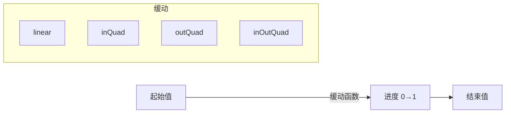

# 补间动画

Next2D Player 使用 `@next2d/ui` 包的 Tween 系统来实现程序化动画。您可以平滑地动画化位置、大小和透明度等属性。

## 基本补间概念



## Tween.add()

使用 `Tween.add()` 方法创建动画用的 `Job` 实例。

```typescript
const { Tween, Easing } = next2d.ui;

const job = Tween.add(
    target,    // 动画目标对象
    from,      // 起始属性值
    to,        // 结束属性值
    delay,     // 延迟时间（秒，默认：0）
    duration,  // 动画持续时间（秒，默认：1）
    ease       // 缓动函数（默认：linear）
);

// 开始动画
job.start();
```

### 参数

| 参数 | 类型 | 默认值 | 说明 |
|------|------|--------|------|
| `target` | any | - | 动画目标对象 |
| `from` | object | - | 起始属性值 |
| `to` | object | - | 结束属性值 |
| `delay` | number | 0 | 动画开始前的延迟（秒） |
| `duration` | number | 1 | 动画持续时间（秒） |
| `ease` | Function \| null | null | 缓动函数（默认为 linear） |

### 返回值

`Job` - 动画作业实例

## Job 类

Job 类管理各个动画作业。它继承自 EventDispatcher。

### 方法

| 方法 | 返回值 | 说明 |
|------|--------|------|
| `start()` | void | 开始动画 |
| `stop()` | void | 停止动画 |
| `chain(nextJob: Job \| null)` | Job \| null | 在此作业完成后连接另一个作业 |

### 属性

| 属性 | 类型 | 说明 |
|------|------|------|
| `target` | any | 目标对象 |
| `from` | object | 起始值 |
| `to` | object | 结束值 |
| `delay` | number | 延迟时间 |
| `duration` | number | 持续时间 |
| `ease` | Function | 缓动函数 |
| `currentTime` | number | 当前动画时间 |
| `nextJob` | Job \| null | 下一个连接的作业 |

### 事件

| 事件 | 说明 |
|------|------|
| `enterFrame` | 每个动画帧触发 |
| `complete` | 动画完成时触发 |

## 缓动函数

`Easing` 类提供 11 种缓动类型的 In、Out、InOut 变体，共 32 种缓动函数。

### Linear / 线性
- `Easing.linear` - 匀速

### Quadratic (Quad) / 二次函数
- `Easing.inQuad` - 从零速度加速
- `Easing.outQuad` - 减速到零速度
- `Easing.inOutQuad` - 加速到中间，然后减速

### Cubic / 三次函数
- `Easing.inCubic` / `Easing.outCubic` / `Easing.inOutCubic`

### Quartic (Quart) / 四次函数
- `Easing.inQuart` / `Easing.outQuart` / `Easing.inOutQuart`

### Quintic (Quint) / 五次函数
- `Easing.inQuint` / `Easing.outQuint` / `Easing.inOutQuint`

### Sinusoidal (Sine) / 正弦波
- `Easing.inSine` / `Easing.outSine` / `Easing.inOutSine`

### Exponential (Expo) / 指数函数
- `Easing.inExpo` / `Easing.outExpo` / `Easing.inOutExpo`

### Circular (Circ) / 圆形
- `Easing.inCirc` / `Easing.outCirc` / `Easing.inOutCirc`

### Elastic / 弹性
- `Easing.inElastic` / `Easing.outElastic` / `Easing.inOutElastic`

### Back
- `Easing.inBack` / `Easing.outBack` / `Easing.inOutBack`

### Bounce / 弹跳
- `Easing.inBounce` / `Easing.outBounce` / `Easing.inOutBounce`

### 缓动函数参数

所有缓动函数接受 4 个参数：

```typescript
ease(t: number, b: number, c: number, d: number): number
```

- `t` - 当前时间 (0 到 d)
- `b` - 起始值
- `c` - 变化量（结束值 - 起始值）
- `d` - 持续时间

## 使用示例

### 基本移动动画

```typescript
const { Tween, Easing } = next2d.ui;

const sprite = new Sprite();
stage.addChild(sprite);

// 在 1 秒内将 x 从 0 移动到 400
const job = Tween.add(
    sprite,
    { x: 0, y: 100 },
    { x: 400, y: 100 },
    0,
    1,
    Easing.outQuad
);

job.start();
```

### 同时多属性动画

```typescript
const { Tween, Easing } = next2d.ui;

// 移动 + 缩放 + 淡入
const job = Tween.add(
    sprite,
    { x: 0, y: 0, scaleX: 1, scaleY: 1, alpha: 0 },
    { x: 200, y: 150, scaleX: 2, scaleY: 2, alpha: 1 },
    0,
    0.5,
    Easing.outCubic
);

job.start();
```

### 动画连接 (chain)

```typescript
const { Tween, Easing } = next2d.ui;

// 第一个动画
const job1 = Tween.add(
    sprite,
    { x: 0 },
    { x: 100 },
    0, 1,
    Easing.outQuad
);

// 第二个动画
const job2 = Tween.add(
    sprite,
    { x: 100 },
    { x: 200 },
    0, 1,
    Easing.inQuad
);

// 连接并执行
job1.chain(job2);
job1.start();
```

### 延迟动画

```typescript
const { Tween, Easing } = next2d.ui;

// 延迟 0.5 秒后在 1 秒内淡出
const job = Tween.add(
    sprite,
    { alpha: 1 },
    { alpha: 0 },
    0.5,
    1,
    Easing.inQuad
);

job.start();
```

### 使用事件

```typescript
const { Tween, Easing } = next2d.ui;

const job = Tween.add(
    sprite,
    { x: 0 },
    { x: 300 },
    0, 2,
    Easing.inOutQuad
);

// 每帧处理
job.addEventListener("enterFrame", (event) => {
    console.log("进行中:", job.currentTime);
});

// 完成时处理
job.addEventListener("complete", (event) => {
    console.log("动画完成!");
});

job.start();
```

### 游戏示例

#### 角色跳跃

```typescript
const { Tween, Easing } = next2d.ui;

function jump(character) {
    const startY = character.y;
    const jumpHeight = 100;

    // 上升
    const upJob = Tween.add(
        character,
        { y: startY },
        { y: startY - jumpHeight },
        0, 0.3,
        Easing.outQuad
    );

    // 下降
    const downJob = Tween.add(
        character,
        { y: startY - jumpHeight },
        { y: startY },
        0, 0.3,
        Easing.inQuad
    );

    // 连接上升 → 下降
    upJob.chain(downJob);
    upJob.start();
}
```

#### UI 动画

```typescript
const { Tween, Easing } = next2d.ui;

function showPopup(popup) {
    popup.scaleX = 0;
    popup.scaleY = 0;
    popup.alpha = 0;

    const job = Tween.add(
        popup,
        { scaleX: 0, scaleY: 0, alpha: 0 },
        { scaleX: 1, scaleY: 1, alpha: 1 },
        0, 0.4,
        Easing.outBack
    );

    job.start();
}

function hidePopup(popup) {
    const job = Tween.add(
        popup,
        { scaleX: 1, scaleY: 1, alpha: 1 },
        { scaleX: 0, scaleY: 0, alpha: 0 },
        0, 0.2,
        Easing.inQuad
    );

    job.addEventListener("complete", () => {
        popup.visible = false;
    });

    job.start();
}
```

#### 金币收集效果

```typescript
const { Tween, Easing } = next2d.ui;

function coinCollectEffect(coin) {
    const job = Tween.add(
        coin,
        { y: coin.y, alpha: 1, scaleX: 1, scaleY: 1 },
        { y: coin.y - 50, alpha: 0, scaleX: 0.5, scaleY: 0.5 },
        0, 0.5,
        Easing.outQuad
    );

    job.addEventListener("enterFrame", () => {
        coin.rotation += 15;
    });

    job.addEventListener("complete", () => {
        coin.parent?.removeChild(coin);
    });

    job.start();
}
```

### 停止和控制

```typescript
const { Tween, Easing } = next2d.ui;

const job = Tween.add(
    sprite,
    { x: 0 },
    { x: 400 },
    0, 2,
    Easing.linear
);

job.start();

// 中途停止
stopButton.addEventListener(PointerEvent.POINTER_DOWN, () => {
    job.stop();
});
```

## 相关

- [DisplayObject](/cn/reference/player/display-object)
- [事件系统](/cn/reference/player/events)
