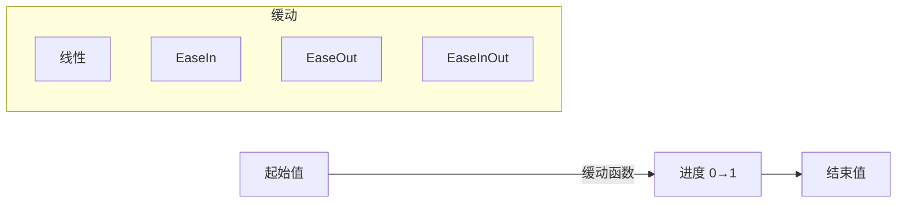

# 补间动画

Next2D Player 允许您实现程序化动画（补间）。您可以平滑地动画化位置、大小和透明度等属性。

## 基本补间概念



## 基本 Tween 类

```javascript
class Tween {
    constructor(target, options) {
        this._target = target;
        this._properties = {};
        this._duration = options.duration;
        this._easing = options.easing || Easing.linear;
        this._startTime = 0;
        this._isPlaying = false;
        this._onUpdate = options.onUpdate;
        this._onComplete = options.onComplete;
    }

    to(properties) {
        for (const key in properties) {
            this._properties[key] = {
                start: this._target[key],
                end: properties[key]
            };
        }
        return this;
    }

    play() {
        this._startTime = Date.now();
        this._isPlaying = true;
        this._update();
        return this;
    }

    _update() {
        const self = this;
        if (!this._isPlaying) return;

        const elapsed = Date.now() - this._startTime;
        let progress = Math.min(1, elapsed / this._duration);
        progress = this._easing(progress);

        // 更新属性
        for (const key in this._properties) {
            const prop = this._properties[key];
            this._target[key] = prop.start + (prop.end - prop.start) * progress;
        }

        if (this._onUpdate) {
            this._onUpdate();
        }

        if (elapsed < this._duration) {
            requestAnimationFrame(function() { self._update(); });
        } else {
            this._isPlaying = false;
            if (this._onComplete) {
                this._onComplete();
            }
        }
    }

    stop() {
        this._isPlaying = false;
    }
}
```

## 缓动函数

```javascript
const Easing = {
    // 线性
    linear: function(t) { return t; },

    // 加速
    easeInQuad: function(t) { return t * t; },
    easeInCubic: function(t) { return t * t * t; },
    easeInQuart: function(t) { return t * t * t * t; },

    // 减速
    easeOutQuad: function(t) { return t * (2 - t); },
    easeOutCubic: function(t) { return (--t) * t * t + 1; },
    easeOutQuart: function(t) { return 1 - (--t) * t * t * t; },

    // 加速 → 减速
    easeInOutQuad: function(t) {
        return t < 0.5 ? 2 * t * t : -1 + (4 - 2 * t) * t;
    },
    easeInOutCubic: function(t) {
        return t < 0.5 ? 4 * t * t * t : (t - 1) * (2 * t - 2) * (2 * t - 2) + 1;
    },

    // 弹跳
    easeOutBounce: function(t) {
        if (t < 1 / 2.75) {
            return 7.5625 * t * t;
        } else if (t < 2 / 2.75) {
            return 7.5625 * (t -= 1.5 / 2.75) * t + 0.75;
        } else if (t < 2.5 / 2.75) {
            return 7.5625 * (t -= 2.25 / 2.75) * t + 0.9375;
        } else {
            return 7.5625 * (t -= 2.625 / 2.75) * t + 0.984375;
        }
    },

    // Back（超调然后返回）
    easeOutBack: function(t) {
        const c1 = 1.70158;
        const c3 = c1 + 1;
        return 1 + c3 * Math.pow(t - 1, 3) + c1 * Math.pow(t - 1, 2);
    },

    // 弹性（橡皮筋般的运动）
    easeOutElastic: function(t) {
        if (t === 0 || t === 1) return t;
        return Math.pow(2, -10 * t) * Math.sin((t * 10 - 0.75) * (2 * Math.PI) / 3) + 1;
    }
};
```

## 使用示例

### 基本移动动画

```javascript
const { Sprite } = next2d.display;

const sprite = new Sprite();
sprite.x = 0;
sprite.y = 100;
stage.addChild(sprite);

// 向右移动
new Tween(sprite, { duration: 1000, easing: Easing.easeOutQuad })
    .to({ x: 400 })
    .play();
```

### 同时多属性动画

```javascript
// 移动 + 缩放 + 淡入
new Tween(sprite, {
    duration: 500,
    easing: Easing.easeOutCubic
})
    .to({
        x: 200,
        y: 150,
        scaleX: 2,
        scaleY: 2,
        alpha: 1
    })
    .play();
```

### 顺序动画

```javascript
// 连续动画
function sequentialAnimation(sprite) {
    new Tween(sprite, {
        duration: 500,
        onComplete: function() {
            new Tween(sprite, {
                duration: 300,
                onComplete: function() {
                    new Tween(sprite, { duration: 500 })
                        .to({ alpha: 0 })
                        .play();
                }
            })
                .to({ scaleX: 1.5, scaleY: 1.5 })
                .play();
        }
    })
        .to({ y: 100 })
        .play();
}
```

### 游戏示例

#### 角色跳跃

```javascript
function jump(character) {
    const startY = character.y;
    const jumpHeight = 100;

    // 上升
    new Tween(character, {
        duration: 300,
        easing: Easing.easeOutQuad,
        onComplete: function() {
            // 下降
            new Tween(character, {
                duration: 300,
                easing: Easing.easeInQuad
            })
                .to({ y: startY })
                .play();
        }
    })
        .to({ y: startY - jumpHeight })
        .play();
}
```

#### 伤害效果

```javascript
function damageEffect(target) {
    const originalX = target.x;
    let shakeCount = 0;

    // 闪烁 + 震动
    function shake() {
        if (shakeCount >= 6) {
            target.x = originalX;
            target.alpha = 1;
            return;
        }

        const offset = shakeCount % 2 === 0 ? 5 : -5;
        target.x = originalX + offset;
        target.alpha = shakeCount % 2 === 0 ? 0.5 : 1;
        shakeCount++;

        setTimeout(shake, 50);
    }

    shake();
}
```

#### 金币收集效果

```javascript
function coinCollectEffect(coin, targetY) {
    // 向上浮动并淡出
    new Tween(coin, {
        duration: 500,
        easing: Easing.easeOutQuad,
        onUpdate: function() {
            // 旋转
            coin.rotation += 15;
        },
        onComplete: function() {
            if (coin.parent) {
                coin.parent.removeChild(coin);
            }
        }
    })
        .to({
            y: targetY,
            alpha: 0,
            scaleX: 0.5,
            scaleY: 0.5
        })
        .play();
}
```

#### UI 动画

```javascript
function showPopup(popup) {
    popup.scaleX = 0;
    popup.scaleY = 0;
    popup.alpha = 0;

    new Tween(popup, {
        duration: 400,
        easing: Easing.easeOutBack
    })
        .to({ scaleX: 1, scaleY: 1, alpha: 1 })
        .play();
}

function hidePopup(popup, onComplete) {
    new Tween(popup, {
        duration: 200,
        easing: Easing.easeInQuad,
        onComplete: onComplete
    })
        .to({ scaleX: 0, scaleY: 0, alpha: 0 })
        .play();
}
```

## 基于 enterFrame 的轻量级补间

```javascript
// 简单的基于 enterFrame 的补间
function tweenTo(target, property, endValue, speed) {
    speed = speed || 0.1;

    function handler(event) {
        const current = target[property];
        const diff = endValue - current;

        if (Math.abs(diff) < 0.1) {
            target[property] = endValue;
            stage.removeEventListener("enterFrame", handler);
        } else {
            target[property] = current + diff * speed;
        }
    }

    stage.addEventListener("enterFrame", handler);
}

// 使用
tweenTo(sprite, "x", 300, 0.15);  // 将 x 移向 300
tweenTo(sprite, "alpha", 0, 0.05);  // 淡出
```

## 自定义缓动

```javascript
// 基于贝塞尔曲线的缓动
function bezierEasing(x1, y1, x2, y2) {
    return function(t) {
        // 简单的三次贝塞尔插值
        const cx = 3 * x1;
        const bx = 3 * (x2 - x1) - cx;
        const ax = 1 - cx - bx;

        const cy = 3 * y1;
        const by = 3 * (y2 - y1) - cy;
        const ay = 1 - cy - by;

        function sampleCurveY(t) {
            return ((ay * t + by) * t + cy) * t;
        }

        return sampleCurveY(t);
    };
}

// CSS cubic-bezier 等效
const customEase = bezierEasing(0.25, 0.1, 0.25, 1.0);
```

## 性能提示

1. **使用 requestAnimationFrame**：比 setTimeout 更流畅
2. **最小化属性更改**：只更新必要的属性
3. **对象池**：为多个动画池化和重用补间
4. **完成后清理**：移除不必要的侦听器

## 相关

- [DisplayObject](/cn/reference/player/display-object)
- [事件系统](/cn/reference/player/events)
