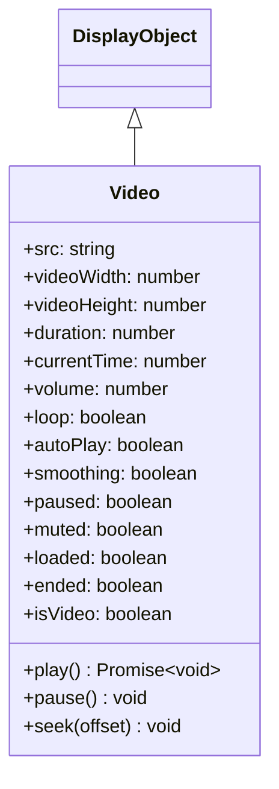

# Video

Video 是用于播放视频内容的 DisplayObject。它支持 WebM 和 MP4 等视频格式。

## 继承



## 属性

| 属性 | 类型 | 默认值 | 说明 |
|------|------|--------|------|
| `src` | string | "" | 指定视频内容的 URL |
| `videoWidth` | number | 0 | 指定视频宽度的整数（像素） |
| `videoHeight` | number | 0 | 指定视频高度的整数（像素） |
| `duration` | number | 0 | 总关键帧数（视频持续时间） |
| `currentTime` | number | 0 | 当前关键帧（播放位置） |
| `volume` | number | 1 | 音量，范围从 0（静音）到 1（最大音量） |
| `loop` | boolean | false | 指定是否生成视频循环 |
| `autoPlay` | boolean | true | 设置自动视频播放 |
| `smoothing` | boolean | true | 指定缩放时是否对视频进行平滑（插值） |
| `paused` | boolean | true | 返回视频是否已暂停 |
| `muted` | boolean | false | 返回视频是否已静音 |
| `loaded` | boolean | false | 返回视频是否已加载 |
| `ended` | boolean | false | 返回视频是否已结束 |
| `isVideo` | boolean | true | 返回显示对象是否具有 Video 功能（只读） |

## 方法

| 方法 | 返回值 | 说明 |
|------|--------|------|
| `play()` | Promise\<void\> | 播放视频文件 |
| `pause()` | void | 暂停视频播放 |
| `seek(offset: number)` | void | 跳转到最接近指定位置的关键帧 |

## 使用示例

### 基本视频播放

```javascript
const { Video } = next2d.media;

// 创建 Video 对象
const video = new Video(640, 360);

// 设置视频源
video.src = "video.mp4";
video.autoPlay = true;
video.loop = false;
video.volume = 0.8;

// 添加到舞台
stage.addChild(video);
```

### 播放控制

```javascript
const { Video } = next2d.media;

const video = new Video(640, 360);
video.src = "video.mp4";
stage.addChild(video);

// 播放按钮
playButton.addEventListener("click", async function() {
    await video.play();
});

// 暂停按钮
pauseButton.addEventListener("click", function() {
    video.pause();
});

// 停止按钮（暂停并返回开始）
stopButton.addEventListener("click", function() {
    video.pause();
    video.seek(0);
});

// 快进 10 秒
forwardButton.addEventListener("click", function() {
    video.seek(video.currentTime + 10);
});

// 后退 10 秒
backButton.addEventListener("click", function() {
    video.seek(Math.max(0, video.currentTime - 10));
});
```

### 显示播放进度

```javascript
const { Video } = next2d.media;

const video = new Video(640, 360);
video.src = "video.mp4";
stage.addChild(video);

// 每帧更新进度
stage.addEventListener("enterFrame", function() {
    if (video.duration > 0) {
        const progress = video.currentTime / video.duration;
        progressBar.scaleX = progress;
        timeLabel.text = formatTime(video.currentTime) + " / " + formatTime(video.duration);
    }
});

function formatTime(seconds) {
    const min = Math.floor(seconds / 60);
    const sec = Math.floor(seconds % 60);
    return min + ":" + sec.toString().padStart(2, '0');
}
```

### 音量控制

```javascript
const { Video } = next2d.media;

const video = new Video(640, 360);
video.src = "video.mp4";
video.volume = 0.5;  // 50%
stage.addChild(video);

// 音量滑块
volumeSlider.addEventListener("change", function(event) {
    video.volume = event.target.value;  // 0.0 ~ 1.0
});

// 静音切换
let isMuted = false;
let previousVolume = 0.5;

muteButton.addEventListener("click", function() {
    isMuted = !isMuted;
    if (isMuted) {
        previousVolume = video.volume;
        video.volume = 0;
    } else {
        video.volume = previousVolume;
    }
});
```

### 全屏支持

```javascript
const { Video } = next2d.media;

const video = new Video(640, 360);
video.src = "video.mp4";
stage.addChild(video);

// 全屏切换
fullscreenButton.addEventListener("click", function() {
    if (stage.displayState === "normal") {
        // 切换到全屏
        stage.displayState = "fullScreen";
        video.width = stage.stageWidth;
        video.height = stage.stageHeight;
    } else {
        // 返回正常显示
        stage.displayState = "normal";
        video.width = 640;
        video.height = 360;
    }
});
```

### 视频播放器组件

```javascript
const { Sprite } = next2d.display;
const { Video } = next2d.media;

class VideoPlayer extends Sprite {
    constructor(width, height) {
        super();

        this._width = width;
        this._height = height;

        this._video = new Video(width, height);
        this.addChild(this._video);
    }

    load(url) {
        this._video.src = url;
    }

    async play() {
        await this._video.play();
    }

    pause() {
        this._video.pause();
    }

    seek(time) {
        this._video.seek(time);
    }

    get currentTime() {
        return this._video.currentTime;
    }

    get duration() {
        return this._video.duration || 0;
    }

    set volume(value) {
        this._video.volume = value;
    }

    get volume() {
        return this._video.volume;
    }
}

// 使用
const player = new VideoPlayer(640, 360);
stage.addChild(player);
player.load("video.mp4");
player.play();
```

### 循环播放和自动播放

```javascript
const { Video } = next2d.media;

const video = new Video(640, 360);
video.src = "background-video.mp4";
video.autoPlay = true;
video.loop = true;
video.volume = 0;  // 静音背景视频

stage.addChild(video);
```

## 支持的格式

| 格式 | 扩展名 | 支持 |
|------|--------|------|
| MP4 (H.264) | .mp4 | 推荐 |
| WebM (VP8/VP9) | .webm | 支持 |
| Ogg Theora | .ogv | 取决于浏览器 |

## 相关

- [DisplayObject](/cn/reference/player/display-object)
- [事件系统](/cn/reference/player/events)
