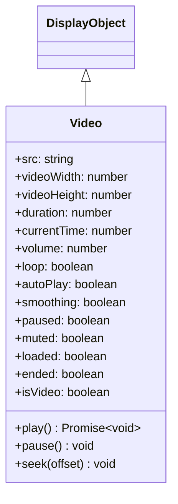

# Video

Video 是用于播放视频内容的 DisplayObject。它支持 WebM 和 MP4 等视频格式。

## 继承



## 属性

| 属性 | 类型 | 默认值 | 说明 |
|------|------|--------|------|
| `src` | string | "" | 指定视频内容的 URL |
| `videoWidth` | number | 0 | 指定视频宽度的整数（像素） |
| `videoHeight` | number | 0 | 指定视频高度的整数（像素） |
| `duration` | number | 0 | 总关键帧数（视频持续时间） |
| `currentTime` | number | 0 | 当前关键帧（播放位置） |
| `volume` | number | 1 | 音量，范围从 0（静音）到 1（最大音量） |
| `loop` | boolean | false | 指定是否循环播放视频 |
| `autoPlay` | boolean | true | 设置自动视频播放 |
| `smoothing` | boolean | true | 指定缩放时是否对视频进行平滑（插值） |
| `paused` | boolean | true | 返回视频是否已暂停 |
| `muted` | boolean | false | 返回视频是否已静音 |
| `loaded` | boolean | false | 返回视频是否已加载 |
| `ended` | boolean | false | 返回视频是否已结束 |
| `isVideo` | boolean | true | 返回显示对象是否具有 Video 功能（只读） |

## 方法

| 方法 | 返回值 | 说明 |
|------|--------|------|
| `play()` | Promise\<void\> | 播放视频文件 |
| `pause()` | void | 暂停视频播放 |
| `seek(offset: number)` | void | 跳转到最接近指定位置的关键帧 |

## 使用示例

### 基本视频播放

```typescript
const { Video } = next2d.media;

// 创建 Video 对象（指定宽度、高度）
const video = new Video(640, 360);

// 设置视频源（设置后自动开始加载）
video.src = "video.mp4";

// 属性设置
video.autoPlay = true;   // 自动播放
video.loop = false;      // 不循环
video.smoothing = true;  // 启用平滑

// 添加到舞台
stage.addChild(video);
```

### 播放控制

```typescript
const { Video } = next2d.media;
const { PointerEvent } = next2d.events;

const video = new Video(640, 360);
video.autoPlay = false;  // 禁用自动播放
video.src = "video.mp4";

stage.addChild(video);

// 播放按钮
playButton.addEventListener(PointerEvent.POINTER_DOWN, async () => {
    await video.play();
});

// 暂停按钮
pauseButton.addEventListener(PointerEvent.POINTER_DOWN, () => {
    video.pause();
});

// 停止按钮（暂停并返回开始）
stopButton.addEventListener(PointerEvent.POINTER_DOWN, () => {
    video.pause();
    video.seek(0);
});

// 快进 10 秒
forwardButton.addEventListener(PointerEvent.POINTER_DOWN, () => {
    video.seek(video.currentTime + 10);
});

// 后退 10 秒
backButton.addEventListener(PointerEvent.POINTER_DOWN, () => {
    video.seek(Math.max(0, video.currentTime - 10));
});
```

### 事件侦听

```typescript
const { Video } = next2d.media;
const { VideoEvent } = next2d.events;

const video = new Video(640, 360);

// 播放事件
video.addEventListener(VideoEvent.PLAY, () => {
    console.log("播放请求");
});

// 开始播放事件
video.addEventListener(VideoEvent.PLAYING, () => {
    console.log("播放开始");
});

// 暂停事件
video.addEventListener(VideoEvent.PAUSE, () => {
    console.log("已暂停");
});

// 跳转事件
video.addEventListener(VideoEvent.SEEK, () => {
    console.log("跳转:", video.currentTime);
});

video.src = "video.mp4";
stage.addChild(video);
```

### 显示播放进度

```typescript
const { Video } = next2d.media;

const video = new Video(640, 360);
video.src = "video.mp4";
stage.addChild(video);

// 每帧更新进度
stage.addEventListener("enterFrame", () => {
    if (video.duration > 0) {
        const progress = video.currentTime / video.duration;
        progressBar.scaleX = progress;
        timeLabel.text = formatTime(video.currentTime) + " / " + formatTime(video.duration);
    }
});

function formatTime(seconds) {
    const min = Math.floor(seconds / 60);
    const sec = Math.floor(seconds % 60);
    return min + ":" + sec.toString().padStart(2, '0');
}
```

### 音量控制

```typescript
const { Video } = next2d.media;

const video = new Video(640, 360);
video.src = "video.mp4";
video.volume = 0.5;  // 50%

stage.addChild(video);

// 静音切换
muteButton.addEventListener(PointerEvent.POINTER_DOWN, () => {
    video.muted = !video.muted;
});
```

### 循环播放

```typescript
const { Video } = next2d.media;

const video = new Video(640, 360);
video.loop = true;  // 启用循环
video.src = "video.mp4";

stage.addChild(video);
```

## VideoEvent

| 事件 | 说明 |
|------|------|
| `VideoEvent.PLAY` | 播放被请求时 |
| `VideoEvent.PLAYING` | 播放开始时 |
| `VideoEvent.PAUSE` | 暂停时 |
| `VideoEvent.SEEK` | 跳转时 |

## 支持的格式

| 格式 | 扩展名 | 支持 |
|------|--------|------|
| MP4 (H.264) | .mp4 | 推荐 |
| WebM (VP8/VP9) | .webm | 支持 |
| Ogg Theora | .ogv | 取决于浏览器 |

## 相关

- [DisplayObject](/cn/reference/player/display-object)
- [事件系统](/cn/reference/player/events)
