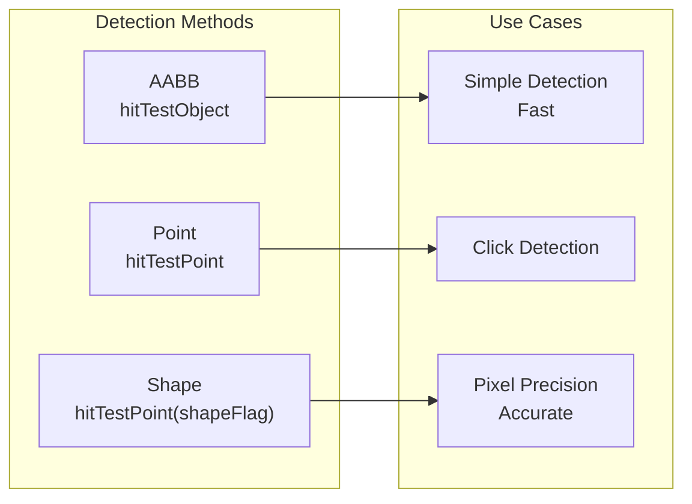

# Collision Detection

Collision detection (hit testing) is an essential feature in game development. Next2D Player provides built-in collision detection methods.

## Types of Collision Detection



## hitTestObject

Performs collision detection using the bounding boxes of two DisplayObjects.

```typescript
import type { DisplayObject, Sprite } from "@next2d/player";

// Basic usage
const isColliding: boolean = object1.hitTestObject(object2);

if (player.hitTestObject(enemy)) {
  // Collision handling
  handleCollision();
}
```

### Player-Enemy Collision

```typescript
interface Entity {
  sprite: Sprite;
  isActive: boolean;
}

function checkPlayerEnemyCollision(
  player: Entity,
  enemies: Entity[]
): Entity | null {
  for (const enemy of enemies) {
    if (!enemy.isActive) continue;

    if (player.sprite.hitTestObject(enemy.sprite)) {
      return enemy;  // Return collided enemy
    }
  }
  return null;
}

// Use in game loop
function gameLoop(): void {
  const hitEnemy = checkPlayerEnemyCollision(player, enemies);
  if (hitEnemy) {
    player.takeDamage();
    hitEnemy.isActive = false;
  }
}
```

### Bullet-Enemy Collision

```typescript
function checkBulletEnemyCollisions(
  bullets: Entity[],
  enemies: Entity[]
): void {
  for (const bullet of bullets) {
    if (!bullet.isActive) continue;

    for (const enemy of enemies) {
      if (!enemy.isActive) continue;

      if (bullet.sprite.hitTestObject(enemy.sprite)) {
        // Collision handling
        bullet.isActive = false;
        bullet.sprite.visible = false;

        enemy.takeDamage();
        if (enemy.hp <= 0) {
          enemy.isActive = false;
          enemy.sprite.visible = false;
          addScore(100);
        }
        break;  // End detection for this bullet
      }
    }
  }
}
```

## hitTestPoint

Performs collision detection with a specified coordinate.

```typescript
// Detection with bounding box (fast)
const hit: boolean = sprite.hitTestPoint(x, y, false);

// Detection with actual shape (accurate)
const hitShape: boolean = sprite.hitTestPoint(x, y, true);
```

### Click Detection

```typescript
import type { MouseEvent, Sprite } from "@next2d/player";

function onStageClick(event: MouseEvent): void {
  const x: number = event.stageX;
  const y: number = event.stageY;

  // Find clicked object
  for (const item of clickableItems) {
    if (item.hitTestPoint(x, y, true)) {
      handleItemClick(item);
      break;
    }
  }
}

stage.addEventListener("click", onStageClick);
```

### Precise Hit Detection with Shape Flag

```typescript
// Complex shaped character
function isHitByBullet(character: Sprite, bulletX: number, bulletY: number): boolean {
  // Passing true checks actual pixel shape
  return character.hitTestPoint(bulletX, bulletY, true);
}
```

## Custom Collision Detection

### Circle-Circle Collision

```typescript
interface Circle {
  x: number;
  y: number;
  radius: number;
}

function circleCollision(c1: Circle, c2: Circle): boolean {
  const dx: number = c1.x - c2.x;
  const dy: number = c1.y - c2.y;
  const distance: number = Math.sqrt(dx * dx + dy * dy);
  return distance < c1.radius + c2.radius;
}

// Usage
const player: Circle = { x: 100, y: 100, radius: 20 };
const enemy: Circle = { x: 150, y: 120, radius: 15 };

if (circleCollision(player, enemy)) {
  // Collision
}
```

### Rectangle-Rectangle Collision (AABB)

```typescript
interface Rectangle {
  x: number;
  y: number;
  width: number;
  height: number;
}

function rectCollision(r1: Rectangle, r2: Rectangle): boolean {
  return r1.x < r2.x + r2.width &&
         r1.x + r1.width > r2.x &&
         r1.y < r2.y + r2.height &&
         r1.y + r1.height > r2.y;
}
```

### Circle-Rectangle Collision

```typescript
function circleRectCollision(circle: Circle, rect: Rectangle): boolean {
  // Find closest point on rectangle
  const closestX: number = Math.max(rect.x, Math.min(circle.x, rect.x + rect.width));
  const closestY: number = Math.max(rect.y, Math.min(circle.y, rect.y + rect.height));

  // Calculate distance to circle center
  const dx: number = circle.x - closestX;
  const dy: number = circle.y - closestY;
  const distance: number = Math.sqrt(dx * dx + dy * dy);

  return distance < circle.radius;
}
```

## Spatial Partitioning Optimization

### Grid-Based Collision Detection

```typescript
interface GridCell {
  entities: Entity[];
}

class SpatialGrid {
  private _cellSize: number;
  private _cells: Map<string, GridCell> = new Map();

  constructor(cellSize: number) {
    this._cellSize = cellSize;
  }

  private _getCellKey(x: number, y: number): string {
    const cellX: number = Math.floor(x / this._cellSize);
    const cellY: number = Math.floor(y / this._cellSize);
    return `${cellX},${cellY}`;
  }

  clear(): void {
    this._cells.clear();
  }

  insert(entity: Entity): void {
    const key: string = this._getCellKey(entity.x, entity.y);
    let cell: GridCell | undefined = this._cells.get(key);

    if (!cell) {
      cell = { entities: [] };
      this._cells.set(key, cell);
    }

    cell.entities.push(entity);
  }

  getNearby(x: number, y: number): Entity[] {
    const result: Entity[] = [];

    // Check surrounding 9 cells
    for (let dx = -1; dx <= 1; dx++) {
      for (let dy = -1; dy <= 1; dy++) {
        const cellX: number = Math.floor(x / this._cellSize) + dx;
        const cellY: number = Math.floor(y / this._cellSize) + dy;
        const key: string = `${cellX},${cellY}`;
        const cell: GridCell | undefined = this._cells.get(key);

        if (cell) {
          result.push(...cell.entities);
        }
      }
    }

    return result;
  }
}

// Usage
const grid: SpatialGrid = new SpatialGrid(100);

function checkCollisions(): void {
  // Clear and rebuild grid
  grid.clear();
  for (const enemy of enemies) {
    if (enemy.isActive) {
      grid.insert(enemy);
    }
  }

  // Only check nearby player
  const nearbyEnemies: Entity[] = grid.getNearby(player.x, player.y);
  for (const enemy of nearbyEnemies) {
    if (player.sprite.hitTestObject(enemy.sprite)) {
      handleCollision(player, enemy);
    }
  }
}
```

## Collision Response

### Push Back (Separation)

```typescript
function resolveCollision(
  moving: { x: number; y: number; vx: number; vy: number },
  static_: { x: number; y: number; width: number; height: number }
): void {
  // Calculate overlap amount
  const overlapLeft: number = (moving.x + 20) - static_.x;
  const overlapRight: number = (static_.x + static_.width) - (moving.x - 20);
  const overlapTop: number = (moving.y + 20) - static_.y;
  const overlapBottom: number = (static_.y + static_.height) - (moving.y - 20);

  // Push back in direction of minimum overlap
  const minOverlapX: number = overlapLeft < overlapRight ? -overlapLeft : overlapRight;
  const minOverlapY: number = overlapTop < overlapBottom ? -overlapTop : overlapBottom;

  if (Math.abs(minOverlapX) < Math.abs(minOverlapY)) {
    moving.x += minOverlapX;
    moving.vx = 0;
  } else {
    moving.y += minOverlapY;
    moving.vy = 0;
  }
}
```

### Reflection (Bounce)

```typescript
function reflectVelocity(
  entity: { vx: number; vy: number },
  normalX: number,
  normalY: number,
  bounciness: number = 0.8
): void {
  // Calculate reflection vector
  const dot: number = entity.vx * normalX + entity.vy * normalY;
  entity.vx = (entity.vx - 2 * dot * normalX) * bounciness;
  entity.vy = (entity.vy - 2 * dot * normalY) * bounciness;
}

// Bounce off walls
function bounceOffWalls(ball: Entity): void {
  if (ball.x - ball.radius < 0) {
    ball.x = ball.radius;
    reflectVelocity(ball, 1, 0);  // Left wall
  }
  if (ball.x + ball.radius > stage.stageWidth) {
    ball.x = stage.stageWidth - ball.radius;
    reflectVelocity(ball, -1, 0);  // Right wall
  }
  if (ball.y - ball.radius < 0) {
    ball.y = ball.radius;
    reflectVelocity(ball, 0, 1);  // Top wall
  }
  if (ball.y + ball.radius > stage.stageHeight) {
    ball.y = stage.stageHeight - ball.radius;
    reflectVelocity(ball, 0, -1);  // Bottom wall
  }
}
```

## Platformer Collision Detection

```typescript
interface Platform {
  x: number;
  y: number;
  width: number;
  height: number;
}

function checkPlatformCollision(
  player: { x: number; y: number; vy: number; width: number; height: number },
  platforms: Platform[]
): boolean {
  let onGround: boolean = false;

  for (const platform of platforms) {
    // Is player's feet on platform surface?
    const playerBottom: number = player.y + player.height / 2;
    const playerLeft: number = player.x - player.width / 2;
    const playerRight: number = player.x + player.width / 2;

    if (playerBottom >= platform.y &&
        playerBottom <= platform.y + 10 &&  // Tolerance
        playerRight > platform.x &&
        playerLeft < platform.x + platform.width &&
        player.vy >= 0) {  // Only when falling
      player.y = platform.y - player.height / 2;
      player.vy = 0;
      onGround = true;
    }
  }

  return onGround;
}
```

## Performance Tips

1. **Early Return**: Exit early when collision is clearly impossible
2. **Spatial Partitioning**: Use grids or quadtrees for many objects
3. **Simplify Detection**: Approximate complex shapes with simple shapes (circles, rectangles)
4. **Adjust Frequency**: Only check fast-moving objects every frame

```typescript
// Early return with distance check
function quickDistanceCheck(e1: Entity, e2: Entity, maxDistance: number): boolean {
  const dx: number = e1.x - e2.x;
  const dy: number = e1.y - e2.y;
  // Avoid Math.sqrt for performance
  return dx * dx + dy * dy < maxDistance * maxDistance;
}

function checkCollisions(): void {
  for (const enemy of enemies) {
    // Skip if too far
    if (!quickDistanceCheck(player, enemy, 100)) continue;

    // Detailed detection
    if (player.sprite.hitTestObject(enemy.sprite)) {
      handleCollision();
    }
  }
}
```

## Related

- [DisplayObject](./display-object.md)
- [Game Loop](./game-loop.md)
- [Performance Optimization](./performance.md)
