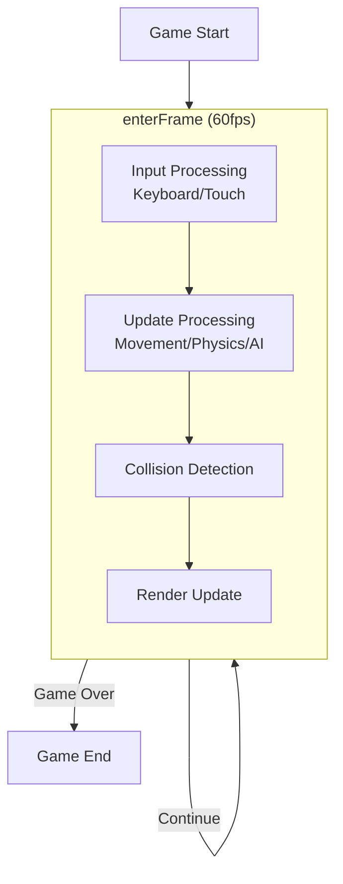

# Game Loop

The game loop is one of the most important concepts in game development. Next2D Player uses the `enterFrame` event to implement per-frame processing.

## Basic Game Loop Structure



## Basic Game Loop

```typescript
import type { Stage, Event } from "@next2d/player";

class Game {
  private _stage: Stage;
  private _isRunning: boolean = false;

  constructor(stage: Stage) {
    this._stage = stage;
  }

  start(): void {
    this._isRunning = true;
    this._stage.addEventListener("enterFrame", this._gameLoop);
  }

  stop(): void {
    this._isRunning = false;
    this._stage.removeEventListener("enterFrame", this._gameLoop);
  }

  private _gameLoop = (event: Event): void => {
    if (!this._isRunning) return;

    this._processInput();
    this._update();
    this._checkCollisions();
    // Rendering is handled automatically by Next2D
  };

  private _processInput(): void {
    // Input processing
  }

  private _update(): void {
    // Game logic update
  }

  private _checkCollisions(): void {
    // Collision detection
  }
}
```

## Input Processing

### Keyboard Input

```typescript
import type { KeyboardEvent } from "@next2d/player";

// Manage key states
const keys: Record<string, boolean> = {};

// Key code constants
const KeyCode = {
  LEFT: 37,
  UP: 38,
  RIGHT: 39,
  DOWN: 40,
  SPACE: 32,
  ENTER: 13,
  A: 65,
  D: 68,
  W: 87,
  S: 83
} as const;

// Set up event listeners
stage.addEventListener("keyDown", (event: KeyboardEvent): void => {
  keys[event.keyCode] = true;
});

stage.addEventListener("keyUp", (event: KeyboardEvent): void => {
  keys[event.keyCode] = false;
});

// Use in game loop
function processInput(): void {
  if (keys[KeyCode.LEFT] || keys[KeyCode.A]) {
    player.x -= playerSpeed;
  }
  if (keys[KeyCode.RIGHT] || keys[KeyCode.D]) {
    player.x += playerSpeed;
  }
  if (keys[KeyCode.UP] || keys[KeyCode.W]) {
    player.y -= playerSpeed;
  }
  if (keys[KeyCode.DOWN] || keys[KeyCode.S]) {
    player.y += playerSpeed;
  }
  if (keys[KeyCode.SPACE]) {
    player.jump();
  }
}
```

### Touch/Mouse Input

```typescript
import { Point } from "@next2d/player";
import type { MouseEvent, TouchEvent } from "@next2d/player";

// Touch position
let touchPosition: Point | null = null;
let isTouching: boolean = false;

stage.addEventListener("mouseDown", (event: MouseEvent): void => {
  isTouching = true;
  touchPosition = new Point(event.stageX, event.stageY);
});

stage.addEventListener("mouseMove", (event: MouseEvent): void => {
  if (isTouching) {
    touchPosition = new Point(event.stageX, event.stageY);
  }
});

stage.addEventListener("mouseUp", (event: MouseEvent): void => {
  isTouching = false;
  touchPosition = null;
});

// Virtual joystick
function processTouch(): void {
  if (!touchPosition) return;

  const centerX: number = stage.stageWidth / 2;
  const centerY: number = stage.stageHeight / 2;

  const dx: number = touchPosition.x - centerX;
  const dy: number = touchPosition.y - centerY;

  // Normalize
  const length: number = Math.sqrt(dx * dx + dy * dy);
  if (length > 10) {
    player.x += (dx / length) * playerSpeed;
    player.y += (dy / length) * playerSpeed;
  }
}
```

## Update Processing

### Player Update

```typescript
interface Player {
  x: number;
  y: number;
  vx: number;
  vy: number;
  isJumping: boolean;
  sprite: DisplayObject;
}

const GRAVITY: number = 0.5;
const JUMP_FORCE: number = -12;
const GROUND_Y: number = 400;

function updatePlayer(player: Player): void {
  // Apply gravity
  player.vy += GRAVITY;

  // Update position
  player.x += player.vx;
  player.y += player.vy;

  // Ground detection
  if (player.y >= GROUND_Y) {
    player.y = GROUND_Y;
    player.vy = 0;
    player.isJumping = false;
  }

  // Apply to sprite
  player.sprite.x = player.x;
  player.sprite.y = player.y;
}

function playerJump(player: Player): void {
  if (!player.isJumping) {
    player.vy = JUMP_FORCE;
    player.isJumping = true;
  }
}
```

### Enemy Update

```typescript
interface Enemy {
  x: number;
  y: number;
  vx: number;
  type: string;
  sprite: DisplayObject;
  isActive: boolean;
}

function updateEnemies(enemies: Enemy[]): void {
  for (const enemy of enemies) {
    if (!enemy.isActive) continue;

    // Movement
    enemy.x += enemy.vx;

    // Off-screen detection
    if (enemy.x < -50 || enemy.x > stage.stageWidth + 50) {
      enemy.isActive = false;
      enemy.sprite.visible = false;
    }

    // Apply to sprite
    enemy.sprite.x = enemy.x;
    enemy.sprite.y = enemy.y;
  }
}
```

### Bullet Update

```typescript
import { Sprite } from "@next2d/player";

interface Bullet {
  x: number;
  y: number;
  vx: number;
  vy: number;
  sprite: DisplayObject;
  isActive: boolean;
}

const bulletPool: Bullet[] = [];

function fireBullet(startX: number, startY: number, dirX: number, dirY: number): void {
  // Get from pool or create new
  let bullet: Bullet | undefined = bulletPool.find(b => !b.isActive);

  if (!bullet) {
    const sprite: Sprite = new Sprite();
    sprite.graphics.beginFill(0xFFFF00);
    sprite.graphics.drawCircle(0, 0, 5);
    sprite.graphics.endFill();
    stage.addChild(sprite);

    bullet = { x: 0, y: 0, vx: 0, vy: 0, sprite, isActive: false };
    bulletPool.push(bullet);
  }

  // Initialize
  bullet.x = startX;
  bullet.y = startY;
  bullet.vx = dirX * 10;
  bullet.vy = dirY * 10;
  bullet.isActive = true;
  bullet.sprite.visible = true;
}

function updateBullets(): void {
  for (const bullet of bulletPool) {
    if (!bullet.isActive) continue;

    bullet.x += bullet.vx;
    bullet.y += bullet.vy;

    // Off-screen detection
    if (bullet.x < 0 || bullet.x > stage.stageWidth ||
        bullet.y < 0 || bullet.y > stage.stageHeight) {
      bullet.isActive = false;
      bullet.sprite.visible = false;
    }

    bullet.sprite.x = bullet.x;
    bullet.sprite.y = bullet.y;
  }
}
```

## Time-Based Update

Frame-rate independent update processing:

```typescript
let lastTime: number = 0;

function gameLoop(event: Event): void {
  const currentTime: number = Date.now();
  const deltaTime: number = (currentTime - lastTime) / 1000;  // In seconds
  lastTime = currentTime;

  // Update using deltaTime
  updateWithDelta(deltaTime);
}

function updateWithDelta(dt: number): void {
  // Movement at constant speed (same speed at 60fps or 30fps)
  player.x += player.vx * dt * 60;  // 60fps baseline
  player.y += player.vy * dt * 60;

  // Gravity
  player.vy += GRAVITY * dt * 60;
}
```

## Game State Management

```typescript
enum GameState {
  TITLE,
  PLAYING,
  PAUSED,
  GAME_OVER,
  CLEAR
}

class GameStateManager {
  private _state: GameState = GameState.TITLE;
  private _stage: Stage;

  constructor(stage: Stage) {
    this._stage = stage;
  }

  get state(): GameState {
    return this._state;
  }

  setState(newState: GameState): void {
    const oldState: GameState = this._state;
    this._state = newState;

    this._onStateChange(oldState, newState);
  }

  private _onStateChange(oldState: GameState, newState: GameState): void {
    switch (newState) {
      case GameState.TITLE:
        this._showTitle();
        break;
      case GameState.PLAYING:
        this._startGame();
        break;
      case GameState.PAUSED:
        this._pauseGame();
        break;
      case GameState.GAME_OVER:
        this._showGameOver();
        break;
      case GameState.CLEAR:
        this._showClear();
        break;
    }
  }

  private _showTitle(): void { /* ... */ }
  private _startGame(): void { /* ... */ }
  private _pauseGame(): void { /* ... */ }
  private _showGameOver(): void { /* ... */ }
  private _showClear(): void { /* ... */ }
}

// Use in game loop
function gameLoop(event: Event): void {
  switch (gameState.state) {
    case GameState.PLAYING:
      processInput();
      update();
      checkCollisions();
      break;
    case GameState.PAUSED:
      // Only process input during pause
      if (keys[KeyCode.ENTER]) {
        gameState.setState(GameState.PLAYING);
      }
      break;
  }
}
```

## Complete Game Loop Example

```typescript
import { Sprite } from "@next2d/player";
import type { Stage, Event, KeyboardEvent } from "@next2d/player";

class SimpleGame {
  private _stage: Stage;
  private _player: Sprite;
  private _enemies: Sprite[] = [];
  private _score: number = 0;
  private _isRunning: boolean = false;

  private _keys: Record<number, boolean> = {};
  private _playerSpeed: number = 5;

  constructor(stage: Stage) {
    this._stage = stage;
    this._setupInput();
    this._createPlayer();
  }

  private _setupInput(): void {
    this._stage.addEventListener("keyDown", (e: KeyboardEvent) => {
      this._keys[e.keyCode] = true;
    });
    this._stage.addEventListener("keyUp", (e: KeyboardEvent) => {
      this._keys[e.keyCode] = false;
    });
  }

  private _createPlayer(): void {
    this._player = new Sprite();
    this._player.graphics.beginFill(0x00FF00);
    this._player.graphics.drawRect(-20, -20, 40, 40);
    this._player.graphics.endFill();
    this._player.x = this._stage.stageWidth / 2;
    this._player.y = this._stage.stageHeight / 2;
    this._stage.addChild(this._player);
  }

  start(): void {
    this._isRunning = true;
    this._stage.addEventListener("enterFrame", this._gameLoop);
  }

  stop(): void {
    this._isRunning = false;
    this._stage.removeEventListener("enterFrame", this._gameLoop);
  }

  private _gameLoop = (event: Event): void => {
    if (!this._isRunning) return;

    // Input processing
    this._processInput();

    // Update
    this._update();

    // Collision detection
    this._checkCollisions();
  };

  private _processInput(): void {
    if (this._keys[37]) this._player.x -= this._playerSpeed;  // Left
    if (this._keys[39]) this._player.x += this._playerSpeed;  // Right
    if (this._keys[38]) this._player.y -= this._playerSpeed;  // Up
    if (this._keys[40]) this._player.y += this._playerSpeed;  // Down

    // Restrict to screen
    this._player.x = Math.max(20, Math.min(this._stage.stageWidth - 20, this._player.x));
    this._player.y = Math.max(20, Math.min(this._stage.stageHeight - 20, this._player.y));
  }

  private _update(): void {
    // Spawn enemies (random)
    if (Math.random() < 0.02) {
      this._spawnEnemy();
    }

    // Update enemies
    for (const enemy of this._enemies) {
      enemy.x -= 3;

      if (enemy.x < -30) {
        this._stage.removeChild(enemy);
        this._enemies.splice(this._enemies.indexOf(enemy), 1);
        this._score += 10;
      }
    }
  }

  private _spawnEnemy(): void {
    const enemy: Sprite = new Sprite();
    enemy.graphics.beginFill(0xFF0000);
    enemy.graphics.drawCircle(0, 0, 15);
    enemy.graphics.endFill();
    enemy.x = this._stage.stageWidth + 30;
    enemy.y = Math.random() * this._stage.stageHeight;
    this._stage.addChild(enemy);
    this._enemies.push(enemy);
  }

  private _checkCollisions(): void {
    for (const enemy of this._enemies) {
      if (this._player.hitTestObject(enemy)) {
        this.stop();
        console.log("Game Over! Score:", this._score);
      }
    }
  }
}

// Usage
const game: SimpleGame = new SimpleGame(stage);
game.start();
```

## Related

- [Event System](./events.md)
- [Collision Detection](./collision.md)
- [Performance Optimization](./performance.md)
