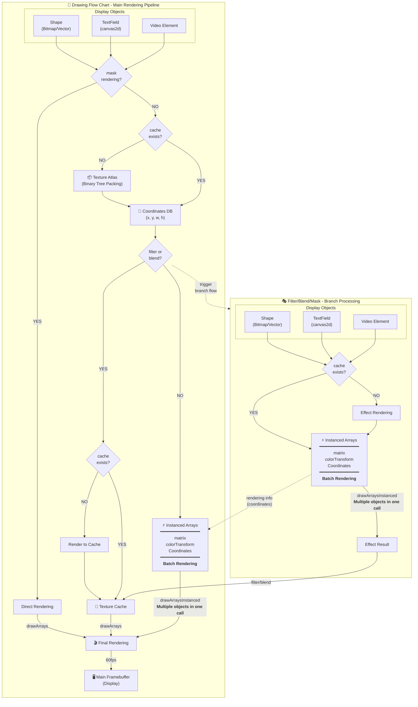

# Next2D Player

Next2D Player is a high-performance 2D rendering engine using WebGL/WebGPU. It provides Flash Player-like functionality on the web, supporting vector graphics, Tween animations, text, audio, video, and more.

## Key Features

- **High-Speed Rendering**: Fast 2D rendering using WebGL/WebGPU
- **Multi-Platform**: Supports desktop to mobile devices
- **Flash-Compatible API**: Familiar API design derived from swf2js
- **Rich Filters**: Supports Blur, DropShadow, Glow, Bevel, and more

## Rendering Pipeline

An overview of the pipeline that enables Next2D Player's high-speed rendering.



### Pipeline Features

- **Batch Rendering**: Render multiple objects in a single GPU call
- **Texture Cache**: Efficiently process filters and blend effects
- **Binary Tree Packing**: Optimal memory usage with texture atlas
- **60fps Rendering**: Smooth animations at high frame rates

## DisplayList Architecture

Next2D Player uses a DisplayList architecture similar to Flash Player.

### Main Class Hierarchy

```
DisplayObject (Base class)
├── InteractiveObject
│   ├── DisplayObjectContainer
│   │   ├── Sprite
│   │   ├── MovieClip
│   │   └── Stage
│   └── TextField
├── Shape
├── Video
└── Bitmap
```

### DisplayObjectContainer

Container class that can hold child objects:

- `addChild(child)`: Add child to the front
- `addChildAt(child, index)`: Add child at specified index
- `removeChild(child)`: Remove child
- `getChildAt(index)`: Get child by index
- `getChildByName(name)`: Get child by name

### MovieClip

DisplayObject with timeline animation:

- `play()`: Start timeline playback
- `stop()`: Stop timeline
- `gotoAndPlay(frame)`: Go to frame and play
- `gotoAndStop(frame)`: Go to frame and stop
- `currentFrame`: Current frame number
- `totalFrames`: Total number of frames

## Basic Usage

```typescript
import { next2d } from "@next2d/player";
import type { MovieClip } from "@next2d/player";

// Initialize stage
const stage: MovieClip = next2d.createRootMovieClip();

// Create MovieClip
const mc: MovieClip = new next2d.display.MovieClip();
stage.addChild(mc);

// Set position and size
mc.x = 100;
mc.y = 100;
mc.scaleX = 2;
mc.scaleY = 2;
mc.rotation = 45;

// Apply filters
mc.filters = [
  new next2d.filters.DropShadowFilter(4, 45, 0x000000, 0.5)
];
```

## Loading JSON Data

Load and render JSON files created with Open Animation Tool:

```typescript
import type { Loader, LoaderInfo, Event, MovieClip } from "@next2d/player";

const loader: Loader = new next2d.display.Loader();
loader.contentLoaderInfo.addEventListener("complete", (event: Event): void => {
  const loaderInfo: LoaderInfo = event.currentTarget as LoaderInfo;
  const mc: MovieClip = loaderInfo.content as MovieClip;
  stage.addChild(mc);
});
loader.load(new next2d.net.URLRequest("animation.json"));
```

## Related Documentation

### Display Objects
- [DisplayObject](./display-object.md) - Base class for all display objects
- [MovieClip](./movie-clip.md) - Timeline animation
- [Sprite](./sprite.md) - Graphics drawing and interaction
- [Shape](./shape.md) - Lightweight vector drawing
- [TextField](./text-field.md) - Text display and input
- [Video](./video.md) - Video playback

### Systems
- [Event System](./events.md) - Mouse, keyboard, touch events
- [Filters](./filters/index.md) - Blur, DropShadow, Glow, etc.
- [Sound](./sound.md) - Audio playback and sound effects
- [Tween Animation](./tween.md) - Programmatic animation

### Game Development
- [Game Loop](./game-loop.md) - enterFrame-based game loop patterns
- [Collision Detection](./collision.md) - hitTest-based collision detection
- [Performance Optimization](./performance.md) - Techniques for maintaining 60fps
