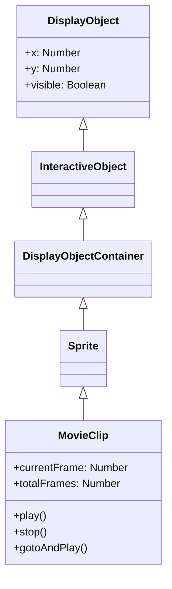

# MovieClip

MovieClip is a DisplayObjectContainer with timeline animation. Animations created with Open Animation Tool are played as MovieClips.

## Inheritance



## Properties

### MovieClip-Specific Properties

| Property | Type | Description |
|----------|------|-------------|
| `currentFrame` | `number` | Specifies the number of the frame in which the playhead is located in the timeline (starts from 1, read-only) |
| `totalFrames` | `number` | The total number of frames in the MovieClip instance (read-only) |
| `currentFrameLabel` | `FrameLabel \| null` | The label at the current frame in the timeline of the MovieClip instance (read-only) |
| `currentLabels` | `FrameLabel[] \| null` | Returns an array of FrameLabel objects from the current scene (read-only) |
| `isPlaying` | `boolean` | A Boolean value that indicates whether a movie clip is currently playing (read-only) |
| `isTimelineEnabled` | `boolean` | Returns whether the display object has MovieClip functionality (read-only) |

### Properties Inherited from DisplayObjectContainer

| Property | Type | Description |
|----------|------|-------------|
| `numChildren` | `number` | Returns the number of children of this object (read-only) |
| `mouseChildren` | `boolean` | Determines whether the children of the object are mouse or user input device enabled |
| `mask` | `DisplayObject \| null` | The calling display object is masked by the specified mask object |
| `isContainerEnabled` | `boolean` | Returns whether the display object has container functionality (read-only) |

## Methods

### MovieClip-Specific Methods

| Method | Return Type | Description |
|--------|-------------|-------------|
| `play()` | `void` | Moves the playhead in the timeline of the movie clip |
| `stop()` | `void` | Stops the playhead in the movie clip |
| `gotoAndPlay(frame: string \| number)` | `void` | Starts playing the file at the specified frame |
| `gotoAndStop(frame: string \| number)` | `void` | Brings the playhead to the specified frame and stops it there |
| `nextFrame()` | `void` | Sends the playhead to the next frame and stops it |
| `prevFrame()` | `void` | Sends the playhead to the previous frame and stops it |
| `addFrameLabel(frame_label: FrameLabel)` | `void` | Dynamically adds a label to the timeline |

### Methods Inherited from DisplayObjectContainer

| Method | Return Type | Description |
|--------|-------------|-------------|
| `addChild(display_object: DisplayObject)` | `DisplayObject` | Adds a child DisplayObject instance to this DisplayObjectContainer instance |
| `addChildAt(display_object: DisplayObject, index: number)` | `DisplayObject` | Adds a child DisplayObject instance at the specified index position |
| `removeChild(display_object: DisplayObject)` | `void` | Removes the specified child DisplayObject instance from the child list |
| `removeChildAt(index: number)` | `void` | Removes a child DisplayObject from the specified index position in the child list |
| `removeChildren(...indexes: number[])` | `void` | Removes children at the specified indexes from the container |
| `getChildAt(index: number)` | `DisplayObject \| null` | Returns the child display object instance that exists at the specified index |
| `getChildByName(name: string)` | `DisplayObject \| null` | Returns the child display object that exists with the specified name |
| `getChildIndex(display_object: DisplayObject)` | `number` | Returns the index position of a child DisplayObject instance |
| `contains(display_object: DisplayObject)` | `boolean` | Determines whether the specified display object is a child of the DisplayObjectContainer instance or the instance itself |
| `setChildIndex(display_object: DisplayObject, index: number)` | `void` | Changes the position of an existing child in the display object container |
| `swapChildren(display_object1: DisplayObject, display_object2: DisplayObject)` | `void` | Swaps the z-order (front-to-back order) of the two specified child objects |
| `swapChildrenAt(index1: number, index2: number)` | `void` | Swaps the z-order (front-to-back order) of the child objects at the two specified index positions |

## Events

### enterFrame

Event that occurs each frame:

```javascript
movieClip.addEventListener("enterFrame", function(event) {
    console.log("Frame:", event.target.currentFrame);
});
```

### frameConstructed

Occurs when frame construction is complete:

```javascript
movieClip.addEventListener("frameConstructed", function(event) {
    // Before frame script execution
});
```

### exitFrame

Occurs when leaving a frame:

```javascript
movieClip.addEventListener("exitFrame", function(event) {
    // Before moving to next frame
});
```

## Usage Examples

### Basic Animation Control

```javascript
const { Loader } = next2d.display;
const { URLRequest } = next2d.net;

// Load MovieClip from JSON
const loader = new Loader();
await loader.load(new URLRequest("animation.json"));

const mc = loader.content;
stage.addChild(mc);

// Stop initially
mc.stop();

// Play/pause on button click
button.addEventListener("click", function() {
    if (mc.isPlaying) {
        mc.stop();
    } else {
        mc.play();
    }
});
```

### Control with Frame Labels

```javascript
// Move to label position
mc.gotoAndStop("idle");

// State change
function changeState(state) {
    switch (state) {
        case "idle":
            mc.gotoAndPlay("idle");
            break;
        case "walk":
            mc.gotoAndPlay("walk_start");
            break;
        case "attack":
            mc.gotoAndPlay("attack");
            break;
    }
}
```

### Controlling Nested MovieClips

```javascript
// Access child MovieClip
const childMc = mc.getChildByName("character");
childMc.gotoAndPlay("run");

// Access grandchild MovieClip
const grandChild = mc.character.arm;
grandChild.play();
```

### Child Object Operations

```javascript
// Add child object
const sprite = new Sprite();
mc.addChild(sprite);

// Add at specific index
mc.addChildAt(sprite, 0);

// Remove child object
mc.removeChild(sprite);

// Remove by index
mc.removeChildAt(0);

// Remove multiple children
mc.removeChildren(0, 1, 2);

// Get child object
const child = mc.getChildAt(0);
const namedChild = mc.getChildByName("myChild");

// Get child index
const index = mc.getChildIndex(sprite);

// Change child index
mc.setChildIndex(sprite, 2);

// Swap child order
mc.swapChildren(sprite1, sprite2);
mc.swapChildrenAt(0, 1);
```

### Dynamically Adding Frame Labels

```javascript
const { FrameLabel } = next2d.display;

// Create and add a new label
const label = new FrameLabel("myLabel", 10);
mc.addFrameLabel(label);

// Navigate using the label
mc.gotoAndPlay("myLabel");
```

### Changing Frame Rate

```javascript
// Change stage frame rate
stage.frameRate = 30;
```

## FrameLabel

A class that holds frame label information:

```javascript
// Get all labels in current scene
const labels = mc.currentLabels;
labels.forEach(function(label) {
    console.log(label.name + ": frame " + label.frame);
});
```

## Related

- [Sprite](/en/reference/player/sprite)
- [Event System](/en/reference/player/events)
