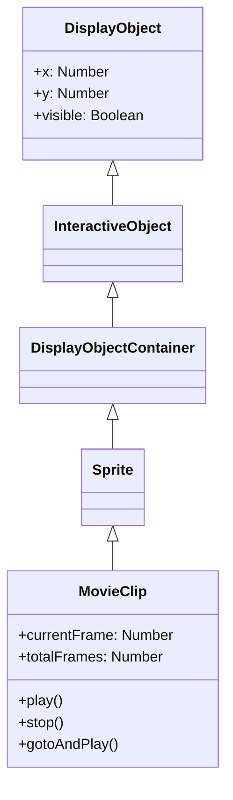

# MovieClip

MovieClip is a DisplayObjectContainer with timeline animation. Animations created with Open Animation Tool are played as MovieClips.

## Inheritance



## Properties

### Timeline Related

| Property | Type | Description |
|----------|------|-------------|
| `currentFrame` | Number | Current frame number (starts from 1) |
| `currentFrameLabel` | String | Label of current frame |
| `currentLabels` | Array | Array of FrameLabel objects for current scene |
| `totalFrames` | Number | Total number of frames |
| `framesLoaded` | Number | Number of frames loaded |
| `isPlaying` | Boolean | Whether playing |

## Methods

### play()

Starts timeline playback.

```javascript
movieClip.play();
```

### stop()

Stops timeline playback.

```javascript
movieClip.stop();
```

### gotoAndPlay(frame)

Moves to specified frame and starts playback.

```javascript
// Specify by frame number
movieClip.gotoAndPlay(10);

// Specify by frame label
movieClip.gotoAndPlay("start");
```

### gotoAndStop(frame)

Moves to specified frame and stops.

```javascript
// Specify by frame number
movieClip.gotoAndStop(1);

// Specify by frame label
movieClip.gotoAndStop("end");
```

### nextFrame()

Advances to next frame and stops.

```javascript
movieClip.nextFrame();
```

### prevFrame()

Returns to previous frame and stops.

```javascript
movieClip.prevFrame();
```

## Events

### enterFrame

Event that occurs each frame:

```javascript
movieClip.addEventListener("enterFrame", function(event) {
    console.log("Frame:", event.target.currentFrame);
});
```

### frameConstructed

Occurs when frame construction is complete:

```javascript
movieClip.addEventListener("frameConstructed", function(event) {
    // Before frame script execution
});
```

### exitFrame

Occurs when leaving a frame:

```javascript
movieClip.addEventListener("exitFrame", function(event) {
    // Before moving to next frame
});
```

## Usage Examples

### Basic Animation Control

```javascript
const { Loader } = next2d.display;
const { URLRequest } = next2d.net;

// Load MovieClip from JSON
const loader = new Loader();
await loader.load(new URLRequest("animation.json"));

const mc = loader.content;
stage.addChild(mc);

// Stop initially
mc.stop();

// Play/pause on button click
button.addEventListener("click", function() {
    if (mc.isPlaying) {
        mc.stop();
    } else {
        mc.play();
    }
});
```

### Control with Frame Labels

```javascript
// Move to label position
mc.gotoAndStop("idle");

// State change
function changeState(state) {
    switch (state) {
        case "idle":
            mc.gotoAndPlay("idle");
            break;
        case "walk":
            mc.gotoAndPlay("walk_start");
            break;
        case "attack":
            mc.gotoAndPlay("attack");
            break;
    }
}
```

### Controlling Nested MovieClips

```javascript
// Access child MovieClip
const childMc = mc.getChildByName("character");
childMc.gotoAndPlay("run");

// Access grandchild MovieClip
const grandChild = mc.character.arm;
grandChild.play();
```

### Changing Frame Rate

```javascript
// Change stage frame rate
stage.frameRate = 30;
```

## FrameLabel

A class that holds frame label information:

```javascript
// Get all labels in current scene
const labels = mc.currentLabels;
labels.forEach(function(label) {
    console.log(label.name + ": frame " + label.frame);
});
```

## Related

- [DisplayObjectContainer](./display-object-container.md)
- [Sprite](./sprite.md)
- [Event System](./events.md)
